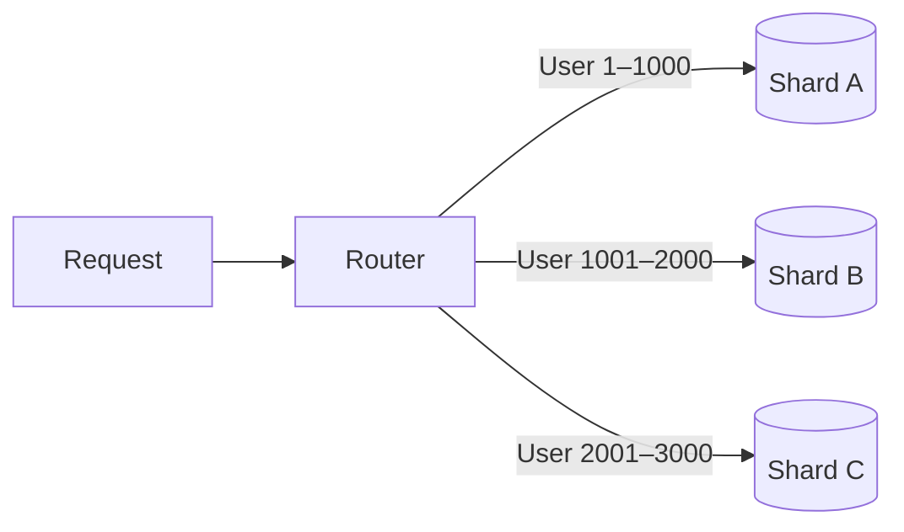
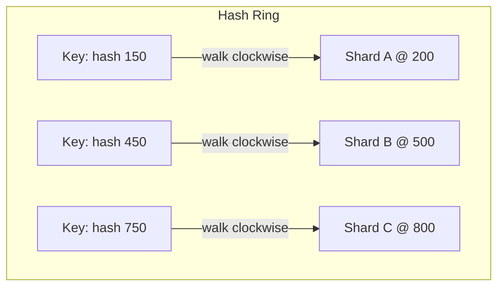

# Database Scaling — Replicas, Sharding & Consistent Hashing

> How to scale a database from read replicas to horizontal sharding, and why consistent hashing solves the rebalancing problem.

---

## Overview

Scaling a database happens in layers. The first layer adds **read replicas** to distribute read load. When data volume itself becomes the bottleneck, you move to **sharding** — splitting the data across multiple independent databases. Choosing the right sharding strategy determines how painful rebalancing will be as the system grows.

---

## Layer 1 — Read Replicas

All replicas hold the **same data** as the primary. Reads are distributed across replicas; writes always go to the primary, which then syncs to replicas.

```
           ┌──────────────────────────────────┐
  Write ──▶│         Primary DB               │
           └──────┬───────────┬───────────────┘
                  │ sync      │ sync
           ┌──────▼──┐   ┌───▼─────┐
  Read ───▶│Replica A│   │Replica B│◀─── Read
           └─────────┘   └─────────┘
```

**The ceiling:** total data volume must still fit in a single node. When that limit is hit, you need sharding.

---

## Layer 2 — Horizontal Sharding

Data rows are split across multiple independent databases. Each shard holds a **subset** of the data.



The **router** (sometimes called a shard key resolver) decides which shard to query based on some attribute of the request — typically an ID.

---

## Sharding Strategies

### Strategy 1 — Key Range

Assign ranges of IDs to shards.

| Range | Shard |
|---|---|
| 1 – 1000 | Shard A |
| 1001 – 2000 | Shard B |
| 2001 – 3000 | Shard C |

**Pros:** range queries are efficient; simple to reason about.  
**Cons:** **hotspots** — if one range is disproportionately active (e.g., new users concentrated in the latest shard), that shard gets hammered. Rebalancing means manually re-splitting ranges.

---

### Strategy 2 — Hash-Based (Modulo)

Apply a hash function and use modulo to pick the shard.

```
shard = hash(user_id) % number_of_shards
```

Example with 3 shards:

| user_id | hash(id) % 3 | Shard |
|---|---|---|
| 1 | 1 | Shard A |
| 2 | 2 | Shard B |
| 3 | 0 | Shard C |
| 4 | 1 | Shard A |

**Pros:** distributes data more evenly; reduces hotspots.  
**Cons:** **adding or removing a shard forces a full redistribution** — almost every key maps to a different shard because `% N` changes when `N` changes. This is expensive and risky.

---

### Strategy 3 — Consistent Hashing ✅

Consistent hashing solves the rebalancing problem. When you add or remove a shard, **only the keys that were assigned to that shard need to move** — everything else stays put.

#### The Ring Mental Model

Imagine all possible hash values arranged in a circle (a ring from `0` to `2³²`). Shards are placed at positions on this ring by hashing their name/ID. To find the shard for a given key, you hash the key and **walk clockwise until you hit the first shard**.

```
              Key C ──▶ Shard B
                 │
    0 ──────────────────────────── 2³²
        ●            ●         ●
      Shard A      Shard B   Shard C
```



#### Adding a New Shard

When Shard D is added at position 350 on the ring, only the keys between position 200 (Shard A) and 350 (new Shard D) need to move from Shard B → Shard D. All other keys are unaffected.

```
Before: keys 201–500 → Shard B
After:  keys 201–350 → Shard D (new)
        keys 351–500 → Shard B (unchanged)
```

#### Removing a Shard

When Shard B is removed, its keys just fall through to the next shard clockwise. No other shard is affected.

---

## Strategy Comparison

| | Key Range | Hash (Modulo) | Consistent Hashing |
|---|---|---|---|
| Even distribution | ❌ Prone to hotspots | ✅ Good | ✅ Good |
| Range queries | ✅ Efficient | ❌ Scattered | ❌ Scattered |
| Add/remove shard | ⚠️ Manual splits | ❌ Full reshuffle | ✅ Minimal movement |
| Implementation complexity | Low | Low | Medium |

---

## Gotchas & Notes

- **Consistent hashing ≠ no rebalancing** — it minimizes it, but you still move some keys when topology changes.
- **Virtual nodes**: in practice, each physical shard is mapped to multiple positions on the ring (virtual nodes). This improves distribution when the number of shards is small. Used by Cassandra and DynamoDB.
- **Hotspots can still happen** with consistent hashing if one key is accessed far more than others (e.g., a viral user). Sharding strategy only helps with *structural* distribution, not access pattern skew.
- Replica strategy and sharding are not mutually exclusive — you can shard first, then add read replicas per shard.