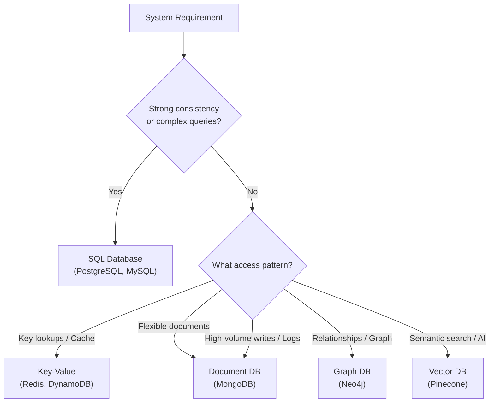

# Databases

> SQL vs NoSQL, ACID vs BASE, and the trade-offs that drive database selection in system design.

## Overview

Databases are the persistence layer of any non-trivial system. The core decision every system design starts with is **SQL vs NoSQL** — and that decision is driven by consistency requirements, access patterns, and scalability needs, not personal preference.

## Core Concepts

| Concept | SQL (Relational) | NoSQL (Non-Relational) |
|---|---|---|
| Schema | Strict — defined at write time | Flexible — schema-on-read |
| Consistency model | ACID | BASE |
| Scalability | Vertical (scale up) | Horizontal (scale out) |
| Throughput | Moderate | Very high |
| Query model | Complex SQL queries | Key lookups, document scans, graph traversals |
| Best for | Financial, CRM, ERP, Marketplace | Logs, cache, real-time feeds, ML/AI |

## How It Works

## ACID — SQL Consistency Guarantees

Every SQL transaction must satisfy all four properties:

- **Atomicity** — A transaction is all-or-nothing. You can't create half a user record. Partial updates never hit the database.
- **Consistency** — Constraints, foreign keys, and triggers always hold. No transaction leaves the database in an invalid state.
- **Isolation** — Concurrent transactions don't interfere with each other. Each runs as if it were the only transaction in flight.
- **Durability** — Committed data survives crashes, power failures, and restarts.

## BASE — NoSQL Consistency Guarantees

NoSQL systems relax ACID in exchange for availability and throughput:

- **Basically Available** — Every request gets a response, but data may not be fully up to date. The system favors uptime over correctness.
- **Soft State** — The system's state can change over time even without new input. Temporary inconsistency is acceptable.
- **Eventual Consistency** — Data will converge to a consistent state, but propagation happens asynchronously across nodes.

> **Trade-off**: BASE relaxes ACID constraints. You gain horizontal scalability and write throughput; you lose strong consistency guarantees.

## Key Patterns / Approaches

### SQL — When to Reach For It

- Core business logic with financial or transactional integrity requirements
- Systems where data relationships are complex and queries are ad-hoc
- CRMs, ERPs, marketplaces, payment systems

**Known limitations:**
- **Vertical scaling** — You scale by making the machine bigger, not by adding more machines
- **Distributed writes** — Multi-master setups are complex and introduce consistency edge cases

### NoSQL — When to Reach For It

- High write throughput (logs, events, telemetry)
- Caching (Redis as session store or rate limiter)
- Flexible or evolving data models (onboarding flows, feature flags, user profiles)
- AI/ML workloads requiring semantic search (vector DBs)

**Impedance mismatch** is a practical reason to prefer NoSQL: if your application model (objects, documents, graphs) doesn't map cleanly to relational tables, the friction of ORM mapping adds complexity with no benefit.

## When to Use / When to Avoid

**Choose SQL when:**
- Data consistency is non-negotiable (money, inventory, orders)
- You need joins across multiple entities
- Business rules live in the DB layer (triggers, constraints)

**Choose NoSQL when:**
- Write volume is the primary constraint
- Schema evolves frequently
- You're storing logs, events, or embeddings
- You're sharding across many nodes by default

## Gotchas & Notes

- **Don't default to SQL** because it's familiar. Model your access patterns first.
- **Don't use NoSQL to avoid schema discipline** — schema-on-read still requires contract discipline at the application layer.
- Eventual consistency means reads can return **stale data**. Design your UX and business logic to tolerate this where BASE is chosen.
- Redis is often used **alongside** a SQL database, not instead of one — cache hot reads, persist truth in SQL.
- Vector databases (Pinecone, pgvector) are increasingly relevant for AI-powered features — know they exist even if you don't deep-dive yet.