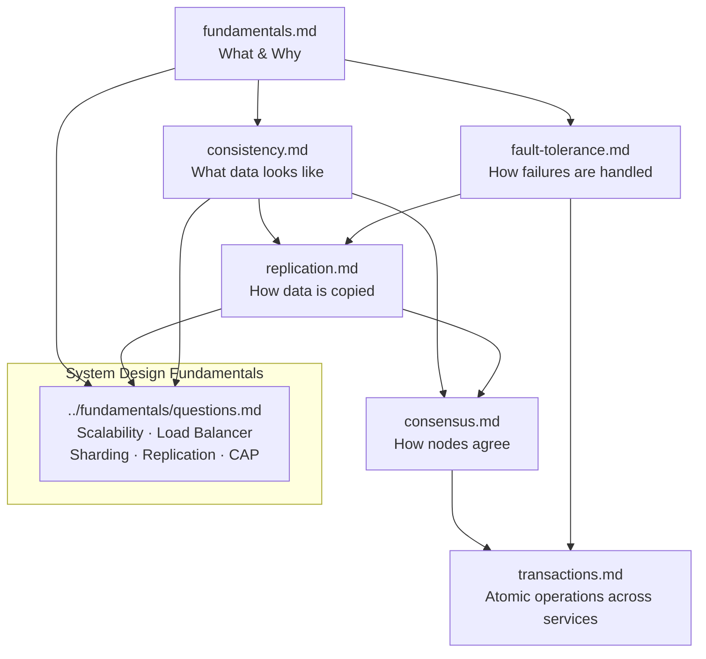

# Distributed Systems

A structured guide through the core concepts of distributed systems — ordered so each topic builds on the previous one.

---

## Learning Path

Read in this order. Each file links forward and backward so you can follow threads as they appear.

```
1. fundamentals.md          — What distributed systems are and why they're hard
2. consistency.md           — How nodes agree on what data looks like
3. replication.md           — How data gets copied across nodes
4. consensus.md             — How nodes elect a leader and agree on decisions
5. transactions.md          — How atomicity works across multiple services
6. fault-tolerance.md       — How systems survive and recover from failures
```

---

## Files

| File | What you'll learn |
|------|------------------|
| [fundamentals.md](./fundamentals.md) | Definition, the 8 fallacies of distributed computing, latency numbers, why distribution is hard |
| [consistency.md](./consistency.md) | Consistency spectrum (linearizability → causal → eventual), CAP theorem, PACELC |
| [replication.md](./replication.md) | Single-leader, multi-leader, leaderless (Dynamo/quorum), sync vs async, replication lag |
| [consensus.md](./consensus.md) | Paxos, Raft, leader election patterns, ZooKeeper, etcd |
| [transactions.md](./transactions.md) | ACID vs BASE, two-phase commit (2PC), SAGA pattern (choreography vs orchestration) |
| [fault-tolerance.md](./fault-tolerance.md) | Timeouts, retries, circuit breaker, bulkhead, idempotency, graceful degradation |

---

## How Everything Connects



---

## Key Concepts at a Glance

| Concept | File | One-line summary |
|---------|------|-----------------|
| 8 Fallacies | fundamentals | The wrong assumptions every engineer makes about networks |
| Linearizability | consistency | Strongest guarantee: every read sees the latest write |
| Eventual Consistency | consistency | Replicas converge over time; stale reads allowed |
| CAP Theorem | consistency | Choose 2 of 3: Consistency, Availability, Partition Tolerance |
| PACELC | consistency | Even without partitions: trade Latency for Consistency |
| Single-leader replication | replication | One writer, many readers — standard relational DB pattern |
| Leaderless (Quorum) | replication | Any node accepts writes; W+R>N ensures consistency |
| Raft | consensus | Understandable consensus algorithm used by etcd, CockroachDB |
| Leader Election | consensus | How a cluster picks one node to coordinate writes |
| 2PC | transactions | Strong atomicity across services; coordinator is a SPOF |
| SAGA | transactions | Long-running transactions via compensating actions |
| Circuit Breaker | fault-tolerance | Stop calling a failing service; give it time to recover |
| Bulkhead | fault-tolerance | Isolate resource pools so one failure doesn't cascade |
| Idempotency | fault-tolerance | Safe retries via idempotency keys |

---

## How This Connects to System Design Interviews

When a system design question touches distributed systems, map it:

- **"How do you handle consistency?"** → consistency.md (CAP, CP vs AP choice)
- **"How does the database scale?"** → replication.md (single-leader) + ../fundamentals (sharding)
- **"How do you avoid data loss?"** → replication.md (sync replication) + consensus.md (Raft log)
- **"How do services stay up?"** → fault-tolerance.md (circuit breaker, retries)
- **"How do you keep data consistent across microservices?"** → transactions.md (SAGA)
- **"How do you elect a leader / coordinate nodes?"** → consensus.md (Raft, ZooKeeper)
