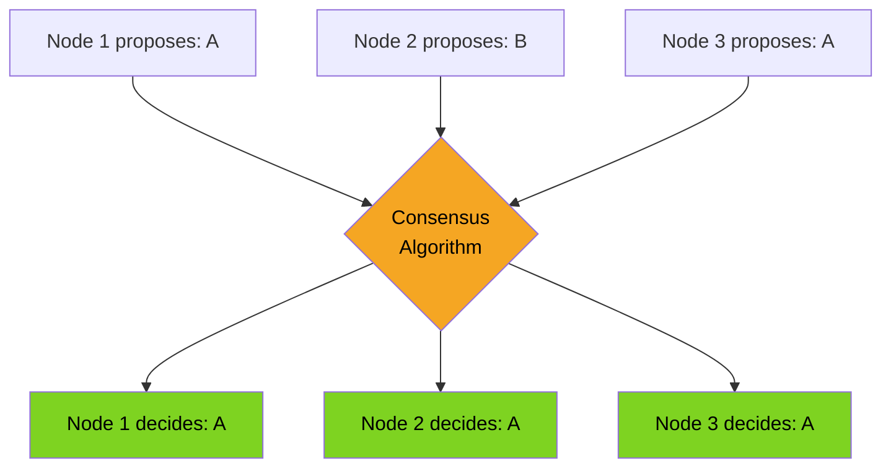
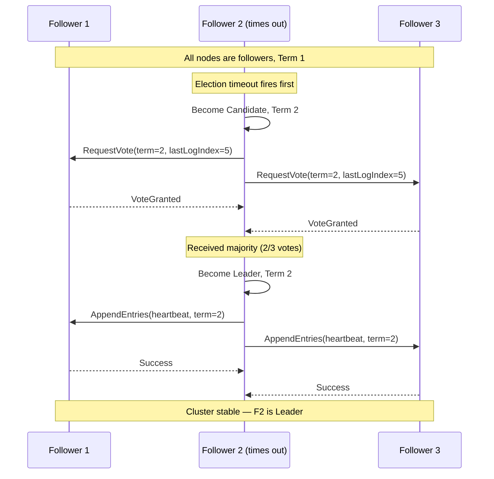
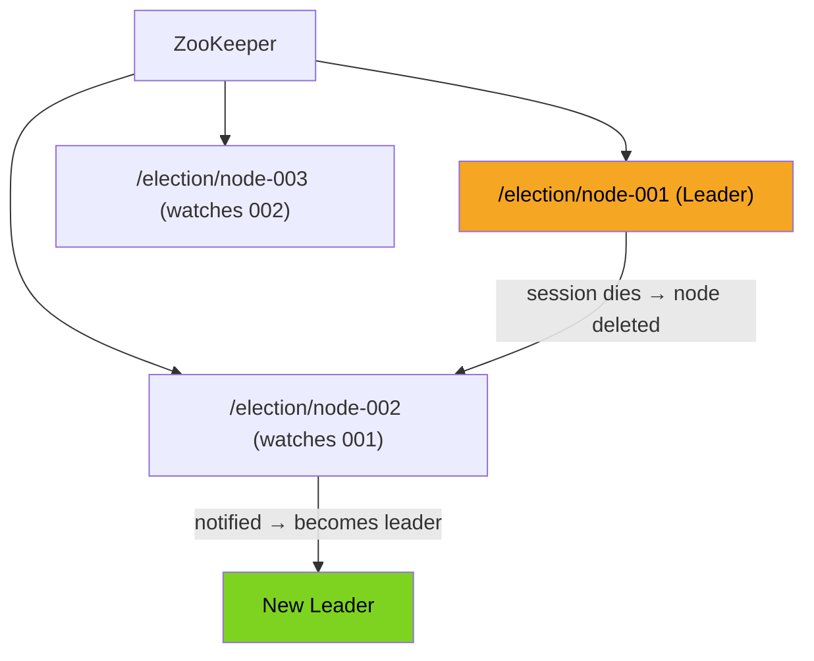

# Consensus in Distributed Systems

---

## What is Consensus?

Consensus is the problem of getting multiple nodes in a distributed system to **agree on a single value**, even in the presence of failures. It sounds deceptively simple — just vote and pick the majority answer — but in practice it underlies some of the hardest problems in distributed systems engineering.

Consensus is needed whenever you need coordinated, fault-tolerant decisions across nodes:

- **Leader election** — which node is the authoritative writer right now?
- **Distributed locks** — only one process may hold the lock at a time.
- **Replicated state machines** — all replicas apply the same sequence of commands in the same order.
- **Atomic broadcast** — deliver a message to all nodes or none.

Any algorithm that claims to solve consensus must satisfy three properties:

| Property | Definition |
|----------|------------|
| **Agreement** | All correct (non-faulty) nodes decide on the same value. |
| **Validity** | The decided value must have been proposed by some node — you cannot invent values out of thin air. |
| **Termination** | All correct nodes eventually decide (the algorithm does not run forever). |

> **Connects to:** [Replication](./replication.md) — consensus is what makes single-leader replication safe: the cluster must agree on who the leader is before any writes are accepted.

---

## Why Consensus is Hard — FLP Impossibility

In 1985, Fischer, Lynch, and Paterson published a landmark result: **in a fully asynchronous system, no consensus algorithm can guarantee both safety and liveness if even a single process can fail.**

This is known as the **FLP Impossibility Result**.

Here is what it means in plain terms:

- **Asynchronous system** — there is no shared clock, and there is no upper bound on how long a message can take to arrive. A slow node looks identical to a dead node.
- **Safety** — nodes never disagree (Agreement + Validity are never violated).
- **Liveness** — nodes always eventually decide (Termination).

FLP says you cannot have all three simultaneously when even one node might crash. You must trade something.

**Practical implication for real systems:**

Real systems give up the guarantee of termination in adversarial conditions and instead use **timeouts and leader elections** to make progress in the common case. They accept the theoretical possibility of getting stuck during a network partition, but in practice partitions are short-lived and the algorithm resumes.

> **Connects to:** [Fault Tolerance](./fault-tolerance.md) — FLP is why fault-tolerant consensus requires careful trade-offs between detecting failures and making progress.

> **Connects to:** [Consistency](./consistency.md) — linearizability (the strongest consistency model) depends on consensus under the hood; FLP explains why linearizable systems are unavailable during partitions (see also: CAP Theorem).

---

## Paxos — The Original Consensus Algorithm

Paxos, introduced by Leslie Lamport, was the first practical consensus algorithm. It is the theoretical foundation that almost everything else is built on or compared against.

### Mental Model

Paxos assigns nodes to three overlapping roles:

- **Proposer** — initiates a proposal with a value.
- **Acceptor** — votes on proposals and persists promises.
- **Learner** — learns the final decided value.

A single node can play all three roles simultaneously.

### Two Phases

**Phase 1 — Prepare / Promise**

The proposer picks a unique proposal number `n` and broadcasts a `Prepare(n)` message to a majority of acceptors. Each acceptor responds with a `Promise` — it will not accept any proposal numbered lower than `n`, and it reports back the highest-numbered proposal it has already accepted (if any).

**Phase 2 — Accept / Accepted**

Once the proposer has a quorum of promises, it sends `Accept(n, v)` where `v` is either:
- The value from the highest-numbered previously accepted proposal among the responses (if any), or
- The proposer's own value (if no prior accepted values were reported).

Acceptors accept the proposal unless they have already promised a higher number. When a majority accepts, the value is **decided**.

### Key Insight

Paxos does not let the proposer choose any arbitrary value — it must honour any previously accepted value. This is what prevents two concurrent proposers from driving the cluster to different decisions.

### Practical Problems

- Paxos is notoriously **hard to understand** and harder to implement correctly.
- The basic Paxos protocol decides only a single value. Real systems need **Multi-Paxos** to agree on a sequence of log entries, which adds significant complexity (leader leases, log gaps, leader completeness).
- The paper intentionally left many engineering details unspecified.

### Where It Is Used

| System | Notes |
|--------|-------|
| Google Chubby | Distributed lock service; inspired Zookeeper |
| Apache ZooKeeper | Uses ZAB (ZooKeeper Atomic Broadcast), a Paxos-inspired variant |
| Google Spanner | Uses Paxos per shard for log replication |

> **Connects to:** [Fault Tolerance](./fault-tolerance.md) — Paxos tolerates up to `f` failures in a cluster of `2f + 1` nodes, so a majority quorum always exists.

---

## Raft — Consensus Made Understandable

Raft was designed by Ongaro and Ousterhout with a single explicit goal: **understandability**. It solves the same problem as Multi-Paxos but decomposes it into three largely independent sub-problems.

### Three Roles

| Role | Responsibility |
|------|----------------|
| **Leader** | Handles all client writes; replicates log entries to followers; exactly one per term. |
| **Follower** | Passive replica; replicates log from leader; votes in elections. |
| **Candidate** | Temporary role during leader election; solicits votes. |

### Three Sub-Problems

**1. Leader Election**

Time is divided into **terms** — monotonically increasing integers. Each term begins with an election. If a follower does not hear from a leader within a randomized election timeout (typically 150–300 ms), it becomes a Candidate and starts an election for the next term. A Candidate wins if it receives votes from a majority. The key safety rule: a node only votes for a Candidate whose log is at least as up-to-date as its own.

Randomized timeouts prevent split votes in most cases — one node will usually time out before others.

**2. Log Replication**

The leader appends new entries to its log and sends `AppendEntries` RPCs to all followers. An entry is **committed** once the leader has received acknowledgements from a majority. Committed entries are guaranteed to survive future leader changes.

**3. Safety**

Raft guarantees that at most one leader exists per term, and that a leader always has all committed entries from previous terms before it can commit anything new. This "Leader Completeness" property means the leader's log is always the source of truth.

### Leader Election Sequence

### Real Systems Using Raft

| System | Use Case |
|--------|----------|
| **etcd** | Key-value store; Kubernetes control plane state |
| **CockroachDB** | Per-range consensus for distributed SQL |
| **TiKV** | Distributed key-value layer for TiDB |
| **Consul** | Service mesh; leader election and KV store |

> **Connects to:** [Replication](./replication.md) — Raft's log replication is a textbook implementation of single-leader replication with strong consistency guarantees.

---

## Leader Election

Leader election is the most common practical application of consensus — or a lightweight approximation of it. The cluster must agree on exactly one leader at a time.

### Pattern 1 — Bully Algorithm

The node with the highest ID broadcasts its candidacy. Any node that receives a message from a higher-ID node steps down. Simple to implement, but has significant problems:

- Does not handle network partitions well — the "bully" may be partitioned away and a new leader is also elected, creating split-brain.
- Does not use quorums, so it is not truly consensus-based.
- Rarely used in production distributed systems.

### Pattern 2 — Raft Election (Randomized Timeouts)

As described above: randomized timeouts prevent simultaneous candidates in most cases, and term numbers ensure that stale leaders immediately step down when they see a higher term. This is the standard approach in modern systems.

Key safety property: **at most one leader per term**, enforced by requiring a majority quorum of votes.

### Pattern 3 — ZooKeeper Ephemeral Nodes

ZooKeeper provides a higher-level primitive: **ephemeral nodes** that are deleted automatically when the client session ends (i.e. when the process dies).

The pattern:
1. All contenders create ephemeral sequential nodes under a parent path, e.g. `/election/node-0000000001`.
2. The contender with the **lowest sequence number** declares itself leader.
3. Other contenders watch the node just below theirs (not the leader directly) to avoid a **herd effect** — when the leader dies, only one follower is notified.

> **Connects to:** [Fault Tolerance](./fault-tolerance.md) — ephemeral nodes are a fault-detection mechanism: ZooKeeper detects the dead session and removes the node, triggering re-election automatically.

---

## ZooKeeper and etcd

Both ZooKeeper and etcd are **coordination services** — distributed systems built on top of consensus protocols, designed to be the single source of truth for cluster metadata, configuration, and leader election.

### ZooKeeper

ZooKeeper (originally from Yahoo, now Apache) uses **ZAB** (ZooKeeper Atomic Broadcast), a Paxos-inspired protocol. It exposes a hierarchical namespace similar to a filesystem.

Key primitives:
- **Watches** — clients register one-time callbacks when a node changes.
- **Sessions** — ZooKeeper tracks client liveness; session expiry triggers cleanup.
- **Ephemeral nodes** — exist only as long as the creating session is alive.
- **Sequential nodes** — ZooKeeper appends a monotonically increasing counter to the node name.

Common use cases: distributed locks, leader election, service discovery, configuration management.

### etcd

etcd (from CoreOS, now CNCF) is a strongly consistent key-value store that uses **Raft** for consensus. Its API is simpler — plain key-value with TTL-based leases and a watch mechanism.

etcd is most notable as the **backing store for Kubernetes**: all cluster state (pods, services, config maps, secrets) lives in etcd.

### Comparison

| Feature | ZooKeeper | etcd |
|---------|-----------|------|
| Consensus protocol | ZAB (Paxos-inspired) | Raft |
| Data model | Hierarchical namespace (znodes) | Flat key-value store |
| Watch semantics | One-shot (re-register after fire) | Continuous streaming watch |
| Liveness primitive | Ephemeral nodes via sessions | TTL leases |
| Client API | Custom ZooKeeper protocol | gRPC / HTTP |
| Primary use case | Distributed coordination, locks | Kubernetes cluster state |
| Typical cluster size | 3 or 5 nodes | 3 or 5 nodes |
| Language | Java | Go |
| Operational complexity | Higher (JVM tuning, session management) | Lower |

> **Connects to:** [Consistency](./consistency.md) — both ZooKeeper and etcd provide linearizable reads (with caveats), making them suitable as the authoritative source of truth in distributed systems.

> **Connects to:** [Transactions](./transactions.md) — distributed locks in ZooKeeper/etcd are often used as an alternative to two-phase commit when you only need mutual exclusion rather than multi-partition atomicity.

---

## Summary

| Algorithm / Tool | Approach | Practical Use |
|-----------------|----------|---------------|
| Paxos | Two-phase quorum voting; hard to implement | Foundation for ZAB, Spanner |
| Raft | Decomposed into election + replication; designed for understandability | etcd, CockroachDB, TiKV, Consul |
| Bully Algorithm | Highest ID wins | Simple systems; not partition-safe |
| ZooKeeper ephemeral nodes | Higher-level primitive over ZAB | Distributed locks, service discovery |
| etcd leases | TTL-based leases over Raft | Kubernetes leader election, feature flags |

The key mental model: **consensus = quorum voting + term/epoch numbers to reject stale leaders**. Any system that needs a single authoritative decision across multiple nodes — whether that is a leader, a lock holder, or a committed log entry — is solving consensus at its core.

> **Connects to:** [Replication](./replication.md) — understanding consensus explains why single-leader replication with automatic failover is safe only when the cluster uses a proper quorum-based election protocol.

> **Connects to:** [Transactions](./transactions.md) — two-phase commit uses a designated coordinator node rather than consensus; this makes 2PC vulnerable to coordinator failure, which is why some systems replace it with Paxos/Raft-based approaches.
