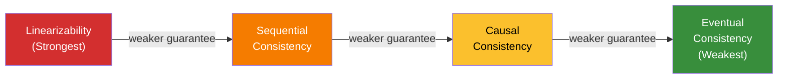
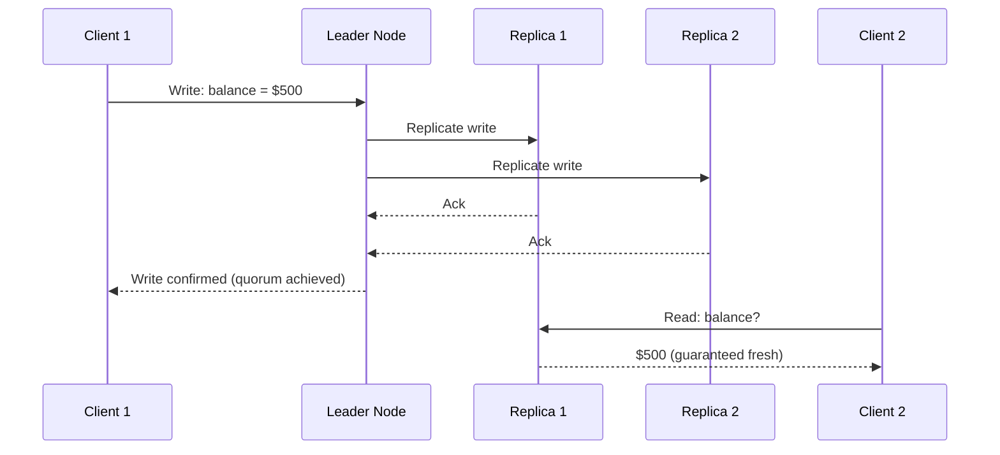
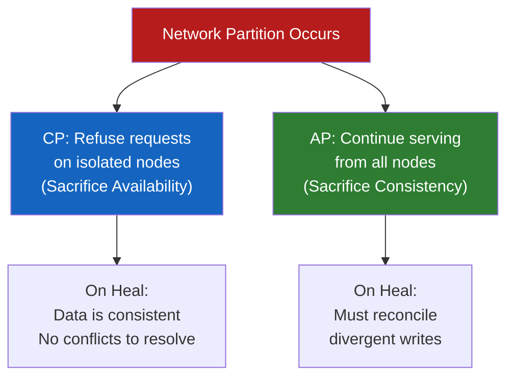

# Consistency in Distributed Systems

> **Connects to:** [Distributed Systems Fundamentals](./fundamentals.md) — understanding consistency requires a solid grasp of what makes distributed systems fundamentally different from single-node systems.

---

## The Consistency Spectrum

Consistency is not a binary property — it exists on a spectrum. The stronger the consistency guarantee a system provides, the more coordination is required between nodes, which translates directly to higher latency and reduced availability. The weaker the guarantee, the faster the system can respond, but at the cost of potentially serving stale or divergent data.

The four major consistency models, ordered from strongest to weakest:

**Linearizability > Sequential Consistency > Causal Consistency > Eventual Consistency**

Understanding where a system falls on this spectrum is one of the most important decisions in distributed systems design. The right choice depends entirely on your use case — there is no universally correct answer.

| Model | Staleness Allowed | Coordination Required | Latency | Availability |
|---|---|---|---|---|
| Linearizability | None | Global | High | Sacrificed under partition |
| Sequential | None (but no real-time guarantee) | Global ordering | High | Low |
| Causal | Allowed for unrelated ops | Causal tracking | Medium | Medium |
| Eventual | Yes | None (async replication) | Low | High |

> **Connects to:** [Replication](./replication.md) — the consistency model a system offers is tightly coupled to how it replicates data across nodes.

---

## Linearizability (Strong Consistency)

Linearizability is the strongest consistency guarantee a distributed system can offer. Under linearizability, every operation appears to take effect **instantaneously at a single point in time** between its invocation and completion. All nodes see the same data at the same time, and operations appear in a globally consistent order that respects real-time ordering.

In practical terms: if a write completes successfully, any subsequent read — from any node, anywhere — must return that written value or a more recent one. There is no window in which a stale read is possible.

**When you need it:**
- Bank account balances — you cannot have two ATMs read the same balance and both approve a withdrawal
- Leader election — only one node must believe it holds the lock at any given time
- Distributed counters — inventory systems where overselling is unacceptable
- Configuration management — all services must see the same feature flag state simultaneously

**The cost:**
- High latency — every write must be acknowledged by a quorum before the operation is considered complete
- Availability sacrifice — under a network partition, a linearizable system must refuse requests rather than risk returning stale data
- Throughput ceiling — coordination overhead limits how many operations per second the system can handle

**Real systems:**
- **ZooKeeper** — uses ZAB (ZooKeeper Atomic Broadcast) to guarantee linearizable writes
- **etcd** — uses Raft consensus; the backbone of Kubernetes control plane
- **Google Spanner** — achieves external consistency (a form of linearizability) across globally distributed data centers using TrueTime, GPS clocks, and atomic clocks to bound clock uncertainty

> **Connects to:** [Consensus Algorithms](./consensus.md) — linearizability in distributed systems is almost always implemented via consensus protocols such as Paxos or Raft.

---

## Eventual Consistency

Eventual consistency is the weakest — and most widely used — consistency model. The guarantee is simple: given that no new updates are issued, all replicas will **eventually converge** to the same value. There is no bound on how long convergence takes, and during that window, different nodes may return different values for the same key.

Stale reads are not a bug in an eventually consistent system — they are an explicit design decision made to achieve high availability and low latency.

**When you need it:**
- DNS — record updates propagate globally within minutes to hours; stale results are acceptable
- Shopping cart — adding items to a cart can tolerate brief inconsistency between data centers
- Social media feeds — whether a post shows 1,000 or 1,001 likes for a brief moment is inconsequential
- Collaborative editing (with CRDTs) — offline edits merged on reconnection

**Real systems:**
- **Apache Cassandra** — tunable consistency; eventual by default, configurable toward stronger guarantees via quorum reads/writes
- **Amazon DynamoDB** — eventually consistent reads by default; strongly consistent reads available at higher cost
- **CouchDB** — embraces eventual consistency with built-in conflict detection using revision trees

**Conflict resolution strategies:**

When replicas diverge and must reconcile, the system needs a strategy:

| Strategy | Mechanism | Trade-off |
|---|---|---|
| Last-Write-Wins (LWW) | Timestamp determines winner | Simple, but concurrent writes lose data |
| Vector Clocks | Track causal history per replica | Preserves causality, detects true conflicts |
| CRDTs | Data structures designed to merge deterministically | No conflicts possible; limited data types |
| Application-level merge | Client resolves conflicts | Maximum flexibility; developer burden |

**Last-Write-Wins (LWW)** is the simplest approach: the write with the highest timestamp wins. The problem is that clocks in distributed systems are never perfectly synchronized — a write with a lower wall-clock time may actually have happened logically after another write, leading to silent data loss.

**Vector clocks** track causality by maintaining a counter per node. Each write increments the local node's counter. When comparing two versions, vector clocks can determine whether one causally precedes the other, or whether they are concurrent (a true conflict requiring resolution).

> **Connects to:** [Replication](./replication.md) — eventual consistency arises directly from asynchronous replication strategies; understanding how replication lag manifests is essential.

---

## Causal Consistency

Causal consistency sits between sequential and eventual consistency on the spectrum. The guarantee is: **operations that are causally related must be seen in causal order by all nodes**. Operations that have no causal relationship may be observed in different orders by different nodes.

Causal relationships include:
- A reads a value written by B → A's subsequent write is causally dependent on B's write
- A sends a message to B → B's reply is causally dependent on A's message
- Two operations by the same client are always causally related (program order)

**The canonical example:**

Alice posts "I got the job!" and then Bob replies "Congratulations!" Under causal consistency, no node should ever show Bob's reply before Alice's original post — even if the reply replicates faster than the original post. Without causal consistency, a reader could see "Congratulations!" with no context, which is confusing and arguably broken.

Under eventual consistency (without causal guarantees), this is entirely possible. Under linearizability, it can never happen — but at a significant cost. Causal consistency provides the right middle ground for many social and collaborative applications.

**Real systems:**
- **MongoDB sessions** — within a session, reads are causally consistent with prior writes from that session
- **Amazon DynamoDB** — does not provide cross-partition causal consistency; application-level workarounds needed
- **COPS (research system)** — one of the seminal causal consistency implementations for geo-distributed stores

**Implementation mechanism:** Causal consistency is typically implemented using **dependency tracking** — each write carries metadata about what it causally depends on. A replica delays applying a write until all its causal dependencies have been applied locally.

> **Connects to:** [Distributed Transactions](./transactions.md) — causal consistency is weaker than serializability but stronger than eventual; understanding where it fits relative to ACID is key for interview discussions.

---

## CAP Theorem

The CAP Theorem, formulated by Eric Brewer in 2000 and proven by Gilbert and Lynch in 2002, states that a distributed data store can only guarantee **two of the following three properties simultaneously**:

- **C**onsistency — every read receives the most recent write or an error (equivalent to linearizability)
- **A**vailability — every request receives a non-error response (though it may be stale)
- **P**artition Tolerance — the system continues operating despite network partitions (messages being dropped between nodes)

**The critical insight: Partition Tolerance is not optional.**

In any real distributed system deployed across multiple nodes or data centers, network partitions are not hypothetical — they happen. Hardware fails. Network switches drop packets. Data center links go down. A system that cannot tolerate partitions is not a distributed system; it is a single node.

This means the real choice is always: **CP or AP when a partition occurs**.

- **CP systems** — when a partition is detected, the system sacrifices availability. Affected nodes refuse to serve requests (returning errors) rather than risk returning inconsistent data. When the partition heals, consistency is restored.
- **AP systems** — when a partition is detected, the system sacrifices consistency. All nodes continue serving requests and accepting writes, potentially diverging. When the partition heals, the system reconciles conflicts.

| System | Type | Rationale |
|---|---|---|
| ZooKeeper | CP | Coordination service — stale data about locks or configs is dangerous |
| etcd | CP | Kubernetes relies on it for source of truth; consistency is non-negotiable |
| HBase | CP | Designed for consistent reads on top of HDFS |
| Cassandra | AP | Multi-region availability prioritized; eventual consistency accepted |
| DynamoDB | AP (default) | High availability across AZs; eventual consistency by default |
| CouchDB | AP | Offline-first design; built for eventual sync |

**Real-world examples:**

**Bank transfer (CP):** When you transfer $1,000 between accounts, it is unacceptable for two nodes to simultaneously believe the balance is $1,000. The system must be CP — if a partition occurs, reject the transaction rather than risk double-spending.

**Twitter feed (AP):** When a tweet is posted, it is acceptable for some users to see it a few seconds later than others. The system should be AP — continue serving feeds and accepting new tweets during partitions, accepting that different users may briefly see different states.

> **Connects to:** [../fundamentals/questions.md#what-is-the-cap-theorem](../fundamentals/questions.md#what-is-the-cap-theorem) — the fundamentals question set covers CAP from an interview answer perspective; this section goes deeper into the operational implications.

> **Connects to:** [Consensus Algorithms](./consensus.md) — CP systems achieve their consistency guarantees through consensus protocols; understanding Raft and Paxos is required to understand how CP systems work under the hood.

---

## PACELC

The CAP theorem, while foundational, is incomplete — it only describes system behavior **during a partition**. Daniel Abadi proposed the PACELC model in 2012 to address this gap.

**PACELC** captures a more complete picture:

- **If Partition (P):** choose between **A**vailability and **C**onsistency (same as CAP)
- **Else (E), in normal operation:** choose between **L**atency and **C**onsistency

The key insight PACELC adds: **even when the network is healthy, there is a fundamental trade-off between consistency and latency**. To provide strong consistency, a system must coordinate between replicas on every write — waiting for acknowledgments adds latency. To minimize latency, a system must accept that replicas may not all be up to date at the moment a read is served.

This trade-off exists in every distributed system, partition or not, and is often the more relevant one for day-to-day performance characteristics.

**Reading PACELC classifications:**
- `PA/EL` — Partition: favor Availability; Else: favor Latency (weakest guarantees, highest performance)
- `PC/EC` — Partition: favor Consistency; Else: favor Consistency (strongest guarantees, highest latency)
- `PA/EC` — Partition: favor Availability; Else: favor Consistency (inconsistent behavior under partition, consistent otherwise)

| System | P behavior | E behavior | PACELC | Notes |
|---|---|---|---|---|
| DynamoDB (default) | Availability | Latency | PA/EL | Async replication; eventually consistent reads |
| DynamoDB (strong reads) | Availability | Consistency | PA/EC | Strongly consistent read option available |
| Cassandra | Availability | Latency | PA/EL | Tunable; default favors availability and low latency |
| Google Spanner | Consistency | Consistency | PC/EC | TrueTime enables external consistency globally; latency cost accepted |
| ZooKeeper | Consistency | Consistency | PC/EC | Designed for coordination; correctness over speed |
| MongoDB (default) | Availability | Latency | PA/EL | Primary-secondary with async replication |
| MongoDB (w:majority) | Consistency | Consistency | PC/EC | Majority write concern enables strong guarantees |

**Why PACELC matters in interviews:**

When asked about system design trade-offs, CAP alone is insufficient. A candidate who can articulate that "even in normal operation, DynamoDB trades consistency for latency — that's why it can serve reads in single-digit milliseconds from local replicas" demonstrates a significantly deeper understanding than one who only knows CP vs AP.

The PACELC model also explains why systems like Spanner, despite being globally distributed, accept higher latency as the price of consistent reads — and why this is the right trade-off for financial and inventory systems.

> **Connects to:** [Distributed Transactions](./transactions.md) — PACELC's EC trade-off is what motivates the design of distributed transaction protocols; systems like Spanner that sit at PC/EC need sophisticated transaction mechanisms to maintain their consistency guarantees at scale.

> **Connects to:** [Replication](./replication.md) — the EL vs EC trade-off in PACELC maps directly to the difference between synchronous and asynchronous replication strategies.

---
