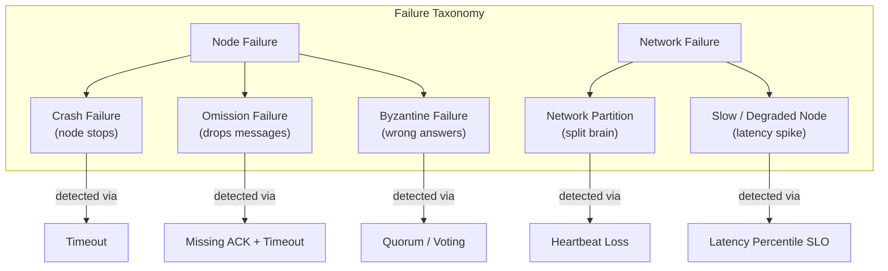
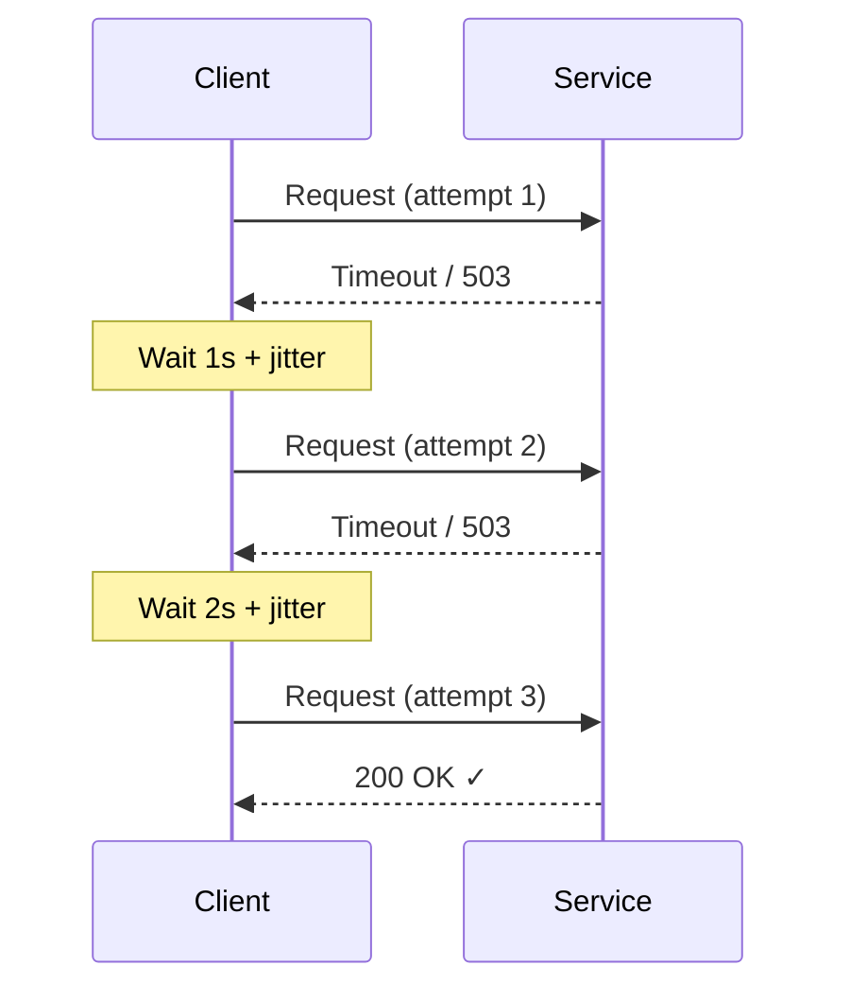
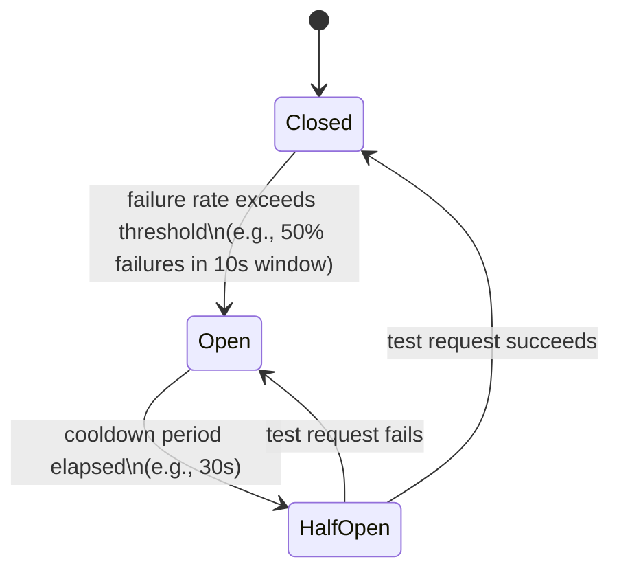
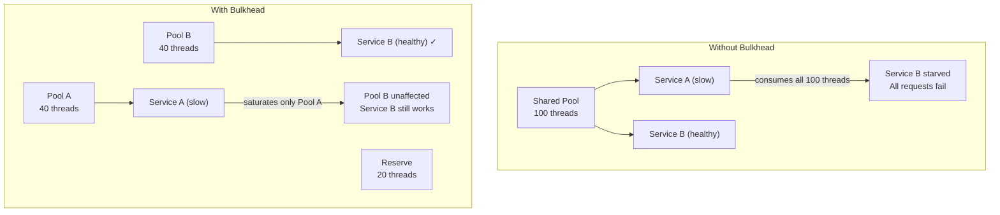

# Distributed Systems — Fault Tolerance Patterns

---

## Types of Failures in Distributed Systems

Not all failures look the same, and the strategy for handling each one differs. Before picking a resilience pattern, you need to understand what kind of failure you are defending against.

> **Connects to:** [Distributed Systems Fundamentals](./fundamentals.md) — the 8 fallacies of distributed computing (network is reliable, latency is zero, etc.) explain why all of these failure modes are inevitable in any real system.

| Failure Type | Description | Detectability | Typical Cause |
|---|---|---|---|
| **Crash failure** | Node stops responding entirely | Relatively easy — timeout fires | OOM kill, power loss, OS panic |
| **Omission failure** | Node drops some messages but appears alive | Hard — no consistent signal | NIC buffer overflow, UDP drops, GC pauses |
| **Byzantine failure** | Node responds with wrong or inconsistent data | Very hard — requires voting | Disk corruption, software bug, malicious actor |
| **Network partition** | Nodes can't reach each other even though both are alive | Hard — looks like crash from both sides | Switch failure, BGP misconfiguration, datacenter split |
| **Slow / degraded node** | Node responds but extremely slowly | Hard — often worse than a crash | GC pressure, hot thread pool, noisy neighbour, disk I/O spike |

Slow nodes deserve special attention: a crashed node stops consuming resources immediately and load balancers route around it. A slow node keeps accepting connections, holds them open, and can drain thread pools and connection pools across the entire call graph — a single slow database replica can cascade into a full system outage.



---

## Timeouts

A timeout is the most fundamental mechanism for detecting failures in a distributed system. Without timeouts, a caller waiting for a response from a failed or slow service will wait forever, blocking a thread (or a connection) indefinitely until the entire system grinds to a halt.

> **Connects to:** [Distributed Systems Fundamentals](./fundamentals.md) — the fallacy that "the network is reliable" is why every network call must have an explicit timeout.

**The core tension:**

- **Too short** → false positives. A node that is merely slow gets treated as failed. You retry unnecessarily, amplify load, and may cause the very failure you were trying to avoid.
- **Too long** → slow failure detection. Resources (threads, connections, memory) are held for the full timeout duration before the system responds to the failure.

**Practical guidance for choosing timeout values:**

1. **Baseline P99 latency of the downstream service** — set your timeout to at least 2–3x the P99 under normal load. If the service responds in 50 ms at P99, a 150–200 ms timeout is a reasonable starting point.
2. **Distinguish connect timeout from read timeout** — connecting to a TCP socket (3-way handshake) is fast; a 1–2 s connect timeout is generous. Reading a response can take longer; tune read timeouts separately.
3. **Account for the full call chain** — if your API has a 5 s SLA and you call three downstream services, each downstream timeout must be well under 5 s (e.g., 1–2 s each), leaving budget for your own processing.
4. **Use adaptive timeouts** — track a rolling histogram of observed latencies and adjust the timeout dynamically. If the service degrades, the adaptive timeout tightens to detect failures faster. Libraries like `resilience4j` support slow-call thresholds that function as soft timeouts.

**The golden rule: every network call must have a timeout.** No exceptions. An unconstrained blocking call is a time bomb in production.

---

## Retries and Exponential Backoff

Retrying a failed request is the simplest form of fault tolerance — if a transient network blip caused the failure, a retry will likely succeed. But naive retries without backoff can take a struggling service and turn it into a dead one.

> **Connects to:** [Distributed Systems Fundamentals](./fundamentals.md) — partial failures mean you often cannot tell whether a request was processed or not, making safe retry logic critical.

**What to retry:**

- Transient failures: timeouts, connection resets, 503 Service Unavailable
- Idempotent operations (see the Idempotency section below)

**What NOT to retry:**

- **4xx client errors** (400, 401, 403, 404) — the request is malformed or unauthorized; retrying will always fail and wastes resources
- **Non-idempotent operations without an idempotency key** — retrying a payment, order creation, or database insert without a deduplication mechanism causes duplicate side-effects

**Exponential backoff with jitter:**

Wait time doubles on each retry: 1 s → 2 s → 4 s → 8 s → 16 s. A maximum cap (e.g., 32 s) prevents unbounded waits. Jitter — adding a random offset (e.g., ±30% of the base wait) — desynchronizes retries from multiple clients. Without jitter, all callers retry at the same instant after a shared failure, creating a thundering herd that re-overwhelms the recovering service.

```
wait = min(cap, base * 2^attempt) * (0.7 + random() * 0.6)
```



**Practical settings:**

| Parameter | Typical Value |
|---|---|
| Initial backoff | 100 ms – 1 s |
| Multiplier | 2 |
| Jitter | ±25–50% |
| Max backoff | 30–60 s |
| Max attempts | 3–5 |

---

## Idempotency

An operation is **idempotent** if applying it multiple times produces the same result as applying it once. Idempotency is what makes retries safe: if you can guarantee that re-sending a request has no additional effect, you can retry freely without worrying about duplicate side-effects.

> **Connects to:** [Distributed Transactions](./transactions.md) — exactly-once delivery in distributed transactions relies on the same idempotency key mechanism described here.

**Why it matters:** Networks are unreliable. A response may be lost even after the server successfully processed the request. The client sees a timeout and cannot tell whether the operation happened. Without idempotency, the client must choose between potentially missing an operation (don't retry) or potentially duplicating it (do retry). With idempotency, retrying is always safe.

**HTTP methods and idempotency:**

| Method | Idempotent? | Safe? | Notes |
|---|---|---|---|
| GET | Yes | Yes | Read-only, no side effects |
| HEAD | Yes | Yes | Like GET, returns headers only |
| PUT | Yes | No | Replace the full resource; same result every time |
| DELETE | Yes | No | Resource is gone after first call; subsequent calls are no-ops |
| POST | No (by default) | No | Creates a new resource each call — requires idempotency key |
| PATCH | No (by default) | No | Partial update may be non-idempotent without careful design |

**Implementing idempotency keys:**

1. Client generates a UUID (or similar) for each logical operation and attaches it to every attempt: `Idempotency-Key: 550e8400-e29b-41d4-a716-446655440000`
2. Server stores the key and the response in a durable store (Redis, database) with a TTL (e.g., 24 hours)
3. On receiving a request, server checks if the key already exists — if it does, return the cached response immediately without re-executing the operation
4. If the key does not exist, execute the operation and atomically store the result

This pattern is used by Stripe for payments, Twilio for SMS, and virtually every payment processor with a public API.

---

## Circuit Breaker

A circuit breaker prevents a slow or failed downstream service from causing cascading failures throughout the call graph. Instead of hammering a failing service with requests (each of which hangs until timeout), the circuit breaker "opens" and immediately returns an error — failing fast and giving the downstream service time to recover.

> **Connects to:** [Distributed Systems Fundamentals](./fundamentals.md) — cascading failures are one of the most common causes of large-scale outages; the circuit breaker is the primary defense.
> **Connects to:** [Replication](./replication.md) — replica failures often need circuit breakers on the client side to prevent a lagging replica from degrading the entire read path.

**The three states:**



| State | Behavior | When to transition |
|---|---|---|
| **Closed** | All requests flow to downstream normally; failures are counted | → Open when failure rate / count exceeds threshold |
| **Open** | All requests fail immediately (no downstream call); a fallback may run | → Half-Open after cooldown period |
| **Half-Open** | A single probe request is allowed through | → Closed on success; → Open on failure |

**Key configuration parameters:**

- **Failure threshold** — e.g., 5 failures in a 10-second window, or 50% failure rate over 20 requests
- **Cooldown period** — how long to stay Open before testing (e.g., 30–60 s)
- **Slow-call threshold** — treat requests taking longer than X ms as failures (circuit breaker can open on latency, not just errors)

**Benefits:**

- **Fail fast** — instead of waiting 10–30 s for timeouts to accumulate, callers get an immediate error
- **Resource preservation** — threads and connections are not held waiting for a service that is down
- **Recovery window** — the downstream gets breathing room; it is not bombarded with traffic while trying to restart

**Real libraries:** Resilience4j (Java), Polly (.NET), `opossum` (Node.js), `pybreaker` (Python). Hystrix (Java) is the original but is now in maintenance mode.

---

## Bulkhead Pattern

The bulkhead pattern isolates resources — thread pools, connection pools, semaphores — per downstream dependency, so that exhaustion caused by one slow service cannot drain the shared pool and kill everything else.

> **Connects to:** [Distributed Systems Fundamentals](./fundamentals.md) — the fallacy that "the network is homogeneous" leads engineers to share resource pools across services, creating hidden coupling that turns a single failure into a system-wide outage.

The name comes from the watertight compartments (bulkheads) inside a ship's hull. If the hull is breached in one section, only that compartment floods — the ship stays afloat. Without bulkheads, a single breach sinks the entire vessel.

**The problem without bulkheads:**

If your service calls Service A and Service B using a single shared thread pool of 100 threads, and Service A becomes slow:

1. Requests to A start queuing; threads are held waiting for A
2. The pool fills up — all 100 threads are waiting on A
3. Requests to B (which is perfectly healthy) start failing because no threads are available
4. Your service appears entirely down, even though B is fine

**The solution:**

Assign a dedicated thread pool (or connection pool, or semaphore) to each downstream. Service A gets 40 threads. Service B gets 40 threads. 20 are reserved for everything else. Service A can saturate its own pool without touching B's.



**Implementation options:**

- **Thread pool isolation** — each downstream gets its own executor (Hystrix's original approach; Resilience4j Bulkhead)
- **Semaphore isolation** — lighter weight; limits concurrent calls with a counter rather than separate threads (better for async/reactive stacks)
- **Connection pool isolation** — separate database connection pools per tenant or per read/write path

---

## Graceful Degradation

Graceful degradation means designing a system to remain useful — even if with reduced functionality — when one or more dependencies are unavailable. The goal is to never show the user a full error page when a partial response is possible.

> **Connects to:** [Consistency](./consistency.md) — graceful degradation often means serving stale or cached data, which is an explicit availability-over-consistency trade-off; understanding consistency models helps you reason about how stale is acceptable.
> **Connects to:** [High Availability Strategies](../fundamentals/questions.md#how-would-you-ensure-high-availability) — graceful degradation is a core HA strategy; circuit breaker fallbacks are a concrete mechanism for implementing it.

**Examples in production systems:**

| Dependency fails | Degraded behaviour | Full failure behaviour (bad) |
|---|---|---|
| Recommendation service | Show popular/trending items or hide recommendations section | Block page load until recommendations return |
| Search index | Return cached results or a reduced result set | Show "search unavailable" error to user |
| Inventory service | Show product page without real-time stock count | Block entire product page |
| Auth service | Allow read-only access with cached session, deny writes | Log out all users |
| Analytics / logging | Drop events silently, continue serving traffic | Refuse requests that can't be logged |

**How to implement graceful degradation:**

1. **Define a fallback for every critical dependency** — when using a circuit breaker, the fallback is what runs when the circuit is open. Return cached data, a default value, or an empty collection — not an exception.
2. **Cache aggressively at the edge** — CDN and application-level caches mean a brief upstream outage may be completely invisible to users.
3. **Feature flags** — allow disabling non-critical features (recommendations, personalization, A/B experiments) independently of core functionality. When a dependency is struggling, turn off the features that depend on it.
4. **Shed load gracefully** — under extreme load, return HTTP 503 with a `Retry-After` header rather than accepting requests you can't serve, which only makes the backlog worse.
5. **Communicate to users** — a banner saying "Some features are temporarily unavailable" is dramatically better UX than an unexpected error. Users tolerate degradation; they do not tolerate confusion.

The key design principle: distinguish between **critical paths** (must work for the product to function at all) and **non-critical paths** (nice to have). Every non-critical path should have a defined degraded behaviour, not an implicit dependency that fails silently or noisily.

---
