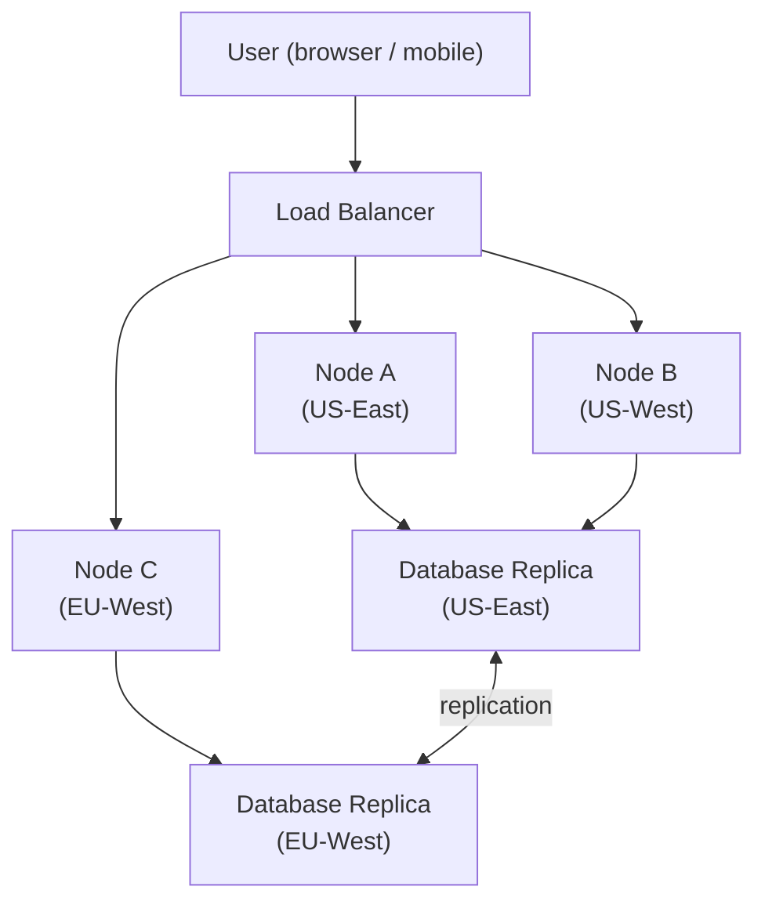
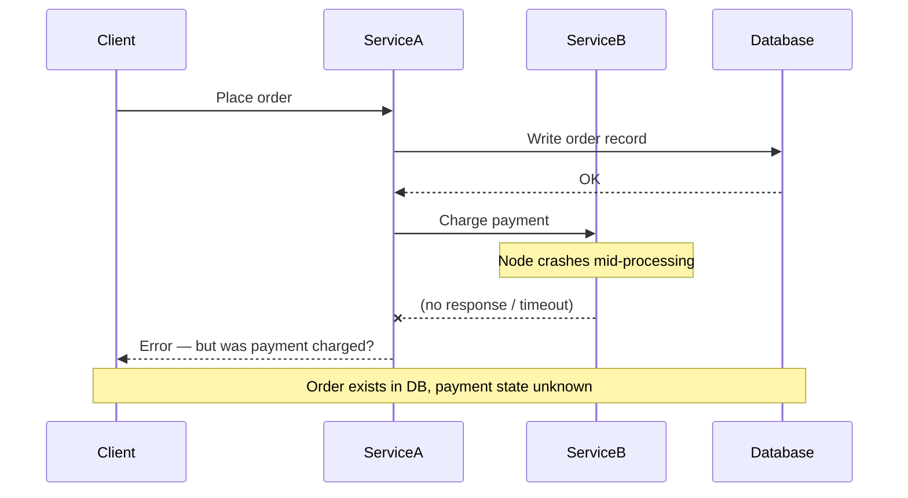

# Distributed Systems — Fundamentals

---

## What is a Distributed System?

A distributed system is a collection of independent computers that appear to their users as a single coherent system. The machines coordinate through message passing over a network, sharing no physical memory or clock. From the outside, users interact with one logical service; under the hood, hundreds or thousands of nodes may be cooperating.

We build distributed systems for three fundamental reasons:

- **Scale beyond a single machine.** No single server can handle Google Search, Netflix streaming, or Amazon's checkout flow. Distribution lets us add capacity horizontally.
- **Fault tolerance.** A single machine will eventually fail. Spreading work across nodes means one failure doesn't bring the whole system down.
- **Geographic latency.** Serving a user in Tokyo from a datacenter in Virginia adds 150–200 ms of round-trip latency. Distributed systems allow data and compute to live close to users.

**Real-world examples:**
- **Google Search** — thousands of index shards spread across dozens of datacenters, results merged in under 200 ms
- **Netflix** — Open Connect CDN delivers video from edge nodes within ISPs worldwide; microservices like the recommendation engine run on hundreds of AWS instances
- **Amazon** — order processing, inventory, payments, and fulfillment are each independent distributed services communicating asynchronously

> **Connects to:** [Fault Tolerance Patterns](./fault-tolerance.md) — the primary motivation for distributing a system is surviving failures; fault tolerance patterns are how you actually achieve that.

---

## Why Distributed Systems Are Hard

Distributed systems introduce a class of problems that simply don't exist on a single machine. Understanding them is what separates engineers who design systems that work in theory from those who design systems that survive production.

### Partial Failures

In a single process, something either works or it crashes completely. In a distributed system, some nodes fail while others keep running — and the healthy nodes may not know which is which. A request might be processed but the acknowledgment lost, leading to duplicate work or inconsistent state.

The hardest part: from `ServiceA`'s perspective, a timeout and a crash look identical. Did the payment go through or not?

### Unreliable Networks

The network between nodes can drop packets, delay them by seconds, deliver them out of order, or duplicate them. A response that never arrives might mean the server is down, the server is slow, or the network lost the reply *after* the server completed the work. TCP handles retransmission but not application-level semantics — if you retry a request that was already processed, you may charge a customer twice.

### No Global Clock

Every machine has its own clock, and clocks drift. Two nodes cannot agree on what "now" is, which makes ordering events across nodes fundamentally hard. If Node A writes a value at timestamp `T` and Node B writes a conflicting value at `T+1ms`, but Node B's clock is 5 ms ahead, the "later" write happened first in real time. Logical clocks (Lamport timestamps, vector clocks) exist to reason about causality rather than wall-clock time.

### Concurrency

Multiple nodes act simultaneously with no shared memory. Two nodes can read the same record, decide to update it, and both write their version back — the last write wins and silently discards the first. Coordination protocols (locks, consensus algorithms like Raft/Paxos) add overhead and become bottlenecks at scale.

> **Connects to:** [Consistency Models](./consistency.md) — partial failures and concurrency are exactly why consistency models exist; they define what guarantees a system makes when things go wrong.

---

## The 8 Fallacies of Distributed Computing

Originally articulated by Peter Deutsch and others at Sun Microsystems in the 1990s, these are the assumptions engineers make when first designing distributed systems — and why each is dangerous in practice.

| # | Fallacy | Why It Matters in Practice |
|---|---------|---------------------------|
| 1 | **The network is reliable** | Packets are dropped, NICs fail, cables are cut. You must design for retries, idempotency, and timeouts — not assume success. |
| 2 | **Latency is zero** | Even within a datacenter, a network call is ~500 µs vs ~100 ns for RAM. Chatty APIs that make dozens of calls per request become painfully slow at scale. |
| 3 | **Bandwidth is infinite** | Sending large payloads frequently saturates links. Pagination, compression, and efficient serialization formats (Protobuf vs JSON) matter at scale. |
| 4 | **The network is secure** | Traffic can be intercepted, replayed, or injected. Encryption in transit (TLS), mutual authentication, and defense-in-depth are non-negotiable in production. |
| 5 | **Topology doesn't change** | Nodes are added, removed, and replaced continuously. Services must discover each other dynamically (service registries, DNS-based discovery) rather than hardcoding IPs. |
| 6 | **There is one administrator** | Large systems cross team, org, and vendor boundaries. Different teams own different services with different deployment cadences, change windows, and SLAs. |
| 7 | **Transport cost is zero** | Moving data between availability zones or regions has real dollar costs on every major cloud. Cross-region replication and inter-AZ traffic fees add up quickly. |
| 8 | **The network is homogeneous** | Services run on different OS versions, JVM versions, and library versions. Protocols must be versioned; never assume all nodes speak the same dialect. |

These fallacies compound each other. A system built on multiple false assumptions simultaneously — assuming reliable, zero-latency, secure transport between homogeneous nodes — will fail in ways that are very difficult to debug.

---

## Latency vs Throughput

**Latency** is the time it takes to complete a single operation — the delay between sending a request and receiving a response. Lower is better.

**Throughput** is the number of operations completed per unit of time — requests per second, records processed per minute. Higher is better.

They trade off against each other. Batching increases throughput by amortizing overhead over many operations, but at the cost of latency (each item waits for the batch to fill). Parallel processing increases throughput but can increase resource contention and tail latency under load.

**The latency numbers every engineer should know:**

| Operation | Approximate Latency | Notes |
|-----------|-------------------|-------|
| L1 cache read | ~1 ns | On-chip; fastest memory access |
| L2 cache read | ~4 ns | Still on-chip |
| L3 cache read | ~40 ns | Shared across cores |
| RAM read | ~100 ns | 100× slower than L1 cache |
| SSD random read | ~100 µs | 1,000× slower than RAM |
| HDD seek + read | ~10 ms | Mechanical latency dominates |
| Network: same datacenter | ~500 µs | Within one AZ; fast but non-trivial |
| Network: cross-region (US→EU) | ~150 ms | Speed-of-light plus routing overhead |
| Network: cross-region (US→Asia) | ~200–300 ms | Increasingly noticeable in UIs |

Key insight: a single cross-region network call costs ~150 ms. A service that makes 5 synchronous cross-region calls in sequence pays 750 ms before doing any real work. These numbers explain why caching, data locality, and async processing are first-class concerns in distributed system design.

**Throughput bottlenecks** most commonly live at:
- The database (disk I/O, lock contention)
- The network link (bandwidth saturation)
- A single-threaded component that can't be parallelized (Amdahl's Law)

> **Connects to:** [Replication](./replication.md) — replication improves read throughput by serving reads from multiple replicas, but it introduces replication lag that affects latency for strongly-consistent reads.

---

## Horizontal vs Vertical Scaling in Distributed Systems

**Vertical scaling** (scale up) means moving to a bigger machine — more CPU cores, more RAM, faster disks. It's simple (no code changes needed) but hits hard limits: the largest AWS instance tops out at 448 vCPUs and 24 TB RAM. It also creates a single point of failure.

**Horizontal scaling** (scale out) means adding more machines of the same size and distributing the load across them. This is the foundation of distributed systems — it's why we accept the complexity of distribution at all.

| Property | Vertical Scaling | Horizontal Scaling |
|----------|-----------------|-------------------|
| Ceiling | Hard limit (largest machine) | Theoretically unbounded |
| Failure mode | Single point of failure | One node down ≠ system down |
| Cost curve | Super-linear (premium for top-tier hardware) | Near-linear |
| Code changes needed | None (usually) | Stateless design, data partitioning |
| Operational complexity | Low | High |

The shift from vertical to horizontal scaling is what makes distributed systems necessary — and what makes them hard. State must be partitioned or replicated. Requests must be routed. Node failures must be detected and handled. Every section in this guide exists because horizontal scaling forces these problems.

> **Connects to:** [../fundamentals/questions.md](../fundamentals/questions.md) — for a deep dive into scaling fundamentals, capacity estimation, and the interview framework for reasoning about when each approach applies.

---
