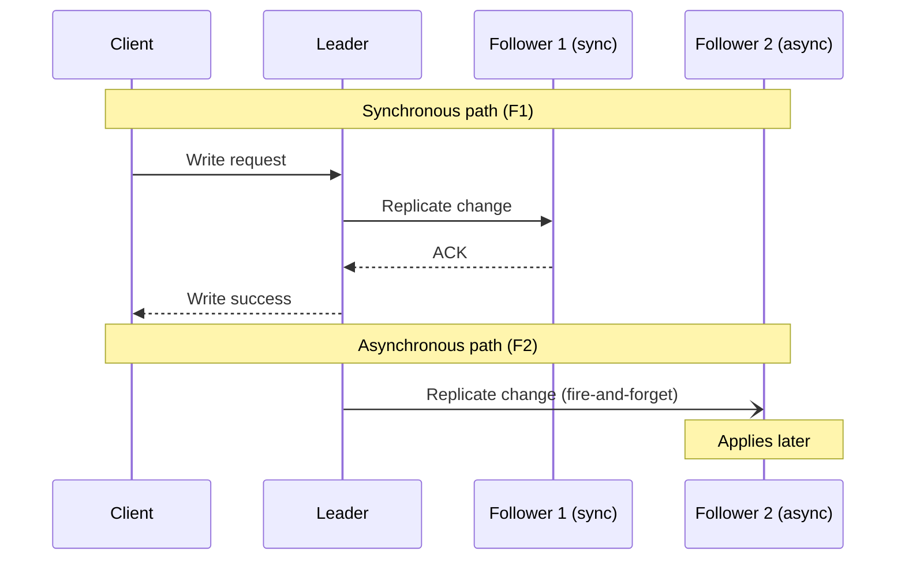
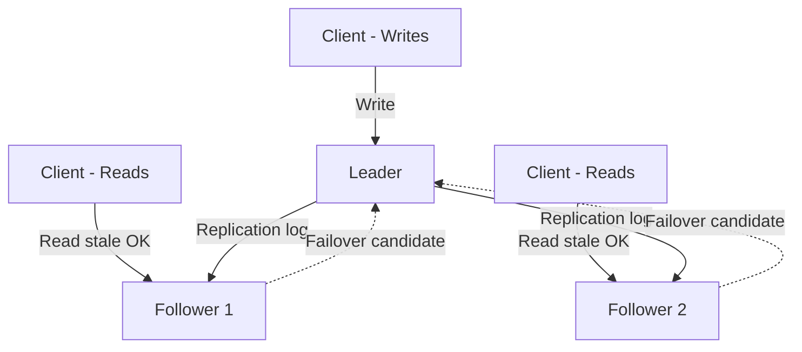
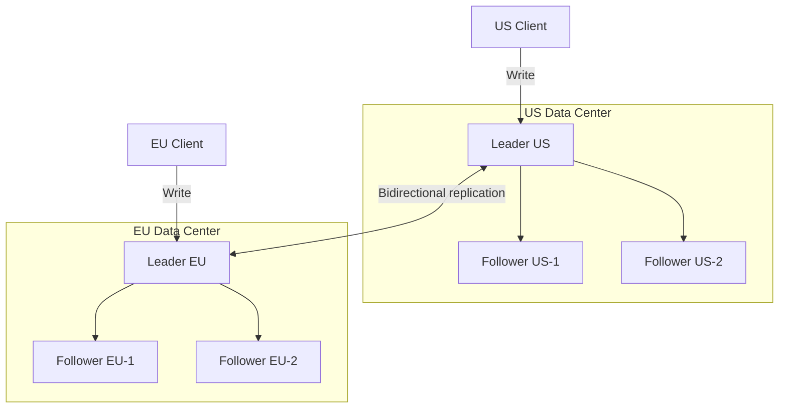
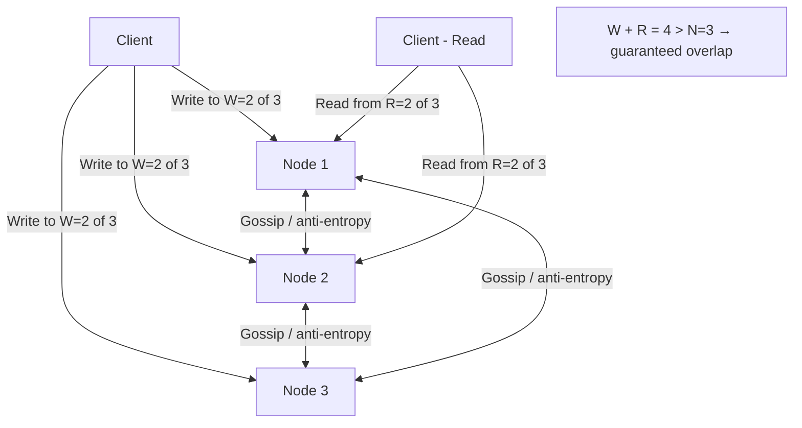
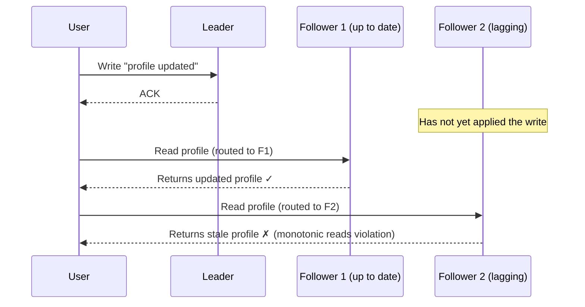

## Why Replication?

Replication means keeping copies of the same data on multiple nodes. Systems replicate data for three fundamental reasons: **fault tolerance** — if one node crashes, other replicas continue serving requests and no data is lost; **read throughput** — read requests can be distributed across replicas, scaling read capacity horizontally without partitioning data; and **geographic latency** — placing replicas in regions close to users reduces round-trip time for reads and, depending on the strategy, for writes too.

Every replication strategy is a trade-off between these three goals and the consistency guarantees it can provide.

> **Connects to:** [Consistency Models](./consistency.md) — the replication strategy you choose directly determines the consistency guarantees visible to clients.

> **Connects to:** [Fault Tolerance](./fault-tolerance.md) — replicas are the primary mechanism for surviving node failures; how failures are detected and handled shapes which replication model fits your system.

> **Connects to:** [Fundamentals Q&A — Sharding vs Replication](../fundamentals/questions.md#diff-between-sharding-and-replication) — replication increases copies of the same data; sharding splits data across nodes. They are orthogonal and often combined.

---

## Synchronous vs Asynchronous Replication

Before examining specific topologies, it is important to understand how the leader (or any write-accepting node) propagates changes to replicas, because this choice controls the latency and durability trade-off for every write.

**Synchronous replication** — the write is not acknowledged to the client until every replica has confirmed it applied the change. This guarantees that a failover never loses a committed write, but every write latency is bounded by the slowest replica. One lagging or unavailable follower can stall all writes.

**Asynchronous replication** — the leader acknowledges the write as soon as it has applied it locally and enqueued the change for followers. Replicas catch up in the background. Write latency is low and a single slow follower never blocks the leader, but if the leader crashes before a follower catches up, recently committed writes can be lost.

**Semi-synchronous replication** — a pragmatic middle ground. The leader waits for at least one designated replica to confirm before acknowledging the client. If that replica fails, another follower is promoted to synchronous. This guarantees at least two copies (leader + one sync replica) while bounding the blast radius of synchronous wait to a single node.

| Property | Synchronous | Semi-synchronous | Asynchronous |
|---|---|---|---|
| Durability on failover | No data loss | At most one lagging replica's lag | Potential data loss |
| Write latency | Slowest replica | One replica RTT overhead | Leader local only |
| Availability under replica failure | Write blocked if any replica unavailable | Write blocked only if sync replica down | Unaffected |
| Consistency | Strong (linearizable) | Strong for one replica | Eventual |
| Typical use | Financial ledgers, metadata stores | MySQL semi-sync, PostgreSQL synchronous_standby_names | High-throughput event streams |

---

## Single-Leader Replication

Single-leader (also called master-replica or primary-standby) is the most common replication model. One node is designated the **leader** and is the only node that accepts writes. All other nodes are **followers** (standbys, replicas). When the leader writes a row, it records the change in a replication log (WAL, binlog, or logical log). Each follower connects to the leader, pulls the log, and applies changes in the same order.

**Reads** can go to followers, which allows horizontal read scaling. However, because replication is usually asynchronous, a follower may serve stale data — this is **replication lag**. For reads that must reflect the user's own recent writes (e.g., a user updates their profile and immediately reloads it), the application must route those reads to the leader or use a read-your-writes mechanism.

**Leader failure** triggers a failover: a follower must be elected or appointed as the new leader. This requires consensus among nodes to avoid split-brain (two nodes both believing they are leader). See [Consensus](./consensus.md) for how systems like Raft and ZooKeeper handle this.

**Common replication lag anomalies** in single-leader setups are covered in detail in the [Replication Lag Problems](#replication-lag-problems) section below.

**Real systems:** PostgreSQL streaming replication (WAL shipping), MySQL/MariaDB binary log replication, Kafka (per-partition leader), MongoDB replica sets, Redis Sentinel/Cluster.

> **Connects to:** [Consensus](./consensus.md) — leader election during failover requires a consensus protocol to ensure exactly one node is promoted and to prevent split-brain scenarios.

---

## Multi-Leader Replication

Multi-leader replication (also called multi-master or active-active) allows **more than one node to accept writes**. Changes made on one leader are replicated to all other leaders and their followers. This topology is most common in **multi-region deployments**: each data center has its own local leader, so writes from users in that region go to the nearest leader without a cross-region round trip.

The critical problem is **write conflicts**. If a user in the US updates a row and simultaneously a user in Europe updates the same row, both leaders accept the write locally. When the changes are replicated, neither leader knows which write should win. Conflict resolution strategies:

- **Last-write-wins (LWW):** each write is tagged with a timestamp; the higher timestamp wins. Simple but lossy — the "losing" write is silently discarded, and clock skew makes this unreliable.
- **Application-level merge:** the system surfaces the conflict to the application, which implements domain-specific logic (e.g., a shopping cart merges two conflicting lists by union).
- **CRDTs (Conflict-free Replicated Data Types):** data structures designed so that concurrent updates always converge to the same result without coordination. Counters, sets, and registers are common CRDT types.
- **Operational Transformation (OT):** used in collaborative editing (Google Docs); operations are transformed against concurrent operations so that all replicas converge to the same document state.

**Real systems:** CockroachDB (multi-region active-active), Cassandra (multi-datacenter with tunable consistency), Google Docs (OT for text), Riak.

> **Connects to:** [Consistency Models](./consistency.md) — multi-leader systems typically offer only eventual consistency; understanding the consistency model is essential for choosing conflict resolution strategies.

---

## Leaderless Replication (Dynamo-style)

Leaderless replication removes the concept of a designated leader entirely. **Any node can accept writes**, and the client (or a coordinator node) sends the write to multiple nodes in parallel. Reads are similarly fanned out to multiple nodes. This was popularized by Amazon's Dynamo paper (2007) and is the basis for Cassandra, DynamoDB, and Riak.

**Quorum reads and writes** are the mechanism that provides tunable consistency. Given a cluster of N replica nodes:

- W = minimum number of nodes that must confirm a write before the client gets a success response.
- R = minimum number of nodes that must respond to a read before the client uses the result.
- If **W + R > N**, the read set and write set are guaranteed to overlap by at least one node, so the most recent write will always be visible to a quorum read.

A classic configuration is **N=3, W=2, R=2**: tolerates one node failure on writes and one on reads while guaranteeing overlap. For higher write availability at the cost of read consistency, use W=1, R=3. For strong consistency, W=N, R=1 (but then any node failure blocks writes).

**Version conflicts** still occur when two clients write to different nodes concurrently before quorum is reached. **Vector clocks** (or version vectors) track the causal history of each value: each node maintains a counter per replica, and the system can detect when two versions are causally concurrent (a conflict) vs. when one causally dominates the other (no conflict, just pick the later one). When a conflict is detected, the system can use LWW, application merge, or CRDTs to resolve it.

**Real systems:** Apache Cassandra (tunable N/W/R per operation), Amazon DynamoDB (internally uses quorums), Riak.

> **Connects to:** [Fault Tolerance](./fault-tolerance.md) — leaderless systems use hinted handoff and read repair as background mechanisms to recover data after a node rejoins the cluster.

> **Connects to:** [Consistency Models](./consistency.md) — quorum reads/writes provide tunable consistency but do not reach linearizability; understanding the spectrum from eventual to strong consistency is essential here.

---

## Replication Lag Problems

Even with a correctly operating single-leader setup, asynchronous replication introduces a window of inconsistency between the leader and followers. Three well-defined anomalies arise from this lag:

### 1. Read-After-Write (Read-Your-Writes) Inconsistency

A user writes data to the leader, then immediately issues a read that is routed to a follower. If the follower has not yet applied the write, the user sees stale data — as if their write never happened. This is especially jarring when the user edits their own profile or posts a comment and immediately sees the old version.

**Solutions:**
- Route reads that reflect the user's own data to the leader (e.g., always read from leader for the user's own profile page).
- Track the timestamp of the user's last write and refuse to serve reads from replicas whose replication position is behind that timestamp.
- Read from the leader for a short window (e.g., one minute) after any write by that user.

### 2. Monotonic Reads

A user issues two consecutive reads that are routed to different replicas. The first read hits a more up-to-date replica and returns a newer value; the second read hits a lagging replica and returns an older value. The user observes time moving backward — data appears and then disappears.

**Solutions:**
- Pin each user's reads to a single replica for the duration of a session (sticky sessions based on user ID hash).
- Track the replication position observed in the last read and only route to replicas at or past that position.

### 3. Consistent Prefix Reads

In a sharded or partitioned system where different partitions replicate independently, a user may read a sequence of writes out of order. For example: a question is written to partition A, its reply to partition B. Because partition B may replicate faster, a reader could see the reply before the question — causality is violated.

**Solutions:**
- Route causally related writes to the same partition so they are replicated together in order.
- Use causality tokens (Lamport timestamps or vector clocks) to detect and buffer out-of-order reads until prerequisites arrive.

> **Connects to:** [Consistency Models](./consistency.md) — each of these anomalies corresponds to a specific consistency level: read-your-writes, monotonic reads, and consistent prefix reads are all named consistency guarantees that a system may or may not provide.

---
