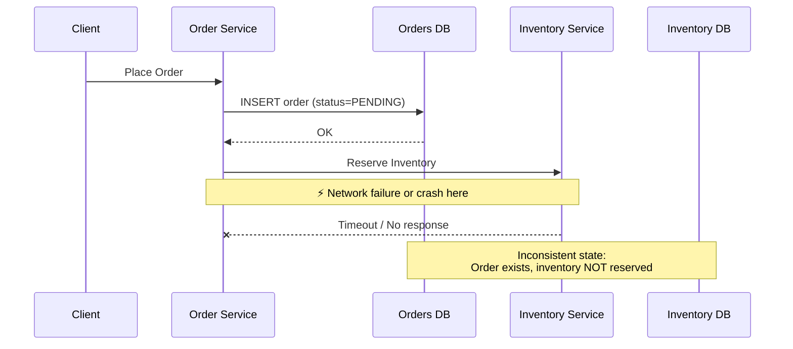
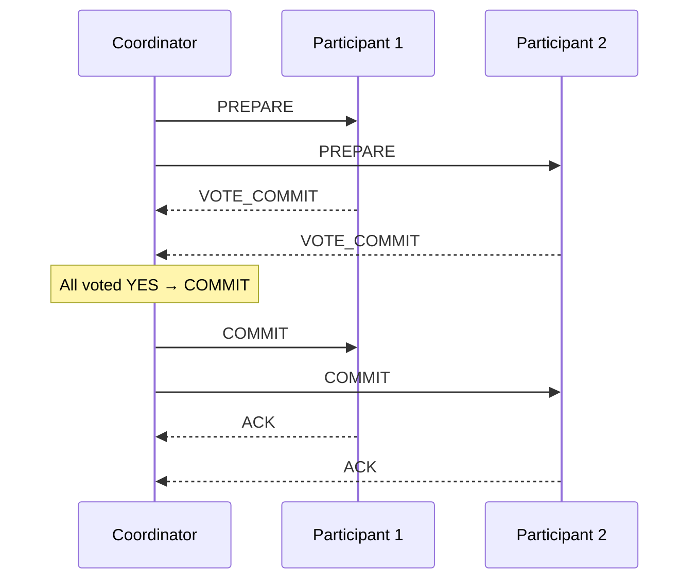
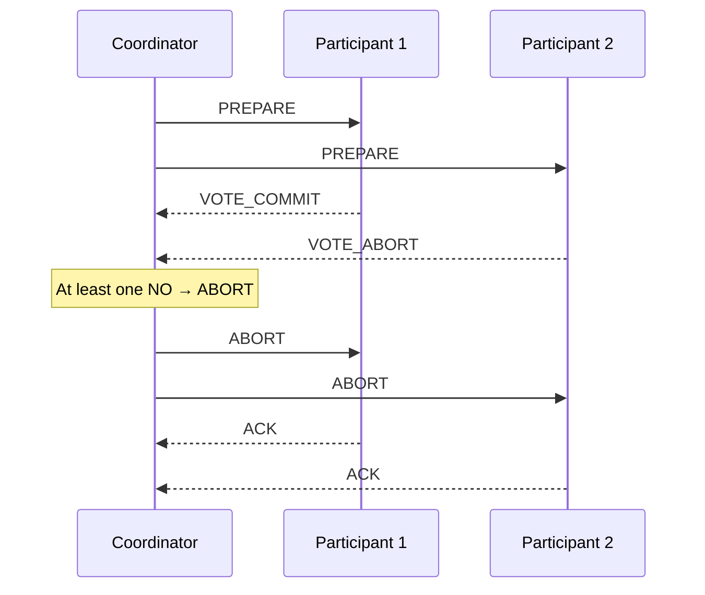
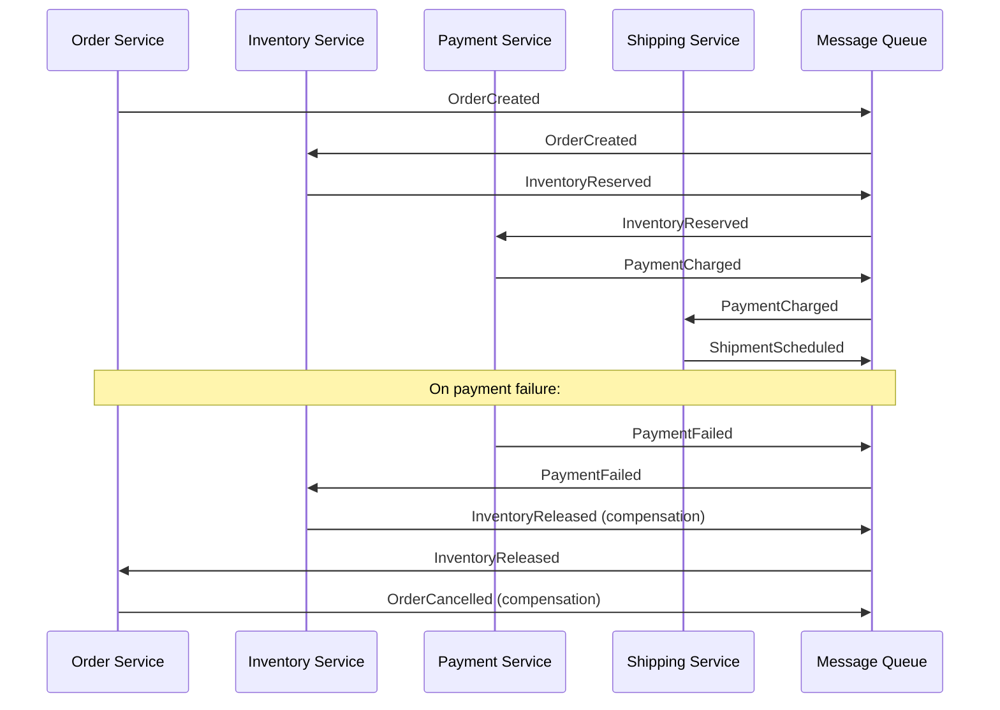
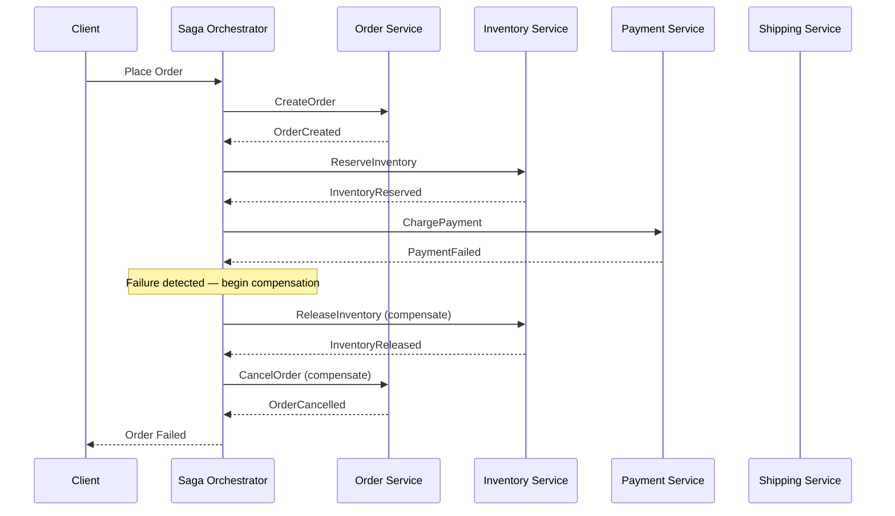
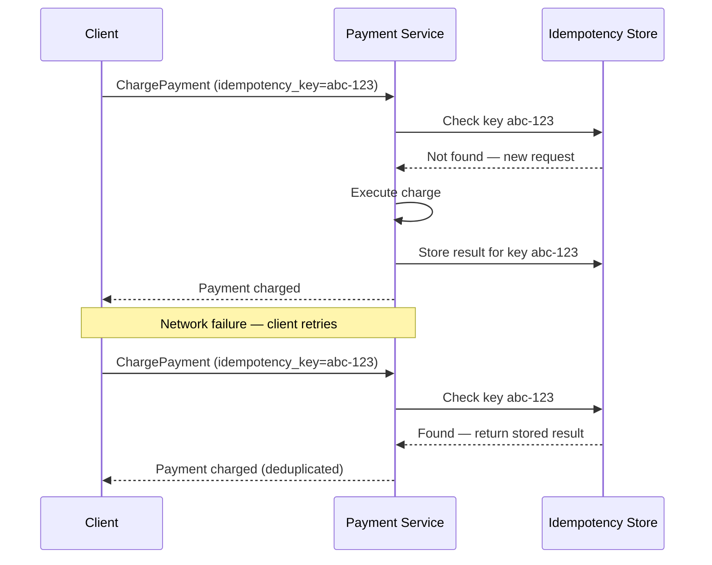

# Distributed Transactions

---

## ACID vs BASE

**ACID** is the set of properties that guarantee reliable processing in traditional, single-node database transactions. It is the foundation of relational databases like PostgreSQL and MySQL.

| Property | Meaning |
|---|---|
| **Atomicity** | The transaction is all-or-nothing. Either every operation succeeds, or none of them are applied. |
| **Consistency** | The database moves from one valid state to another. All integrity constraints are preserved. |
| **Isolation** | Concurrent transactions behave as if they executed serially. No dirty reads, no phantom reads. |
| **Durability** | Once committed, the transaction is permanent — even across crashes and restarts. |

**BASE** is the alternative model for distributed systems that prioritize availability over strict consistency. The term was coined as a deliberate counterpoint to ACID.

| Property | Meaning |
|---|---|
| **Basically Available** | The system guarantees availability, even if some nodes are partitioned or degraded. |
| **Soft state** | The state of the system may change over time, even without new input, as updates propagate. |
| **Eventually consistent** | Given enough time without new writes, all replicas will converge to the same value. |

**ACID vs BASE — Comparison**

| Dimension | ACID | BASE |
|---|---|---|
| Consistency model | Strong (immediate) | Eventual |
| Availability | May sacrifice availability for consistency | Prioritizes availability |
| Failure behavior | Abort and rollback | Accept partial state, resolve later |
| Latency | Higher (coordination overhead) | Lower (no global locks) |
| Scale | Harder to scale horizontally | Designed for horizontal scale |
| Typical systems | PostgreSQL, MySQL, Oracle | Cassandra, DynamoDB, CouchDB |

**Key insight for microservices:** In a microservices architecture, each service owns its own database. There is no shared transaction manager that can enforce ACID properties across service boundaries. This means that whenever a business operation touches more than one service, you are operating in BASE territory by default — and you need an explicit distributed transaction strategy to maintain correctness.

> **Connects to:** [Consistency Models](./consistency.md) — ACID vs BASE maps directly to strong vs eventual consistency. Understanding where your system sits on the consistency spectrum drives every data modeling decision.

---

## The Distributed Transaction Problem

Consider a typical e-commerce scenario: a customer places an order. This requires two operations that must succeed or fail together:

1. **Order Service** — create an order record in the orders database.
2. **Inventory Service** — decrement the stock count in the inventory database.

If only one of these succeeds, the system is in an inconsistent state: an order exists with no inventory reserved, or inventory is reserved with no corresponding order.

The problem is that these two services have **separate databases** and communicate over a **network that can fail**. There is no single transaction manager that can atomically span both operations.

**Why this is hard:**

- **Partial failures are invisible.** The Order Service doesn't know if the Inventory Service received the request, processed it, or crashed mid-way.
- **Retrying is dangerous.** Retrying the inventory reservation without knowing if the first attempt succeeded can double-deduct stock.
- **Rollback is not free.** To undo the order creation, you must issue a compensating operation — which can itself fail.
- **Two Generals Problem.** No amount of message-passing over an unreliable network can guarantee that two parties achieve consensus on a committed state. Any protocol must make trade-offs.

> **Connects to:** [Fault Tolerance & Retry Patterns](./fault-tolerance.md) — the strategies for handling network failures, retries, and idempotency that underpin every distributed transaction solution.

---

## Two-Phase Commit (2PC)

Two-Phase Commit is the classical protocol for achieving atomic commit across multiple participants (databases or services). A **coordinator** node manages the protocol on behalf of all **participants**.

### How It Works

**Phase 1 — Prepare (Voting)**

The coordinator sends a `PREPARE` message to every participant. Each participant checks if it can commit (acquires locks, writes to a write-ahead log, ensures constraints are met) and replies either `VOTE_COMMIT` or `VOTE_ABORT`.

**Phase 2 — Commit or Abort**

- If **all** participants voted `VOTE_COMMIT` → the coordinator sends `COMMIT` to all participants. Each participant applies the transaction and releases locks.
- If **any** participant voted `VOTE_ABORT` (or timed out) → the coordinator sends `ABORT` to all participants. Each participant rolls back.

### Happy Path

### Failure Path

### Problems with 2PC

| Problem | Description |
|---|---|
| **Coordinator SPOF** | If the coordinator crashes after sending `PREPARE` but before sending `COMMIT`, participants are stuck holding locks indefinitely, waiting for a decision that never comes. |
| **Blocking protocol** | Participants hold resource locks across both phases. Under high latency or coordinator failure, this blocks all concurrent access. |
| **Not partition-tolerant** | A network partition between the coordinator and a participant causes an indefinite block. 2PC sacrifices availability (CAP theorem). |
| **Scalability** | Coordinating many participants increases latency linearly. Impractical at microservice scale with dozens of services. |

### When to Use 2PC

- Operations within the **same datacenter** where network partitions are rare and round-trip latency is low.
- **Small number of participants** (typically 2–5 databases or services).
- **Strong consistency is non-negotiable** (financial transactions, inventory reservations with hard constraints).
- You control all participants (they support XA or an equivalent protocol).

**Real systems:** XA transactions (Java EE, Spring), some relational databases (PostgreSQL, MySQL with `XA START`), distributed databases like CockroachDB and Spanner use variants internally.

> **Connects to:** [Consensus Algorithms](./consensus.md) — the coordinator in 2PC is a single point of failure. Paxos and Raft solve the same problem (agreeing on a value across nodes) with fault-tolerant consensus instead of a single coordinator.

---

## SAGA Pattern

The SAGA pattern solves distributed transactions without a locking coordinator. Instead of one atomic distributed transaction, a business operation is decomposed into a **sequence of local transactions**, each of which updates a single service's database and publishes an event or message to trigger the next step.

**The key rule:** every local transaction must have a corresponding **compensating transaction** — a business-level undo operation that reverses its effect. If step N fails, the SAGA executes compensating transactions for all completed steps in reverse order (N-1, N-2, … 1).

**Example: E-commerce order flow**

| Step | Local Transaction | Compensating Transaction |
|---|---|---|
| 1 | Create order (status = PENDING) | Cancel order (status = CANCELLED) |
| 2 | Reserve inventory | Release inventory reservation |
| 3 | Charge payment | Refund payment |
| 4 | Schedule shipment | Cancel shipment |

### Choreography SAGA

Each service listens for events published by the previous service, executes its local transaction, and publishes its own event. There is no central coordinator — the flow emerges from the chain of event reactions.

**Pros:** No central point of failure. Services are loosely coupled — adding a new step only requires a new subscriber.

**Cons:** The overall flow is implicit and hard to trace. Debugging requires correlating events across multiple services and log streams. Cyclic dependencies between services are easy to introduce accidentally.

> **Connects to:** [Message Queues](../fundamentals/questions.md#whats-message-queue) — choreography SAGAs depend on reliable, ordered message delivery. The message queue is the backbone of event propagation and the guarantee that compensating transactions are triggered even after a service crash.

### Orchestration SAGA

A dedicated **Saga Orchestrator** (a service or state machine) explicitly tells each participant service what to do next. The orchestrator tracks the current step, handles failures, and triggers compensating transactions centrally.

**Pros:** The full state of the saga is visible in one place. Easy to monitor, debug, and add retry logic. Clear audit trail for compliance.

**Cons:** The orchestrator becomes a central dependency — if it goes down, in-flight sagas stall. Requires careful design to avoid the orchestrator becoming a "god service" with too much business logic.

**Choosing between choreography and orchestration:**

| Factor | Choreography | Orchestration |
|---|---|---|
| Flow complexity | Simple, linear flows | Complex flows with branching/retries |
| Observability | Harder — distributed traces needed | Easy — orchestrator holds state |
| Coupling | Lower — services only know events | Higher — services know the orchestrator |
| Failure handling | Each service handles its own retries | Centralized retry and compensation logic |
| Operational complexity | Lower initially, grows with flow size | Higher setup, easier long-term |

---

## 2PC vs SAGA — When to Use Each

| Dimension | Two-Phase Commit (2PC) | SAGA |
|---|---|---|
| Consistency model | Strong (immediate) | Eventual (compensations, not rollbacks) |
| Availability under partition | Low — participants block | High — each service remains available |
| Participant count | Small (2–5) | Any number |
| Network topology | Same datacenter, low latency | Cross-datacenter, microservices |
| Failure handling | Abort and rollback atomically | Compensating transactions |
| Implementation complexity | Protocol-level (XA, DB support needed) | Application-level (compensations must be written) |
| Latency impact | High (locking across phases) | Low (no distributed locking) |
| Debugging | Straightforward — single coordinator log | Harder — events spread across services |
| Suitable for | Financial ledgers, inventory hard-limits, same-DB operations | Microservices, order workflows, user onboarding flows |

**Rule of thumb:** If your participants are multiple microservices with independent databases, use SAGA. If you are coordinating a small number of databases in a controlled environment and need strict atomicity, 2PC may be appropriate. In modern distributed systems, SAGA is almost always the right default.

> **Connects to:** [Consistency Models](./consistency.md) — 2PC delivers strong consistency at the cost of availability; SAGA delivers eventual consistency. Knowing which consistency level your business operation can tolerate drives this choice.

---

## Idempotency in Distributed Transactions

In distributed systems, **retries are unavoidable**. Networks time out. Processes crash mid-operation. Load balancers retry failed requests. This means any operation may be executed more than once — at the protocol layer, you get **at-least-once delivery**, not exactly-once.

Without idempotency, retries cause duplicate side effects: double charges, duplicate orders, double inventory decrements.

### Idempotency Keys

An **idempotency key** is a unique identifier (typically a UUID or hash) attached to each operation by the caller. The server stores the key alongside the result. On subsequent requests with the same key, the server returns the stored result instead of re-executing the operation.

### Idempotent Compensating Transactions

Compensating transactions in a SAGA must also be idempotent. The orchestrator or event handler may re-trigger a compensation multiple times if it doesn't receive an acknowledgment. A compensation that deducts stock or refunds a payment twice is worse than no compensation at all.

**Pattern:** Store the state of each SAGA step (including whether compensation has been applied) in a persistent log keyed by saga ID + step number. Before executing a compensation, check whether it has already been applied.

### At-Least-Once + Idempotent Consumers = Effectively Once

The practical guarantee in distributed systems is:

> **At-least-once delivery** (the message queue will deliver the message, possibly multiple times) + **idempotent consumer** (the handler safely ignores duplicate messages) = **effectively-once behavior** at the application level.

This is the foundation of reliable event-driven SAGAs. Every event handler in a choreography SAGA should be idempotent by default.

> **Connects to:** [Fault Tolerance & Retry Patterns](./fault-tolerance.md) — idempotency keys are the implementation complement to retry strategies. Exponential backoff with jitter decides *when* to retry; idempotency keys make retries *safe*.

---
