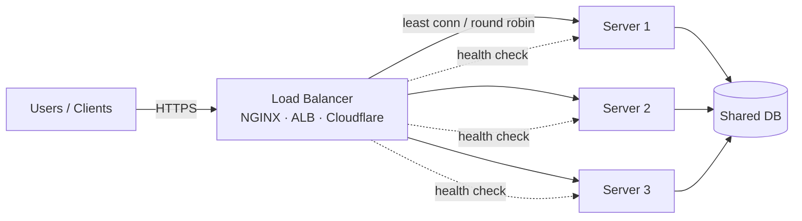
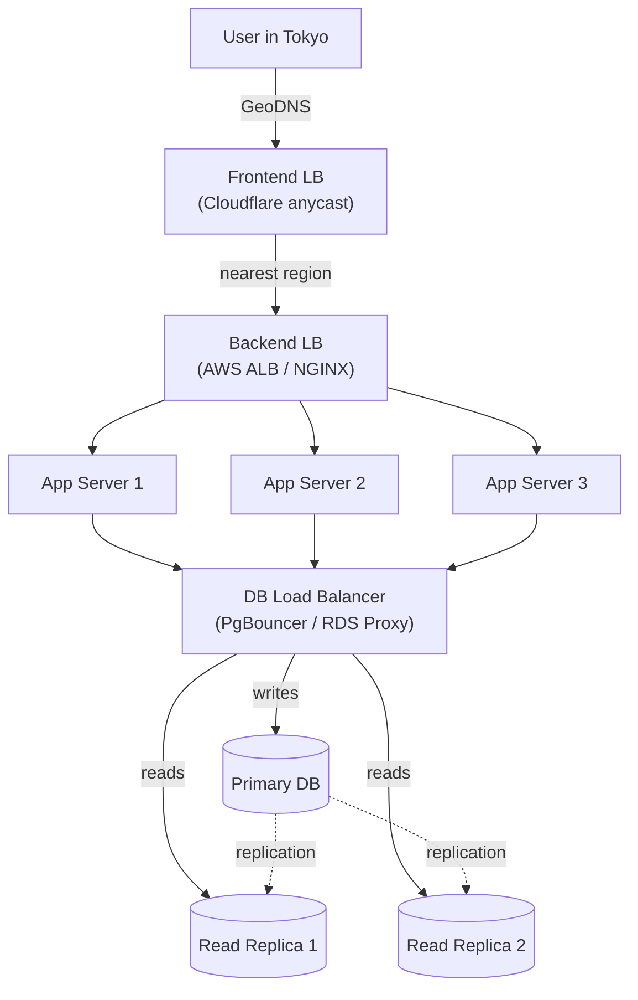
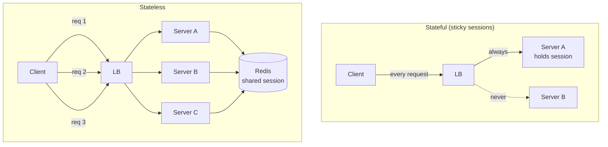
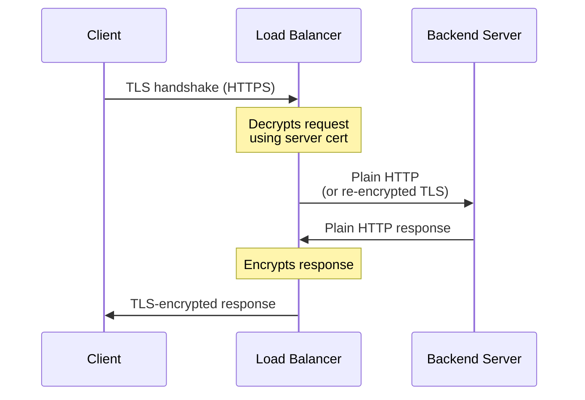
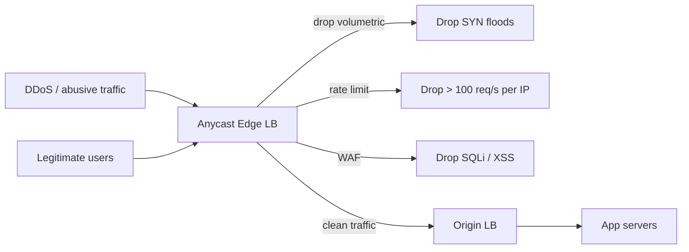

# Load Balancer

A load balancer (LB) sits in front of a pool of servers and distributes incoming traffic across them. It improves **scalability** (no single server gets overwhelmed), **availability** (a dead server is taken out of rotation), and **security** (it can absorb or filter abusive traffic before it reaches your application).

When a server starts receiving more requests than it can handle, two things can happen: legitimate users see degraded latency / errors, or — worse — the spike is a **DDoS** (Distributed Denial of Service) attack where thousands of compromised machines flood your origin to take it offline. A properly configured load balancer is the first line of defense against both: it spreads load, drops obvious garbage, and isolates failures.

> **Connects to:** [Scalability](../../system-design/fundamentals/questions.md#what-is-scalability) — horizontal scaling is impossible without a load balancer. [Stateless vs Stateful](../../system-design/fundamentals/questions.md#stateless-vs-stateful) — stateless apps allow true round-robin without sticky sessions. [API Gateway](../../system-design/fundamentals/questions.md#what-is-api-gateway-vs-load-balancer) — gateway sits **above** the load balancer in a microservice stack. [Fault Tolerance](../distributed-systems/fault-tolerance.md) — health checks + failover are core fault-tolerance primitives.

---

## Where Load Balancers Live

Load balancers don't live in a single place — most production systems use **multiple LBs at different tiers**, each solving a different problem.

### Frontend Load Balancer (edge / global)

Sits at the **edge of the internet**, before the request even reaches your data center. Its job is to route the user to the closest / healthiest **region**.

- **GeoDNS / latency-based DNS** (e.g., AWS Route 53, Cloudflare DNS) — the DNS resolver returns a different IP depending on where the user is, so a user in Tokyo hits your `ap-northeast-1` region while a user in Madrid hits `eu-west-1`.
- **Anycast IP** (Cloudflare, Fastly, Google Cloud LB) — the same IP address is announced from dozens of points of presence worldwide. BGP routing automatically delivers the user's packets to the nearest PoP.
- **CDN as a frontend LB** (CloudFront, Cloudflare, Akamai) — for static assets and cacheable content, the edge node *is* the server; for dynamic requests, the CDN proxies to the nearest origin.

This layer is usually invisible to engineers who haven't worked on global products, but it's why a single `app.example.com` URL can resolve to different servers depending on who's asking.

### Backend Load Balancer (application tier)

The "classic" load balancer most engineers picture. Sits between the public internet (or the frontend LB) and your fleet of application servers.

- Distributes HTTP/HTTPS requests across stateless app instances.
- Terminates TLS, runs health checks, applies rate limiting.
- Examples: **NGINX**, **HAProxy**, **AWS ALB**, **Envoy**, **Traefik**.

### Database Load Balancer (data tier)

Less commonly known, but critical for read-heavy systems. A connection-level proxy sits between your application and the database fleet.

- **Read/write splitting** — sends `SELECT` to read replicas, `INSERT/UPDATE/DELETE` to the primary.
- **Connection pooling** — a single client connection is multiplexed across thousands of short-lived backend connections (databases like PostgreSQL are expensive to connect to).
- **Failover routing** — if the primary dies, the proxy redirects writes to the newly-promoted replica without the application reconnecting.
- Examples: **PgBouncer**, **ProxySQL**, **AWS RDS Proxy**, **Vitess** (sharding + LB for MySQL).

---

## Static vs Dynamic Load Balancers

Load balancers fall into two families based on **whether they look at the current state of the backend** when deciding where to send a request.

| | Static | Dynamic |
|---|---|---|
| **Decision logic** | Fixed rule (round robin, hash, weights) | Real-time metrics (connections, latency, CPU) |
| **Knows server load?** | No — assumes all servers behave equally | Yes — actively monitors backends |
| **Cost** | Cheap, simple, predictable | More complex, more compute on the LB |
| **Best when** | Servers are homogeneous and requests are uniform | Requests vary in cost, or servers vary in capacity |
| **Risk** | A slow/overloaded server keeps getting traffic | Misconfigured metrics can flap (oscillate) |
| **Examples** | Round Robin, IP Hash, URL Hash | Least Connections, Least Response Time |

A **static** load balancer is essentially a deterministic function: `server = f(request)`. It doesn't care that Server 2 is at 95% CPU while Server 3 is idle — if the rule says Server 2 is next, traffic goes to Server 2.

A **dynamic** load balancer continuously polls or measures the backend pool and adapts. It's strictly more powerful but has more failure modes: if your latency probe is broken, the LB might think every server is unhealthy and start dropping requests.

In practice, modern LBs (ALB, NGINX Plus, HAProxy) support both and let you mix: e.g., weighted round robin with health-aware drop-out.

---

## Algorithms

### Static algorithms

#### Round Robin
Distributes requests in sequence: `S1 → S2 → S3 → S1 → …`. Simplest possible algorithm. Works well when servers are equal and requests are uniform in cost.

**Weakness:** ignores server load. If S2 has a stuck request consuming 100% CPU, round robin will happily send the next request to it anyway.

#### Weighted Round Robin
Same idea, but each server gets a **weight** proportional to its capacity. A server with weight 3 receives 3 requests for every 1 request a weight-1 server gets.

**Use case:** heterogeneous fleets — e.g., you're rolling out a new generation of beefier instances and want to send them more traffic, or you want to **canary** 10% of traffic to a new version (`v1: weight=9, v2: weight=1`).

#### IP Hash
Hashes the client IP and uses the hash to pick a server. The same client always lands on the same server.

**Use case:** legacy apps that store session in local memory ("sticky sessions"). Strongly discouraged for new systems — externalize session state to Redis instead and stay stateless.

**Weakness:** uneven distribution if one IP (e.g., a corporate NAT or mobile carrier gateway) sends disproportionate traffic. Adding/removing servers reshuffles every client.

#### URL Hash
Hashes the request URL (or path) instead of the client. The same URL always lands on the same server.

**Use case:** cache locality. If `/products/123` always hits the same backend, that backend's local cache stays hot for that product. This is the foundation of **CDN cache sharding** and **consistent hashing** in distributed caches.

**Weakness:** popular URLs become hotspots — every request for `/home` slams the same server. Mitigated with consistent hashing + bounded loads.

### Dynamic algorithms

#### Least Connections
Sends the next request to whichever backend currently has the **fewest open connections**. Best when requests vary wildly in cost (slow DB queries, file uploads, long-polling).

**Use case:** mixed workloads where one request might take 5 ms and another 5 s. Round robin would let the slow ones pile up on one server; least connections drains them naturally.

#### Least Response Time
Picks the server with the **lowest recent average response latency**. The LB tracks p50/p95 per backend and prefers the fastest.

**Use case:** latency-sensitive APIs. Naturally avoids servers that are GC-pausing, swapping, or hitting a slow downstream dependency.

**Weakness:** noisy. A single slow request can spike a server's average and starve it of traffic, leading to oscillation. Usually combined with a moving window and damping.

#### Resource-based (CPU / memory)
Backends report their CPU / RAM utilization to the LB; traffic flows toward the least-loaded box. Used by orchestration-aware proxies (Envoy with EDS, service meshes).

---

## Stateful vs Stateless (at the connection level)

This is a distinct question from "stateless app servers" — it's about whether the **load balancer itself** keeps state about connections between clients and backends.

### Stateful load balancers

The LB tracks every active connection in an internal table: client IP/port ↔ chosen backend. Once a client is bound to a backend, every subsequent packet/request from that client goes to the same backend until the connection is closed (or, with sticky sessions, for the lifetime of a session cookie).

- **Layer 4** TCP load balancers are inherently stateful — they have to remember which backend each TCP connection was assigned to.
- **Sticky sessions** (a Layer 7 feature) extend this to the session level: a cookie like `AWSALB=<server-id>` ensures all of one user's HTTPS requests hit the same backend, useful for legacy stateful apps.
- **Pros:** session affinity works without code changes; backends can keep local cache warm per user.
- **Cons:** uneven load (one whale user can hammer one server), painful failover (when the bound server dies, the user's session vanishes), harder to scale the LB itself horizontally.

### Stateless load balancers

The LB makes a routing decision **per request** with no memory of past decisions. A user's 10 requests in a row may land on 10 different backends.

- **Pros:** any LB instance can handle any request; trivially horizontally scalable; backend failures are invisible to the client.
- **Cons:** requires the application tier to be stateless too (sessions in Redis/JWT, not in process memory). See [Stateless vs Stateful](../../system-design/fundamentals/questions.md#stateless-vs-stateful) for the application-side story.

**Rule of thumb:** keep both the load balancer routing and the application tier stateless. Push state into Redis / a database. Use sticky sessions only as a temporary crutch for legacy apps you can't easily refactor.

---

## Capabilities

Beyond just picking a backend, modern load balancers do a surprising amount of work. The features below are why people pay for ALB / Cloudflare instead of just running a DNS round-robin.

### Health checking

The LB continuously probes each backend to decide if it's eligible to receive traffic. A backend that fails N consecutive probes is **drained** (no new traffic, existing connections finish gracefully) until it recovers.

- **Active probes** — the LB sends a synthetic request (e.g., `GET /health` every 5 s) and checks the status code / response body.
- **Passive probes** — the LB watches real traffic and removes a backend that returns too many 5xx errors or times out.
- **Two-tier checks** — `/healthz` (cheap, "is the process alive?") vs `/readyz` (expensive, "are all my dependencies — DB, cache, downstream services — also alive?"). Kubernetes formalizes this distinction.

Without health checks, a load balancer is actively dangerous: if 1 of 5 servers crashes, 20% of traffic gets errors instead of 0%.

### Dynamic provisioning (autoscaling integration)

The LB integrates with the orchestrator (Kubernetes, ECS, Auto Scaling Groups) to automatically pick up new backends as they're spun up and drop them as they're terminated.

- A new pod / EC2 instance comes online → registers with the LB → starts receiving traffic once it passes health checks.
- A scale-in event marks an instance as *draining* → LB stops sending new requests but lets in-flight ones complete (`connection draining` / `deregistration delay`).
- Combined with **autoscaling policies** (scale up when CPU > 70%, scale down when CPU < 30%), this gives you elastic capacity that grows and shrinks with traffic without manual intervention.

This is why cloud LBs (ALB, GCLB) can absorb traffic spikes that would have required pre-provisioned capacity 10 years ago.

### TLS termination

This is one of the most important LB features and the most commonly misunderstood.

**The flow:**

The load balancer holds the TLS certificate and **decrypts incoming HTTPS traffic**. It then forwards the request to the backend over either:

1. **Plain HTTP** — fast, simple, requires a trusted private network between LB and backends.
2. **Re-encrypted TLS** ("end-to-end encryption" / "TLS passthrough variant") — the LB re-encrypts to the backend with a separate cert. Required for zero-trust environments and most compliance regimes (PCI-DSS, HIPAA).
3. **Pure passthrough** (Layer 4 only) — the LB forwards encrypted bytes blindly. The backend handles TLS. The LB **cannot inspect or route by HTTP content** in this mode.

**Why terminate at the LB?**

- **Centralized cert management.** One place to install, rotate, and renew certificates (Let's Encrypt every 90 days, AWS ACM auto-rotation). Backends never touch a cert.
- **CPU offloading.** TLS handshakes are expensive (RSA / ECDSA). Doing them once at the LB instead of on every backend frees app servers to do real work. Modern LBs have hardware-accelerated TLS.
- **Layer 7 routing requires it.** The LB needs to read the URL path / Host header / cookies to make routing decisions like "send `/api/*` to service A and `/images/*` to service B." That's only possible after decryption.
- **WAF and inspection.** Web Application Firewalls, rate limiters, and bot detection all need to see the cleartext request to do their job.

The trade-off: traffic between LB and backend is plaintext on your network. In modern cloud setups (mTLS, service mesh, private VPC) this is acceptable; in stricter environments, re-encrypt.

### Security: rate limiting, WAF, DDoS prevention

Putting an LB at the edge is the cheapest way to keep your application from being trivially crushed by traffic — malicious or accidental.

**Volumetric absorption.** A DDoS attack throws gigabits of traffic at you. Anycast LBs (Cloudflare, AWS Shield, GCLB) accept traffic in **dozens of PoPs simultaneously**, so a 1 Tbps attack is split across 50 locations and arrives as a manageable 20 Gbps per location. Your origin sees almost nothing.

**Rate limiting.** Cap requests per source per unit time:

- *"No single IP > 100 requests/sec"* — stops basic flooders.
- *"No single API key > 10,000 requests/min"* — protects against runaway clients and credential sharing.
- *"Slow down anyone with > 10 failed logins in 60 s"* — credential-stuffing defense.

Implemented with token-bucket or sliding-window counters at the LB, before the request ever reaches your application.

**Connection limits / SYN flood protection.** Caps concurrent TCP connections per source IP. Combined with **SYN cookies**, the LB defends against attackers that open millions of half-open connections to exhaust your file-descriptor table.

**Layer 7 filtering (WAF).** A Web Application Firewall sits inside or beside the LB and inspects request content for malicious patterns: SQL injection (`' OR 1=1 --`), XSS payloads, path traversal (`../../etc/passwd`), known exploit signatures (Log4Shell, Struts CVEs). Examples: AWS WAF, Cloudflare WAF, ModSecurity in front of NGINX.

**Bot management.** Distinguish humans from automation via JS challenges, CAPTCHA, and behavioral fingerprinting (mouse movement, request timing). Cloudflare and Akamai have entire products built on this.

**Geo-blocking & IP reputation.** Drop traffic from countries you don't serve, or from known-malicious IP ranges (Tor exit nodes, abusive ASNs). Cheap, broad-strokes filtering.

**The mental model:** every layer drops what it can cheaply identify as abusive, and the surviving traffic gets progressively more expensive scrutiny. Volumetric drops at the network edge, payload inspection at L7, business-logic rate limits in your application.

---

## Layer 4 vs Layer 7

A quick aside that explains a lot of the terminology above.

| | Layer 4 (Transport) | Layer 7 (Application) |
|---|---|---|
| **Operates on** | TCP/UDP packets | HTTP/HTTPS requests |
| **Sees** | IPs, ports, byte streams | URLs, headers, cookies, body |
| **Can route by** | Source IP, destination port | Path (`/api/*`), Host header, cookie value |
| **Can do TLS termination** | No (passthrough only) | Yes |
| **Latency** | Lower (no parsing) | Slightly higher |
| **Examples** | AWS NLB, HAProxy in TCP mode, IPVS | AWS ALB, NGINX, Envoy, Traefik |

**Rule of thumb:** L4 for raw throughput and non-HTTP protocols (databases, gRPC streaming, gaming UDP). L7 for everything HTTP, where you want path-based routing, header rewriting, and TLS termination.

---

## Common Technologies

| Tool | Layer | Type | Use case |
|---|---|---|---|
| **NGINX** | L4 + L7 | Self-hosted | Most common open-source LB; reverse proxy + LB + static server |
| **HAProxy** | L4 + L7 | Self-hosted | High-performance LB; preferred for L4 and database proxying |
| **Envoy** | L4 + L7 | Self-hosted | Service mesh sidecar (Istio, Consul, AWS App Mesh) |
| **Traefik** | L7 | Self-hosted | Cloud-native; auto-discovers backends from Docker / Kubernetes |
| **AWS ALB** | L7 | Managed | Default for HTTP/HTTPS in AWS; path/host routing, WAF integration |
| **AWS NLB** | L4 | Managed | Ultra-high throughput TCP/UDP; static IP per AZ |
| **GCP Cloud Load Balancing** | L4 + L7 | Managed | Single global anycast IP; cross-region failover |
| **Cloudflare** | L7 | Managed (edge) | Frontend / DDoS / WAF; sits in front of your origin LB |
| **PgBouncer / ProxySQL** | L4 | Self-hosted | Database connection pooling + read/write splitting |
| **AWS RDS Proxy** | L4 | Managed | Managed connection pooling for RDS / Aurora |

---

## Interview-ready summary

When a system design interviewer asks "how do you handle 1M RPS?" the load-balancer answer is structured like this:

1. **Anycast / GeoDNS** at the edge to route users to the nearest region and absorb DDoS.
2. **Layer 7 LB** (ALB / NGINX) per region, terminating TLS, doing path-based routing, running health checks.
3. **Stateless app tier** so any server can handle any request; sessions in Redis.
4. **Connection-pooling DB proxy** (PgBouncer / RDS Proxy) so you can scale app servers to thousands without melting the database.
5. **Health checks + autoscaling** at every tier so capacity follows demand.
6. **Rate limiting + WAF** at the edge to keep abusive traffic from reaching origin.

Each of those is a load balancer doing a different job at a different layer.

> **Connects to:** [Scalability](../../system-design/fundamentals/questions.md#what-is-scalability) · [Stateless vs Stateful](../../system-design/fundamentals/questions.md#stateless-vs-stateful) · [API Gateway](../../system-design/fundamentals/questions.md#what-is-api-gateway-vs-load-balancer) · [High Availability](../../system-design/fundamentals/questions.md#how-would-you-ensure-high-availability) · [Fault Tolerance](../distributed-systems/fault-tolerance.md) · [Replication](../distributed-systems/replication.md) — the DB load balancer is what makes read replicas usable from the app tier.
