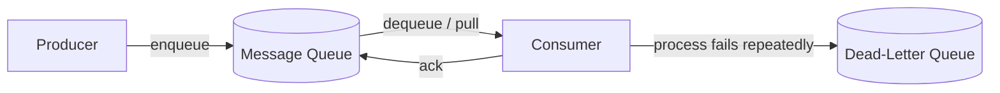

# Message Queues in System Design

> A buffering component that decouples producers and consumers, enabling systems to absorb load spikes without falling over.

## Overview

A **message queue** is a durable buffer that sits between two parts of a system: it accepts an input (a message) and makes it available as an output to be consumed later. It can be as small as an in-memory queue between two threads/services on the same machine (e.g., a C# `HostedService` running inside an application), or as large as a managed cloud service like **Amazon SQS**, **RabbitMQ**, or **Kafka**.

In a system design diagram, the queue is always drawn as its own isolated component — not absorbed into the producer or the consumer — because it has its own failure modes, scaling concerns, and operational behavior.

The core value of a queue is **not speed** — it doesn't make any single request faster. The value is **resilience and load smoothing**: it lets a system absorb thousands of requests without crashing, by letting producers and consumers operate at different paces.

## Core Concepts

| Concept | Description |
|---|---|
| **Producer** | The service that creates and sends messages into the queue. |
| **Consumer** | The service that pulls messages off the queue and processes them. |
| **Decoupling** | Producer and consumer don't know about each other or call each other directly — they only know about the queue. |
| **Buffering** | The queue absorbs bursts of messages so the consumer can process them at its own pace. |
| **Fan-out** | Multiple consumers/services receiving and processing the same message. |
| **Retry policy** | If a consumer fails to process a message, the queue can redeliver it. |
| **Dead-Letter Queue (DLQ)** | Where messages go after repeated processing failures, for later inspection/reprocessing. |

**Important constraint:** queues are for messages, not large payloads. You should never send a photo or large file through a queue — send a reference (e.g., a URL/ID pointing to blob storage) instead.

## How It Works

Basic operations a queue supports:

- **Enqueue** — producer adds a message to the queue.
- **Dequeue** — consumer pulls/removes a message from the queue.
- **Acknowledge (ack)** — consumer confirms successful processing; only after the ack is the message actually removed from the queue.
- **Retry** — if processing fails or no ack is received in time, the message becomes visible again for reprocessing.
- **Send to DLQ** — after a configured number of failed attempts, the message is moved out to a separate dead-letter queue instead of retrying forever.

Consumers **pull** from the queue (rather than the queue pushing to them). The message is only removed from the queue *after* the consumer acknowledges it — this is what makes retries possible: if a consumer crashes before acking, the message stays in the queue and gets redelivered.

## Why Use a Queue: Isolation & Availability

Two of the biggest benefits of introducing a queue between two services:

- **Failure isolation** — if the consumer goes down or starts failing, the producer is unaffected. The producer just keeps enqueueing messages; it has no dependency on the consumer's health.
- **Availability** — as long as the queue itself is up, the producer can always "complete" its work (by enqueueing), even if the downstream processing is delayed or temporarily broken.

**Trade-off to remember:** queues improve a system's ability to *survive* load and partial failures — they do **not** make individual operations faster. If anything, they add latency (a message waits in line before being processed) in exchange for durability and resilience.

## Delivery Semantics

| Semantic | Guarantee | Typical Use Case |
|---|---|---|
| **At-most-once** | Message is delivered zero or one time — it may be lost. | Non-critical messages where occasional loss is acceptable (e.g., metrics, non-essential notifications). |
| **At-least-once** | Message is delivered one or more times — duplicates possible. | Most common in practice; pairs with **idempotency** on the consumer side to safely handle duplicates. |
| **Exactly-once** | Message is delivered exactly one time — no loss, no duplication. | Hardest to guarantee; needed for things like financial transactions. Usually achieved via transactional outbox + dedup, not "for free" from the broker. |

## Queue Types: Point-to-Point vs Pub/Sub

| Pattern | Description | Examples |
|---|---|---|
| **Simple queue (point-to-point)** | One message is consumed by **one** consumer (or one consumer group instance). | RabbitMQ, BullMQ, ActiveMQ, Amazon SQS |
| **Pub/Sub (fan-out)** | One message is published once and delivered to **multiple independent subscribers**, each processing it for their own purpose. | Amazon SNS, Kafka |

The key distinction: in a simple queue, a message is "used up" by a single consumer. In pub/sub, the same event can trigger many unrelated downstream systems (e.g., an "order placed" event triggering email, inventory update, and analytics — independently).

## Scaling Queues

### Why you can't just "add more queue servers"

A queue isn't a stateless compute node — it's the **stateful** component holding the actual messages and their order/position. Naively adding more queue server instances doesn't automatically distribute the data; it just creates *separate, isolated* queues, each with its own independent stream of messages. You'd now need producers and consumers to agree on *which* queue instance handles *which* messages — which is exactly what partitioning solves.

### Queue Partitioning

**Partitioning** means splitting a single logical queue/topic into multiple physical partitions (this is the same idea Kafka uses with topic partitions). Each partition is an independent, ordered sub-queue. A partition key (e.g., user ID, order ID) determines which partition a given message lands in.

This is different from just "adding more queue servers" because:
- With partitioning, the system (and routing logic) is aware of *all* partitions as one logical unit — producers route by key, consumers are assigned specific partitions to read from, and ordering is preserved *within* a partition.
- Just spinning up more independent queue servers gives you more capacity, but no coordination — producers would have to manually pick a queue with no guarantee of even distribution or message ordering relative to related events.

Partitioning is what allows a single conceptual queue/topic to scale horizontally while still preserving order *per partition key* (e.g., all events for a given user stay in order, even if other users' events are processed completely in parallel on different partitions).

### Other Scaling Strategies

- **Add more queues** — split traffic across multiple logical queues, often by topic or domain.
- **Add more consumers** — increase parallel processing capacity (works well combined with partitioning, since each consumer can own one or more partitions).
- **Batch processing** — see below.
- **Auto scaling** — scale consumer instances up/down based on queue depth or processing lag.
- **Priority queues** — separate high-priority and low-priority queues so urgent messages aren't stuck behind a backlog of low-priority ones.

### Batch Processing (consumer-side)

Instead of pulling and acking one message at a time, a consumer pulls a **batch** of messages (e.g., 10–100 at once) and processes them together. This matters because:

- **Throughput** — fewer round trips to the queue (fewer network calls to fetch/ack) means significantly higher messages-processed-per-second.
- **Efficiency for downstream systems** — if the consumer writes to a database or calls an API per message, batching lets you do a single bulk write/call instead of many small ones (e.g., one `INSERT` with 50 rows instead of 50 separate `INSERT`s).
- **Trade-off** — batching increases the *blast radius* of a single failure: if one message in the batch fails processing, you need a clear strategy (process individually on failure, partial ack, or fail the whole batch and retry) or you risk reprocessing/losing messages that actually succeeded.
- **Latency vs throughput** — batching usually means waiting briefly to accumulate a batch (or hitting a max wait time), which trades a small amount of latency for a large gain in throughput. This is generally a good trade when the queue's job is to absorb burst load, not to minimize per-message latency.

### Priority Queues

When not all messages are equally urgent, separating into **high-priority** and **low-priority** queues (or using a priority field within a single queue) ensures that time-sensitive messages aren't delayed behind a large backlog of less important ones. Consumers can be configured to always drain high-priority queues first, or to allocate more consumer capacity to them.

## Operational Limits & Challenges

- **Hot partitions** — if partitioning is based on a key that isn't evenly distributed (e.g., a single very active user or tenant), one partition can receive disproportionately more messages than others. This creates a bottleneck even though the system "looks" scaled. Mitigations include better key design (e.g., adding randomness/sharding suffixes) and rebalancing partitions over time.
- **Observability** — queues can silently degrade (growing backlog, stalled consumers, repeated retries) without being obviously visible unless you're tracking metrics end-to-end. Key things to monitor:
  - Queue depth / backlog size
  - Age of oldest message (processing lag)
  - Consumer error rate and retry counts
  - DLQ volume (a growing DLQ is a strong signal something is systemically broken)

## Dead-Letter Queues & Retries

When a consumer fails to process a message, the broker doesn't just give up immediately — it follows a **retry policy**:

1. Message is dequeued by a consumer.
2. If the consumer doesn't ack within a visibility timeout (or explicitly signals failure), the message becomes visible again and is redelivered — to the same or another consumer.
3. This retry can happen with a fixed delay or **exponential backoff** (waiting longer between each retry) to avoid hammering a downstream dependency that's already struggling.
4. After a configured **maximum number of retries** (e.g., 5 attempts), the message is automatically moved to a **Dead-Letter Queue (DLQ)** instead of being retried indefinitely.

Why this matters:

- **Prevents poison messages from blocking the queue.** A single malformed or unprocessable message could otherwise be retried forever, consuming consumer capacity and potentially blocking messages behind it (especially in ordered/partitioned queues).
- **Gives visibility into systemic failures.** A spike in DLQ volume is one of the clearest signals of a bug, bad deploy, or downstream outage — it's a natural place to alert on.
- **Enables safe reprocessing.** Once the root cause is fixed (bad code, downstream dependency restored, malformed data corrected), messages in the DLQ can be manually or programmatically replayed back into the original queue.
- **Pairs with idempotency.** Since retries can cause the same message to be processed more than once (at-least-once delivery), consumers should be designed to handle duplicate processing safely (e.g., using an idempotency key to skip messages already processed).

## When to Use / When to Avoid

- **Use a queue when:** you need to decouple services, absorb bursty traffic, isolate failures between producer/consumer, or fan out an event to multiple independent consumers.
- **Avoid (or rethink) a queue when:** you need an immediate synchronous response (queues add latency, not speed), or you're tempted to send large payloads through it (use object storage + a reference instead).

## Gotchas & Notes

- Queues do **not** speed up processing — their job is to let the system absorb load without crashing. This trade-off (latency/complexity for resilience) is the one to articulate clearly in interviews.
- Never send large files/blobs through a queue — pass a reference instead.
- "Adding more queue servers" ≠ partitioning. More servers without coordination just creates isolated queues; partitioning treats multiple physical partitions as one logical, coordinated unit with key-based routing and per-partition ordering.
- A message is only removed from the queue *after* an explicit ack — this is the mechanism that makes retries and at-least-once delivery possible.
- At-least-once + idempotency is the most common real-world combination — exactly-once is hard to achieve and rarely "free."
- Batching trades a bit of latency for a lot of throughput, but increases the blast radius of per-message failures — plan your failure-handling strategy per batch.
- A healthy-looking queue can hide problems; always track queue depth, processing lag, and DLQ growth, not just "is it up."