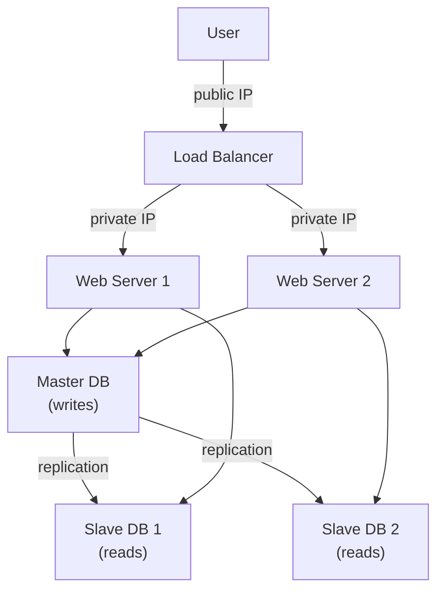
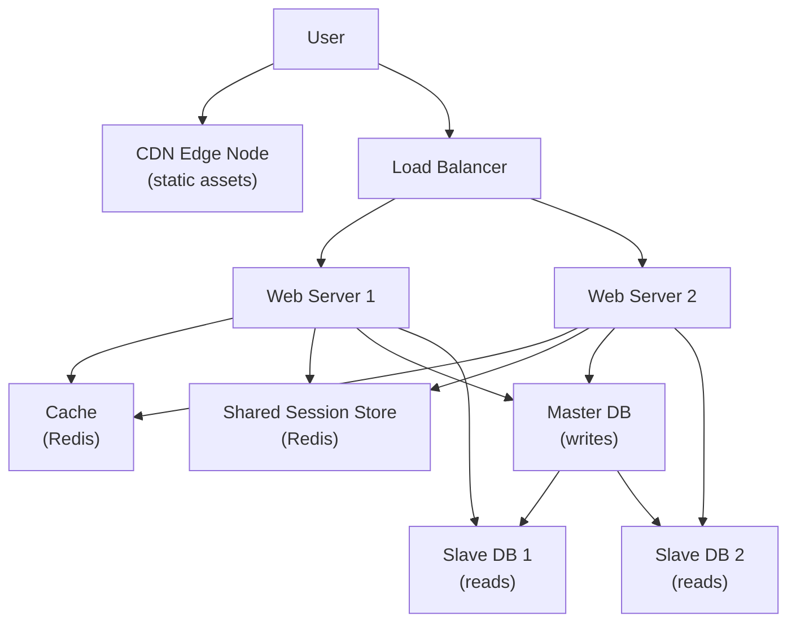
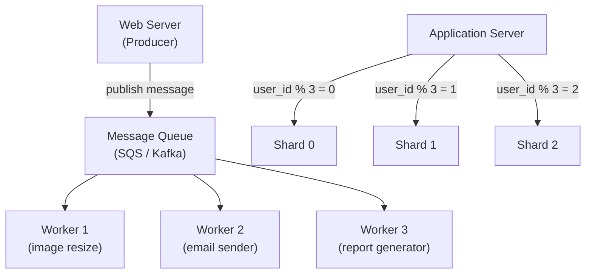

# Ch01: Scale from Zero to Millions of Users

## What questions does this chapter answer?

- What is the incremental path for scaling a single-server app to millions of users?
- When should you use horizontal scaling instead of vertical scaling, and why?
- How do stateless web servers, caching, and CDNs work together to enable scale?
- What is database replication and what consistency trade-offs does it introduce?
- When do you reach for database sharding, and what are the costs?

## Key Concepts

### Single Server Setup

Everything runs on one machine: web app, database, and any caching. DNS resolves the domain to the server's IP and clients connect directly. This is the correct starting point — it has zero operational complexity and is easy to debug. The fatal weaknesses are that it is a single point of failure, it cannot scale independently across tiers, and it hits a performance ceiling quickly.

### Separating Web Tier and Data Tier

Running web servers and database servers on separate machines is the first meaningful scaling step. Web servers handle HTTP requests and business logic; database servers handle persistence over a private network. The benefit is that each tier can be scaled independently — you can add web servers without touching the database, or upgrade the database hardware without changing the web layer.

### Vertical Scaling vs. Horizontal Scaling

Vertical scaling ("scale up") adds CPU or RAM to an existing server. It is simple and requires no code changes, but it has a hard hardware ceiling, costs exponentially more at the high end, and still leaves a single point of failure. Horizontal scaling ("scale out") adds more servers behind a load balancer. It has no hard ceiling, provides fault tolerance, and uses commodity hardware cost-effectively. The rule of thumb is to scale vertically until the pain is real, then switch to horizontal.

### Load Balancer

A load balancer distributes incoming requests across multiple backend servers using algorithms such as round-robin, weighted round-robin, or least connections. Clients connect to the load balancer's public IP; the load balancer forwards traffic to web servers via private IPs. If a server goes offline, the load balancer routes around it automatically. The load balancer itself can become a single point of failure, which is mitigated by running active-passive or active-active load balancer pairs.

### Database Replication

One master database accepts all write operations (INSERT, UPDATE, DELETE). One or more slave databases receive replicated copies of the data and serve read operations. This improves read throughput, increases availability, and preserves data across hardware failures. The key trade-off is replication lag — slaves may be slightly behind the master, which means reads immediately after a write might return stale data. If the master fails, a slave must be promoted, which may involve data loss under asynchronous replication.

### Caching

A cache is an in-memory layer (Redis, Memcached) that stores the results of expensive database queries. On a cache hit, the web server returns data without touching the database — memory access is roughly 100x faster than disk. The cache-aside (lazy loading) pattern is the most common: check cache first, fall back to the database on a miss, then populate the cache with the result. Key considerations: use a TTL to prevent stale data, choose an eviction policy (LRU is most common), and run multiple cache servers to avoid a cache SPOF that would flood the database on failure.

### Content Delivery Network (CDN)

A CDN is a globally distributed network of edge servers that caches static content (images, CSS, JavaScript, video) close to users. A Tokyo user fetching assets from a CDN edge node in Tokyo instead of an origin server in New York sees dramatically lower latency. On a cache miss, the CDN fetches from the origin, caches at the edge, and serves the user. Cost is per data transfer, so avoid caching rarely-accessed assets. Use versioned URLs (e.g., `image-v2.jpg`) to force cache invalidation on updates. Fallback to the origin server must be handled if the CDN goes down.

### Stateless Web Tier

Stateful servers store user session data locally — every subsequent request from that user must go to the same server, breaking horizontal scaling. Stateless servers store all session data in a shared external store (Redis or a database). Any web server can then handle any request without pinning. This is a prerequisite for true horizontal scaling: you can freely add or remove web servers and autoscaling works correctly.

### Multi-Data Center Setup

Running identical application stacks in multiple geographically distributed data centers provides lower latency (users connect to the nearest DC) and higher availability (one DC failing does not bring down the service). GeoDNS resolves the same domain to different IP addresses based on the requester's location. The main technical challenges are traffic redirection configuration, keeping databases in sync across DCs via asynchronous replication, and coordinating deployments across regions.

### Message Queues

A message queue (AWS SQS, RabbitMQ, Kafka) decouples producers (web servers) from consumers (worker processes). Producers publish a message and return immediately; consumers process messages at their own pace. This is appropriate for work that does not need to block the HTTP response: sending email, resizing uploaded images, generating reports. Benefits include independent scaling of producers and consumers, resilience (messages survive consumer crashes and are reprocessed), and absorption of traffic spikes so consumers are never overwhelmed.

### Database Sharding

Sharding horizontally partitions a database across multiple servers. A sharding key (e.g., `user_id`) and a hash function determine which shard stores a given row. Each shard is a separate database server; together they hold the complete dataset. Sharding is the solution when a single database server cannot handle write volume even after vertical scaling and replication. The costs are significant: cross-shard joins require application-level logic, resharding when data grows unevenly is operationally painful, and the celebrity (hotspot) problem means a single popular entity can overwhelm one shard.

## Architecture Diagrams

### Load Balancer with Database Replication

This diagram shows the core scalable web architecture. A load balancer distributes traffic across multiple stateless web servers, which route writes to the master database and reads to slave replicas.

The load balancer accepts public traffic and hides server private IPs. Both web servers can handle any request because session data is stored externally. Writes go to the single master; the slaves receive replicated copies asynchronously and serve the majority of read traffic. Replication lag means reads from slaves may be slightly stale — a trade-off acceptable for most read-heavy workloads.

### Full Scalable Architecture with Cache and CDN

This diagram adds the cache layer and CDN to the replicated architecture, and introduces the shared session store that enables truly stateless web servers.

The CDN handles all static assets before requests reach the origin servers. The cache (Redis) serves frequent database reads from memory, dramatically reducing database load. The shared session store makes web servers stateless — any server can handle any user without sticky routing. Together, these three additions handle the majority of read traffic and enable horizontal scaling of the web tier with no architectural limits.

### Message Queue and Sharded Database Architecture

This diagram shows asynchronous processing via a message queue and horizontal database partitioning via sharding for write-heavy workloads.

The message queue decouples the web server from slow async work — the web server publishes a job and immediately returns a response to the user. Workers scale independently of the web tier and failures result in message re-queuing, not lost work. In the sharding diagram, the application routes each database operation to the correct shard by hashing the sharding key. Distributing both storage and query load across shards gives theoretically unlimited write scaling, at the cost of cross-shard query complexity and resharding difficulty.

## Interview Questions

- "Walk me through how you would scale a web application from a single server to millions of users." → Describe the progression stage by stage: separate web and data tiers, add a load balancer with multiple web servers, add read replicas and a cache layer, introduce a CDN for static assets, make web servers stateless with shared session storage, add a message queue for async work, and finally shard the database when write volume exceeds what a single master can handle. Emphasize this is iterative, not a one-time design.

- "Why do web servers need to be stateless before horizontal scaling works?" → If session data lives on a specific web server, the load balancer must always send that user to the same server (sticky routing). This prevents free addition or removal of servers. Moving session to Redis means any server can serve any request; autoscaling works without coordination.

- "What are the trade-offs of database replication?" → Benefits: read scaling across slaves, high availability. Costs: replication lag causes eventual consistency for reads (a read immediately after a write may return stale data from a slave), and master failover requires promoting a slave which may involve data loss under async replication.

- "When would you choose sharding over adding more read replicas?" → Replicas improve read throughput but every replica still receives all writes from the master — write throughput does not scale with replicas. Sharding distributes writes across multiple master shards. Choose sharding when write volume has exhausted what a single master can handle.

- "What is the celebrity problem in sharding and how do you handle it?" → A popular entity (e.g., a celebrity user) maps to a single shard, causing that shard to receive a disproportionate share of traffic while others are idle. Mitigations include allocating a dedicated shard for high-traffic entities and using consistent hashing to minimize hotspot severity.

## Related Chapters

- [Ch02 - Back-of-the-Envelope Estimation](02-estimation.md) — provides the quantitative tools to determine at which traffic level each scaling component becomes necessary
- [Ch03 - Framework for System Design Interviews](03-framework.md) — teaches the interview process in which this chapter's scaling vocabulary is applied
- [Ch05 - Consistent Hashing](05-consistent-hashing.md) — solves the resharding problem introduced by database sharding in this chapter
- [Ch06 - Key-Value Store](06-kv-store.md) — builds on concepts from this chapter including replication, sharding, and caching to design a full distributed KV store
- [Ch04 - Rate Limiter](04-rate-limiter.md) — uses Redis (introduced as a cache and session store here) for centralized distributed counters
