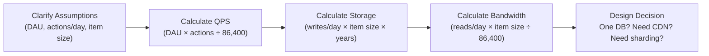
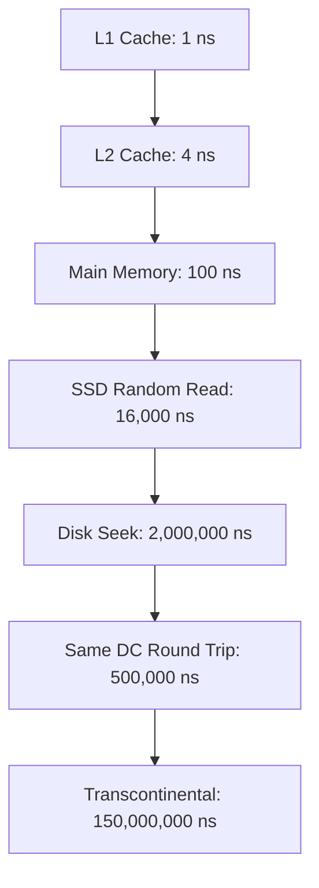
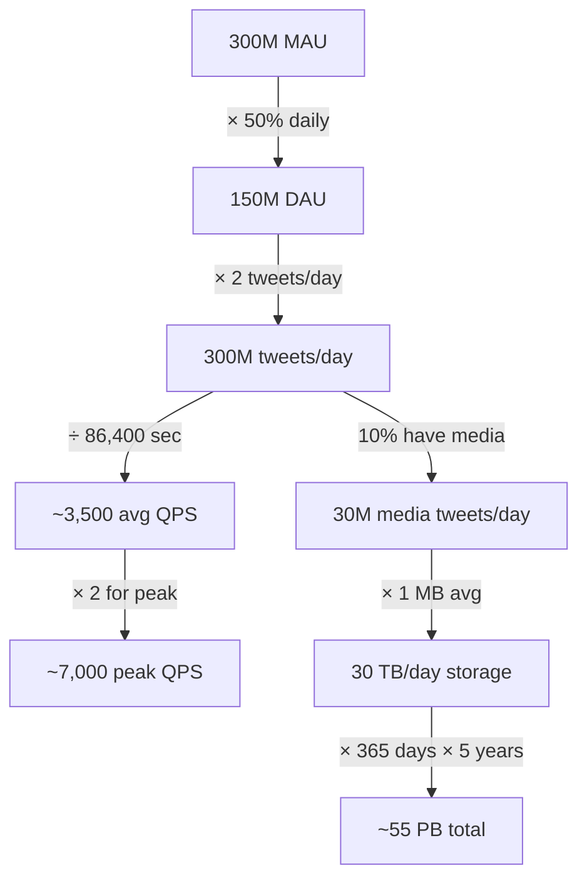

# Ch02: Back-of-the-Envelope Estimation

## What questions does this chapter answer?

- How do you quickly estimate QPS, storage, and bandwidth requirements for a system?
- What are the key latency numbers every engineer should have memorized?
- What does "four nines" (99.99%) availability actually mean in terms of downtime?
- How do you translate daily active users into a system capacity requirement?
- What rounding techniques and estimation conventions are expected in interviews?

## Key Concepts

### Powers of Two

All storage and bandwidth calculations reduce to bytes, and bytes scale in powers of two. For mental math, approximate with powers of ten: 1 KB is about 10^3 bytes, 1 MB is 10^6, 1 GB is 10^9, 1 TB is 10^12, 1 PB is 10^15. These five magnitudes cover every practical system. Knowing them cold prevents the common mistake of estimating storage in GB when the correct answer is PB.

### Latency Numbers Every Programmer Should Know

The canonical latency hierarchy provides intuition for what is fast, what is slow, and where bottlenecks will form. Memory (RAM) access takes about 100 nanoseconds; SSD random read takes about 16 microseconds — 160x slower. Disk seek takes about 2 milliseconds — 20,000x slower than RAM. A round trip within the same data center is about 0.5 milliseconds; a round trip from California to the Netherlands is about 150 milliseconds. These numbers drive design decisions: anything requiring sub-10ms response must be served from memory; disk-backed databases are acceptable for 10–100ms targets; transcontinental calls cannot be in the critical path for interactive features.

### Availability Numbers (The "Nines")

Availability is the percentage of time a system is operational, expressed in nines. The formula for annual downtime is `(1 - availability%) × 8,760 hours`. At 99% (two nines): 87.6 hours of downtime per year. At 99.9% (three nines): 8.76 hours. At 99.99% (four nines): 52.6 minutes. At 99.999% (five nines): 5.26 minutes. Each additional nine costs exponentially more in engineering effort: going from 99.9% to 99.99% requires multi-AZ deployment, automated failover, and zero single points of failure. Most cloud SLAs sit at 99.9% to 99.99%.

### QPS Estimation

Queries per second (QPS) is the primary metric for sizing web servers and databases. The derivation follows a standard chain: Monthly Active Users multiplied by an activity rate yields Daily Active Users (DAU); DAU multiplied by actions per user per day yields actions per day; dividing by 86,400 seconds per day yields average QPS. Peak QPS is typically 2–3x the average because traffic is not uniform throughout the day — design for peak, not average. Any time a peak QPS exceeds roughly 1,000–10,000 per server (depending on request complexity), a load balancer and multiple servers are needed.

### Storage Estimation

Storage estimation starts with the size of one unit of data (one tweet, one image, one user record) and multiplies it through daily volume and retention period. Common reference sizes: an integer is 4 bytes, a UUID is 16 bytes, a tweet text is about 140 bytes, a compressed profile photo is about 200 KB, one minute of HD video is about 100 MB. Multiply per-item size by writes per day to get daily storage growth, then multiply by the retention period (30 days vs. 5 years produces a 60x difference). Always account for the replication factor — 3 replicas of data means 3x the raw storage.

### Bandwidth Estimation

Bandwidth is derived from storage writes: if you write 30 TB per day, that is `30 × 10^12 ÷ 86,400 ≈ 350 MB/second` of inbound bandwidth. Outbound bandwidth scales with the read-to-write ratio — at a 10:1 read-to-write ratio, outbound is 3.5 GB/second. A number that high immediately signals that a CDN is mandatory and that the origin servers alone cannot serve the traffic.

## Architecture Diagrams

### Estimation Workflow

This flowchart shows the structured four-step derivation chain that converts business assumptions into architectural decisions. Each step's output feeds the next.

Start with assumptions you state explicitly; interviewers cannot follow your reasoning if they do not know your inputs. QPS tells you how many servers and whether you need a load balancer. Storage tells you whether a single database server is sufficient or whether sharding and distributed storage are needed. Bandwidth tells you whether a CDN is required. Each metric collapses into a specific architectural decision.

### Latency Hierarchy

This diagram shows the order-of-magnitude gaps between hardware layers. Each level is significantly slower than the one above, which is why the architectural decision of "memory vs. SSD vs. disk vs. network" dominates system performance far more than algorithm choice for I/O-bound systems.

Read the arrows as "is this many times slower than." The gap between RAM and SSD (160x) justifies Redis caching. The gap between same-DC and transcontinental (300x) justifies CDNs and multi-region deployments. If a latency requirement cannot be met by the storage or network tier that data naturally lives in, the solution is always to move closer to the user or to memory.

### Twitter QPS and Storage Estimation Example

This diagram traces a complete estimation for a Twitter-like system from Monthly Active Users through to total storage over five years.

The QPS branch (left side) tells you that seven thousand peak requests per second requires a load balancer and multiple web servers, with a Redis cache to keep database QPS manageable. The storage branch (right side) tells you that 55 PB over five years is far beyond a single server — distributed storage (S3, HDFS) or a sharded database is required. The 30 TB/day write rate at 350 MB/s inbound also implies a CDN is essential for serving reads.

## Interview Questions

- "How do you estimate storage needs for a photo-sharing service with 500M users?" → State assumptions: X% upload daily, average photo size Y KB. Compute: daily uploads = DAU × upload rate, daily storage = uploads × Y KB, multiply by retention years. State the replication factor (typically 3x). If the number is in the PB range, conclude that distributed object storage (S3) or a sharded database is needed.

- "What does four nines of availability mean and how do you engineer for it?" → 99.99% = ~52 minutes of downtime per year. To achieve it: eliminate single points of failure (multi-AZ deployment), implement automated failover, ensure every dependency also meets the target SLA. Budget for planned maintenance windows within the allowance.

- "At what QPS does a single database become a bottleneck?" → Depends on query complexity, but a practical threshold is 5,000–10,000 QPS for a well-indexed relational DB. Above that, add read replicas and a cache. Above 50,000–100,000 write QPS, sharding becomes necessary.

- "Walk me through your estimation process for a URL shortener." → Assumptions: 100M DAU, 1 write per 100 users per day = 1M new URLs/day, 100M redirects/day. Average QPS = 1M / 86,400 ≈ 12 writes/sec, 100M / 86,400 ≈ 1,160 reads/sec. Per URL: 7-char shortcode + 200-char original URL ≈ 500 bytes. 1M/day × 500B = 500MB/day. Over 5 years: ~900GB — fits on a single server with replicas.

- "Why is peak QPS the right number to design for, not average?" → Traffic is not uniformly distributed through the day. Social apps spike during morning commutes and evenings. Designing for the average means the system is undersized during peaks, causing user-facing degradation or outages during the highest-value traffic windows.

## Related Chapters

- [Ch01 - Scale from Zero to Millions](01-scale.md) — provides the architectural components this chapter's estimates help you size
- [Ch03 - Framework for System Design Interviews](03-framework.md) — the 4-step framework explicitly includes estimation as part of the high-level design step
- [Ch08 - Design a URL Shortener](08-url-shortener.md) — a worked example that begins with a back-of-envelope estimation
- [Ch14 - Design YouTube](14-youtube.md) — estimation is critical given the enormous storage and bandwidth involved in video
