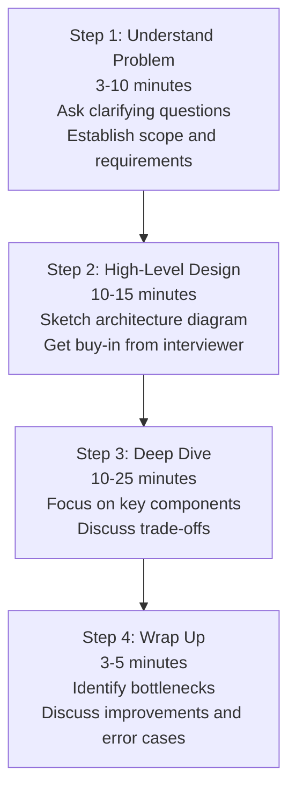
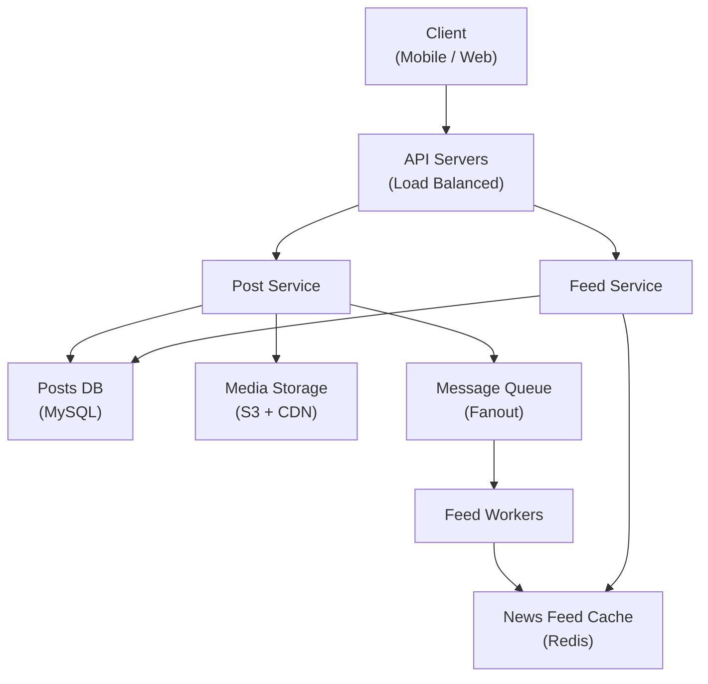
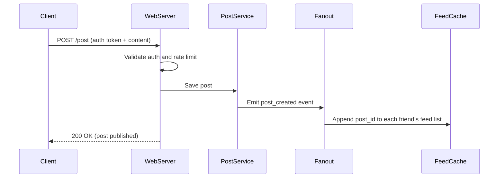

# Ch03: A Framework for System Design Interviews

## What questions does this chapter answer?

- What is the repeatable 4-step process for tackling any system design question?
- What clarifying questions should you always ask before designing anything?
- How do you balance time across requirements, high-level design, deep dive, and wrap-up?
- What does a good high-level architecture diagram look like at the start of a session?
- What behaviors separate strong candidates from weak ones in a design interview?

## Key Concepts

### Step 1 — Understand the Problem and Establish Design Scope (3–10 min)

The same prompt — "design Twitter" — can describe systems requiring radically different architectures depending on scale, feature set, and constraints. Assuming wrong burns time on the wrong solution. Before drawing anything, ask targeted clarifying questions across five dimensions: features (what is in scope and explicitly out of scope), scale (DAU, QPS, read/write ratio), constraints (latency targets, consistency vs. availability), platform (mobile, web, or both), and existing infrastructure (services you can rely on vs. services you must build). Aim for 3–5 focused questions that resolve the biggest ambiguities, then state your assumptions explicitly. Asking too many questions signals indecisiveness; asking too few signals poor judgment about what matters.

### Step 2 — Propose High-Level Design and Get Buy-In (10–15 min)

After establishing scope, sketch the overall system shape before going deep on any component. The artifact of this step is a box-and-arrow diagram showing clients, API servers, databases, caches, queues, and CDN, with arrows representing data flows. Think aloud while drawing — interviewers evaluate reasoning, not just the diagram. After sketching, explicitly ask: "Does this look reasonable to you?" or "Which area would you like me to go deeper on?" Getting buy-in before diving into details prevents wasting time going deep on a component the interviewer disagrees with. If the scale estimate suggests it is needed, do a brief back-of-envelope calculation to validate the design at this step.

### Step 3 — Design Deep Dive (10–25 min)

The high-level design proves you know the components. The deep dive proves you know how they actually work, what breaks, and how to fix it. Work with the interviewer to prioritize: focus on the bottleneck identified in the high-level design, the component the interviewer shows interest in, or the most technically complex piece. Common deep-dive topics include feed ranking algorithms, cache eviction strategies, database schema, hot shard handling, and failover mechanics. Do not go into algorithm implementation unless explicitly asked. Do not skip to details before the high-level is confirmed. Do not spend time on trivial or obvious components.

### Step 4 — Wrap Up (3–5 min)

Senior engineers evaluate what they build, not just build it. In the wrap-up, identify the biggest bottleneck in your design and how you would address it. Briefly recap the full design for the interviewer's memory. Mention error scenarios (server failure, network partition, database corruption). Discuss operational concerns (monitoring, alerting, deployment). Suggest future improvements with more time. Avoid claiming the design is perfect — every system has trade-offs, and naming them signals mature engineering judgment. A candidate who honestly identifies their own design's weaknesses is more trustworthy than one who claims everything is handled.

### The Dos and Don'ts

Strong candidates ask for clarification, state assumptions explicitly, communicate their thinking out loud, and treat the interviewer as a teammate by bouncing ideas off them. They suggest multiple approaches when genuine trade-offs exist and acknowledge what they do not know. Weak candidates design in silence, jump to implementation details before the high-level is agreed, use buzzwords without explanation, ignore feedback from the interviewer, or spend so long on one component that they never finish the overall design. If you do not know something, reason through it out loud rather than guessing or going silent — structured uncertainty is better than silence.

## Architecture Diagrams

### The 4-Step Interview Framework

This flowchart shows the four sequential steps of the framework with their recommended time budgets. Each step must be completed before the next can begin effectively — you cannot design well without requirements, and you cannot dive deep without an agreed-upon high-level structure.

In a 45-minute interview, if you are still in Step 1 at the 15-minute mark you are spending too long on requirements. If you never leave Step 2 you are staying too shallow. The framework forces you to allocate time deliberately across all four dimensions that interviewers evaluate.

### High-Level Design Example: News Feed System

This diagram is the type of architecture to draw during Step 2 — all major components visible, data flows clear, no implementation details. It was constructed after the interviewer confirmed scope: mobile and web, reverse-chronological feed, 10M DAU, posts with media.

The diagram separates write path (Post Service → DB, message queue → fanout workers → cache) from read path (Feed Service reads from cache first, falls back to DB). The interviewer can see immediately that writes fan out to all followers' feed caches asynchronously, which is the key architectural decision for this system. This opens the door to a Step 3 deep dive on fanout strategy for celebrities with millions of followers.

### Feed Publishing Sequence Diagram (Step 3 Deep Dive)

This sequence diagram is the type of artifact produced during Step 3 — it zooms in on the exact sequence of operations for a single flow: publishing a post.

The sequence shows that the client receives a response before fanout completes — the system is asynchronous. This immediately raises the deep-dive question: what happens for a user with 10 million followers? The fanout takes too long to be fully async without degrading the publisher's experience, which motivates a hybrid push/pull strategy for celebrities.

## Interview Questions

- "How do you start a system design interview when the prompt is vague?" → Open with requirements: "Before I design anything, let me confirm the requirements." Ask about features in scope, target scale (DAU, QPS), latency constraints, and platform. State assumptions explicitly after 3–5 questions. Only then begin drawing.

- "How do you structure your time in a 45-minute system design interview?" → Roughly: 5–8 minutes on requirements, 10–15 minutes on high-level design, 15–20 minutes on deep dive, 3–5 minutes on wrap-up. Watch the clock. If the interviewer says "let's move on," follow their lead.

- "What should a high-level design diagram include?" → All major components: clients, API servers, databases (specify SQL vs. NoSQL), caches, message queues, CDN, and any external services. Arrows should show the direction and type of data flow. Every box should have a one-sentence explanation as you draw it.

- "What do you cover in the wrap-up step?" → Bottlenecks and how you would address them, a brief design recap, error scenarios (server crash, DB failure, network partition), operational concerns (monitoring and alerting), and future improvements. Explicitly acknowledge the design's weaknesses.

- "What is the most common mistake candidates make in system design interviews?" → Designing in silence. If you do not narrate your thinking, the interviewer cannot assess your reasoning — they only see a diagram that may or may not be correct. Everything you write, draw, or consider should be accompanied by verbal explanation.

## Related Chapters

- [Ch01 - Scale from Zero to Millions](01-scale.md) — supplies the vocabulary of components (load balancer, cache, CDN, sharding) that you apply using this framework
- [Ch02 - Back-of-the-Envelope Estimation](02-estimation.md) — provides the quantitative tools used during the high-level design step to validate architecture choices
- [Ch11 - Design a News Feed System](11-news-feed.md) — a worked example of applying this exact framework end-to-end, including the high-level diagram shown above
- [Ch04 - Design a Rate Limiter](04-rate-limiter.md) — first full worked system design in the book, applying this framework to a focused component design
