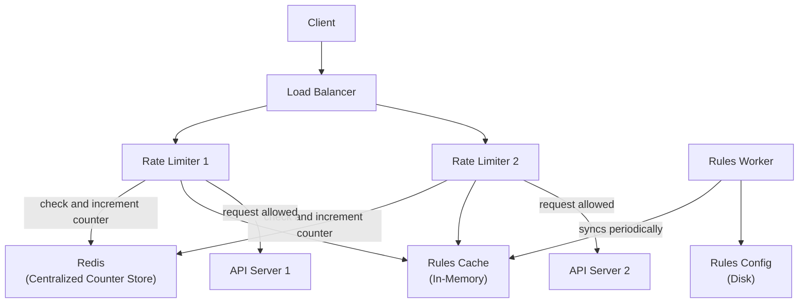
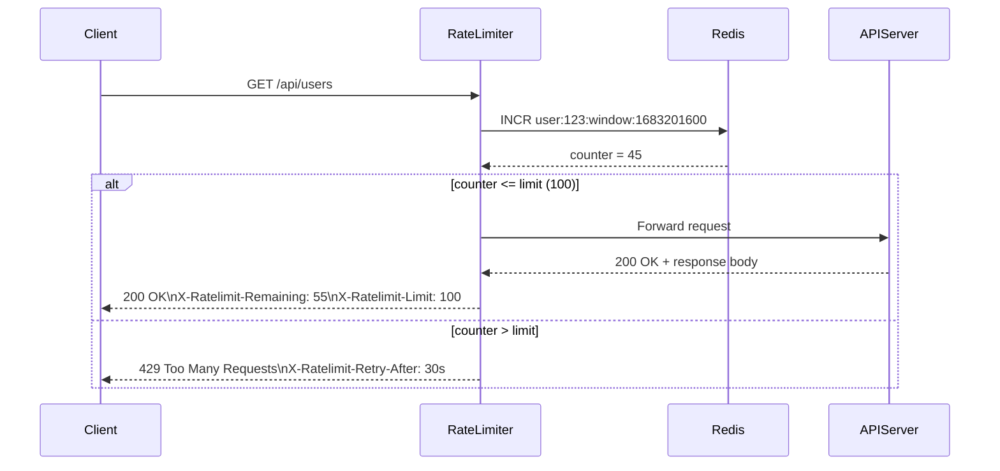
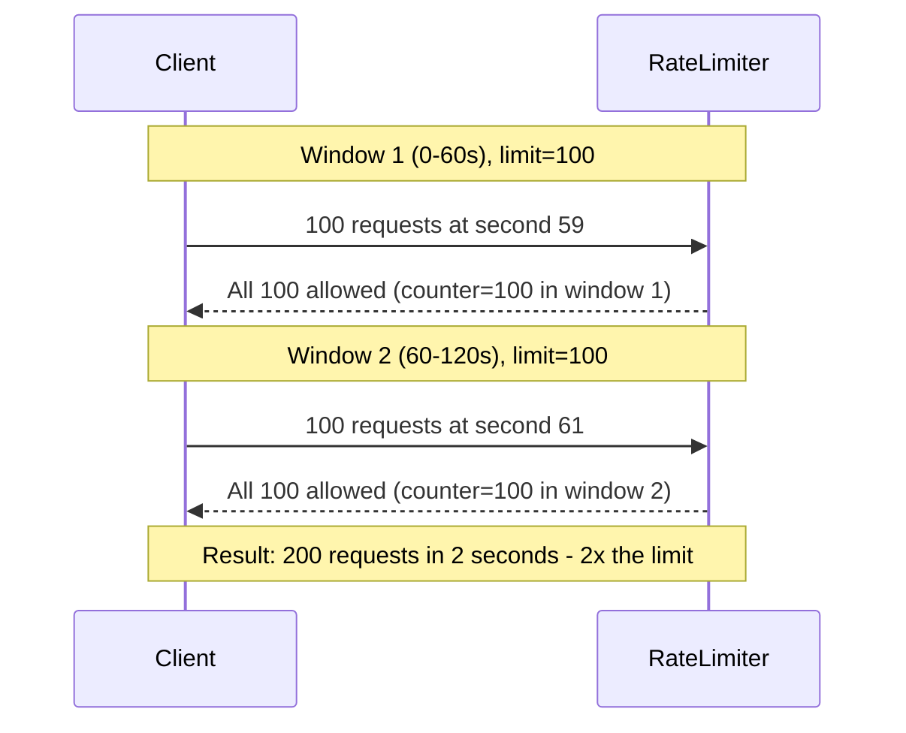

# Ch04: Design a Rate Limiter

## What questions does this chapter answer?

- What are the five rate limiting algorithms and when should you use each?
- Where in the system architecture should a rate limiter be placed?
- How do you implement rate limiting correctly in a distributed environment with multiple servers?
- How does a rate limiter communicate limits and rejections to clients?
- What race conditions exist in distributed rate limiting and how do you fix them?

## Key Concepts

### Where to Place the Rate Limiter

Client-side rate limiting is unreliable because clients control it and malicious actors simply ignore it. Server-side rate limiting inside each API server works but duplicates logic across every service. The most common production approach is a middleware or API gateway layer that sits between the load balancer and the application servers. API gateways (Kong, AWS API Gateway, NGINX) already handle SSL termination, authentication, and routing — adding rate limiting there centralizes the concern without modifying each service. Use a middleware approach when you do not already have a gateway, or when rate limiting logic needs to be shared across many independent services.

### Token Bucket Algorithm

The token bucket uses two parameters: `bucket_capacity` (the maximum burst size) and `refill_rate` (tokens added per second). The bucket fills up to capacity at the refill rate; each request consumes one token. When the bucket is empty, the request is rejected with a 429. This naturally allows burst traffic up to the bucket size while enforcing the average rate over time. It is memory-efficient — only two values per bucket — and is used by Stripe and Amazon. The trade-off is that the bucket can be drained instantly by a burst, which is by design but may allow a short spike before limiting kicks in.

### Leaking Bucket Algorithm

The leaking bucket queues incoming requests in a FIFO queue (the "bucket") and processes them at a fixed outflow rate. If the queue is full, new requests are dropped. This produces a completely stable, predictable outflow regardless of how bursty the input is. It is ideal for use cases that need constant throughput — payment processing, batch jobs — where unpredictable bursts would overwhelm downstream systems. The cost is that bursty traffic stacks up in the queue and requests may wait a long time before being processed, making it inappropriate for interactive, latency-sensitive APIs.

### Fixed Window Counter

Fixed window divides time into discrete windows (e.g., minute boundaries) and assigns a counter per client per window. Each request increments the counter; if the counter exceeds the limit, the request is rejected. This is the simplest algorithm to implement but has a critical flaw: a client can send the full limit's worth of requests in the last second of one window and the first second of the next, sending 2x the allowed requests in a 2-second span. This window-boundary spike makes fixed window unsuitable for any security-sensitive rate limit.

### Sliding Window Log

Sliding window log stores a sorted set of request timestamps for each user. On each request, it removes timestamps older than one window ago, counts the remaining entries, and rejects if the count meets the limit. This eliminates the boundary spike entirely and produces exact rate limiting. The cost is memory: every request timestamp is stored. A user making 1,000 requests per hour has 1,000 timestamps in their log. At high cardinality (millions of users, high request rates), this becomes expensive. Use it when precision is more important than memory efficiency — financial compliance APIs, for example.

### Sliding Window Counter

Sliding window counter is a hybrid: it uses two fixed-window counters (current window and previous window) and computes an approximation of the sliding window count using the formula: `estimated = current_window_count + prev_window_count × (1 - elapsed_fraction)`. For example, if 40 seconds of a 60-second window have elapsed, the previous window contributes 33% and the current window contributes 100%. This approximation is accurate within about 0.003% of the true sliding window value, is memory-efficient (only two counters per user), and avoids the boundary spike problem. Cloudflare uses this algorithm. It is the best general-purpose choice for most APIs.

### High-Level Rate Limiter Architecture

The rate limiter sits between the load balancer and the API servers as middleware. It consults an in-memory rules cache to retrieve the limit configuration for the current client and endpoint, then checks and increments a counter in a centralized Redis cluster. If the counter is within the limit, the request is forwarded to the API server; otherwise a 429 is returned with rate-limit response headers. A rules worker periodically syncs limit configurations from disk to the in-memory rules cache. Redis is the source of truth for all counters — this is the key point that makes distributed rate limiting correct.

### Response Headers

A correct rate limiter returns three headers with every response:
- `X-Ratelimit-Remaining`: how many requests remain in the current window
- `X-Ratelimit-Limit`: the total allowed requests per window
- `X-Ratelimit-Retry-After`: a Unix timestamp (or seconds) indicating when to retry after a 429

Returning these headers allows well-behaved clients to back off gracefully and retry at the right time. Omitting them is an incomplete implementation.

### Distributed Rate Limiting Challenges

When multiple rate limiter servers share a Redis counter, race conditions are possible. A naive implementation reads the counter (GET), checks it, and then writes the incremented value (SET) — these are two separate operations, not atomic. Two concurrent requests can both read `counter = 4`, both decide they are within the limit of 5, and both write back `counter = 5`, effectively allowing two requests when only one should have been permitted. The fix is to use Redis's atomic `INCR` command, which reads and increments in a single operation. For more complex multi-step logic, Redis Lua scripts run atomically on the server, eliminating the race. All rate limiter instances must share the same Redis cluster — if each server used its own in-memory counter, a user's requests spread across N servers would effectively face N times the intended limit.

## Architecture Diagrams

### Rate Limiter Architecture with Centralized Redis

This diagram shows the full rate limiter architecture: multiple rate limiter instances share a centralized Redis counter store and an in-memory rules cache populated by a rules worker.

Both rate limiter instances write to the same Redis cluster, ensuring consistent counter state regardless of which instance handles a request. The rules cache is a local in-memory copy of the rate limit configuration (e.g., "endpoint /api/payment: 3 requests/user/day") and is periodically refreshed from the authoritative configuration on disk. Rejected requests return 429 directly from the rate limiter without ever reaching an API server.

### Request Flow with Rate Limiting

This sequence diagram traces the path of a single request through the rate limiter, showing the decision point where allowed and rejected requests diverge.

The Redis key encodes the user ID and the current time window, so counter state is automatically namespaced per window without needing manual expiration logic. The `INCR` command atomically increments and returns the new value in a single round trip. The rate limiter never touches the API server for rejected requests, protecting backend services entirely.

### Fixed Window Boundary Spike Problem

This diagram illustrates why the fixed window algorithm is problematic for security-sensitive limits. A well-timed client can send double the allowed traffic in a two-second window.

The window resets at second 60 with no memory of the previous window's traffic. A sliding window counter resolves this by weighting the previous window's count based on how much of the current window has elapsed, making the limit smooth across boundaries.

## Interview Questions

- "Design a rate limiter for a REST API." → Place it at the API gateway or middleware layer. Choose the token bucket algorithm for most APIs (allows bursts, memory-efficient). Store counters in a centralized Redis cluster shared across all rate limiter instances. Use atomic Redis INCR to prevent race conditions. Return 429 with X-Ratelimit-Remaining, X-Ratelimit-Limit, and X-Ratelimit-Retry-After headers.

- "What is the difference between the token bucket and leaking bucket algorithms?" → Token bucket allows bursts up to the bucket capacity while enforcing the average rate over time — appropriate for interactive APIs. Leaking bucket enforces a constant output rate with no bursts — appropriate for payment processing or any downstream system that cannot absorb spikes.

- "How do you prevent the race condition in a distributed rate limiter?" → Use Redis's atomic INCR command (reads and increments in a single operation) rather than a GET followed by a SET. For multi-step operations, use Lua scripts that run atomically on the Redis server.

- "What happens if Redis goes down?" → This is a fail-open vs. fail-closed decision. Fail-open: allow all traffic through while Redis is unavailable. This maintains user experience but removes rate limiting protection. Fail-closed: reject all traffic when Redis is unavailable. This protects backend services but degrades user experience. The right choice depends on the use case — user-facing APIs typically fail-open; payment or security endpoints typically fail-closed.

- "How would you rate limit by both user ID and endpoint?" → Use a compound Redis key: `{user_id}:{endpoint}:{window}`. Set different limits for different endpoints in the rules configuration. For example, `/api/payment` might allow 3 requests/day while `/api/search` allows 1,000 requests/hour.

## Related Chapters

- [Ch01 - Scale from Zero to Millions](01-scale.md) — introduces Redis as a caching and session store; this chapter uses it as the counter store for distributed rate limiting
- [Ch03 - Framework for System Design Interviews](03-framework.md) — this chapter is a worked example of applying the 4-step framework to a focused component design
- [Ch05 - Consistent Hashing](05-consistent-hashing.md) — relevant if Redis itself is distributed across a cluster and keys need to be routed to the correct node
- [Ch06 - Key-Value Store](06-kv-store.md) — deeper dive into the Redis-like store used here as the counter backend, including replication and consistency considerations
