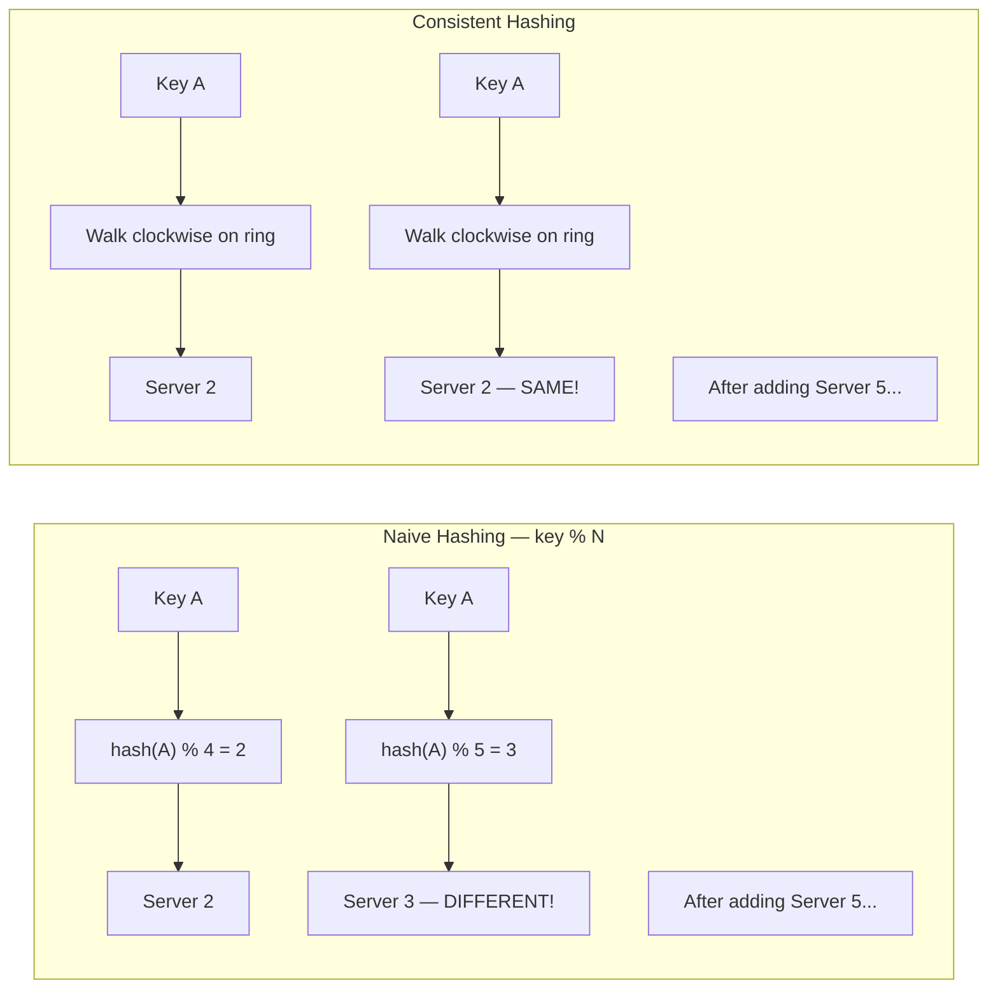
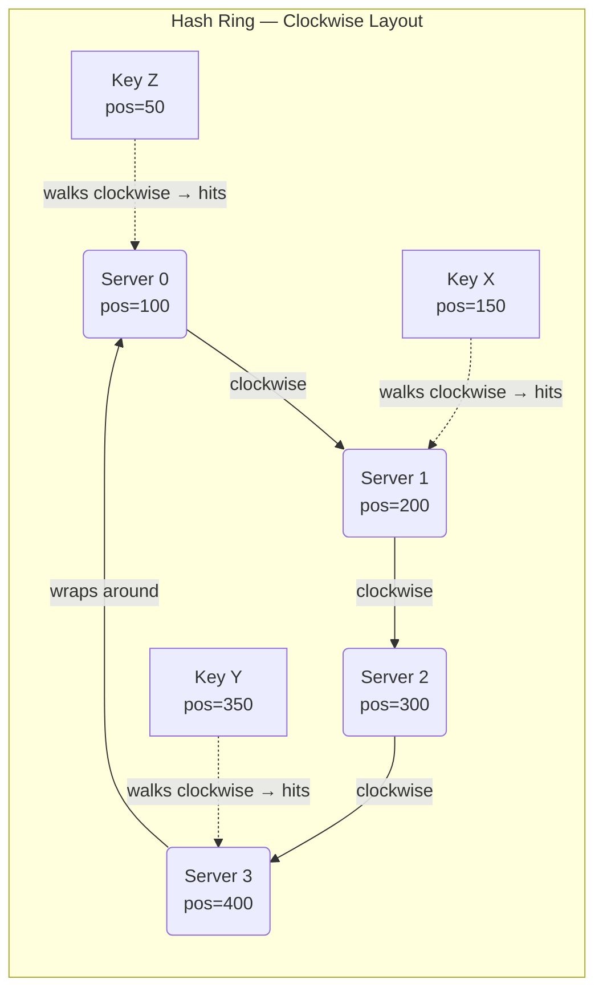
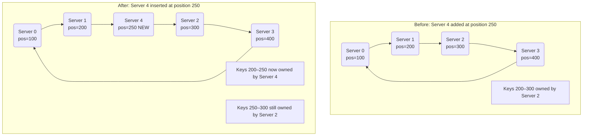
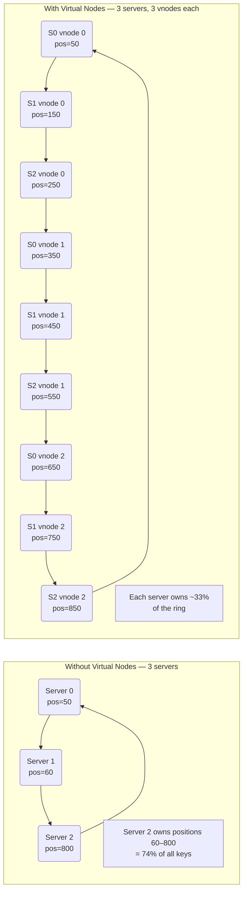
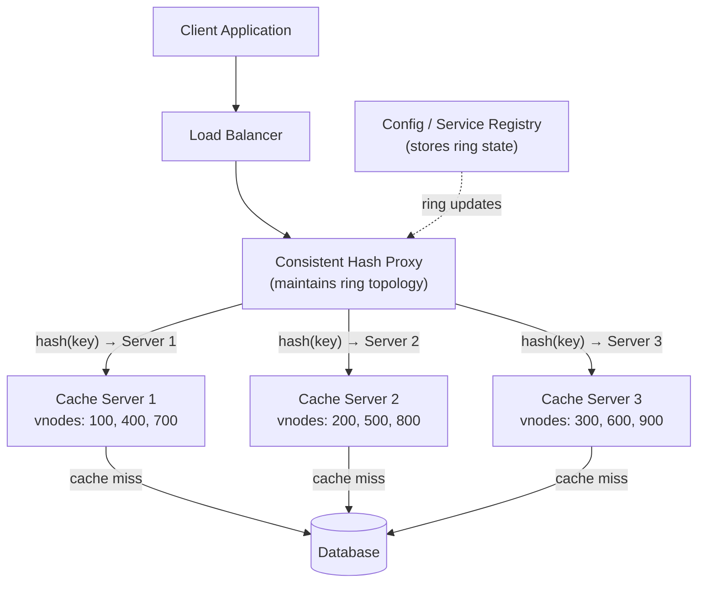

# Ch05: Consistent Hashing

## What questions does this chapter answer?
- Why does naive modular hashing cause massive cache invalidation when the cluster size changes?
- How does a hash ring let you add or remove servers while remapping only a small fraction of keys?
- What are virtual nodes and why are they required in any production consistent hashing system?
- How do you tune load distribution across heterogeneous hardware using virtual nodes?
- Where is consistent hashing used in real production systems?

## Key Concepts

### Naive Hashing and Its Fatal Flaw
Naive hashing assigns a key to a server using `server = hash(key) % N`. This works perfectly with a fixed cluster, but the moment N changes — a server is added or removed — the modulo result changes for nearly every key. Adding a fifth server to a four-server cluster remaps roughly 80% of all keys, turning the cache cold and flooding the database with misses. The problem worsens with larger clusters: going from 10 to 11 servers remaps about 91% of keys.

### The Hash Ring
A hash ring places both servers and keys on a circular number line from 0 to 2^32 - 1 using the same hash function. A key belongs to the first server encountered when walking clockwise from the key's ring position. When a server is added, only the keys in the arc between the new server and its predecessor need to move — approximately 1/N of all keys. When a server is removed, only that server's keys migrate to the next clockwise neighbor. The ring is implemented as a sorted array, so lookups use binary search and run in O(log N) time. No central coordinator is needed because any node can independently determine which server owns any key.

### Virtual Nodes
Virtual nodes (vnodes) assign each physical server K positions on the ring instead of one. Because hash placement is random, a basic ring with three servers might accidentally place two servers very close together, leaving one server responsible for 70% of the key space. Virtual nodes solve this by scattering each server's presence across the entire ring so their aggregate coverage approaches 1/N. With 150–200 virtual nodes per server, the standard deviation from perfectly even distribution falls to 5–10%. Virtual nodes also enable proportional weighting: a server with twice the RAM can be assigned twice as many virtual nodes, carrying twice the load with no manual range configuration. When a node fails, its load distributes across all surviving nodes rather than overwhelming one neighbor.

### Replication on the Ring
For a replication factor of N, after finding the primary server for a key, the system walks clockwise N-1 more steps, skipping vnodes that belong to the same physical server. This ensures replicas land on distinct machines. Apache Cassandra's "replication factor" setting implements exactly this model, and the same key ends up stored on N consecutive physical servers on the ring.

### Time and Space Complexity
Key lookup runs in O(log(N × K)) using binary search over the sorted ring. Adding or removing a server costs O(K × log(N × K)) — K insertions or deletions each requiring a binary search. More virtual nodes improve load balance at the cost of higher memory overhead for the ring metadata.

## Architecture Diagrams

### Naive Hashing vs. Consistent Hashing

This diagram shows why changing cluster size breaks naive hashing but leaves consistent hashing unaffected for most keys.

With naive hashing, Key A moves to a completely different server whenever N changes. With consistent hashing, Key A only moves if a new server is inserted between Key A's ring position and Server 2. All other keys on the ring are unaffected by the new server.

### Hash Ring — Clockwise Key Assignment

This diagram shows how servers and keys are positioned on the ring and how the clockwise-walk rule determines ownership.

Each server occupies a position on the ring determined by hashing its name or IP. Each key also hashes to a ring position, then walks clockwise to the first server. Key X at position 150 walks to Server 1 at 200. Key Y at 350 walks to Server 3 at 400. Key Z at 50 wraps past 0 and hits Server 0 at 100. The ring structure guarantees every key always has a server to walk to.

### Adding and Removing Servers

This diagram shows the minimal disruption caused by topology changes on a consistent hashing ring.

Only the keys in the arc between Server 4's predecessor (Server 1 at 200) and Server 4 itself (250) move. Everything else stays exactly where it was. This is approximately 1/N of all keys — in contrast to the ~80% remapped by naive hashing.

### Virtual Nodes — Distribution Comparison

This diagram shows how random placement can create severe load imbalance without virtual nodes, and how virtual nodes correct it.

Without virtual nodes, random hash placement may cluster two servers together, leaving one server with most of the key space. Virtual nodes scatter each server's presence across the entire ring, so no single server can accidentally dominate. In production, 150–200 virtual nodes per server gives distribution within 5–10% of ideal.

### Full System Architecture with Consistent Hashing

This diagram shows how consistent hashing fits into a real caching infrastructure.

The proxy is the only component that needs to know about the ring. Cache servers are routing-agnostic. The config registry (etcd or ZooKeeper) stores the current ring topology and notifies proxies when servers join or leave. Adding cache servers only invalidates the small fraction of keys whose positions now map to the new server. The proxy can be made highly available by running multiple instances, all reading from the same registry.

## Interview Questions

- "Why does naive hashing fail when the number of servers changes?" → Explain that `key % N` produces a completely different result for most keys when N changes. Show the math: adding a 5th server remaps ~80% of keys. This causes a thundering herd on the database when the entire cache goes cold. Then introduce the hash ring as the solution.

- "How does a hash ring work?" → Describe placing servers and keys on a circular number line using the same hash function. A key walks clockwise to the first server. Adding a server only affects the arc between the new server and its predecessor. Removing a server only moves that server's keys to the next clockwise neighbor. O(log N) lookup via binary search.

- "What are virtual nodes and why are they necessary in production?" → Basic ring placement is random and can leave one server with far more than 1/N of the key space. Virtual nodes give each physical server K positions scattered across the ring, averaging out to roughly equal load. They also let you weight more powerful servers by assigning them more vnodes. Production systems typically use 150–200 vnodes per server for 5–10% deviation from ideal.

- "How does consistent hashing support data replication?" → After finding the primary for a key (first clockwise server), walk N-1 more steps — skipping vnodes of the same physical server — to find N-1 replicas. The key is stored on N consecutive physical servers. This is exactly how Cassandra's replication factor is implemented.

- "What is a hot spot in consistent hashing and how do you mitigate it?" → Consistent hashing distributes keys, not request load. If one key is extremely popular, it still routes to one server. Mitigations: add a suffix to the hot key to spread it across servers, cache at a layer above the KV store, or add dedicated read replicas for identified hot keys.

## Related Chapters
- [Ch06 - Key-Value Store](06-kv-store.md) — Consistent hashing is the core partitioning mechanism of the distributed KV store design; virtual nodes and replication on the ring are applied directly.
- [Ch07 - Unique ID Generator](07-unique-id-generator.md) — The KV store uses Snowflake-style IDs for some internal operations; understanding distributed ID generation complements the ring-based data model.
