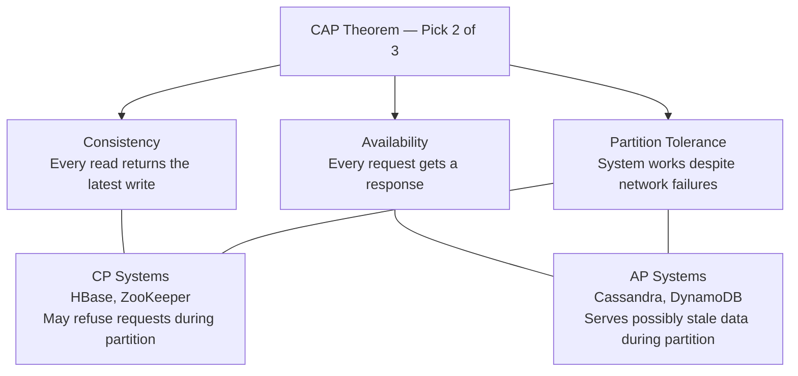
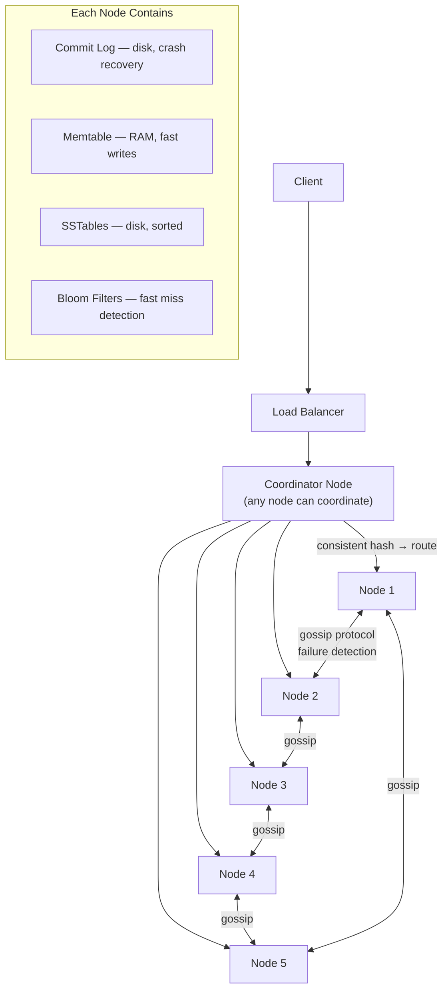
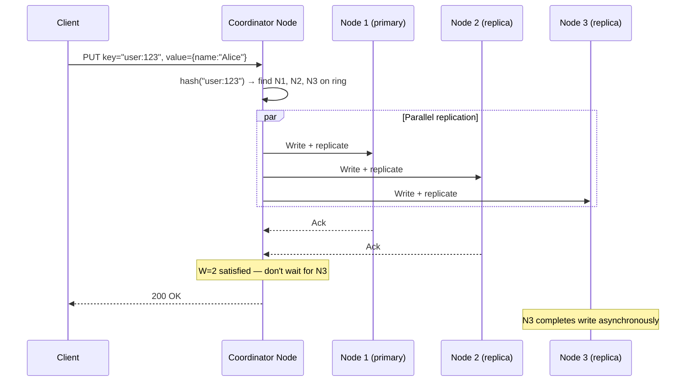
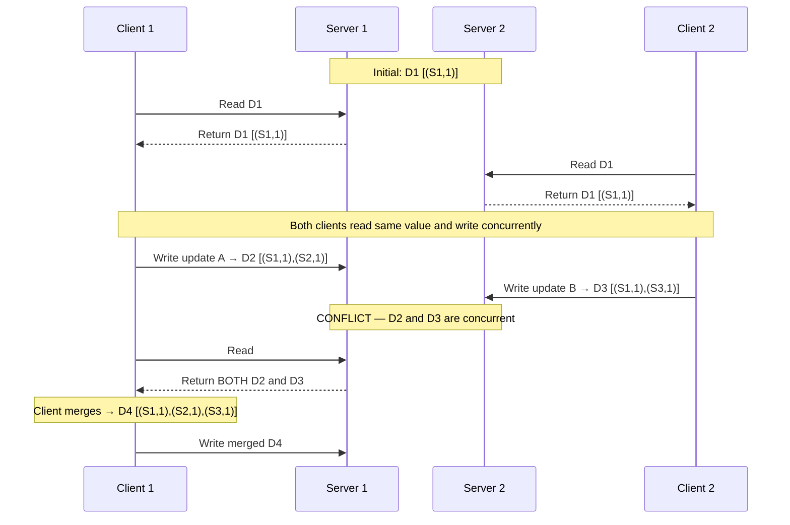
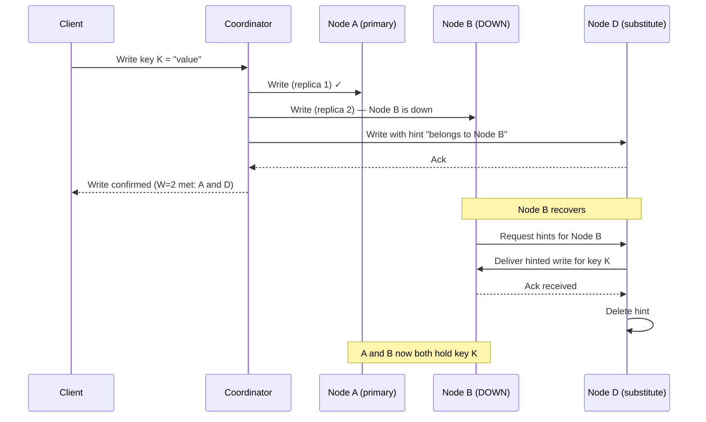
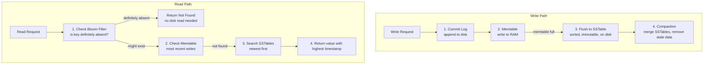

# Ch06: Design a Key-Value Store

## What questions does this chapter answer?
- What trade-off does the CAP theorem force on every distributed KV store, and how do CP and AP systems behave differently?
- How is data partitioned and replicated across nodes in a distributed KV store?
- How does the quorum formula (W + R > N) control the consistency vs. availability dial?
- How do vector clocks detect conflicting writes, and what alternatives exist?
- How do gossip protocol, sloppy quorum, hinted handoff, and Merkle trees handle node failures?
- What is the write and read path through an LSM tree-based storage engine?

## Key Concepts

### CAP Theorem
The CAP theorem states that a distributed system can simultaneously guarantee only two of three properties: Consistency (every read returns the latest write), Availability (every request gets a response), and Partition Tolerance (the system operates despite network failures). Network partitions happen in every real distributed system, so partition tolerance is not optional — it is a baseline requirement. This reduces the real choice to CP vs. AP. A CP system refuses requests during a partition to avoid serving stale data; it is appropriate for financial transactions and inventory systems where stale reads have hard consequences. An AP system continues serving requests during a partition, potentially returning stale data; it is appropriate for social feeds, DNS, and analytics where approximate data is acceptable.

### Data Partitioning
Data is distributed across nodes using consistent hashing with virtual nodes (see Ch05). Each key hashes to a ring position and walks clockwise to its owning server. With N servers, each handles approximately 1/N of all keys. Adding servers requires moving only the affected arc of keys. Virtual nodes ensure even load distribution and allow more capable servers to carry proportionally more load.

### Data Replication
Each key is replicated to N servers for fault tolerance. After finding the primary server via the hash ring, the system replicates to the next N-1 clockwise physical servers, skipping virtual nodes that belong to the same physical machine. With N=3 (the typical production default), the system survives one node failure without losing data. A higher replication factor improves fault tolerance at the cost of additional storage and write overhead.

### Quorum Consensus
A quorum is the minimum number of nodes that must acknowledge an operation before it is considered successful. Given N replicas, W write quorum, and R read quorum: when W + R > N, the read and write sets must overlap by at least one node, guaranteeing that reads always see the most recent write (strong consistency). With W + R ≤ N, reads may return stale data (eventual consistency) but the system remains highly available. Common production setting: N=3, W=2, R=2 — strong consistency with tolerance for one node failure.

### Vector Clocks
When two clients write the same key to different replicas simultaneously, the replicas end up with different values. A vector clock is a list of (server, version) pairs attached to each value that tracks causal ordering. To detect a conflict, compare two vector clocks: if neither clock is a component-wise superset of the other, the writes are concurrent and represent a genuine conflict. The system returns both conflicting versions to the client for resolution, then stores the merged result with a combined vector clock. The alternative — Last-Write-Wins (LWW) — is simpler but silently discards writes when clock skew causes a newer write to carry an older timestamp.

### Gossip Protocol
Gossip is a decentralized failure detection mechanism. Each node maintains a membership list of (node ID, heartbeat counter, last-updated) for all other nodes. Every few seconds, each node increments its own heartbeat and shares its list with a random subset of peers. Receiving nodes merge lists, keeping the highest heartbeat per node. If a node's heartbeat has not increased for longer than a configured threshold, it is marked offline. No central coordinator is needed. Information propagates to all N nodes in O(log N) rounds.

### Sloppy Quorum and Hinted Handoff
When designated replica nodes are temporarily unavailable, sloppy quorum accepts acknowledgments from any W healthy nodes in the cluster — including nodes outside the normal replica set for that key. When a substitute node accepts such a write, it stores a "hint" — metadata indicating the write should be delivered to the original target when it recovers. On recovery, the original node contacts substitute nodes and collects all hinted writes. Sloppy quorum maintains availability during temporary failures but does not guarantee strong consistency, since the substitute is not in the normal read path.

### Merkle Trees for Anti-Entropy
After network partitions or node failures, replicas can diverge. Merkle trees enable efficient detection and repair. Each replica builds a binary tree where leaf nodes contain hashes of key ranges and internal nodes contain hashes of their children. To sync two replicas, compare root hashes. If they match, data is identical. If they differ, traverse the tree comparing child hashes to locate specific diverging key ranges. Only those ranges need to be transferred — reducing O(N) comparisons to O(log N).

### LSM Tree Storage Engine
The write path uses a Log-Structured Merge Tree (LSM tree): writes append to a commit log on disk (for crash recovery), then update an in-memory memtable (for fast serving). When the memtable fills, it is flushed to an immutable SSTable on disk. Periodic compaction merges SSTables, removing overwritten values and tombstones (delete markers). The read path checks a bloom filter first — if the key is definitely absent from an SSTable, skip it entirely. Otherwise, check the memtable and SSTables newest-first. This architecture is used by Cassandra, LevelDB, RocksDB, and HBase.

## Architecture Diagrams

### CAP Theorem — System Classification

This diagram shows how distributed systems split into CP and AP based on their behavior during a network partition.

Since network partitions always occur in real distributed environments, partition tolerance is a baseline — not a choice. The real decision is: during a partition, do you refuse some requests to preserve consistency (CP), or continue serving potentially stale data to preserve availability (AP)?

### System Architecture Overview

This diagram shows the full distributed KV store with all major components and how they interact.

Any node can act as coordinator for a request — there is no single master. The coordinator hashes the key to determine the target nodes and forwards the operation. Nodes detect each other's failures via gossip protocol without any central health-check server. Each node stores data using the LSM tree structure: commit log, memtable, and SSTables, with bloom filters accelerating reads.

### Write Path with Quorum

This diagram shows how a write is replicated across nodes and confirmed using a quorum.

The coordinator sends writes to all replica nodes in parallel. With W=2, it confirms success to the client as soon as two nodes acknowledge — without waiting for the slowest replica. Node 3 completes asynchronously. If you also set R=2 for reads, then W+R=4 > N=3 and strong consistency is guaranteed.

### Vector Clock Conflict Detection

This diagram shows how concurrent writes to different replicas create a conflict that vector clocks can detect.

D2 has clock `[(S1,1),(S2,1)]` and D3 has `[(S1,1),(S3,1)]`. Neither is a component-wise superset of the other — both started from D1 and diverged independently. The system detects the conflict and returns both values to the client for resolution. The client merges and writes back a unified version.

### Hinted Handoff for Temporary Failures

This diagram shows how a substitute node bridges the gap when a replica is temporarily unavailable.

Sloppy quorum allows Node D — normally not in the replica set for key K — to stand in for the down Node B. When B recovers, it proactively collects hinted writes from substitute nodes. This keeps the system writable during temporary failures at the cost of a brief consistency window while the hint is in transit.

### Write and Read Paths in the Storage Engine

This diagram shows how data moves through the LSM tree on writes and how reads avoid unnecessary disk I/O.

The commit log is written first so a crash between the commit log write and the memtable update can be replayed on restart — no data is lost. The memtable serves writes at RAM speed. Bloom filters have no false negatives: if the filter says a key is absent, no disk read is needed. This eliminates expensive disk I/O for most reads of non-existent keys.

## Interview Questions

- "Walk me through the CAP theorem in a distributed KV store." → State the three properties and explain why partition tolerance is mandatory. Reduce the choice to CP vs. AP. Give concrete examples of systems and use cases for each. Explain that quorum parameters (W and R) let you tune where on the spectrum you sit.

- "How does data partitioning and replication work?" → Describe consistent hashing with virtual nodes for partitioning. Explain that replication walks N-1 more steps clockwise from the primary, skipping physical-server duplicates. Mention N=3 as the standard production default. Connect replication factor to fault tolerance: N=3 survives one failure.

- "How do you tune consistency using quorum?" → Introduce W, R, and N. Explain that W + R > N guarantees strong consistency because the read and write sets must overlap. Contrast W=2, R=2 (strong) with W=1, R=1 (eventual, maximum availability). Note that this can be tuned per operation in systems like Cassandra.

- "How does gossip protocol detect node failures?" → Each node maintains heartbeat counters for all peers and shares its list with random neighbors every few seconds. If a node's counter stops incrementing past a threshold, it is marked offline. No central coordinator; scales to hundreds of nodes; propagation reaches all nodes in O(log N) rounds.

- "What is the write path in a distributed KV store's storage engine?" → Commit log first (durability on disk), then memtable (RAM speed), then flush to SSTable when the memtable fills. Periodic compaction merges SSTables and removes tombstones. Reads check the bloom filter, then memtable, then SSTables newest-first.

## Related Chapters
- [Ch05 - Consistent Hashing](05-consistent-hashing.md) — The core data partitioning and replication mechanism used throughout this chapter.
- [Ch07 - Unique ID Generator](07-unique-id-generator.md) — Internal IDs for KV store records and event ordering may require distributed ID generation.
- [Ch08 - URL Shortener](08-url-shortener.md) — URL shortener uses a KV-like mapping (short URL → long URL) backed by similar caching and storage patterns.
