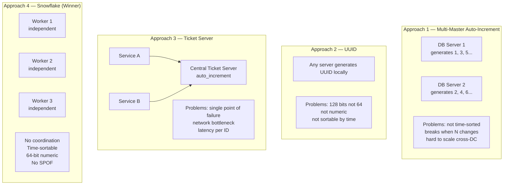
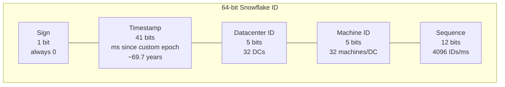
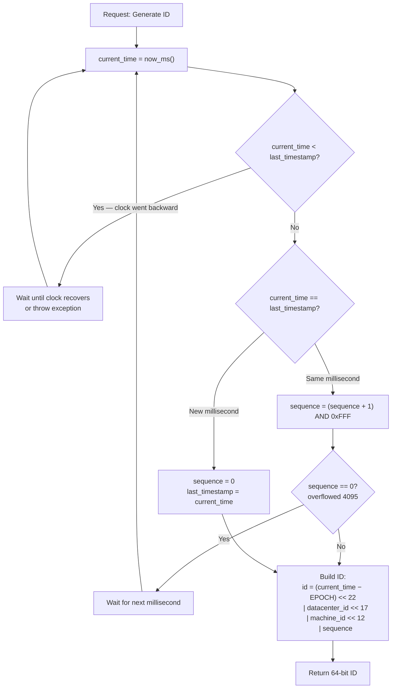
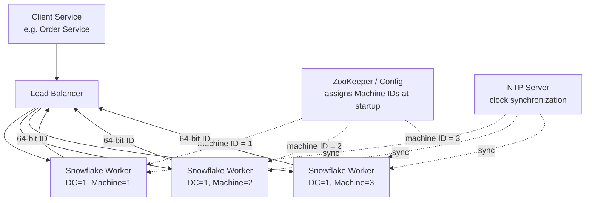
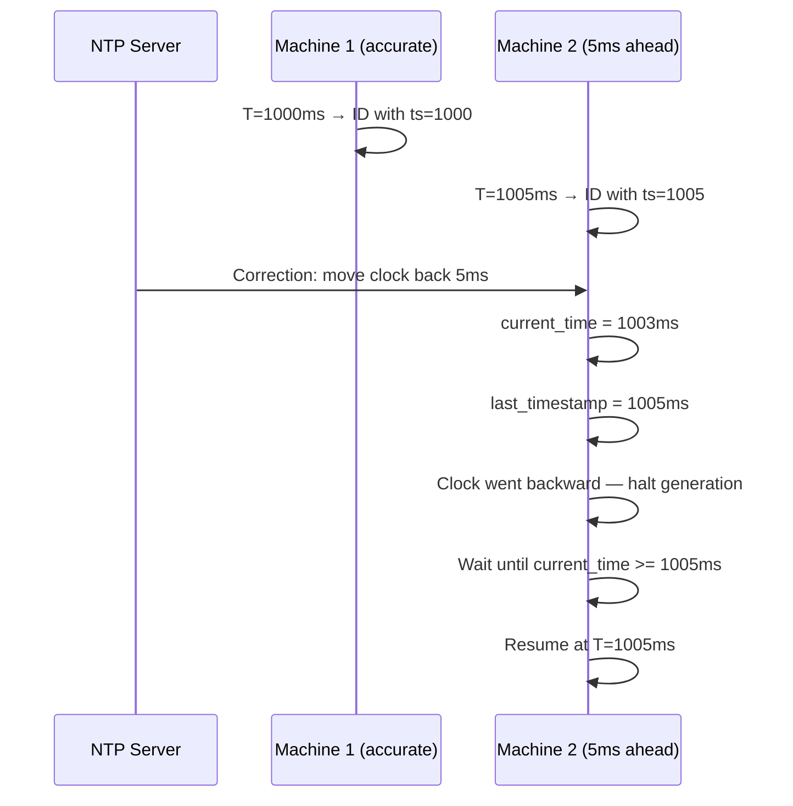

# Ch07: Design a Unique ID Generator in Distributed Systems

## What questions does this chapter answer?
- Why does a single database with auto_increment fail as a distributed ID source?
- What are the four approaches to distributed ID generation and why do the first three fall short?
- What is the Twitter Snowflake bit layout, and how does it produce time-sortable, globally unique 64-bit IDs with no inter-machine coordination?
- What happens when the per-millisecond sequence counter overflows?
- How does clock skew and clock rollback threaten ID correctness, and what are the mitigations?

## Key Concepts

### Why Single-Server Auto-Increment Fails
A single database auto_increment column is a bottleneck (one machine handling all ID requests) and a single point of failure. Multi-master replication distributes the load by having each server increment by K (the number of servers), but this breaks time sort order — Server 1 generates ID 5 at 10:00:01 while Server 2 generates ID 6 at 09:59:00 — and fails when cluster topology changes because all servers must be reconfigured with new increment offsets.

### UUID — Close but Wrong Size
UUIDs are 128-bit identifiers generated independently by each machine using a combination of timestamp, MAC address, and randomness. No coordination is needed, which is attractive. However, the typical system design requirement is a 64-bit numeric ID that fits in a database BIGINT column. UUID v4 is 128 bits, is not a pure integer, and is not time-sortable. UUID v1 has a timestamp component but it is not directly sortable as an integer.

### Ticket Server — Centralized SPOF
A ticket server maintains a single auto_increment counter and services ID requests over HTTP. It is simple, produces sequential IDs, and works across multiple services. But it is a single point of failure — if it goes down, no part of the system can generate IDs. It is also a throughput bottleneck: every ID requires a network round-trip (approximately 1 ms), making high-frequency ID generation impractical.

### Twitter Snowflake — The Solution
Snowflake generates 64-bit IDs on each worker machine independently using a combination of the current millisecond timestamp, a datacenter ID, a machine ID, and a local per-millisecond sequence counter. No inter-worker communication is needed. The bit layout is: 1 sign bit (always 0) + 41 bits timestamp (milliseconds since custom epoch, ~69.7 years of range) + 5 bits datacenter ID (32 datacenters) + 5 bits machine ID (32 machines per DC) + 12 bits sequence (4,096 IDs per millisecond per machine). Total: 4,096 × 1,024 workers = approximately 4.2 billion IDs per millisecond globally.

### Sort Order and the Timestamp Placement
Because the 41-bit timestamp occupies the most significant bits (bits 22–62), any ID generated at a later millisecond is numerically larger than any ID generated at an earlier millisecond. Sorting IDs as integers is equivalent to sorting by generation time. Within the same millisecond, IDs from different machines differ in their datacenter and machine ID bits — still deterministic and consistent.

### Sequence Overflow
If a single machine generates more than 4,095 IDs within one millisecond, the 12-bit sequence counter overflows from 4,095 back to 0. The machine must wait until the clock advances to the next millisecond before generating more IDs. In practice, 4,096 IDs per millisecond is roughly 4 million IDs per second — an extraordinary rate for a single machine.

### Clock Skew and Rollback
Snowflake depends on each machine's clock being accurate. Two failure modes exist. Clock rollback: if the system clock moves backward (NTP correction or leap second), the same timestamp might be reused, potentially generating a duplicate sequence number. The mitigation is to track the last used timestamp and wait if the current time is less than it. Clock skew: if Machine A's clock is 5 ms ahead of Machine B's, their IDs will interleave correctly (5 ms skew is acceptable for sort order purposes) but perfect cross-machine ordering is not guaranteed within that window. NTP keeps clocks within 1–5 ms on well-configured servers, which is acceptable for most use cases.

### Custom Epoch
Using the Unix epoch (1970) would waste the early bits of the 41-bit timestamp field. Twitter chose November 4, 2010 as their epoch, giving 69.7 years of runway from 2010 (valid until ~2079). Systems launched today typically choose a 2020s epoch for maximum usable years.

## Architecture Diagrams

### Four Approaches Compared

This diagram shows all four ID generation strategies side by side, making it easy to communicate the rejection of the first three before presenting Snowflake.

Approaches 1 through 3 each solve one or two requirements but fail at least one critical constraint. Snowflake satisfies all requirements: uniqueness, 64-bit numeric format, time sortability, high throughput, and no single point of failure.

### Snowflake ID Bit Layout

This diagram makes the 64-bit structure concrete so it can be drawn or described precisely in an interview.

The timestamp field in the most significant position ensures numerical ordering equals temporal ordering. The datacenter and machine ID bits guarantee uniqueness across all workers without any runtime coordination. The sequence counter handles burst traffic within a single millisecond.

### ID Generation Algorithm

This diagram shows the full decision flow inside a Snowflake worker for every ID request.

Clock rollback detection prevents duplicate timestamps from being used. Same-millisecond detection determines whether to increment the sequence or reset it. Sequence overflow forces a wait for the next millisecond to prevent wrap-around within the same timestamp slot. Bit-shifting packs all four components into a single 64-bit integer.

### System Deployment Architecture

This diagram shows how Snowflake workers are deployed and how machine IDs are assigned at startup.

Workers are stateless with respect to each other — no inter-worker communication occurs during ID generation. The only coordination is at startup: ZooKeeper assigns each worker a unique machine ID within its datacenter. After that, each worker generates IDs from its local clock and sequence counter. NTP keeps clocks synchronized to prevent large skew, but workers never block waiting for each other.

### Clock Skew and Rollback Handling

This diagram shows what happens when an NTP correction causes a worker's clock to move backward.

If the backward correction is small (under a configurable threshold, e.g. 5 ms), the worker waits for the clock to catch up. If the correction is large, the worker should alert operations and halt ID generation rather than risk duplicates. NTP on well-maintained servers typically stays within 1–5 ms, making the wait scenario rare and brief.

## Interview Questions

- "Why can't you just use auto_increment for distributed IDs?" → A single database auto_increment is a bottleneck and SPOF. Multi-master with step K breaks time sort order and fails when cluster size changes. Briefly mention UUIDs (128-bit, not sortable) and ticket server (network SPOF) to eliminate all naive options before presenting Snowflake.

- "Explain the Snowflake ID bit layout." → Draw or describe: 1 sign bit + 41-bit timestamp (milliseconds since custom epoch, ~69.7 years) + 5-bit datacenter ID (32 DCs) + 5-bit machine ID (32 machines/DC) + 12-bit sequence (4,096/ms). Total = 64 bits. Know the exact numbers; vague answers signal shallow preparation.

- "Why are Snowflake IDs time-sortable?" → The timestamp occupies the most significant bits (bits 22–62). Any ID from a later millisecond is numerically larger. Sorting IDs as integers is equivalent to sorting by generation time. Within the same millisecond, deterministic ordering by datacenter and machine ID bits applies.

- "What happens when the sequence counter overflows?" → At 4,095 IDs in one millisecond, the counter rolls to 0 and the worker must wait for the clock to advance to the next millisecond before generating more. In practice, 4,096 IDs/ms = ~4 million/second per machine — hitting this limit is extraordinary and signals load should be distributed across more workers.

- "How do you handle clock skew and rollback?" → Track the last used timestamp. Before generating an ID, compare current time against the last timestamp. If current time is earlier (rollback), wait until the clock catches up. If the gap is large, alert and halt. NTP keeps production clocks within 1–5 ms, making large rollbacks rare.

## Related Chapters
- [Ch05 - Consistent Hashing](05-consistent-hashing.md) — Distributed ID generators rely on machine identity, which parallels how virtual nodes assign server identities on the hash ring.
- [Ch06 - Key-Value Store](06-kv-store.md) — KV stores use similar distributed ID schemes to generate internal record identifiers without central coordination.
- [Ch08 - URL Shortener](08-url-shortener.md) — The base-62 encoding approach for short URLs uses a Snowflake-style ID generator to produce unique numeric IDs that are then encoded into short strings.
