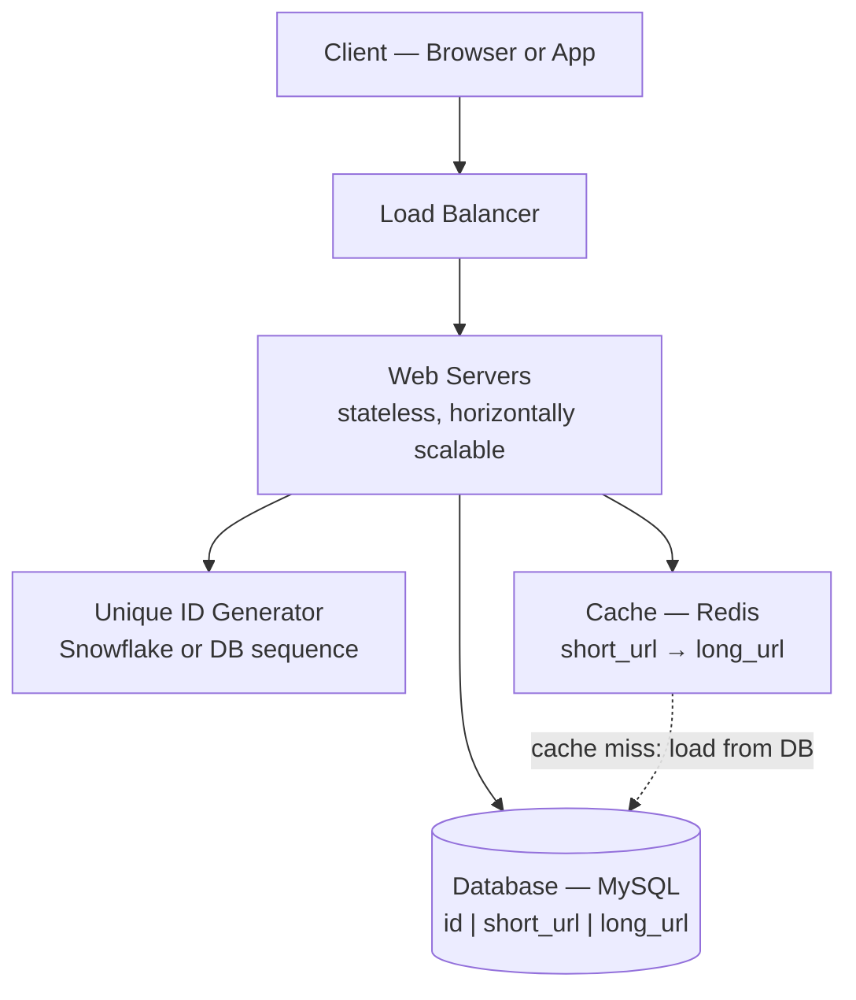
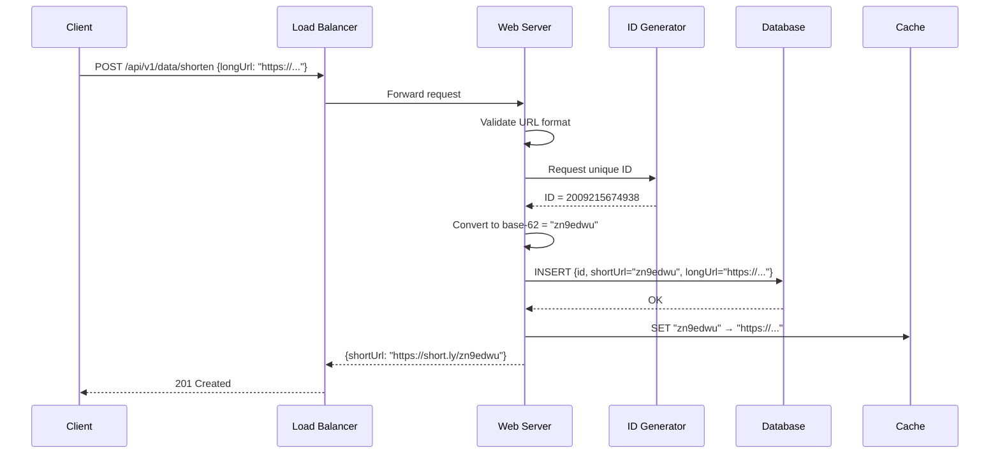
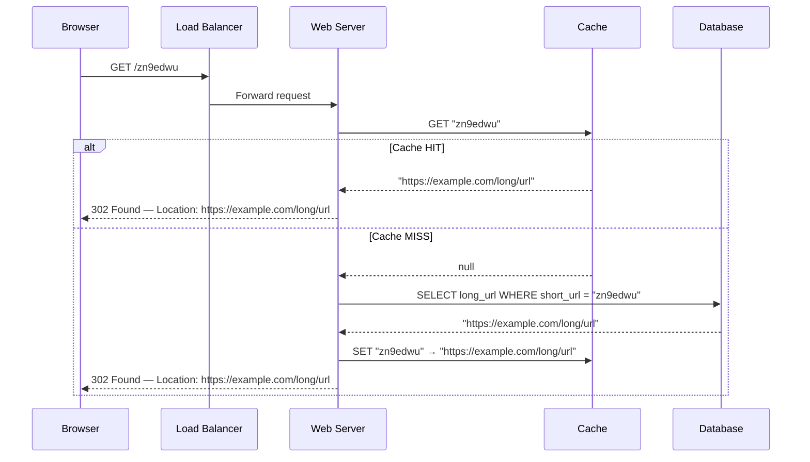
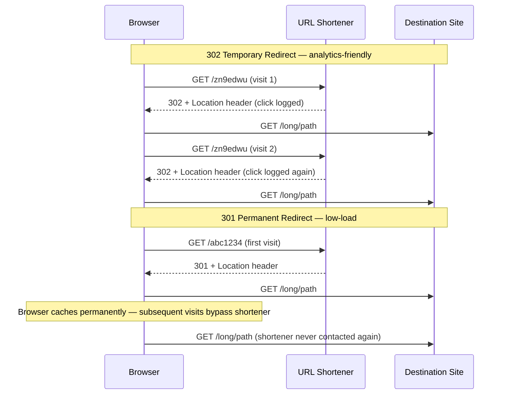
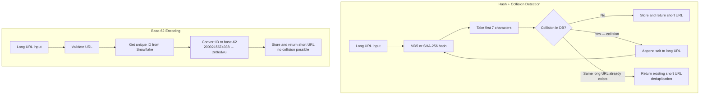
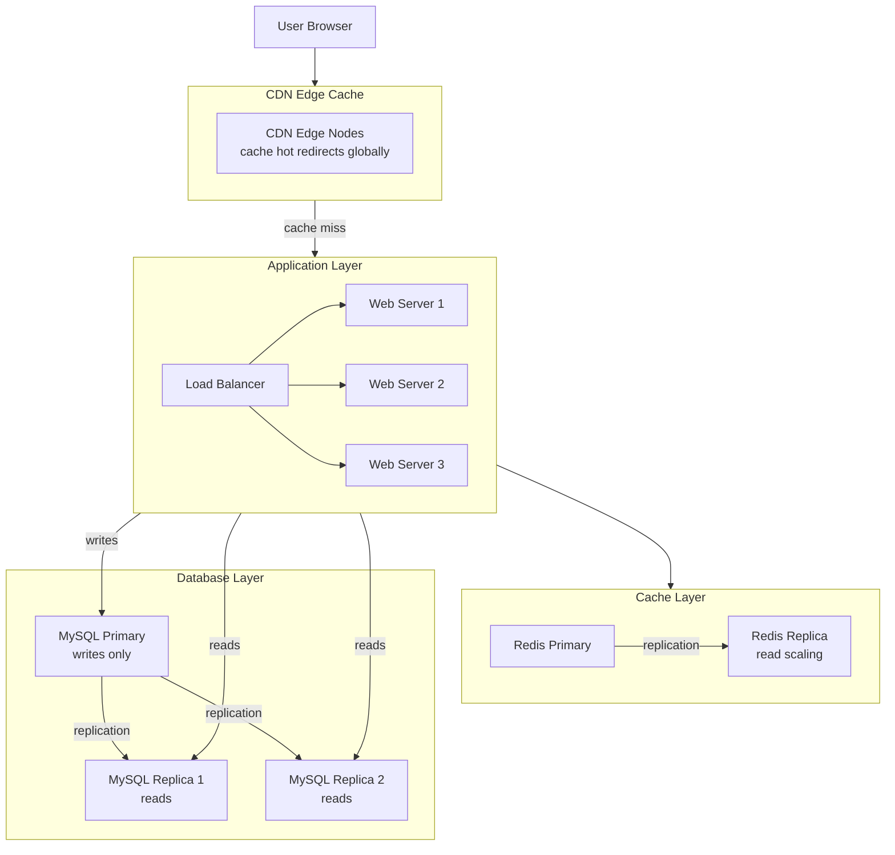
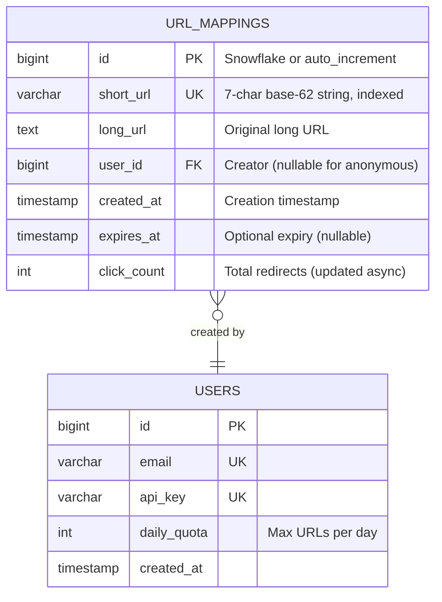

# Ch08: Design a URL Shortener

## What questions does this chapter answer?
- What is the engineering difference between HTTP 301 and 302 redirects, and when does each matter?
- How does the hash + collision detection approach differ from base-62 encoding, and which should you prefer in an interview?
- How does a URL shortener scale to 100 million URLs per day with high read throughput?
- Why is caching critical for a redirect-heavy service, and how should the cache be sized?
- What database schema and indexes does a URL shortener require?

## Key Concepts

### 301 vs. 302 Redirect
When a short URL is visited, the server must redirect the browser to the long URL. HTTP 301 (Moved Permanently) tells the browser to cache the redirect indefinitely — subsequent visits to the same short URL bypass the server entirely. This dramatically reduces server load but makes per-click analytics impossible for repeat visitors. HTTP 302 (Found / Temporary Redirect) forces the browser to contact the server on every visit, enabling the server to log each click. Most commercial URL shorteners (bit.ly) use 302 because analytics is a core product feature. Use 301 only when server load reduction is the overriding priority and no per-click data is needed.

### Hash + Collision Detection Approach
Apply a hash function (CRC32, MD5, or SHA-1) to the long URL. Even the shortest of these (CRC32) produces more than 7 characters, so take only the first 7 characters of the hex output as the short URL. Before storing, check the database for a **collision** — another long URL that hashed to the same 7-character prefix. If a collision exists, append a predefined salt string to the original URL and rehash until no collision is found.

The collision detection loop is expensive because it requires a database lookup on every write. A **Bloom filter** optimization eliminates most of these database queries: the Bloom filter checks in O(1) whether a shortURL already exists, with no false negatives (a shortURL that doesn't exist is never reported as existing) and a small configurable false-positive rate (~0.1%). Only on a Bloom filter positive hit (a potential collision) does the system query the database. This reduces database collision-check queries by ~99.9%.

Main advantage: natural deduplication — the same long URL always produces the same short URL without looking it up. Main disadvantage: every write requires at least a Bloom filter check (and sometimes a database lookup), plus the collision resolution loop adds latency in rare cases.

### Hash Length Calculation
The short URL uses characters from `[0-9, a-z, A-Z]` — 10 + 26 + 26 = **62 possible characters**. To support 365 billion URLs (100M/day × 365 days × 10 years), find the smallest n such that 62^n ≥ 365 billion:

| n | 62^n |
|---|------|
| 1 | 62 |
| 5 | ~916 million |
| 6 | ~56 billion |
| **7** | **~3.5 trillion** ✓ |

With n=7, 62^7 ≈ 3.5 trillion > 365 billion needed. A 7-character short URL is sufficient for a 10-year horizon at 100M URLs/day.

### Base-62 Encoding Approach
Generate a unique numeric ID (using a Snowflake-style generator or database auto_increment), then convert the integer to base-62 notation using the 62-character alphabet: 0→'0', ..., 9→'9', 10→'a', 11→'b', ..., 35→'z', 36→'A', ..., 61→'Z'.

**Concrete example from the book**: Convert the integer `11157` to base-62:
```
11157 = 2 × 62² + 55 × 62¹ + 59 × 62⁰
      = [2, 55, 59]
      → [2, T, X]     (10→a, ..., 55→T, 59→X)
      → short URL: "2TX"
```

Real example from the book: ID `2009215674938` converts to `"zn9edcu"`.

No collisions are possible because each numeric ID is unique by construction. The trade-off is that sequential IDs produce somewhat predictable short URLs, which a malicious actor could enumerate to discover private links — mitigated with non-sequential Snowflake IDs.

### Comparison: Hash + Collision vs. Base-62

| Property | Hash + Collision | Base-62 |
|----------|-----------------|---------|
| Same long URL → same short URL | Yes (deterministic) | No (new ID each time) |
| Collision possible | Yes (must detect and resolve) | No (IDs are unique) |
| Requires unique ID generator | No | Yes |
| Scalability | Harder (DB lookup per write) | Easier (ID gen is separate) |
| Security (predictable URLs) | Unpredictable (hash output) | Somewhat predictable (sequential IDs) |
| Preferred for interviews | ❌ | ✅ |

Base-62 is the preferred interview approach: cleaner architecture, no collision resolution, integrates naturally with the Snowflake ID generator from Ch07.

### Caching for Redirect Lookups
Redirect lookups (short URL → long URL) are extremely read-heavy. The 80/20 rule applies: roughly 20% of short URLs receive 80% of traffic. Caching the hot 20% in Redis with LRU eviction means most redirect requests are served from memory with no database hit. Cache TTL should be long (days to a week) if URLs never change. If the destination can be updated, delete the cache entry on update and let the next request reload from the database.

### Scaling Architecture
At 100 million URLs per day, write QPS is approximately 1,160 per second — well within a single MySQL primary's capacity. Read QPS with a 100:1 read-write ratio reaches about 116,000 per second. This is handled by a Redis cache layer (a single Redis instance handles 100,000+ operations/second) and MySQL read replicas. For the hottest short URLs, a CDN edge cache can serve the redirect with zero server involvement, reducing latency to the nearest edge location.

### Rate Limiting
Without rate limiting, a single malicious IP could exhaust the ID space and storage budget. The standard approach is a Redis counter keyed by IP and time window (e.g., `rate_limit:{ip}:{hour}`) with a TTL equal to the window size. If the counter exceeds the threshold, return HTTP 429 Too Many Requests. API key authentication adds per-key daily quotas for programmatic consumers.

### Database Schema
The core table maps numeric IDs to short and long URLs. Key indexes: primary key on `id`, unique index on `short_url` (for fast redirect lookups and collision detection), index on `user_id` (for listing a user's links), and index on `expires_at` (for background cleanup of expired URLs). Deletes use a tombstone or soft-delete pattern rather than immediate row removal, consistent with the LSM tree model used in the storage engine.

## Architecture Diagrams

### High-Level System Architecture

This diagram shows all components involved in both the write (shortening) and read (redirect) paths.



Web servers are stateless — no session state is held locally. Any request can be routed to any web server because all state lives in the shared cache and database. The ID generator is an external service (or a Snowflake library running in-process). The cache sits in front of the database and absorbs the vast majority of redirect read traffic.

### URL Shortening Flow — Write Path

This diagram shows the sequence of operations when a client submits a long URL to be shortened.



URL validation happens before ID generation to avoid wasting IDs on malformed input. Pre-warming the cache on write (the `SET` step) eliminates the cache miss on the first click. If the ID generator fails, the server retries. The write path only touches the database primary — reads go to replicas.

### URL Redirect Flow — Read Path

This diagram shows the cache hit and cache miss paths for redirect lookups.



A popular short URL receiving 1 million clicks generates 1 million database queries without a cache — or just 1 query with a cache (the first miss). Cache misses fill the cache for subsequent requests. The browser follows the 302 redirect to the destination site after receiving the Location header.

### 301 vs. 302 Redirect Behavior

This diagram shows the behavioral difference between permanent and temporary redirects across repeat visits.



With 302, every click reaches the server — enabling full analytics but increasing load. With 301, the browser caches the redirect and subsequent visits skip the server entirely — minimizing load but preventing per-click tracking. For a commercial analytics product, 302 is the correct choice.

### Hash vs. Base-62 — Decision Flow

This diagram contrasts the write paths for the two URL generation approaches.



The hash approach requires a database lookup on every write to check for collisions. It provides natural deduplication at the cost of this overhead and the rare collision-resolution loop. The base-62 approach has a cleaner write path — no collision check needed — and is easier to reason about in an interview setting.

### Full Scaling Architecture

This diagram shows the complete production-scale deployment with CDN, cache, and database replication layers.



The CDN handles the hottest short URLs at the edge — a cached redirect never reaches the application servers. Redis handles the next tier of popular URLs. MySQL read replicas handle the remaining redirect lookups. The MySQL primary only receives new URL insertions (~1,160 per second at 100M URLs/day), which is well within a single primary's capacity.

### Database Schema

This diagram shows the core entities and their relationships.



The unique index on `short_url` serves double duty: fast O(log N) redirect lookups on the read path, and collision detection on the write path for the hash approach. The index on `expires_at` enables efficient range scans in the background cleanup job without full-table scans.

## Interview Questions

- "What is the difference between 301 and 302 redirects?" → 301 is permanent: browsers cache it forever and bypass the server on repeat visits — low load, no per-click analytics. 302 is temporary: every click contacts the server — higher load, full analytics. Most commercial URL shorteners use 302 because analytics is a product feature. Ask the interviewer which matters more before committing.

- "Hash versus base-62 — which do you choose and why?" → Hash + collision detection produces natural deduplication (same long URL → same short URL) but requires a DB lookup on every write for collision checking. Base-62 is collision-free by construction and has a simpler write path, but requires a unique ID generator and exposes sequential IDs. Prefer base-62 in interviews for its cleaner architecture; acknowledge hash as an alternative with its trade-offs.

- "How would you scale the read path to handle 100,000 redirect lookups per second?" → Layer the reads: CDN edge cache for the hottest URLs (zero server contact), Redis cache for the next tier (microsecond latency), MySQL read replicas for the remainder. The 80/20 rule means caching the top 20% of short URLs handles most traffic from memory. Cache TTL should be long (URLs rarely change).

- "How do you prevent the same long URL from getting multiple short URLs?" → With hashing, it is automatic — the same input always produces the same hash. With base-62, add a unique index on `long_url` and check before inserting; if it exists, return the existing short URL. This deduplication is an explicit DB query in the base-62 path but a natural property of the hash approach.

- "How do you handle URL analytics without blocking redirects?" → Fire-and-forget: send the 302 redirect response immediately, then asynchronously publish a click event to a message queue (Kafka or SQS) containing short URL, timestamp, IP, and user agent. A separate analytics consumer reads from the queue and writes aggregated stats to an analytics store. Redirect latency is unaffected by analytics processing.

## Related Chapters
- [Ch05 - Consistent Hashing](05-consistent-hashing.md) — At extreme read scale, the URL mapping cache can be partitioned across multiple Redis nodes using consistent hashing.
- [Ch06 - Key-Value Store](06-kv-store.md) — The Redis cache backing redirect lookups is itself a key-value store; the same CAP and caching trade-offs apply.
- [Ch07 - Unique ID Generator](07-unique-id-generator.md) — The base-62 approach depends directly on a distributed unique ID generator (Snowflake) to produce the numeric ID that gets encoded into the short URL.
