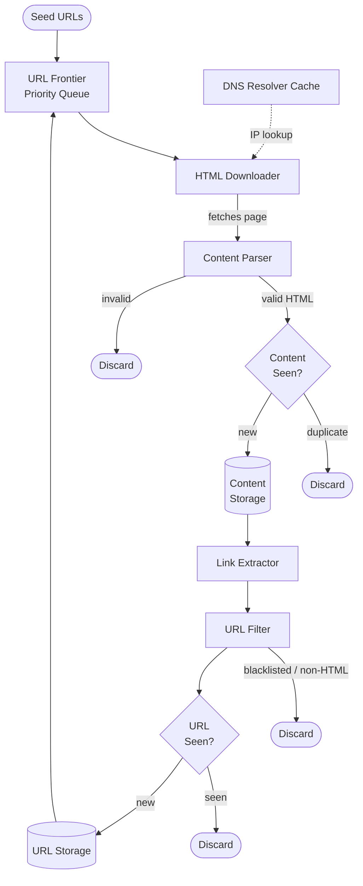
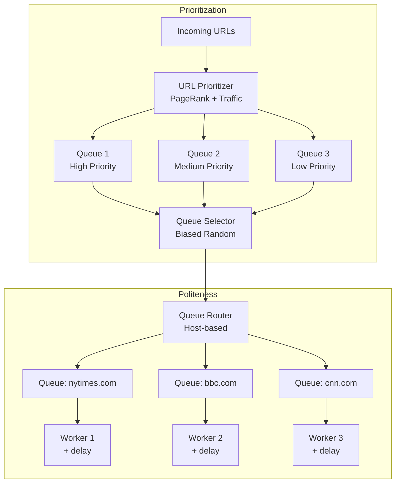
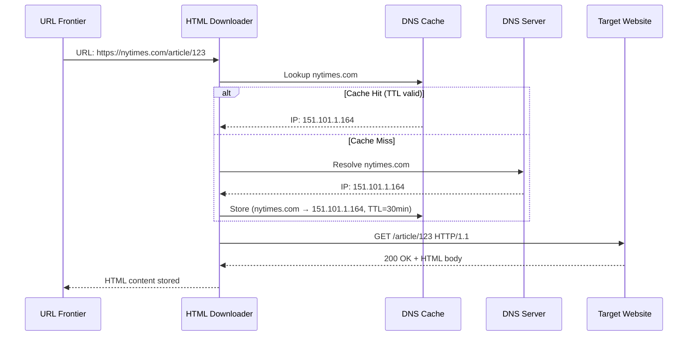

# Ch09: Design a Web Crawler

## What questions does this chapter answer?
- How does a web crawler systematically discover and download billions of pages without overwhelming servers?
- What is the URL Frontier and how does it enforce both prioritization and politeness?
- Why is BFS preferred over DFS for web crawling, and what are spider traps?
- How do Bloom filters and content hashing prevent storing duplicate URLs and pages?
- How does consistent hashing enable fault-tolerant distributed crawling?

## Key Concepts

### BFS vs DFS for Web Crawling
Breadth-first search (BFS) explores all links at the current depth before going deeper, while depth-first search (DFS) follows one path as far as possible before backtracking. BFS is the right choice for crawlers because it surfaces high-value, well-linked pages (which appear early in the link graph) before descending into obscure subdirectories. DFS risks descending infinitely into dynamically generated URL hierarchies — a problem called a spider trap — and hammers a single domain repeatedly, violating politeness constraints. At 400 pages/second, these risks are catastrophic with DFS.

### URL Frontier
The URL Frontier is a priority queue that acts as the central scheduler of the crawler. It has three responsibilities: (1) Prioritization — assigning priority scores based on PageRank and update frequency, routing URLs into multiple priority-weighted FIFO queues; (2) Politeness — maintaining one queue per host so that no single server receives a burst of back-to-back requests, with each worker thread enforcing a delay between requests; (3) Freshness — scheduling recrawls based on historical update frequency, so news sites are revisited hourly while academic papers are revisited monthly. Without the URL Frontier, multiple workers would hammer the same server and download low-value pages before important ones.

### HTML Downloader and DNS Caching
The HTML Downloader fetches raw page content via HTTP. The most impactful optimization is a local DNS resolver cache: DNS lookups take 10–300 ms per domain, and at 400 requests/second this latency dominates throughput without caching. Caching domain-to-IP mappings with a ~30-minute TTL eliminates most lookups. Additional optimizations include geographic locality (placing crawler workers near target servers) and short timeouts (skip servers that don't respond within ~5 seconds rather than blocking the pipeline).

### Content Deduplication (Content Seen?)
Approximately 30% of the web is duplicate content — mirrors, syndicated articles, and scraped copies. Storing duplicates wastes storage and pollutes search indexes. The Content Seen check computes an MD5 or SHA-256 hash of the page body and checks it against a hash set; if the hash already exists, the page is discarded. Hash comparison is O(1) after the hash is computed, regardless of page size (up to 500 KB). For near-duplicate detection — pages that are 95% identical but hash differently — SimHash produces similar fingerprints for similar documents and can detect near-duplicates within a configurable bit-distance threshold.

### URL Deduplication (URL Seen? / Bloom Filter)
The URL Seen check prevents adding the same URL to the crawl queue more than once. It is distinct from content dedup: a URL can appear at thousands of addresses with identical content (Content Seen handles that), but the URL Seen filter prevents re-queuing any address already visited or scheduled. A Bloom filter is used because it is dramatically more space-efficient than a hash set — 1 billion URLs require ~1.2 GB in a Bloom filter versus ~36 GB in a hash set. Bloom filters have no false negatives (a URL never in the set will never be reported as seen) but a tunable false-positive rate (~0.1%), meaning a tiny fraction of new URLs will be incorrectly skipped — an acceptable trade-off for crawlers.

### Consistent Hashing for Distributed Workers
Multiple downloader workers are assigned URL ranges using consistent hashing, which maps both URLs and workers onto a circular hash ring. Each URL is assigned to the nearest worker clockwise on the ring. When a worker fails, only the URLs in its ring segment need reassignment; the rest of the workers are unaffected. This contrasts with simple modulo hashing (`hash(url) % N`), where removing any single worker forces nearly all URL assignments to change, making fault recovery prohibitively expensive at scale.

### Spider Traps
Spider traps are websites — sometimes accidental, sometimes adversarial — that generate infinite unique URLs. Common examples include calendar pages (`/calendar/2024/01/` through `/calendar/9999/12/`) and URLs with embedded session IDs. Mitigation strategies include enforcing a maximum URL length (e.g., 200 characters), a maximum subdirectory depth, stripping known dynamic parameters (session IDs, tracking tokens), and maintaining a domain blacklist of known trap sites.

### Robots.txt (Robots Exclusion Protocol)
The `robots.txt` file at `<domain>/robots.txt` specifies which paths a crawler may visit and how fast it may crawl. Crawlers must fetch and cache this file once per domain before crawling any page on that domain, respect all `Disallow` rules, honor the `Crawl-delay` directive, and identify themselves with a `User-Agent` header. Ignoring robots.txt is considered unethical, can result in IP bans, and in some jurisdictions carries legal risk.

## Architecture Diagrams

### High-Level Web Crawler Architecture
This diagram shows the full data path from seed URLs through downloading, parsing, deduplication, and link extraction back into the URL Frontier. It illustrates how the crawler is a loop: discovered URLs feed back into the same pipeline that processes them.

Seed URLs are hand-picked high-authority starting points. The URL Frontier controls crawl order and politeness. The HTML Downloader uses a local DNS cache to avoid repeated lookups. Content Parser validates HTML before the page reaches storage. The two dedup checks — Content Seen (hash-based, catches duplicate bodies) and URL Seen (Bloom filter, catches re-queued addresses) — serve different purposes and are both required. The loop closes when extracted links pass filtering and are added back to the URL Frontier.

### URL Frontier: Prioritization and Politeness
This diagram exposes the internal two-stage structure of the URL Frontier: a priority tier that controls which URLs are processed soonest, and a politeness tier that controls how frequently each host is hit.

The Queue Selector is biased toward higher-priority queues (e.g., Queue 1 selected 60% of the time, Queue 3 only 10%). After priority selection, the Queue Router assigns each URL to a per-host FIFO queue so that requests to a single domain are paced. Each worker thread enforces a minimum delay (e.g., 1 second) between consecutive requests to its assigned host, preventing the crawler from behaving like a DDoS attack.

### HTML Downloader with DNS Cache Sequence
This sequence diagram shows the DNS resolution path for each download request, highlighting the cache hit and miss cases.

On a cache miss, the DNS lookup adds 10–300 ms of latency. At 400 requests/second even a 50 ms average savings per request represents a massive throughput improvement. The 30-minute TTL balances freshness (servers rarely change IPs) against staleness risk.

## Interview Questions

- "Design a web crawler for a search engine that processes 1 billion pages per month." → Open with clarifying questions (HTML only or multi-format? Freshness requirements?). Walk through the estimation (400 pages/sec, 500 TB/month, 30 PB over 5 years). Present the 9-component architecture, then deep-dive on URL Frontier (prioritization + politeness) and HTML Downloader (DNS cache, distributed workers). Close with robustness: spider traps, URL canonicalization, resumability via checkpoints.

- "Why not DFS for web crawling?" → BFS finds high-PageRank pages first because they are linked from many other pages. DFS risks infinite descent into dynamically generated URL hierarchies (spider traps), repeatedly hammers one domain (politeness violation), and provides worse coverage breadth. BFS naturally spreads requests across many domains.

- "How would you prevent storing the same page that appears at 1,000 different URLs?" → Content Seen check: compute MD5/SHA-256 of the page body; if the hash exists in the hash set, discard. The URL Seen check independently records all 1,000 URLs as visited (no re-download), but only one copy of the content is stored.

- "What is a Bloom filter and when would you use it instead of a hash set?" → A Bloom filter is a space-efficient probabilistic data structure: no false negatives, tunable false-positive rate (~0.1%). For 1 billion URLs it uses ~1.2 GB versus ~36 GB for a hash set. Use a Bloom filter when memory is constrained and missing ~0.1% of new URLs is acceptable — which it is for crawlers.

- "How do you handle JavaScript-rendered pages?" → Standard HTTP download retrieves only static HTML. For JS-rendered content, use a headless browser (Puppeteer, Playwright) on a targeted subset of high-value pages. This is 10–100x more resource-intensive than static fetching, so it is used selectively, not universally.

## Related Chapters
- [Ch05 - Consistent Hashing](05-consistent-hashing.md) — The crawler uses consistent hashing to assign URL ranges to workers and recover gracefully from worker failure.
- [Ch06 - Key-Value Store](06-key-value-store.md) — The DNS cache and URL hash sets are key-value lookups; understanding their internals informs capacity planning.
- [Ch10 - Notification System](10-notification-system.md) — Both chapters use message queues to decouple producers (URL Frontier / services) from consumers (workers), a core distributed systems pattern.
