# Ch11: Design a News Feed System

## What questions does this chapter answer?
- What is a news feed and what are the two core flows that define it?
- What is fan-out, and what are the trade-offs between fan-out on write and fan-out on read?
- How does the hybrid fan-out approach solve the hotkey/celebrity problem without sacrificing read performance?
- How does the fanout service work step-by-step internally?
- Why is the news feed cache structured as `<post_id, user_id>` and not full post content?
- How are feed publishing and feed retrieval architecturally separated?
- What are the 5 cache layers in a news feed system and what does each store?
- How do you paginate an infinite-scroll feed and handle the cold-start case?
- What database scaling techniques apply when the system grows?

---

## Step 1 — Understand the Problem

Before designing anything, you must clarify requirements. In an interview, this is a mandatory first step.

**Sample interview dialogue (from the book):**

| Question | Answer |
|---|---|
| Mobile app? Web app? Or both? | Both |
| What are the important features? | Publish a post + see friends' posts in the feed |
| Is feed sorted by reverse chronological order or ranking? | Reverse chronological order (simple case) |
| How many friends can a user have? | 5,000 |
| What is the traffic volume? | 10 million DAU |
| Can feed contain images, videos, or just text? | Media files, including images and videos |

**What this scoping tells us:**
- The friend limit of 5,000 is bounded → fan-out on write is viable for most users
- 10M DAU is a meaningful load → caching is critical, single-server won't work
- Media in the feed → content is stored in object storage (S3) + CDN, never inline

---

## Step 2 — High-Level Design

The system is divided into **two flows**:

1. **Feed publishing** — a user creates a post; it gets persisted and distributed to friends' feeds
2. **Newsfeed building** (retrieval) — a user opens the app and sees their feed

### APIs

```
POST /v1/me/feed
Params: content (text of post), auth_token

GET /v1/me/feed
Params: auth_token
```

Both APIs are HTTP-based. The `auth_token` authenticates every request at the web server layer.

---

### Feed Publishing — High-Level Flow

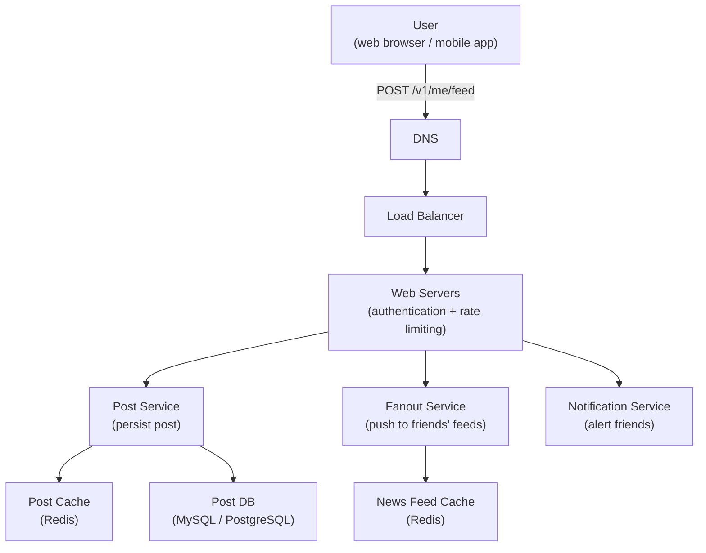

**Component responsibilities:**
- **Load Balancer** — distributes incoming traffic across web servers
- **Web Servers** — enforce auth token validation and rate limits; route to internal services
- **Post Service** — saves the post to the database and post cache
- **Fanout Service** — pushes the new post ID to the news feed cache of every friend
- **Notification Service** — sends push notifications to friends that new content is available

---

### Newsfeed Building — High-Level Flow

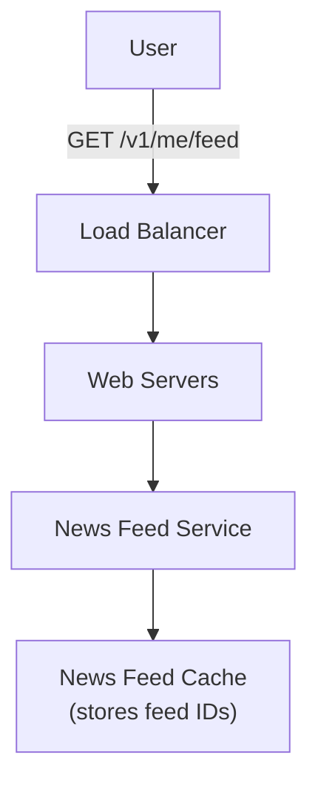

This path is read-only. The News Feed Service reads from the cache to return the user's pre-built feed. No writes happen here.

---

## Step 3 — Deep Dive

### 3a. Feed Publishing Deep Dive

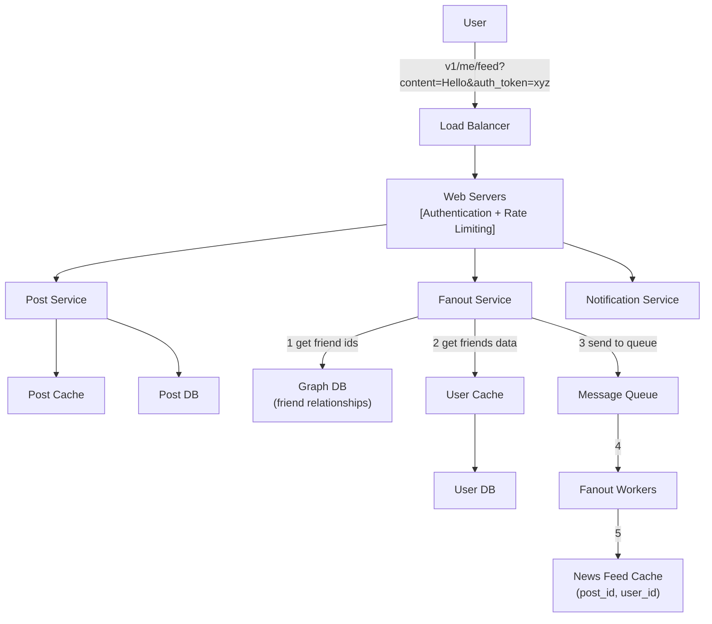

#### Web Servers

Beyond routing, web servers enforce two critical policies:
- **Authentication** — only requests with a valid `auth_token` can post; prevents unauthorized access
- **Rate Limiting** — limits the number of posts a user can make per time window; prevents spam and abuse

#### Fanout Service — Step-by-Step

The fanout service is the core of feed publishing. It follows exactly 5 steps:

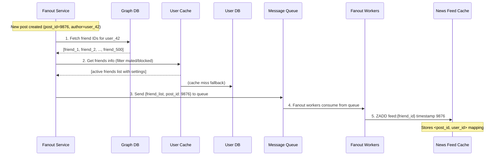

**Step-by-step explanation:**

1. **Fetch friend IDs from Graph DB** — The Graph DB (e.g., Neo4j or MySQL adjacency list) is optimized for graph traversal. It quickly returns all follower/friend IDs for the post author.

2. **Get friends info from User Cache** — User Cache provides account-level data including mute/block settings. If user_42 is muted by friend_7, friend_7's feed does NOT receive the post, even though they are friends. Also handles visibility settings (e.g., "share with close friends only").

3. **Send to Message Queue** — The fanout service sends the full friend list and the new post ID to a message queue (e.g., Kafka, RabbitMQ). This decouples the fanout service from the workers. The post service can return `200 OK` immediately, before any fanout has occurred.

4. **Fanout Workers consume from queue** — Workers are independently scalable. If post volume spikes, you add more workers. They pull jobs from the queue and process them asynchronously.

5. **Store in News Feed Cache** — Workers write `<post_id, user_id>` pairs to each follower's feed slot in Redis. Only IDs are stored — not full post content. This keeps the cache compact.

---

### Fan-Out Strategy: Push vs Pull vs Hybrid

This is the most important design decision in a news feed system.

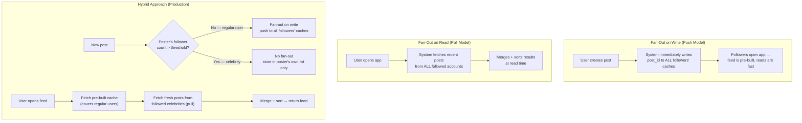

#### Comparison Table

| | Fan-Out on Write | Fan-Out on Read | Hybrid |
|---|---|---|---|
| **Read latency** | Fast (pre-computed) | Slow (computed on demand) | Fast for most users |
| **Write latency** | Slow (N writes per post, N = followers) | Fast (1 DB write) | Fast (writes skip celebrities) |
| **Celebrity/hotkey problem** | Yes — 10M followers = 10M cache writes | No | No — celebrities pull at read time |
| **Inactive users** | Wastes computation (feeds never read) | No waste | Push only for active users |
| **Used in practice** | Small social networks | Never alone | Twitter, Facebook, Instagram |

**Why the hybrid is the right answer in interviews:**

The key insight is that the _threshold_ (e.g., 1 million followers) bounds the read-time cost. A user might follow 3 celebrities. At read time, fetching 3 celebrities' recent posts is fast and cheap. But computing writes for those celebrities' 10M+ followers on every post would be catastrophic.

---

### 3b. Newsfeed Retrieval Deep Dive

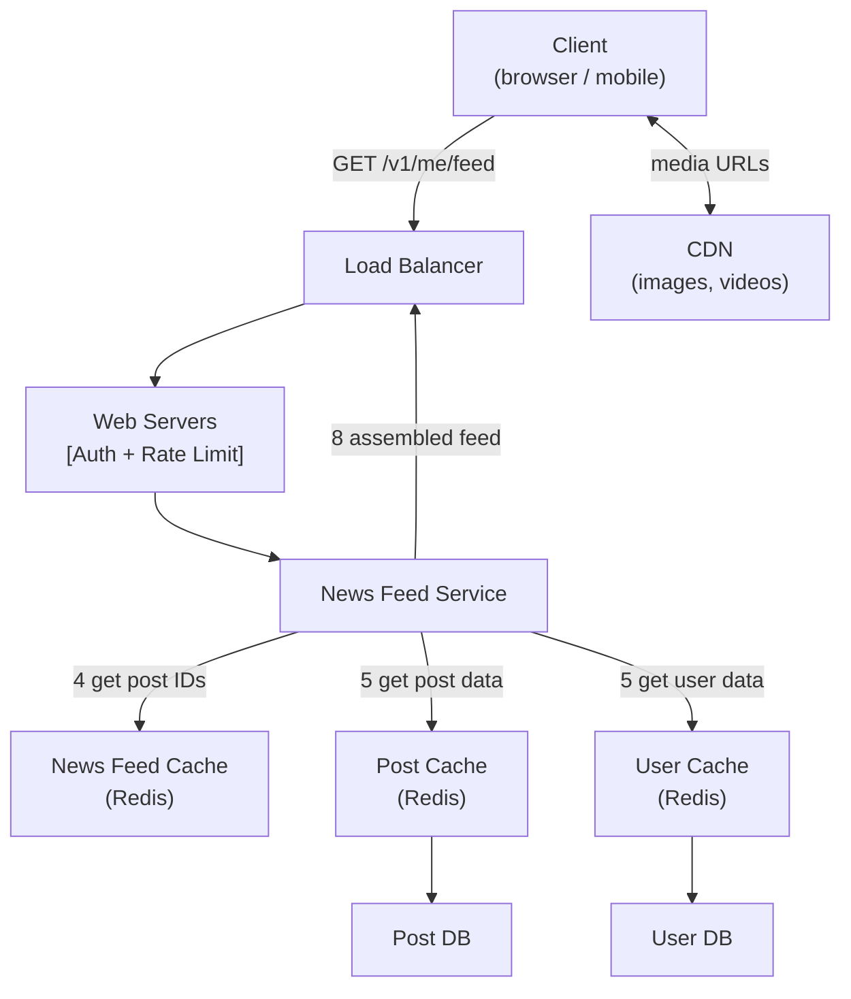

**6 steps to serve a feed:**

1. User sends `GET /v1/me/feed` request
2. Load balancer routes to a web server
3. Web server calls the News Feed Service
4. News Feed Service fetches a list of post IDs from the **News Feed Cache**
5. The service fetches full post content from Post Cache, and author info from User Cache, to "hydrate" the feed items (fill in text, profile pics, metadata)
6. The fully assembled feed (JSON) is returned to the client. Media URLs in the response point to the CDN — the service never fetches media bytes itself.

#### Feed Cache Structure (Redis)

The News Feed Cache stores a simple mapping:

```
| post_id | user_id |
|---------|---------|
| 9876    | 42      |
| 9875    | 101     |
| 9871    | 42      |
| 9870    | 77      |
| ...     | ...     |
```

This is a Redis Sorted Set keyed by `feed:{user_id}` where:
- **Score** = Unix timestamp of the post
- **Member** = post_id

```redis
# Write (fanout worker adds a post to a follower's feed):
ZADD feed:12345 1716200000 9876

# Read (fetch 20 most recent posts):
ZREVRANGE feed:12345 0 19

# Paginated read (cursor-based, posts before timestamp T):
ZREVRANGEBYSCORE feed:12345 T -inf LIMIT 0 20
```

**Why only post IDs and not full content?**
- An 8-byte post ID vs 500+ bytes of post content × millions of users = enormous memory savings
- Post content can be updated independently without invalidating any feed entry
- The same post_id appears in N followers' feeds without N copies of the content

**Why Redis Sorted Set and not a simple list?**
- Sorted sets support O(log N) insertion and O(K) range queries
- Scores (timestamps) enable efficient cursor-based pagination
- Built-in deduplication (can't add same member twice)

**Cache cap:** Each user's feed is capped at ~500 entries. Posts older than the cap are served from the database on demand. Most users never scroll that far, so the cache miss rate is low.

---

### 3c. Cache Architecture — 5 Layers

Cache is the most critical performance layer in a news feed system. The book defines 5 distinct cache tiers:

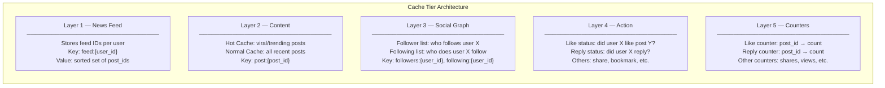

#### Layer breakdown:

| Layer | What it stores | Why it's cached |
|---|---|---|
| **News Feed** | Ordered list of post IDs per user | Feed reads happen on every app open — must be sub-millisecond |
| **Content** | Full post objects (text, media URLs, metadata) | Posts are read far more often than written |
| **Social Graph** | Follower/following relationship lists | Graph DB queries are expensive; cached adjacency lists are fast |
| **Action** | Whether user X has liked/replied to post Y | Needed to render the "liked" state on each post in the feed |
| **Counters** | Aggregated like/reply/view counts per post | Counter reads on every feed render; DB aggregation is too slow |

**Hot cache vs Normal cache (Content layer):**

Viral content (a post going viral) gets disproportionate traffic. The hot cache holds the top N% of content that receives the most reads, so popular posts are served from an even faster, smaller cache tier.

---

### 3d. Fanout on Write Sequence (Full Detail)

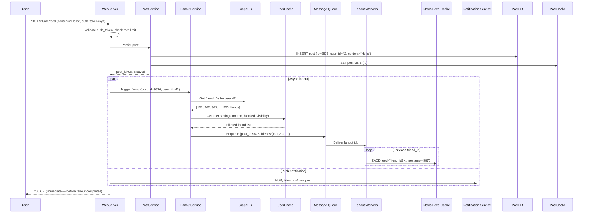

Key takeaway: The user gets `200 OK` immediately. Fanout is fully asynchronous. Friends typically see the post within seconds, not because the post request waited for all writes, but because the workers are fast.

---

### 3e. Feed Retrieval Sequence (Full Detail)

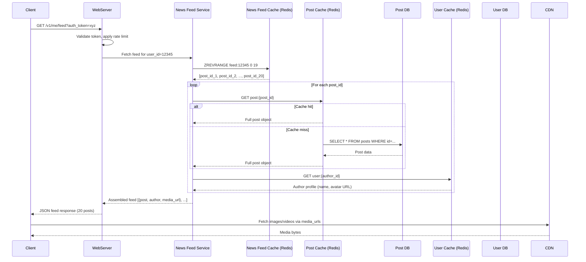

The media URLs in the response are CDN URLs. The feed service never touches media bytes — it only stores and returns URLs.

---

### 3f. Cursor-Based Pagination (Infinite Scroll)

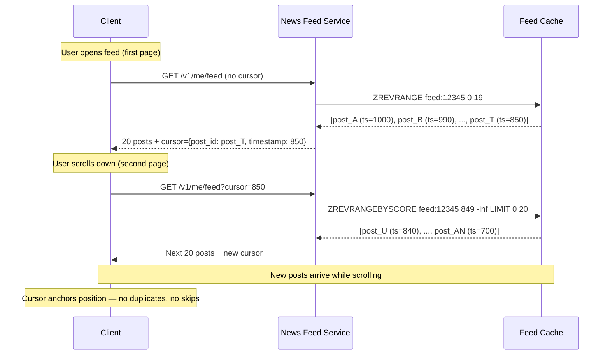

**Why not offset-based pagination?**

Offset-based: `LIMIT 20 OFFSET 40` breaks when new posts arrive. If 5 posts are added at the top while a user is scrolling, every subsequent page is shifted by 5 — users see duplicates or miss posts. Cursor-based pagination anchors to the last seen item's timestamp, so new content at the top never disrupts the scroll position.

**Cold start (no feed in cache):**

When a user opens the app for the first time or their cache has expired, there's no pre-built feed. The system falls back to fan-out on read: it fetches recent posts from all followed accounts, merges and sorts them by timestamp, returns the result, and caches it for subsequent requests.

---

## Step 4 — Wrap Up: Scalability Talking Points

In an interview, after walking through the design, use any remaining time to mention scalability:

### Database Scaling

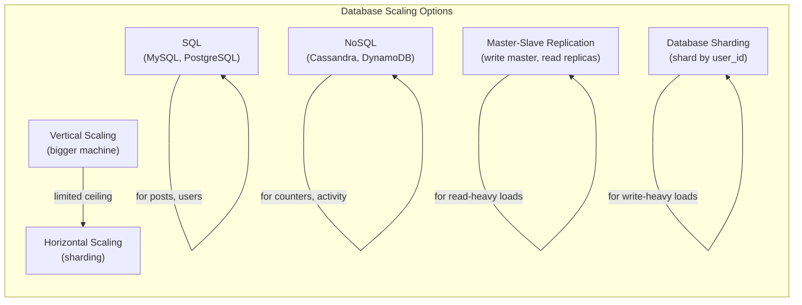

### Architecture Scaling

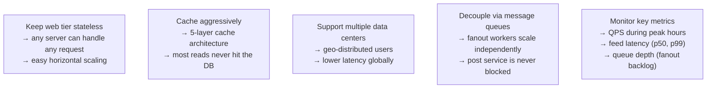

---

## Architecture Diagrams Summary

### Complete Feed Publishing Path

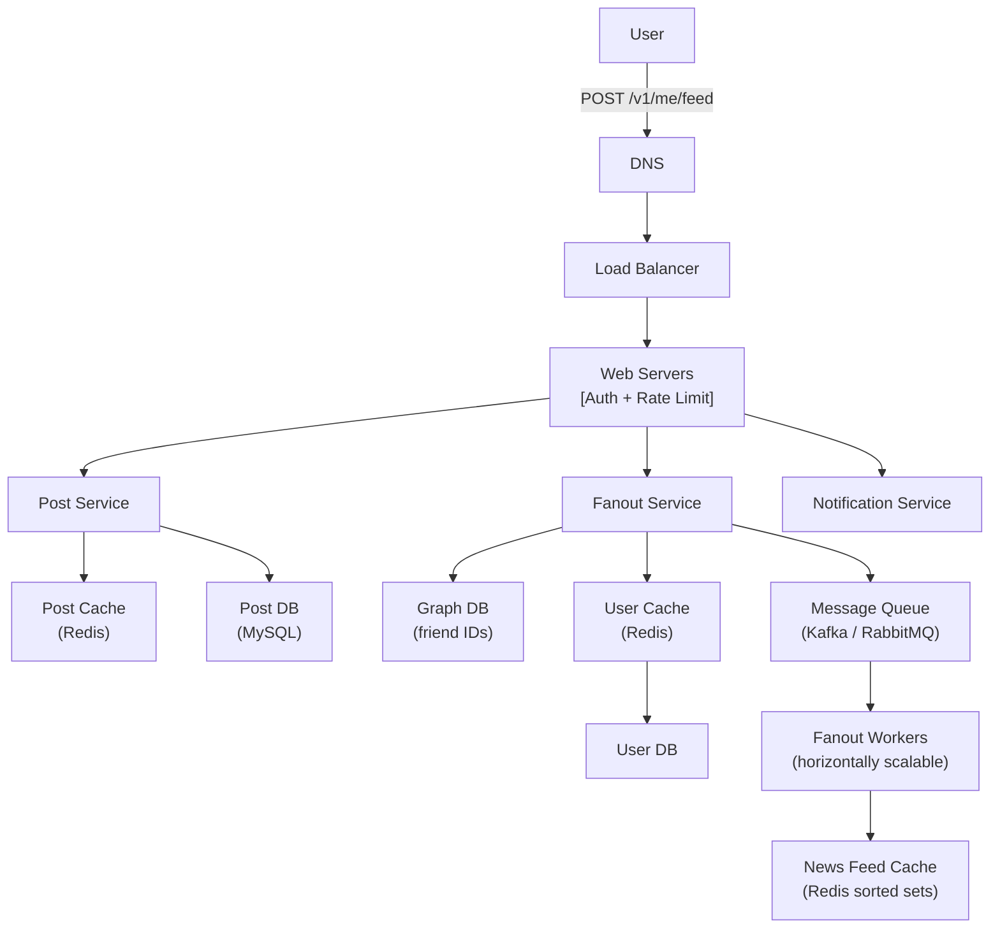

### Complete Feed Retrieval Path

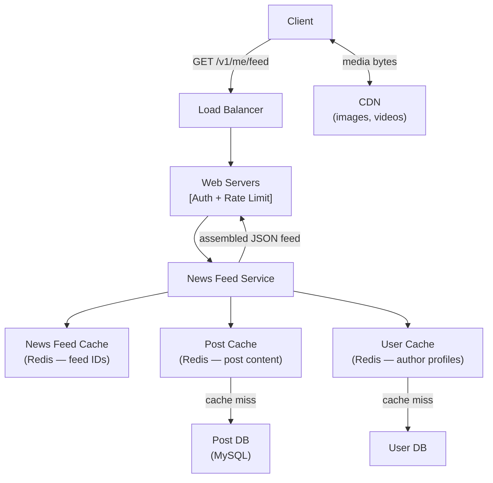

### Hybrid Fan-Out Decision

```mermaid
flowchart TD
    NewPost["New Post by User X"] --> CheckFollowers{Follower count\n> threshold\n(e.g. 1M)?}

    CheckFollowers -->|No — regular user| FanoutWrite["Fan-out on WRITE\nPush post_id to ALL followers' caches\nasynchronously via workers"]
    CheckFollowers -->|Yes — celebrity| NoFanout["No fan-out\nPost stored in user X's own post list only"]

    UserOpensApp["User Opens App"] --> FetchCache["Fetch pre-built feed\nfrom Redis sorted set\n(covers regular followed users)"]
    FetchCache --> FetchCeleb["For each followed celebrity:\nfetch recent posts directly (pull)"]
    FetchCeleb --> Merge["Merge + sort all by timestamp"]
    Merge --> ReturnFeed["Return paginated feed to client"]
```

### 5-Layer Cache Architecture

```mermaid
graph TD
    subgraph Cache["Cache Tier — 5 Layers"]
        direction TB
        L1["NEWS FEED\nfeed:{user_id} → sorted set of post_ids"]
        L2a["CONTENT — Hot Cache\nViral/trending posts"]
        L2b["CONTENT — Normal\nAll recent posts"]
        L3a["SOCIAL GRAPH — Followers\nWho follows user X"]
        L3b["SOCIAL GRAPH — Following\nWho user X follows"]
        L4a["ACTION — Liked\nuser_id liked post_id?"]
        L4b["ACTION — Replied\nuser_id replied to post_id?"]
        L4c["ACTION — Others\nShared, bookmarked, etc."]
        L5a["COUNTERS — Like counter"]
        L5b["COUNTERS — Reply counter"]
        L5c["COUNTERS — Other counters"]
    end
```

---

## Interview Questions

- **"Design a news feed system for a social network with 10M DAU."**
  Open by identifying the two core flows: feed publishing and feed retrieval. Explain the fan-out trade-off (write = fast reads + celebrity problem, read = slow reads + no celebrity problem, hybrid = production approach). Describe the feed cache as Redis sorted sets of post IDs, asynchronous fanout via message queue, and the 5-layer cache architecture. Close with cursor-based pagination and cold-start handling.

- **"What is the hotkey/celebrity problem and how do you solve it?"**
  A user with 10M followers causes 10M cache writes on every post with pure fan-out on write. Solution: hybrid approach — fan-out on write for users below a follower threshold (e.g., 1M), no fan-out for celebrities. At read time, the client merges pre-built feed entries (regular users) with fresh celebrity posts fetched directly (pull).

- **"Why store only post IDs in the feed cache rather than full post content?"**
  Keeps the feed cache compact (~8 bytes per entry vs 500+ bytes). Allows post content to be updated independently without cache invalidation. The same post ID appears in millions of users' feeds without data duplication. Full post content is fetched separately from the post cache.

- **"How do you implement infinite scroll pagination?"**
  Use cursor-based pagination: the client passes the last seen post's timestamp as a cursor. The Feed Service queries `ZREVRANGEBYSCORE` to fetch the next page of post IDs scored below the cursor. Stable even when new posts arrive — unlike offset-based pagination which shifts all subsequent pages.

- **"What happens when a user first opens the app and has no feed cache (cold start)?"**
  Fall back to fan-out on read: fetch recent posts from all followed accounts, merge and sort by timestamp, return the result, and cache it for subsequent requests. This is slower for the first load but guarantees the user always sees a feed.

- **"How does the fanout service filter what gets pushed to a follower's feed?"**
  Step 2 of the fanout process fetches user data from the User Cache. This includes mute lists, block lists, and visibility settings. If friend A has muted the poster, or if the poster restricted the post to "close friends only", the fanout service filters those followers out before enqueuing the fanout job.

- **"What database would you use for the news feed cache and why?"**
  Redis sorted sets. Sorted sets provide O(log N) insert (ZADD), O(K) range query (ZREVRANGE), and built-in score-based queries (ZREVRANGEBYSCORE) needed for cursor-based pagination. They're also naturally deduplicated and support configurable size limits via ZREMRANGEBYRANK to evict the oldest entries.

---

## Related Chapters
- [Ch10 - Notification System](10-notification-system.md) — Feed publishing triggers push notifications via the Notification Service; the chapter explains how those are delivered to offline users at scale.
- [Ch12 - Chat System](12-chat-system.md) — Both news feed and chat involve real-time content delivery; chat uses persistent WebSocket connections where feeds use async fanout + cached pre-computation.
- [Ch06 - Key-Value Store](06-key-value-store.md) — Redis sorted sets power the feed cache; understanding key-value store internals informs TTL, eviction strategy, and memory sizing decisions.
- [Ch05 - Consistent Hashing](05-consistent-hashing.md) — Consistent hashing is mentioned as a technique to distribute hotkey traffic across fanout workers more evenly.
