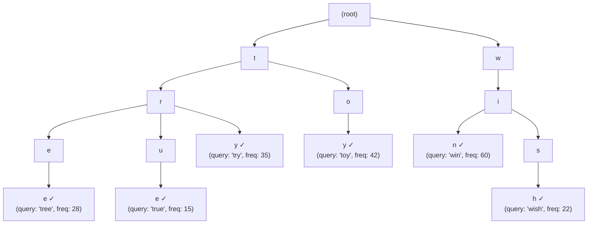
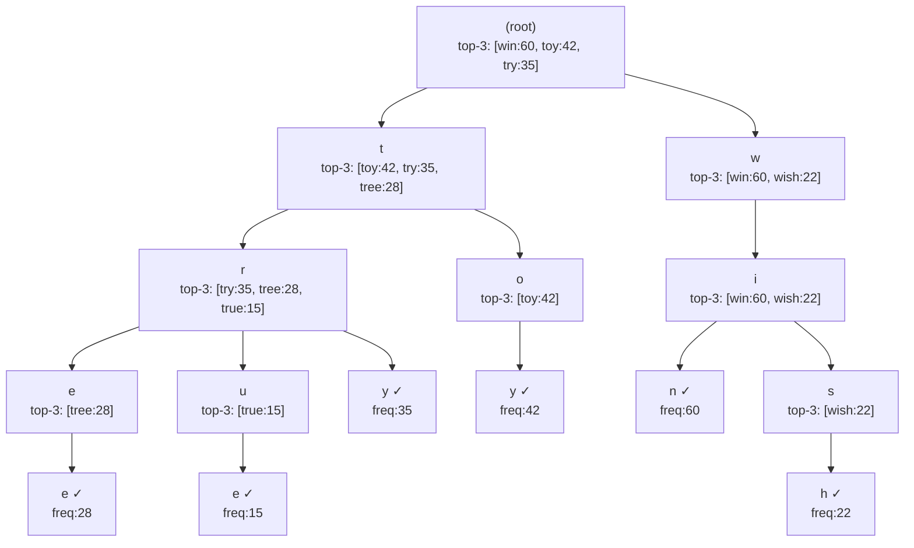
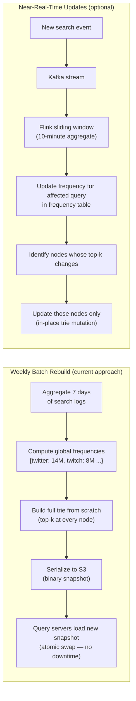
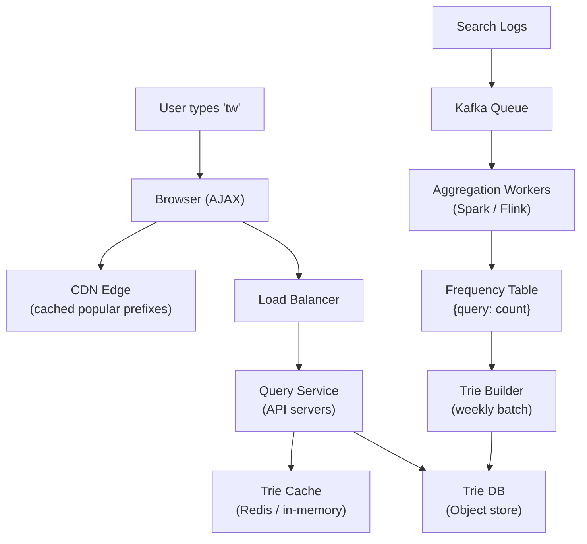
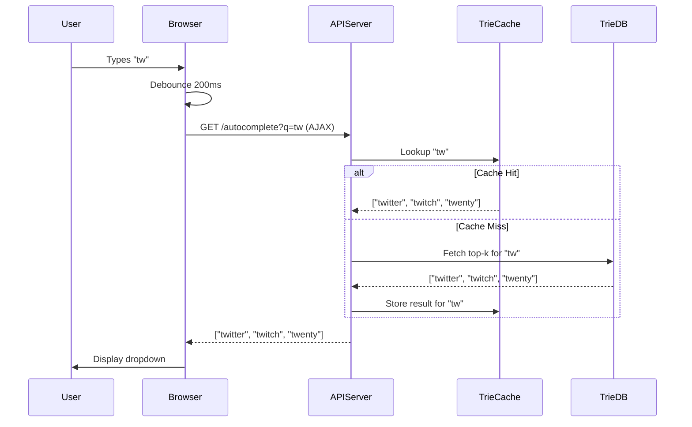
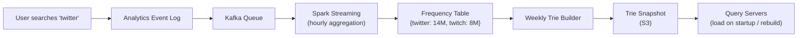

# Ch13: Search Autocomplete System

## What questions does this chapter answer?
- What data structure powers search autocomplete, and how does it enable sub-100ms responses?
- How do you optimize trie lookups so you never traverse an entire subtree at query time?
- Why are the data-gathering pipeline and the query service designed as two completely separate systems?
- How does browser-side debouncing reduce server load, and what is its mechanism?
- What are the trade-offs between weekly batch trie rebuilds and near-real-time trie updates?

## Key Concepts

### Trie Data Structure
A trie is a tree where each node represents one character. Words are spelled by traversing from the root down to a node, character by character. In autocomplete, every indexed query is stored as a path through the trie. To find completions for a prefix like "tw", you traverse from the root to the node for 'w' and then inspect everything under it. This makes prefix lookups natural and fast, but the naive version — doing a full subtree traversal on every query — is too slow at Google scale where the trie can have millions of nodes.

### Pre-Computed Top-K at Every Node
The critical optimization is storing the top-k most frequent completions directly inside each trie node, not just at leaves. When a user types "tw", the system traverses to the 'w' node and reads the pre-computed list `[("twitter", 200), ("twitch", 80), ("twenty", 100)]` — no subtree traversal needed. Query time drops from O(prefix_length + subtree_size) to O(prefix_length), effectively O(1) at the node. The trade-off is extra memory: every node stores k word entries rather than just a single frequency count.

### Two-Service Architecture
The system splits cleanly into two independent services. The **data gathering service** runs offline in batch mode: it collects raw search logs, streams them through Kafka, aggregates query frequencies via Spark or Flink, and periodically rebuilds the full trie — typically on a weekly schedule. The **query service** runs in real time: it receives each AJAX request, reads from an in-memory trie cache, and returns the top-k suggestions within 100ms. These services scale independently; heavy read traffic never interferes with the trie rebuild pipeline.

### AJAX and Browser-Side Optimizations
Autocomplete uses AJAX to make background HTTP requests without a full page reload. Two browser-side techniques reduce unnecessary server load. **Debouncing** delays the request until the user has stopped typing for a fixed interval (commonly 200ms) — without it, typing "twitter" fires 7 requests; with debouncing, it fires 1 or 2. **Browser caching** stores autocomplete results locally using `Cache-Control: private, max-age=3600` so repeated lookups of the same prefix skip the network entirely.

### Content Filtering
Before results are returned to the user, a filter layer checks them against a blocklist of harmful or inappropriate queries. This blocklist can be enforced both at query time (fast, covers dynamic additions) and proactively at trie-build time (prevents harmful content from entering the trie at all). Forgetting this step in an interview is a significant red flag — shipping unchecked autocomplete suggestions to millions of users is a product disaster.

### Trie Storage and Loading
The trie is serialized periodically to object storage (S3) as a binary snapshot. Query servers load the full trie into memory at startup and after each weekly rebuild. This makes each query server effectively stateless — it just needs the latest snapshot URL. Redis can serve as an intermediate cache layer for trie data. The in-memory trie is read-only during normal operation, which allows concurrent access without locking.

### Multi-Language and Multi-Region Support
Each language or locale gets its own trie. When a request arrives, the server routes it to the correct trie based on the `Accept-Language` header or user settings. Regional tries differ even within a language: "football" autocomplete in the US differs from the UK. Separate tries per region allow each to reflect local search behavior independently.

### Trie Structure Visualization
A trie stores characters at each node. Every path from root to a terminal node spells a complete query. This example shows a trie built from the queries: "tree", "try", "true", "toy", "wish", "win":

Searching for prefix `"tr"`: traverse root → `t` → `r`, then collect all completions in the subtree under `r`. Without optimization, this requires visiting every node below `r`. With top-k pre-computation at `r`, the answer is already there.

### Top-K Pre-Computation at Every Node
Each node stores the k most popular completions reachable from it. The search never needs to traverse the subtree:

User types `"tr"` → traverse to node `r` → read pre-computed top-3: `[try:35, tree:28, true:15]` → done. No subtree traversal. Query time is O(prefix length), not O(subtree size).

**Trade-off**: top-k pre-computation increases memory by k entries per node. For a trie with 1M nodes and k=5, each entry stores ~20 bytes: that's 100MB of pre-computed data for near-instant responses at every node.

### Algorithm Complexity Comparison

| Operation | Naive Trie | Pre-Computed Trie | SQL LIKE 'prefix%' |
|-----------|-----------|-------------------|---------------------|
| Lookup | O(p + subtree_size) | O(p) | O(log N) min, O(N) worst |
| Ranking | O(K log K) sort at query time | O(1) — pre-sorted | Extra ORDER BY needed |
| Memory | O(nodes) | O(nodes × k) | O(rows × row_size) |
| Update frequency | At query time | At trie rebuild time | Real-time |
| At 10B queries | Too slow | Sub-100ms | Too slow |

`p` = prefix length (typically 1–20 characters). Subtree size can be millions of nodes for single-character prefixes like `"a"`.

### Trie Update: Batch Rebuild vs Incremental Update

The batch approach is simpler but means trending queries can take up to 7 days to appear in suggestions. The incremental approach reduces lag to minutes but requires locking or copy-on-write to safely mutate the in-memory trie without serving stale data during an update.

## Architecture Diagrams

### High-Level Autocomplete Architecture
This diagram shows the two main data paths: the real-time query path (user keystrokes → CDN/load balancer → query service → trie cache) and the offline data gathering pipeline (search logs → Kafka → Spark → trie builder → trie DB). The two paths share only the trie DB, which is updated by the pipeline and read by the query service.

The query service is stateless and horizontally scalable — each instance loads the trie into local memory at startup. The CDN caches autocomplete responses for the most popular prefixes (top 10,000 prefixes cover roughly 90% of queries), reducing load on the query service further.

### Query Service Request Flow
This sequence diagram traces a single autocomplete request from keypress to dropdown. The debounce step at the browser prevents sending a request on every keystroke. The cache-hit path returns results without touching the trie DB; the cache-miss path loads from the trie DB and warms the cache for subsequent requests.

The debounce means that typing "twitter" (7 characters) typically produces only 1-2 actual network requests, not 7. Browser-side caching means a user who types "tw" again in the same session gets an instant response from the local cache.

### Data Gathering Pipeline
This diagram shows how raw search events become a rebuilt trie. Each step is sequential but the stages run as independent services: log ingestion, stream processing, frequency aggregation, trie building, and snapshot distribution to query servers.

The trie is rebuilt weekly because a full rebuild is expensive. For trending topics (e.g., breaking news), a near-real-time variant uses Kafka + Flink to reduce the lag from weekly to minutes, at higher operational cost.

## Interview Questions

- "Design a search autocomplete system for Google" → Open with the two-service split (data gathering vs. query service), introduce the trie, explain the top-k pre-computation optimization, then walk through caching layers (in-memory trie, Redis, CDN edge, browser cache). End with freshness trade-offs and content filtering.

- "How would you make autocomplete reflect trending queries like breaking news?" → Near-real-time pipeline using Kafka and Flink for streaming aggregation instead of weekly batch. Incremental trie updates are possible but complex; discuss the trade-off between implementation complexity and freshness.

- "Why not use SQL LIKE 'prefix%' for autocomplete?" → At scale, SQL table scans on every keystroke are far too slow. A trie in memory provides O(prefix_length) lookups versus O(log N) or worse for indexed SQL, and the trie result is already ranked — SQL queries require a sort step too.

- "How would you support autocomplete in 50 languages?" → Build one trie per language/locale, serialized separately. Route requests to the correct trie based on the Accept-Language header. Trie sizes and vocabularies differ significantly by language, so separate tries allow independent rebuild schedules.

- "How would you add personalized autocomplete?" → Blend global top-k (from the shared trie) with a per-user top-k (from user's search history stored in a key-value store keyed by user_id + prefix). The cache becomes per-user rather than shared, which increases memory requirements.

## Related Chapters
- [Ch05 - Consistent Hashing](05-consistent-hashing.md) — used to distribute trie shards across multiple cache servers when the trie is too large to fit on a single machine
- [Ch06 - Key-Value Store](06-key-value-store.md) — Redis is the underlying store for the trie cache layer
- [Ch01 - Scale from Zero to Millions](01-scale.md) — the general scaling patterns (horizontal scaling, caching, CDN) applied specifically here to the query service
