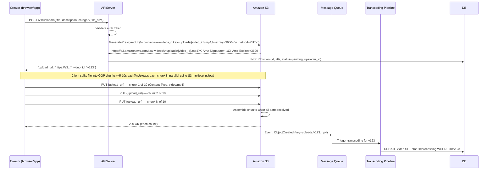
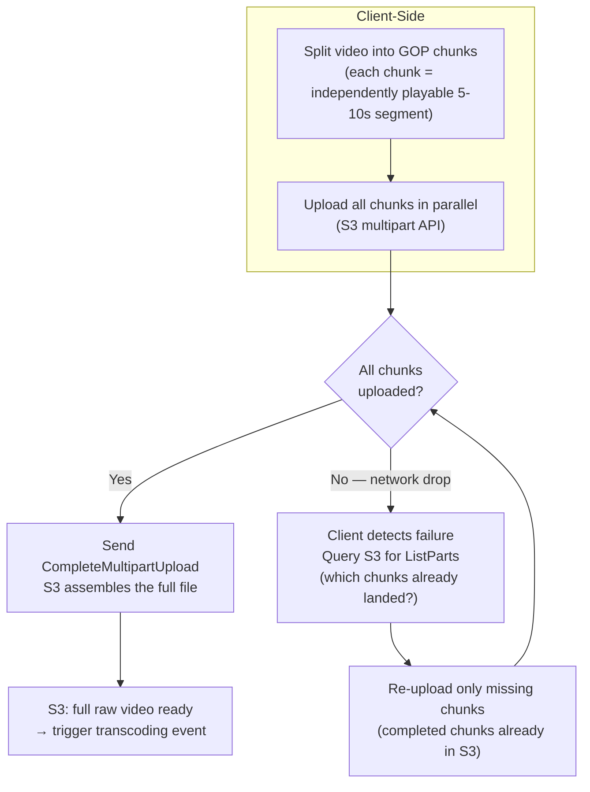
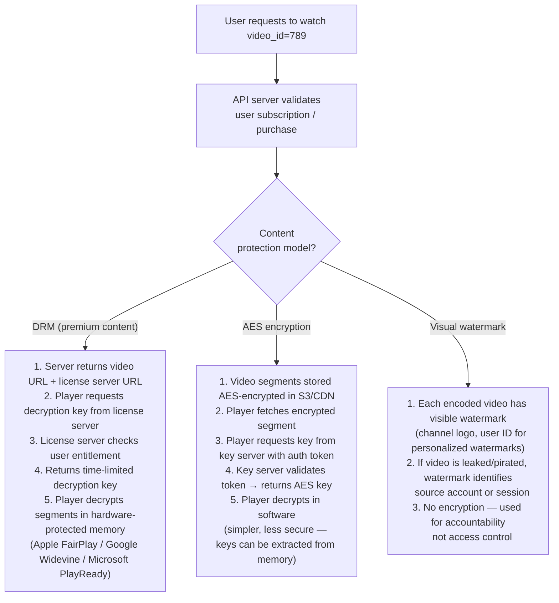
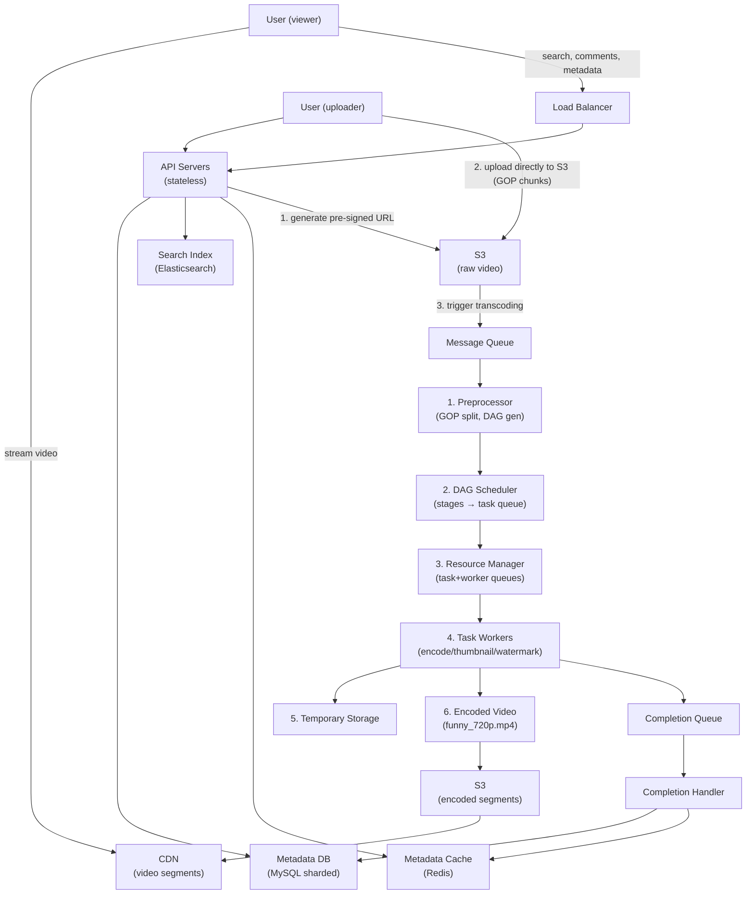
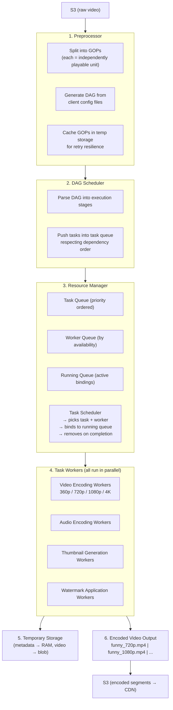
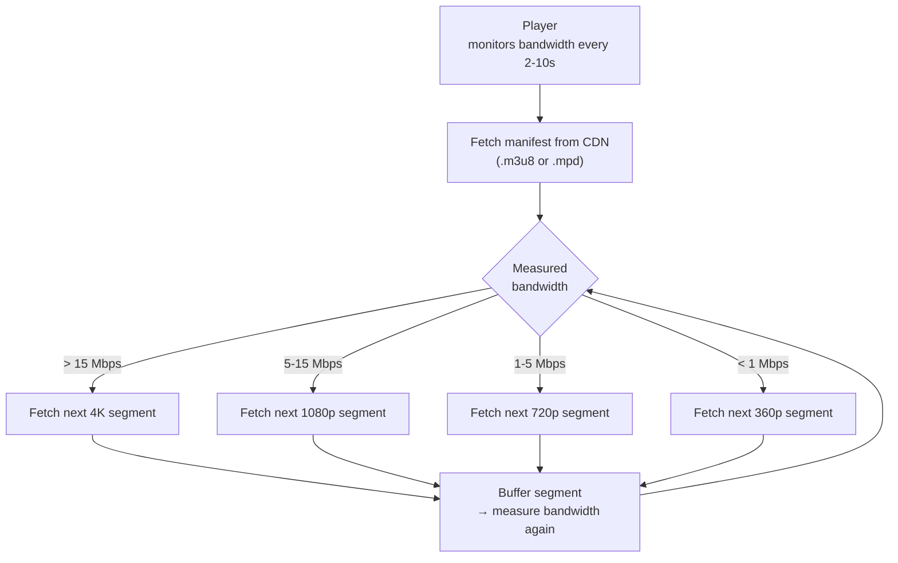
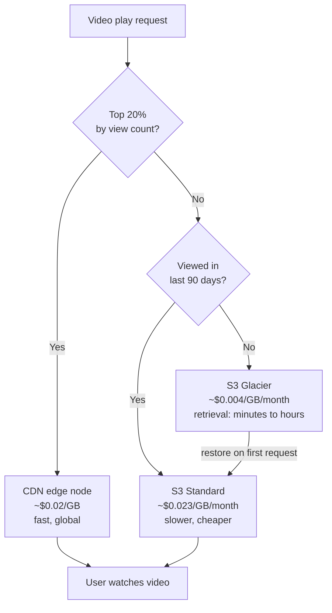

# Ch14: Design YouTube

## What questions does this chapter answer?
- Why do video uploads bypass API servers, and what mechanism enables this?
- How does the DAG-based transcoding pipeline convert one uploaded video into 15+ formats efficiently?
- What are the 6 components of the transcoding architecture and what does each do?
- What is adaptive bitrate streaming, and why does it matter for viewers on different networks?
- How does YouTube reduce CDN costs by 80% using long-tail content distribution?
- What are the safety, speed, and cost optimizations that make large-scale video streaming viable?

## Key Concepts

### Pre-Signed Upload URLs
Raw video files are large — typically 1GB to 10GB — and must not flow through API servers. Instead, the API server generates a **pre-signed URL**: a time-limited, cryptographically signed URL that grants the client direct write access to a specific S3 object. The client then uploads directly to S3 without any application server handling the bytes. This removes the upload bandwidth burden entirely from the API tier. Pre-signed URLs include an expiry (e.g., 1 hour) and are scoped to a single object path. Microsoft Azure uses the equivalent feature under the name "Shared Access Signature."

### Resumable Multipart Upload by GOP Alignment
Large uploads fail frequently due to network drops, especially on mobile. The solution is to split the video into **GOP (Group of Pictures)** chunks — a GOP is a group of frames arranged in a specific order, each chunk being an independently playable unit, typically a few seconds in length. S3's multipart upload then uploads each GOP chunk independently. If the connection drops mid-upload, the client resumes from the last successfully uploaded chunk. Chunks can also be uploaded in parallel, significantly increasing throughput. This alignment is performed by the client when possible; older clients that cannot split by GOP pass the entire video to the server, which splits it server-side.

### DAG-Based Transcoding Pipeline
A single uploaded video must be encoded into multiple resolutions (360p, 480p, 720p, 1080p, 4K) and codecs (H.264, VP9, AV1). Different creators have different requirements — watermarks, thumbnails, different quality ladders. Rather than processing these sequentially with a single pipeline, the transcoding is modeled as a **Directed Acyclic Graph (DAG)**. Independent tasks run in parallel on separate worker machines. Tasks with dependencies are expressed as graph edges. Total pipeline time equals the slowest parallel branch, not the sum of all branches.

The DAG is generated by the preprocessor from configuration files. A typical DAG has these stages:
- Stage 1: Video stream, audio stream, and metadata extraction (parallel)
- Stage 2a: Video encoding at each resolution (360p, 720p, 1080p, 4K — all parallel)
- Stage 2b: Audio encoding (parallel with video encoding)
- Stage 2c: Thumbnail generation (parallel)
- Stage 2d: Watermark application (parallel)

### The 6-Component Transcoding Architecture

**1. Preprocessor** has four responsibilities:
- **Video splitting by GOP**: splits video into independently processable GOP-aligned chunks for parallel processing
- **Backward compatibility**: older clients that can't split by GOP receive the full file; the preprocessor handles the split server-side
- **DAG generation**: reads configuration files written by client developers and generates the processing DAG
- **Caching**: stores GOPs and metadata in temporary storage for retry resilience — if encoding fails, retries resume from cached state

**2. DAG Scheduler**: splits the DAG graph into stages and places tasks into the Resource Manager's task queue. Example: Stage 1 has 3 tasks (video, audio, metadata). Stage 2 has 4 tasks (video encoding, audio encoding, thumbnail, watermark). The scheduler determines execution ordering based on dependencies.

**3. Resource Manager**: manages efficient resource allocation using three internal data structures:
- **Task queue**: a priority queue of tasks to execute
- **Worker queue**: a priority queue of worker utilization info (which workers are free and their capacity)
- **Running queue**: tracks currently executing tasks and their assigned workers

The **Task Scheduler** inside the Resource Manager picks the highest-priority task from the task queue, finds the optimal free worker from the worker queue, instructs that worker to execute the task, binds the task/worker pair into the running queue, and removes it from the running queue when done.

**4. Task Workers**: execute specific task types defined in the DAG. Different worker types exist:
- Video encoding workers (360p, 720p, 1080p, 4K — each runs as a separate worker in parallel)
- Audio encoding workers
- Thumbnail generation workers
- Watermark workers

**5. Temporary Storage**: stores intermediate artifacts between pipeline stages. Metadata is cached in memory (small size, frequently accessed by workers). Video and audio data goes to blob storage. All temporary data is freed once the corresponding video processing completes.

**6. Encoded Video**: the final pipeline output — e.g., `funny_720p.mp4`, `funny_1080p.mp4`, etc.

### Streaming Protocols
Video streaming uses standardized protocols to control data transfer. Popular protocols:
- **MPEG-DASH** (Dynamic Adaptive Streaming over HTTP): open standard, widely adopted by YouTube
- **Apple HLS** (HTTP Live Streaming): required for iOS devices, uses `.m3u8` manifest files
- **Microsoft Smooth Streaming**: used in Azure-native environments
- **Adobe HDS** (HTTP Dynamic Streaming): legacy format, less common

Different protocols support different video encodings and playback players. Which protocols you implement depends on which clients you must support. You don't need to memorize these in interviews, but knowing that HLS is iOS and that DASH is the open standard is sufficient.

### Adaptive Bitrate Streaming
A user on 4G LTE has ~5 Mbps; a user on fiber has 500 Mbps. Serving a single video quality breaks one experience. **Adaptive bitrate streaming** encodes video into short segments (2–10 seconds) at each quality level and serves a manifest file listing all segment URLs at all qualities. The client player monitors its download speed every few seconds and switches to the appropriate quality for the next segment. Quality switches happen at GOP boundaries, which is why GOP alignment is so important — segments at all quality levels are exactly the same duration.

### CDN-First Video Delivery
Application servers never serve video bytes during playback. When a client requests a video, the API server returns a CDN URL — bytes come from the nearest CDN edge node. A viewer in Tokyo gets video from a nearby edge node, not from a US data center. The API tier remains lightweight and stateless. This is the direct application of the CDN principle from Ch01.

### Speed Optimizations

**Upload parallelism by GOP**: Splitting video into GOPs at the client allows chunks to be uploaded in parallel. Total upload time drops from `sum(chunk times)` to `max(chunk times)`.

**Upload centers close to users**: Setting up multiple upload centers globally (using CDN as upload centers) means a user in China uploads to an Asian center, not to the US. Network round-trip time for upload drops proportionally to the geographic reduction in distance.

**Parallelism via message queues**: Without message queues, encoding modules wait for the download module to finish. With message queues, the encoding module consumes events as soon as they arrive — no sequential waiting. Each stage publishes to a queue that the next stage reads from. This decoupling enables true pipelining across the transcoding architecture.

### Safety Optimizations

**Pre-signed URL flow** (step by step):
1. Client sends HTTP request to API server to fetch a pre-signed URL
2. API server generates the URL scoped to the target S3 path with an expiry
3. Client uploads video directly to S3 using the pre-signed URL — API server is not involved in the data transfer

**Video content protection** — three options:
- **Digital Rights Management (DRM)**: Apple FairPlay, Google Widevine, Microsoft PlayReady — hardware-backed key management, segment-level encryption, browser/device enforcement
- **AES encryption**: encrypt with a symmetric key; configure an authorization policy so only authenticated users can obtain the decryption key at playback time
- **Visual watermarking**: embed identifying information (company logo, user identity) as an image overlay on the video — useful for identifying the source of leaks

### Cost Optimization: Long-Tail Distribution

YouTube video views follow a **long-tail distribution**: a small number of popular videos account for the vast majority of views. From research: YouTube CDN costs ~$150,000/day at 5M DAU watching 5 videos each at $0.02/GB.

Four strategies to cut this cost:

1. **Popular videos from CDN, long-tail from storage**: Serve top 20% most-viewed videos from CDN (fast, expensive at $0.02/GB). Route long-tail 80% of requests to high-capacity origin storage servers (much cheaper per GB). CDN bandwidth is the dominant cost line; this strategy reduces it by ~64%.

2. **Encode long-tail on demand**: If a video has been viewed zero times, avoid pre-encoding 15+ resolutions. Encode the first requested resolution on-demand; cache the result. This saves both storage (no unused encoded files) and compute (transcoding workers not wasted).

3. **Regional popularity**: Some videos are popular only in certain regions. No need to distribute them globally — serve from the closest regional storage rather than replicating to every CDN PoP.

4. **Build your own CDN or partner with ISPs**: Netflix and major streaming companies build embedded caches within ISP networks (Comcast, AT&T, Verizon). ISPs are physically close to end users. Bypassing public CDN pricing entirely and paying for colocation reduces per-GB bandwidth cost to nearly zero for popular content.

### Error Handling Playbook

Each pipeline component has a defined failure strategy:
- **Upload error**: retry with exponential backoff
- **Split video error**: if old client can't split by GOP, route full video to server for splitting
- **Transcoding error**: retry the encoding task
- **Preprocessor error**: regenerate the DAG from configuration files
- **DAG scheduler error**: reschedule the affected task
- **Resource manager queue down**: failover to a replica queue
- **Task worker down**: retry the task on a different available worker
- **API server down**: stateless — load balancer routes to a different instance automatically
- **Metadata cache down**: data is replicated; read from another cache node; bring up a replacement
- **Metadata DB master down**: promote a slave to master; bring up a new slave
- **Metadata DB slave down**: redirect reads to a healthy slave; bring up a replacement

### Pre-Signed URL Upload Flow (Full Protocol Detail)
The pre-signed URL pattern keeps raw video bytes entirely off the API tier. Here is the exact sequence including what data goes where:

The uploader never sends video bytes to your servers. S3 handles the incoming bandwidth. If the upload is interrupted, S3's multipart upload API allows resuming from the last completed chunk using the `UploadId` returned when the multipart session was initiated.

### GOP-Aligned Multipart: How Resumable Uploads Work

Without GOP alignment, a 1GB upload drop at chunk 9 of 10 would require restarting from zero. With GOP alignment, only the in-flight chunks at the moment of failure need to be retried — the rest are durably stored in S3 already.

### Video Content Protection — Three Models

DRM is the strongest protection but requires platform-specific SDKs (FairPlay is iOS-only, Widevine covers Android + Chrome). AES is simpler and cross-platform but software keys can be extracted by determined attackers. Most platforms use DRM for premium content and AES for standard content.

## Architecture Diagrams

### High-Level YouTube Architecture
This diagram shows the three main data flows: video upload (client → S3 → transcoding pipeline → CDN), video streaming (client → CDN directly), and metadata/search (client → API → databases).

### The 6-Component Transcoding Pipeline Detail

### DAG Execution Stages

```mermaid
flowchart LR
    Raw["Raw Video"] --> Stage1

    subgraph Stage1["Stage 1 — extract streams (parallel)"]
        S1V["Video stream"]
        S1A["Audio stream"]
        S1M["Metadata"]
    end

    Stage1 --> Stage2

    subgraph Stage2["Stage 2 — all tasks run in parallel"]
        S2E1["Encode 360p H.264"]
        S2E2["Encode 720p H.264"]
        S2E3["Encode 1080p H.264"]
        S2E4["Encode 4K VP9/AV1"]
        S2AE["Encode Audio AAC"]
        S2T["Generate Thumbnail"]
        S2W["Apply Watermark"]
    end

    Stage2 --> Stage3

    subgraph Stage3["Stage 3 — assemble and publish"]
        S3M["Assemble manifest (.m3u8 / .mpd)"]
        S3U["Upload all artifacts to S3 → CDN"]
        S3N["Update metadata DB: status=published"]
    end
```

Total transcoding time = max(Stage 2 task times) ≈ the 4K encoding job. Workers run on spot/preemptible instances since transcoding is batch work — interruptions just restart from the last cached GOP checkpoint.

### Adaptive Bitrate Streaming Player Loop

GOP alignment ensures that all quality levels have identical segment boundaries. The player can switch quality at any segment boundary with no visual artifact.

### Cost Optimization: Long-Tail Routing Strategy

At $150k/day full CDN cost: routing 80% long-tail to origin (10x cheaper bandwidth) reduces the CDN bill by ~$96k/day. Lifecycle policies automate the S3 → Glacier migration with no application code.

## Interview Questions

- "Design YouTube." → Three flows: upload (pre-signed URL → S3 → GOP multipart), transcoding (6-component DAG pipeline with parallel workers), streaming (CDN only, adaptive bitrate HLS/DASH). API servers never touch video bytes. Long-tail cost optimization. Discuss error handling per component.

- "Walk me through the transcoding pipeline in detail." → 6 components: (1) Preprocessor — GOP split, DAG generation, cache for retry; (2) DAG Scheduler — parse stages, push to task queue; (3) Resource Manager — task queue + worker queue + running queue + task scheduler; (4) Task Workers — video/audio/thumbnail/watermark workers all running in parallel; (5) Temporary Storage — metadata in RAM, video in blob; (6) Encoded Video output.

- "How would you handle a 10GB video upload from a mobile user with an unreliable connection?" → GOP-aligned multipart upload. Client splits video into GOPs (a few seconds each). If connection drops, resume from the last uploaded GOP using the upload_id. Parallel chunk uploads maximize throughput. Pre-signed URL keeps API servers out of the data path.

- "How does adaptive bitrate streaming work?" → Video encoded into short segments at each quality level. Manifest file lists all segment URLs at all qualities. Player monitors bandwidth every 2-10 seconds and fetches the next segment at appropriate quality. GOP alignment ensures seamless quality switches at segment boundaries.

- "How do you reduce CDN costs for a video platform?" → Long-tail distribution: top 20% from CDN, bottom 80% from origin storage. Encode long-tail on demand. Move videos not accessed in 90+ days to S3 Glacier. Use AV1 codec to reduce bitrate 30-50%. Partner with ISPs for embedded caches.

- "How do you protect videos from piracy?" → Three options: DRM (FairPlay/Widevine/PlayReady — hardware-backed key management), AES encryption at the segment level with server-side key authorization, or visual watermarking to identify leak sources.

## Related Chapters
- [Ch01 - Scale from Zero to Millions](01-scale.md) — CDN, load balancing, database replication patterns that form the foundation
- [Ch02 - Back-of-the-Envelope Estimation](02-estimation.md) — the CDN cost calculation ($150k/day) and 150TB/day storage estimate drove key design decisions
- [Ch05 - Consistent Hashing](05-consistent-hashing.md) — distributes transcoding tasks across worker nodes in the Resource Manager
- [Ch07 - Unique ID Generator](07-unique-id-generator.md) — video IDs generated with Snowflake for global uniqueness and time ordering
- [Ch15 - Google Drive](15-google-drive.md) — both use S3 blob storage and pre-signed URLs; Drive adds block-level delta sync instead of GOP chunks
- [Ch13 - Search Autocomplete](13-search-autocomplete.md) — the YouTube search bar uses the same trie-based autocomplete architecture
