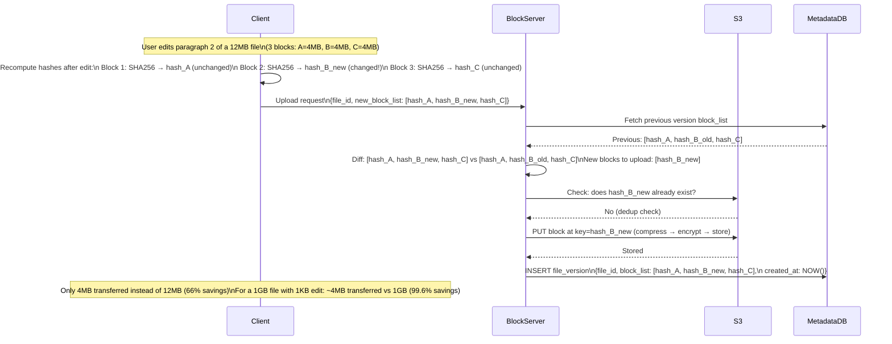
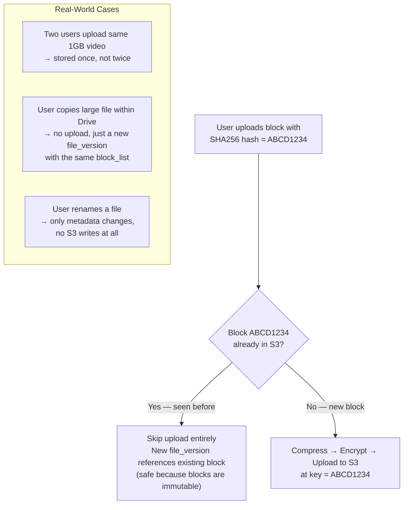
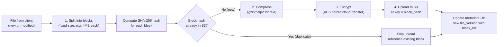
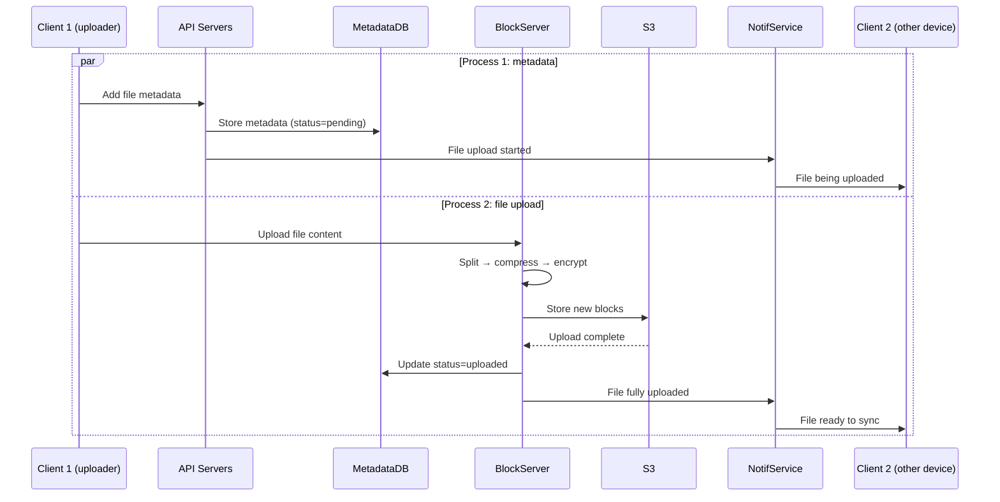
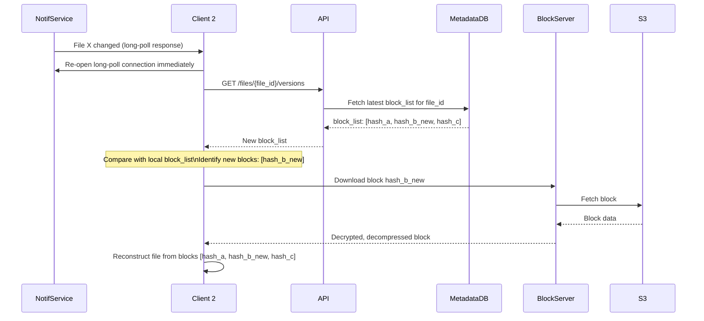
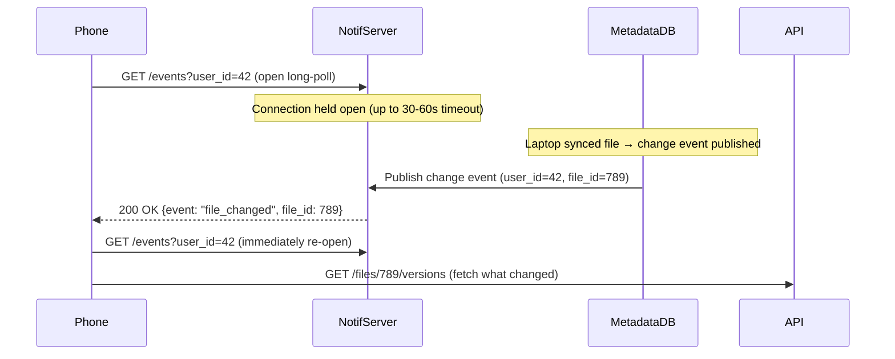

# Ch15: Design Google Drive

## What questions does this chapter answer?
- What is block-level storage, and why does it reduce sync bandwidth so dramatically?
- How does the block server pipeline (split → compress → encrypt → upload) work?
- How does delta sync determine which parts of a file to upload without transferring the whole file?
- What happens when the same file is edited on two offline devices and both try to sync?
- Why is long polling preferred over WebSocket for file-change notifications?
- How does deduplication work across users, and what is the metadata database schema?
- How does the system handle failures at every component level?

## Key Concepts

### Block-Level Storage and the Block Server Pipeline
Files are split into fixed-size blocks (typically 4MB each). Every block is identified by the SHA-256 hash of its content. The file is represented in the metadata layer as an ordered list of block hashes. This separation enables delta sync, deduplication, and versioning to all work together.

The **block server** does the heavy lifting for uploads. When a new file arrives, the block server:
1. **Splits** the file into blocks
2. **Compresses** each block using compression algorithms appropriate to file type (gzip/bzip2 for text; different algorithms for images and video)
3. **Encrypts** each compressed block before sending to cloud storage (security requirement)
4. **Uploads** only the blocks whose hashes don't already exist in the block table

This means blocks are immutable, content-addressable artifacts in S3. A given hash always refers to the same bytes, forever.

### Delta Sync
When a file changes, the block server computes hashes for all its blocks and compares them against the previous version's block list. Only blocks whose hashes changed are uploaded.

Example: A user edits one paragraph in a 12MB document (3 blocks of 4MB each). Only the one changed block is uploaded — a 66% bandwidth reduction. For large files with small edits, the savings are even more dramatic: editing 1KB in a 1GB file uploads only 4MB instead of 1GB — a 99.6% reduction.

After uploading changed blocks, the metadata service creates a new file version entry with the updated block list.

### Content-Addressable Storage and Deduplication
Storing blocks by content hash means identical content — regardless of who owns it or what file it lives in — is stored exactly once. If two users upload the same 1GB video, the system stores 1GB, not 2GB. When a block is uploaded, the server checks whether its hash already exists in the block table. If it does, no upload occurs; the new file version simply references the existing block entry. This is safe because blocks are immutable.

### Metadata Database Schema
The schema has five key tables:

| Table | Key Fields | Purpose |
|-------|-----------|---------|
| `user` | user_id, username, email, profile_photo | Basic user info |
| `device` | device_id, user_id, push_id | Device tokens for push notifications; one user can have multiple devices |
| `namespace` | namespace_id, user_id, path | Root directory per user |
| `file` | file_id, namespace_id, name, is_directory, last_modified | Latest file state; each file has one row |
| `file_version` | version_id, file_id, block_list (ordered), created_at | Version history; rows are read-only once written |
| `block` | block_id, block_hash, block_size, s3_key | Maps hash → S3 storage location |

A file of any version can be reconstructed by fetching all blocks in `file_version.block_list` order from S3.

### Strong Consistency Requirement
Unlike eventual consistency tolerated by many distributed systems, Google Drive requires **strong consistency**: a file saved on a laptop must immediately appear identically on the user's phone.

This has implications for the cache layer:
- Memory caches adopt eventual consistency by default — replicas may have different data
- To achieve strong consistency, caches must be **invalidated on every database write** (not updated — invalidated, so the next read reloads from the authoritative database)
- Relational databases (MySQL with ACID) are chosen because ACID is natively supported; NoSQL would require programmatically adding consistency logic

MySQL with master-slave replication provides the required consistency: writes go to master, caches are invalidated on write, reads go to slaves after cache invalidation propagates.

### Upload Flow (Parallel Operations)
The upload flow runs two processes in parallel:

**Process 1 — Add file metadata:**
1. Client sends request to add the file's metadata
2. Metadata DB stores the new record with status `pending`
3. Notification service is notified that a new file is being added
4. Notification service informs other devices of the user that an upload is in progress

**Process 2 — Upload file to block servers:**
1. Client uploads file content to block servers
2. Block servers split, compress, encrypt, and upload blocks to S3
3. S3 triggers an upload completion callback
4. Metadata DB status updated to `uploaded`
5. Notification service notified: file status is `uploaded`
6. Other devices receive the upload completion notification

### Download Flow
Download is triggered when a file is changed elsewhere. Two scenarios:

**Client is online**: the notification service informs the client that a file changed and a pull is needed. The client requests updated metadata from API servers, which fetch from the metadata DB. The client then downloads only the new/changed blocks from S3 via block servers.

**Client is offline**: changes are stored in the offline backup queue. When the client reconnects, it pulls all queued changes. The client downloads updated metadata and fetches only the blocks it doesn't already have locally (delta sync applies to downloads too).

### Sync Client Architecture (4 Components)
The client-side sync client has four decoupled components:
1. **Filesystem watcher**: monitors the local OS filesystem for changes (inotify on Linux, FSEvents on macOS)
2. **Block handler**: splits changed files into blocks, computes hashes, identifies which blocks need uploading
3. **API client**: communicates with backend servers for authentication, metadata operations, and file sharing
4. **Metadata syncer**: maintains a local copy of the metadata database and detects conflicts by comparing local version history against the server's current version

Decoupling is critical: a slow upload does not block the filesystem watcher from detecting new changes.

### Conflict Resolution: First-Write-Wins
When two devices edit the same file while both are offline, a conflict arises when both attempt to sync:
- The **first device to sync** is accepted as the new authoritative version
- When the **second device syncs**, the server detects that the base version it was editing is no longer current (the server now has a newer version from the first device)
- The second device's changes are saved as a **conflict copy** — a separate file named `report (conflicted copy - MacBook, 2024-05-21).pdf`
- The user sees both files and merges manually

Auto-merging binary files (PDFs, images, Word documents) is not attempted because it requires semantic understanding of the file format.

### Notification Service via Long Polling
When User A's laptop syncs a file, User A's phone must be told to pull the update. Two options:
- **Long polling** (chosen — Dropbox uses this): client holds an open HTTP connection; server responds immediately when an event occurs; client immediately re-opens a new connection after receiving a response
- **WebSocket**: persistent bidirectional connection

Long polling is chosen because:
1. Communication is **one-directional** — server notifies client, not vice versa
2. File sync events are **infrequent** — a few per hour, not per second
3. WebSocket overhead and complexity are not justified for low-frequency events

At scale (1 million concurrent users), each notification server holds ~1 million open long-poll connections (per Dropbox's 2012 engineering talk).

### Save Storage Space — Three Techniques
1. **De-duplicate data blocks**: identical blocks are stored once. Two blocks are identical if they have the same hash. Applied at the account level.

2. **Intelligent version retention**:
   - Set a maximum version count: if a file has 100 versions and the limit is 50, the oldest versions are discarded
   - Keep only valuable versions: a heavily edited document saved 1,000 times within an hour doesn't need all 1,000 versions — keep the most recent N and discard intermediates

3. **Cold storage**: files not accessed for months or years are moved to Amazon S3 Glacier (~$0.004/GB/month vs. S3 Standard's ~$0.023/GB/month — a 6x cost reduction). Retrieval takes minutes to hours, acceptable for archived files. Lifecycle policies handle migration automatically.

### Failure Handling at Every Component

| Component | Failure Strategy |
|-----------|-----------------|
| Load balancer | Active-passive pair with heartbeat monitoring; secondary activates on primary failure |
| Block server | Other block servers pick up pending/unfinished jobs |
| Cloud storage (S3) | Buckets replicated across multiple regions; if one region is unavailable, fetch from another |
| API server | Stateless — load balancer redirects to healthy instances |
| Metadata cache | Multiple replicas; failed node's traffic routes to healthy replica; replace failed node |
| Metadata DB master | Promote a slave to master; bring up new slave |
| Metadata DB slave | Route reads to healthy slave; bring up replacement |
| Notification service | 1M+ long-poll connections per server; if server fails, all connections are lost — clients detect disconnect and reconnect to a different server; reconnection is slow (gradual ramp-up) |
| Offline backup queue | Queues replicated multiple times; consumers re-subscribe to backup queue on primary failure |

### Delta Sync Algorithm — Step by Step
Delta sync identifies exactly which parts of a file changed without comparing raw bytes. The block hash list is the change fingerprint:



The savings scale with file size and edit size. The algorithm only needs to hash file blocks on the client — no byte-by-byte comparison required.

### Content Deduplication: Cross-User and Within-User


The immutability constraint is load-bearing for deduplication correctness. If blocks could be modified in place, a later upload could silently corrupt an earlier file that shared the same block.

### Strong Consistency via Cache Invalidation
Most distributed caches accept eventual consistency (replicas may lag behind writes). Google Drive cannot — a file edited on a laptop must appear identically on the phone immediately. The mechanism:

```mermaid
sequenceDiagram
    participant LaptopClient
    participant APIServer
    participant Redis as Redis Cache
    participant MySQL as MySQL Master
    participant Slave as MySQL Read Replica

    LaptopClient->>APIServer: Upload new version of report.pdf
    APIServer->>MySQL: INSERT file_version (block_list=[...], status=uploaded)
    MySQL->>Slave: Replicate (asynchronous — replica may lag briefly)
    
    APIServer->>Redis: DEL file:{file_id}:versions (INVALIDATE cache)
    Note over Redis: Cache entry removed — next read will go to DB

    APIServer-->>LaptopClient: 200 OK

    Note over APIServer,Slave: Phone opens app; requests latest version
    PhoneClient->>APIServer: GET /files/{file_id}/versions
    APIServer->>Redis: GET file:{file_id}:versions → cache MISS
    APIServer->>MySQL: SELECT from master (not replica)\nto guarantee reading the just-written version
    MySQL-->>APIServer: New block_list [hash_A, hash_B_new, hash_C]
    APIServer->>Redis: SET file:{file_id}:versions (warm cache)
    APIServer-->>PhoneClient: New block_list
```

The choice to **invalidate** (delete the cache entry) rather than **update** (write new data to cache) is deliberate: after invalidation, the next read is forced to go to the authoritative DB. This prevents any window where a stale cached value could be served. Reads after the invalidation go to the MySQL master until the replica catches up.

## Architecture Diagrams

### High-Level Google Drive Architecture
This diagram shows the three main service groups: block servers (handle raw file data, compress, encrypt, deduplicate, store in S3), API servers (metadata operations, authentication, sharing), and the notification service (pushes sync signals to all devices).

```mermaid
graph TD
    Laptop["Laptop Client\n(filesystem watcher + block handler)"] -->|"upload blocks"| BlockServer["Block Servers\n(split → compress → encrypt → deduplicate)"]
    Phone["Phone Client"] -->|"download blocks"| BlockServer

    BlockServer --> S3["S3\n(blocks stored by hash)"]

    Laptop -->|"metadata + auth"| LB["Load Balancer"]
    Phone -->|"metadata + auth"| LB
    LB --> API["API Servers\n(stateless)"]

    API --> MetadataDB["Metadata DB\n(MySQL master-slave sharded by user_id)"]
    API --> MetaCache["Metadata Cache\n(Redis — invalidated on write)"]

    API --> NotifService["Notification Service\n(long polling — 1M+ connections/server)"]
    NotifService --> Phone
    NotifService --> Laptop
    NotifService --> OfflineQueue["Offline Backup Queue\n(for offline devices)"]
```



### Block Server Processing Pipeline



### Parallel Upload Flow



### Download Flow When Notified of Change



The client only downloads blocks it doesn't already have locally — delta sync applies to downloads as well as uploads.

### Conflict Resolution Flow

```mermaid
sequenceDiagram
    participant Laptop
    participant Server
    participant Phone

    Note over Laptop,Phone: Both offline; both edit report.pdf (base version v2)

    Laptop->>Server: Sync (base=v2, new blocks for v3)
    Server->>Server: Server has v2 → no conflict
    Server-->>Laptop: Accepted as v3

    Phone->>Server: Sync (base=v2, new blocks for v3)
    Server->>Server: Server now has v3 (from laptop)\nPhone's base v2 is stale → CONFLICT
    Server->>Server: Save phone's version as conflict copy
    Server-->>Phone: "report (conflicted copy - iPhone, 2024-05-21).pdf" saved

    Note over Laptop,Phone: User sees both files\nmerges manually
```

### Notification via Long Polling



After receiving notification, the phone immediately re-opens a new long-poll connection to maintain continuity. The notification only says "something changed" — the phone makes a separate metadata fetch to learn what changed.

## Interview Questions

- "Design Google Drive / Dropbox." → Lead with block-level storage and delta sync — these are the core ideas. Cover: block server pipeline (split → compress → encrypt → upload with dedup), parallel upload flow (metadata + blocks simultaneously), conflict resolution (first-write-wins, conflict copies), notification service (long polling), metadata DB schema (file/file_version/block tables), strong consistency requirement (invalidate caches on write). Close with failure handling and cold storage.

- "How does editing a 1GB file on mobile sync efficiently?" → Block-level delta sync: file split into 4MB blocks; only blocks whose hashes changed are uploaded. Small text edit → typically one block (4MB) uploaded instead of 1GB — 99.6% bandwidth reduction.

- "What happens when two devices edit the same file simultaneously?" → First-write-wins: first device to sync becomes v3. Second device arrives with a v2-based edit — server detects stale base, saves second device's version as a conflict copy. User sees both files and merges manually.

- "Why long polling instead of WebSocket for sync notifications?" → File sync events are infrequent (a few per hour) and one-directional (server notifies client). WebSocket is for high-frequency bidirectional communication. Long polling handles infrequent events with simpler infrastructure.

- "How does deduplication work when two users upload the same file?" → Each block stored by its SHA-256 hash. When a block is uploaded, server checks if hash exists in the block table. If yes, no upload — the new file version references the existing block. Storage cost is O(unique content), not O(total uploads).

- "How do you handle a user who goes offline while a file is being synced to their device?" → Changes are stored in the offline backup queue. When the client reconnects, it polls for changes since its last-known version. The queue ensures no change is lost during offline periods.

## Related Chapters
- [Ch14 - YouTube](14-youtube.md) — both use S3 for blob storage and pre-signed URLs; YouTube uses GOP-aligned chunks, Drive uses content-hash blocks; Drive adds metadata versioning and sync conflict handling
- [Ch06 - Key-Value Store](06-kv-store.md) — the block table (hash → S3 key) is a key-value lookup; Redis provides the metadata cache; understanding KV store consistency informs the strong consistency requirement here
- [Ch01 - Scale from Zero to Millions](01-scale.md) — database replication, sharding, caching, CDN patterns that form the storage and metadata layer foundation
- [Ch12 - Chat System](12-chat-system.md) — both systems need to notify multiple devices when state changes; chat uses WebSocket (high frequency, bidirectional), Drive uses long polling (low frequency, one-directional)
