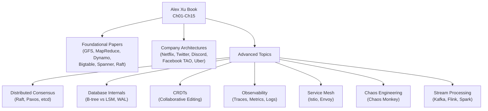
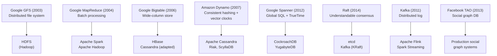

# Ch16: The Learning Continues

## What questions does this chapter answer?
- What should you study after completing this book to go from interview-ready to production-ready?
- Which foundational academic papers defined the distributed systems techniques used throughout this book?
- What real-world company architectures are worth studying, and what does each one teach?
- What advanced topics (consensus, CRDT, LSM trees, observability) distinguish senior engineers in system design discussions?
- How do you demonstrate depth in a system design interview beyond the standard patterns?

## Key Concepts

### Why Go Beyond the Book
The 15 chapters cover the most common interview patterns and the core vocabulary of distributed systems. But production systems are messier, deeper, and more nuanced. Going beyond the book closes the gap between "can answer interview questions" and "can design systems that survive contact with reality." The primary goal is to read foundational papers, study how real companies actually built their systems, and understand advanced trade-offs that most candidates cannot articulate.

### Distributed Consensus: Paxos and Raft
Consensus is the problem of getting a set of distributed nodes to agree on a single value — which node is the leader, whether a transaction is committed, what the current cluster configuration is. **Paxos** (1989) is the original, mathematically proven algorithm; it is notoriously difficult to understand and implement correctly. **Raft** (2014) was designed explicitly to be understandable: it separates leader election from log replication and defines clear invariants at each step. Raft is used in etcd (Kubernetes coordination), CockroachDB, and Kafka (from version 2.8). In an interview, saying "I'd use etcd backed by Raft rather than a single Redis instance" immediately signals production awareness.

### Database Internals: B-Trees vs. LSM Trees
Traditional relational databases (PostgreSQL, MySQL) use **B-trees**: balanced trees for sorted data, optimized for random reads and in-place updates. Modern NoSQL databases (Cassandra, RocksDB, HBase) use **LSM trees** (Log-Structured Merge trees): all writes go to an in-memory memtable, which flushes sequentially to disk as SSTables. Sequential writes are much faster than random writes, making LSM trees ideal for write-heavy workloads. Reads are slower (may check multiple SSTables) but mitigated by Bloom filters. Choosing between them is a deliberate engineering decision: LSM for time-series, event sourcing, logging; B-tree for OLTP, user profiles, random access patterns.

### CRDTs for Conflict-Free Collaboration
**Conflict-free Replicated Data Types (CRDTs)** are data structures designed so that concurrent updates from multiple replicas can always be merged deterministically without conflicts. Google Docs uses CRDTs (or Operational Transformation) for collaborative editing: two users typing simultaneously produce a merged result without manual conflict resolution. CRDTs include G-Counters (increment-only), Last-Write-Wins Registers, and OR-Sets (supports concurrent add and remove). CRDTs contrast sharply with the first-write-wins approach in Ch15 (Google Drive): CRDTs are for real-time collaborative text; block-level sync is for binary files where auto-merge is not possible.

### Chaos Engineering
**Chaos engineering** is the practice of deliberately injecting failures into production systems to verify they behave correctly under failure conditions. Netflix's **Chaos Monkey** randomly terminates production instances during business hours, forcing engineers to design for instance failure from the start. The insight is that you do not discover the real failure modes of a distributed system until it actually fails — chaos engineering surfaces them proactively under controlled conditions. In interviews, mentioning chaos experiments as part of a reliability strategy demonstrates that you think about systems beyond the happy path.

### Service Mesh
A **service mesh** is an infrastructure layer that handles service-to-service communication: load balancing, retries, circuit breaking, mutual TLS, and distributed tracing. A sidecar proxy (typically Envoy) runs alongside each service instance; all traffic flows through it. The control plane (Istio) configures all sidecars from a central location. The benefit is that reliability and observability features are applied uniformly without modifying application code — useful when operating dozens or hundreds of microservices.

### Observability
At scale, debugging requires more than logs. **Distributed tracing** (Jaeger, Zipkin, OpenTelemetry) attaches a trace ID to every request, propagating it across all service boundaries. Every service logs its span against the trace ID, allowing engineers to reconstruct the full request path and identify latency bottlenecks. **Structured logging** (JSON format) allows log aggregation systems to index and query logs as data. **Metrics** (Prometheus, Datadog) track numerical time-series (request rate, error rate, latency percentiles). A complete observability stack — traces + logs + metrics — is standard in production at any scale above a single service.

## Architecture Diagrams

### Study Roadmap: Chapters to Advanced Topics
This diagram maps the 15 core chapters to the advanced topics in Ch16. Completing the book gives you the vocabulary; the advanced topics give you the depth to reason about production tradeoffs.

Each branch in the advanced topics connects back to concepts already in the book. Distributed consensus underpins the leader election discussed in Ch05 and Ch06. LSM trees explain why Cassandra is chosen for write-heavy workloads in Ch11. CRDTs extend the conflict resolution discussion from Ch15.

### Foundational Papers: Influence Map
This diagram shows how the landmark distributed systems papers influenced the modern tools and databases covered throughout the book. Reading the original papers gives you the reasoning behind design decisions that appear as "facts" in the chapters.

GFS (2003) directly inspired the S3 architecture used throughout Chapters 14 and 15. Dynamo (2007) introduced consistent hashing, the concept taught in Chapter 5. Bigtable (2006) introduced the LSM tree storage model used by Cassandra, which appears as a storage choice across multiple chapters.

## Interview Questions

- "What's the difference between Paxos and Raft?" → Both solve distributed consensus. Raft was designed for understandability: it separates leader election from log replication and defines clear invariants at each phase. Paxos is more flexible but notoriously difficult to implement correctly. Raft is the practical choice in production (etcd, CockroachDB, Kafka KRaft).

- "When would you use an LSM tree database instead of a B-tree database?" → LSM trees for write-heavy workloads: time-series data, event logs, message storage (Cassandra, RocksDB). Sequential writes are much faster than B-tree's random in-place updates. B-trees for read-heavy OLTP with random access patterns (PostgreSQL, MySQL). The trade-off is write amplification vs. read amplification.

- "What is the CAP theorem, and does it matter in practice?" → CAP states that a distributed system can only guarantee two of three properties during a network partition: Consistency, Availability, Partition tolerance. In practice, partition tolerance is non-negotiable (networks always partition eventually). The real choice is between strong consistency (CP — refuse to serve stale data) and high availability (AP — serve potentially stale data). Most systems tune this trade-off per operation type rather than making a single global choice.

- "How would you validate that a distributed system actually handles failures correctly?" → Chaos engineering: deliberately inject failures (kill instances, introduce latency, drop packets) in production under controlled conditions. Verify that the system maintains its SLA during each failure mode. Chaos Monkey (random instance termination), chaos toolkits, and fault injection frameworks all operationalize this.

- "What is the Saga pattern, and when would you use it?" → Saga is a distributed transaction pattern for microservices. Each step in a workflow has a corresponding compensating transaction (undo). If step 3 fails, steps 1 and 2 are compensated by running their undo operations. Saga avoids two-phase commit's blocking and coordinator SPOF. Use Saga when you need distributed transactions across services that cannot share a single database.

## Study Roadmap: All Chapters in This Book

Use this as a reference to navigate the full guide. Each chapter builds on earlier concepts.

| Chapter | Topic | Core Concept |
|---------|-------|--------------|
| [Ch01 - Scale from Zero to Millions](01-scale.md) | Scaling fundamentals | Vertical vs. horizontal scaling, CDN, caching, databases |
| [Ch02 - Back-of-Envelope Estimation](02-estimation.md) | Scale estimation | QPS, storage, bandwidth estimation |
| [Ch03 - System Design Interview Framework](03-framework.md) | Interview process | Clarify → estimate → design → deep dive |
| [Ch04 - Rate Limiter](04-rate-limiter.md) | Traffic control | Token bucket, leaky bucket, sliding window |
| [Ch05 - Consistent Hashing](05-consistent-hashing.md) | Data partitioning | Hash ring, virtual nodes |
| [Ch06 - Key-Value Store](06-key-value-store.md) | Distributed storage | CAP theorem, eventual consistency, Dynamo model |
| [Ch07 - Unique ID Generator](07-unique-id.md) | ID generation | Snowflake IDs, clock skew |
| [Ch08 - URL Shortener](08-url-shortener.md) | Read-heavy systems | Hash functions, redirection, caching |
| [Ch09 - Web Crawler](09-web-crawler.md) | Distributed crawling | BFS, politeness, deduplication |
| [Ch10 - Notification System](10-notifications.md) | Push delivery | APNs, FCM, fanout |
| [Ch11 - News Feed](11-news-feed.md) | Social feed | Fanout-on-write vs. fanout-on-read |
| [Ch12 - Chat System](12-chat.md) | Real-time messaging | WebSocket, presence, message storage |
| [Ch13 - Search Autocomplete](13-search-autocomplete.md) | Typeahead | Trie, pre-computed top-k, debouncing |
| [Ch14 - YouTube](14-youtube.md) | Video platform | Transcoding DAG, adaptive bitrate, CDN |
| [Ch15 - Google Drive](15-google-drive.md) | File sync | Block-level storage, delta sync, conflict resolution |

## What to Study Next (Beyond This Book)

**Books**
- *Designing Data-Intensive Applications* by Martin Kleppmann — the definitive deep dive into distributed data systems; covers everything in this book at twice the depth
- *Database Internals* by Alex Petrov — B-trees, LSM trees, WAL, consensus protocols from first principles

**Papers** (in reading order)
1. Google GFS (2003) — distributed file system foundations
2. Google MapReduce (2004) — batch processing model
3. Amazon Dynamo (2007) — consistent hashing, vector clocks, availability-first design
4. Google Bigtable (2006) — wide-column store, LSM trees
5. Raft (2014) — consensus made understandable
6. Google Spanner (2012) — global SQL, TrueTime

**Blogs and Resources**
- High Scalability (highscalability.com) — real architecture write-ups from companies
- Netflix Tech Blog, Uber Engineering, Stripe Blog, Airbnb Engineering
- System Design Primer (GitHub) — open-source reference with diagrams

## Related Chapters
- [Ch01 - Scale from Zero to Millions](01-scale.md) — the starting point; all subsequent chapters build on the scaling vocabulary established here
- [Ch06 - Key-Value Store](06-key-value-store.md) — introduces CAP theorem and eventual consistency, foundational for understanding Dynamo and Cassandra
- [Ch15 - Google Drive](15-google-drive.md) — the most complex chapter in the book; revisiting it after studying the foundational papers reveals the Dynamo-inspired design choices throughout
