# System Design — Fundamentals

---

## What is System Design?

The process of defining the architecture, components, and interactions of a system to satisfy given requirements. In interviews, it's how you show you can think at scale — not just "make it work", but "make it work for millions of users."

> **Connects to:** [Functional vs Non-Functional Requirements](#what-is-functional-and-non-functional-requirements) — requirements are the starting point of every design decision.

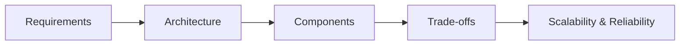

---

## What is Functional and Non-Functional Requirements?

> Source: [Hello Interview — Delivery Framework](https://www.hellointerview.com/learn/system-design/in-a-hurry/delivery)

### Functional Requirements

What the system **must do** — expressed as _"Users/Clients should be able to..."_ statements.

- Prioritize ruthlessly: pick the **top 3 features** that matter most
- Involve the interviewer: ask clarifying questions like you would a product manager

**Example — Twitter:**
- Users should be able to post tweets
- Users should be able to follow other users
- Users should be able to see a feed of tweets from followed users

**Example — Cache System:**
- Clients should be able to insert items
- Clients should be able to set expirations
- Clients should be able to read items

### Non-Functional Requirements

How well the system should perform — expressed as _"The system should be..."_ statements. **Always quantify when possible.**

| Quality | Vague | Quantified |
|---------|-------|------------|
| Latency | low latency | < 200ms p99 |
| Availability | highly available | 99.99% uptime |
| Scale | handles many users | 100M DAU |

**Evaluation checklist:**
1. CAP Theorem — consistency vs. availability?
2. Environment constraints — mobile, bandwidth, memory?
3. Scalability — read/write ratio, traffic spikes?
4. Latency — which operations are time-sensitive?
5. Data durability — can we afford to lose data?
6. Security & compliance needs
7. Fault tolerance expectations

**Example — Twitter:**
- The system should be **highly available**, prioritizing availability over consistency
- The system should scale to **100M+ DAU**
- Feed should render in **< 200ms**

> **Connects to:** [Scalability](#what-is-scalability) for scale requirements, [High Availability](#how-would-you-ensure-high-availability) for availability, [CAP Theorem](../databases/questions.md) for consistency trade-offs.

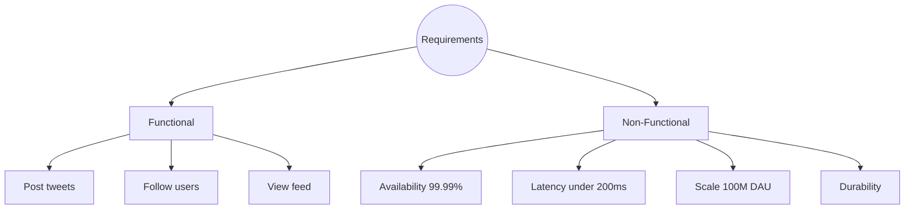

---

## What is Scalability?

The ability of a system to handle increasing load — more users, more requests, more data — without degrading performance.

Two dimensions:
- **Horizontal scaling (scale out):** add more machines → see [Vertical vs Horizontal Scaling](#vertical-scaling-vs-horizontal-scaling)
- **Vertical scaling (scale up):** make machines bigger

> **Connects to:** [Load Balancer](#explain-load-balancer) — required to distribute load across horizontal replicas. [Sharding](#diff-between-sharding-and-replication) — scales the database layer.

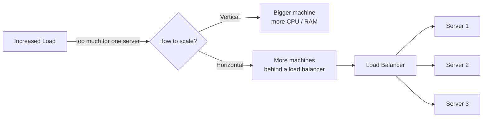

---

## Vertical Scaling vs Horizontal Scaling

| | Vertical (Scale Up) | Horizontal (Scale Out) |
|-|---------------------|------------------------|
| How | Bigger machine (more CPU, RAM) | More machines |
| Limit | Hardware ceiling | Virtually unlimited |
| Cost | Expensive at high end | More predictable |
| Downtime | Often requires restart | Zero downtime possible |
| Complexity | Simple | Requires load balancer, distributed state |

> **Connects to:** [Load Balancer](#explain-load-balancer) — mandatory for horizontal scaling. [Sharding](#diff-between-sharding-and-replication) — databases need sharding when vertical scaling of the DB hits its ceiling. [Non-Functional Requirements](#what-is-functional-and-non-functional-requirements) — scale targets (100M DAU) determine which strategy to use.

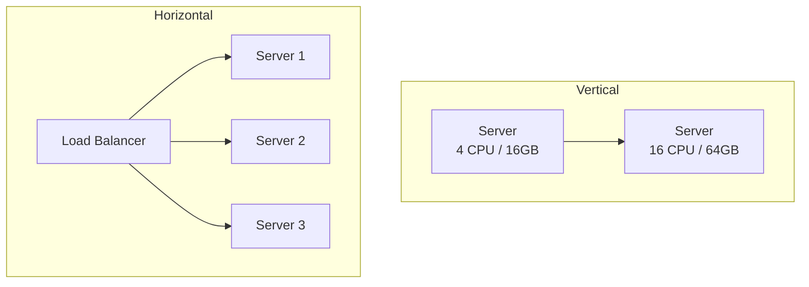

---

## Explain Load Balancer

Distributes incoming traffic across multiple servers to improve scalability and availability. Prevents any single server from being overwhelmed. If a server fails, the load balancer stops sending traffic to it.

**Common algorithms:**
- **Round Robin** — each server gets requests in turn
- **Least Connections** — sends to the server with fewest active connections
- **IP Hash** — same client always hits the same server (useful for session stickiness)

> **Connects to:** [Scalability](#what-is-scalability) — horizontal scaling requires a load balancer. [Stateless vs Stateful](#stateless-vs-stateful) — stateless apps allow true round-robin without session pinning. [API Gateway](#what-is-api-gateway-vs-load-balancer) — gateway sits above the load balancer in a microservice stack.

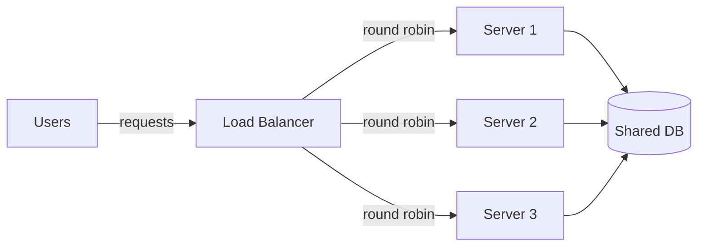

---

## Stateless vs Stateful

| | Stateless | Stateful |
|--|-----------|---------|
| Session data | Not stored on server | Stored on server |
| Scaling | Easy — any instance handles any request | Hard — client must hit same instance |
| Failure recovery | Any replica takes over | Session lost if instance dies |
| Example | REST APIs, CDN | WebSockets, game servers |

**Making stateful systems stateless:** offload session state to an external store (Redis, DynamoDB). Each server reads from the store — no pinning required.

> **Connects to:** [Load Balancer](#explain-load-balancer) — stateless apps allow true round-robin. [Cache](#what-is-cache) — Redis is the standard solution to externalize session state.

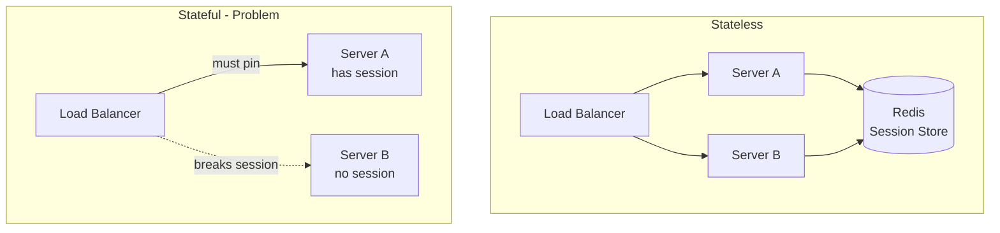

---

## What is Redundancy?

Having backups of critical components so the system never depends on a single point. If one fails, another takes over without downtime.

**Example:** Two database instances running the same data. If the primary crashes, the secondary is already up-to-date and ready.

> **Connects to:** [Failover](#what-is-failover) — redundancy makes failover possible. [Replication](#diff-between-sharding-and-replication) — the mechanism that keeps replicas in sync.

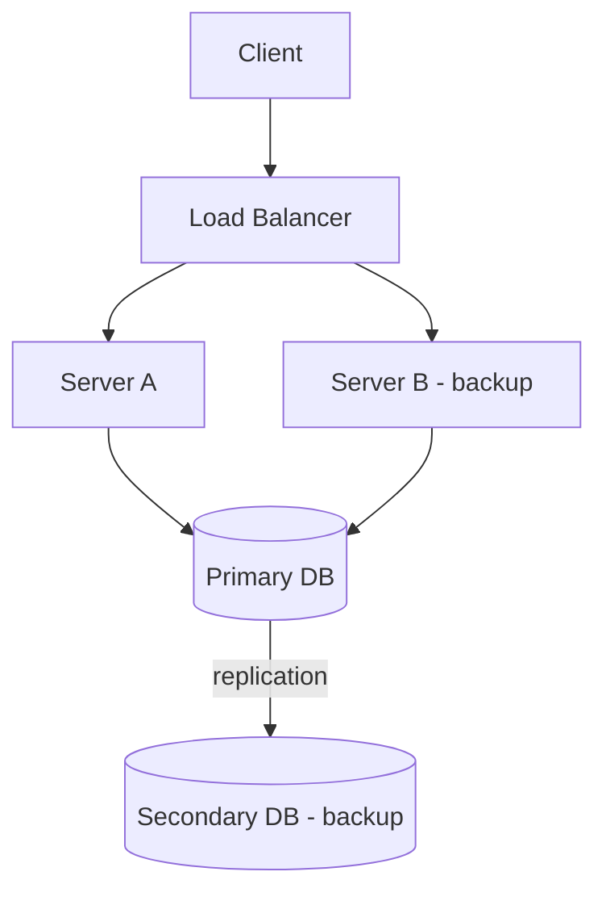

---

## Diff between Sharding and Replication?

Both are database scaling strategies, but they solve different problems.

### Replication — for **availability and read throughput**

Copy the same data to multiple nodes. Primary handles writes; replicas serve reads. If primary fails → failover to replica.

### Sharding — for **write throughput and storage**

Split data across multiple nodes (shards). Each shard owns a subset of the data (e.g., by user ID range or hash).

| | Replication | Sharding |
|--|-------------|---------|
| Problem solved | Read scale + availability | Write scale + storage |
| Data per node | Full copy | Partial (its shard only) |
| Failure impact | Failover available | Shard loss = data loss (mitigated with replication per shard) |
| Complexity | Low | High (routing, resharding, hotspots) |

> **Connects to:** [Redundancy](#what-is-redundancy) and [Failover](#what-is-failover) — replication enables both. [High Availability](#how-would-you-ensure-high-availability) — replication is a pillar of HA.

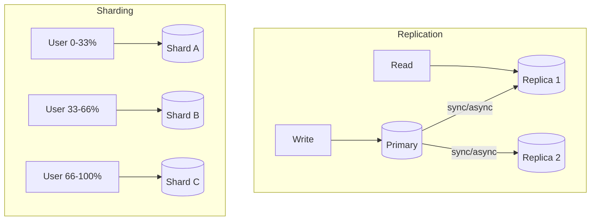

---

## What is Failover?

The process where the system automatically switches from a failed component to its backup, with no manual intervention required.

**Example:** Primary database crashes → health check detects failure → traffic is rerouted to the secondary in seconds.

> **Connects to:** [Redundancy](#what-is-redundancy) — requires redundant components to fail over to. [Multi-AZ](#multi-az-multi-availability-zone) — AZ-level failover uses DNS. [High Availability](#how-would-you-ensure-high-availability) — failover is a core HA mechanism.

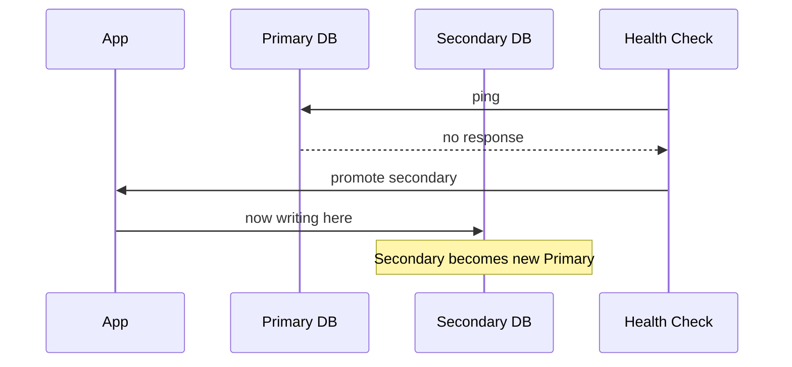

---

## What is Cache? Cache Invalidation, Eviction, and TTL

A cache stores the result of expensive operations (DB queries, API calls, computations) in fast memory so future requests skip the expensive step.

**Benefits:**
- Dramatically lower latency (memory vs disk/network)
- Reduced load on databases
- Higher throughput per dollar

### Cache Patterns

| Pattern | How it works | Use case |
|---------|-------------|----------|
| Cache-aside | App checks cache first, writes on miss | General reads |
| Write-through | Write to cache and DB together | Strong consistency |
| Write-behind | Write to cache, async flush to DB | High write throughput |
| Read-through | Cache fetches from DB on miss automatically | Simplified reads |

### Eviction Policies

When cache is full, something must be removed:
- **LRU** (Least Recently Used) — remove the least recently accessed item
- **LFU** (Least Frequently Used) — remove the least accessed overall
- **FIFO** — remove the oldest inserted item

### TTL (Time to Live)

Each entry expires after a set duration. Prevents serving stale data indefinitely.

### Cache Invalidation

The hard problem: when the source data changes, how do you update/remove the cached version?
- **TTL-based** — accept some staleness, let it expire
- **Event-driven** — on DB write, explicitly delete/update cache entry
- **Cache-aside write** — invalidate on write, re-populate on next read

> **Connects to:** [CDN](#what-is-cdn) — CDNs are distributed caches. [Stateless vs Stateful](#stateless-vs-stateful) — Redis cache enables stateless services. [Replication](#diff-between-sharding-and-replication) — cache reduces read load that replication tries to solve.

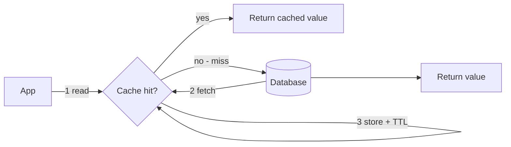

---

## What is CDN? When should we use it?

A **Content Delivery Network** is a geographically distributed network of edge servers that cache static content closer to users.

**When to use:**
- Serving static assets: images, JS, CSS, videos
- Global user base with latency requirements
- Reducing origin server load

**How it works:** User requests an asset → CDN edge checks cache → if miss, fetches from origin and caches → subsequent users in the same region get cached response.

> **Connects to:** [Cache](#what-is-cache) — CDN is effectively a geographically distributed cache layer. [Non-Functional Requirements](#what-is-functional-and-non-functional-requirements) — latency < 200ms often requires a CDN.

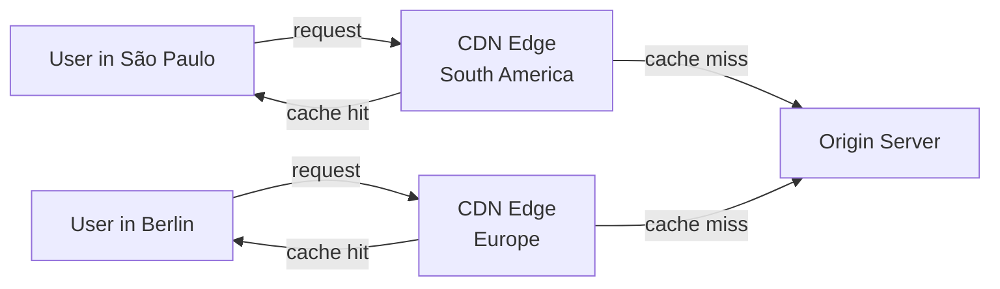

---

## Multi-AZ (Multi Availability Zone)

Deploying your infrastructure across multiple data centers (AZs) within a cloud region. If one AZ has a power outage or network failure, others remain unaffected.

**Multi-AZ vs Multi-Region:**
| | Multi-AZ | Multi-Region |
|--|----------|-------------|
| Scope | Same city/region | Different continents |
| Latency between nodes | ~1-5ms | ~100ms+ |
| Use case | High availability | Disaster recovery + global latency |
| Cost | Medium | High |

> **Connects to:** [Redundancy](#what-is-redundancy) and [Failover](#what-is-failover) — Multi-AZ is the physical implementation of redundancy. [DNS](#dns-domain-name-system) — DNS routes traffic away from a failed AZ/region.

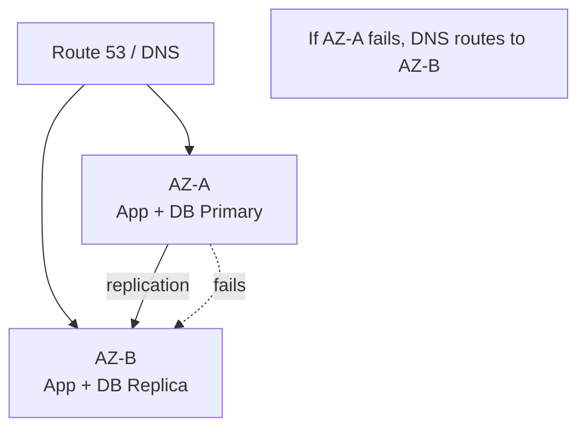

---

## DNS (Domain Name System)

DNS translates human-readable domain names (e.g., `twitter.com`) into IP addresses that routers understand.

**In system design, DNS also enables:**
- **Failover routing** — route traffic to a secondary region if primary is down
- **Latency-based routing** — send users to the nearest region
- **Weighted routing** — canary deployments (e.g., 5% of traffic to new version)

> **Connects to:** [Multi-AZ / High Availability](#how-would-you-ensure-high-availability) — DNS failover is the top-level switch for disaster recovery. [CDN](#what-is-cdn) — CDN edge resolution happens via DNS.

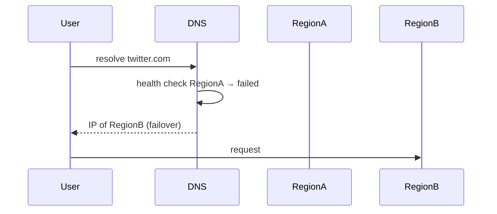

---

## How would you ensure High Availability?

Eliminate single points of failure at every layer of the stack.

**Strategy:**
1. Multiple app instances behind a load balancer
2. Database primary/secondary replication with automatic failover
3. Multi-AZ (or multi-region) deployment for disaster recovery
4. Health checks + circuit breakers to isolate failures fast
5. CDN for static content — offloads origin and survives partial failures

> **Connects to:** [Redundancy](#what-is-redundancy), [Failover](#what-is-failover), [Replication](#diff-between-sharding-and-replication), [Multi-AZ](#multi-az-multi-availability-zone), [Load Balancer](#explain-load-balancer) — HA is the combination of all these concepts working together.

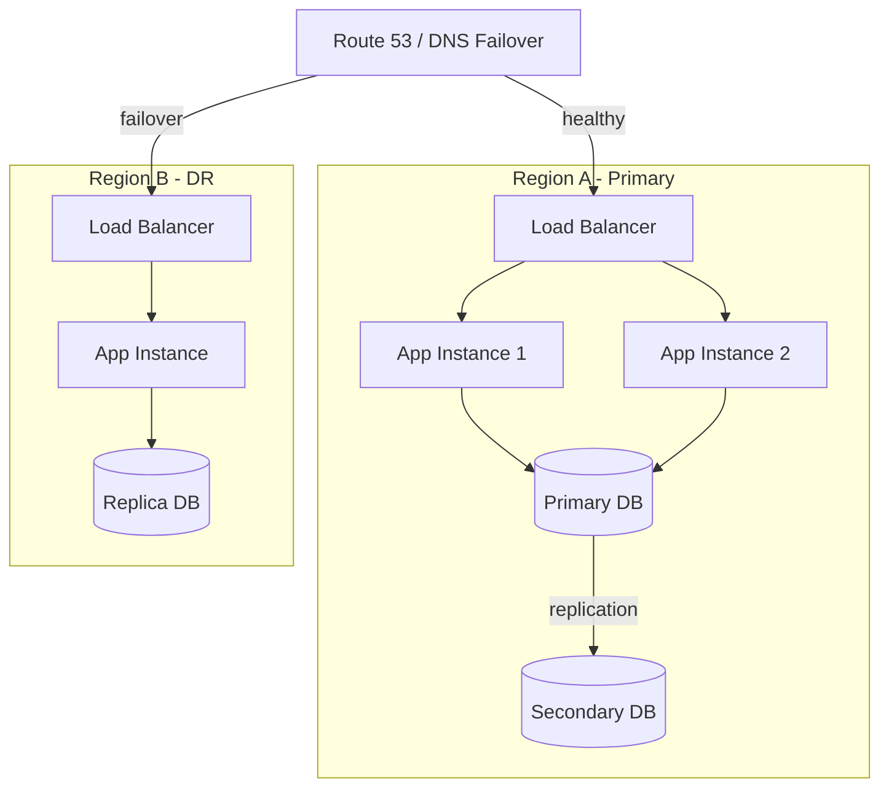

---

## What is Monolithic Architecture vs Microservices? When to use each?

### Monolithic

All features run in a single deployable unit — one codebase, one process, one database.

**When to use:**
- Early-stage product (speed of development > scale)
- Small team (< 10 engineers)
- Domain is not well understood yet

### Microservices

Each feature/domain is an independent service with its own deployment and (often) its own database.

**When to use:**
- Different parts of the system need to scale independently
- Teams are large and need autonomy
- Services have very different reliability/latency requirements

### Trade-offs

| | Monolithic | Microservices |
|--|------------|---------------|
| Deployment | One artifact | Many artifacts |
| Scalability | Scale everything | Scale per service |
| Complexity | Low | High (networking, observability) |
| Data | Single DB | DB per service |
| Failure blast radius | High | Contained |
| Team autonomy | Low | High |

> **Connects to:** [Message Queue](#whats-message-queue) — microservices communicate asynchronously via queues. [API Gateway](#what-is-api-gateway-vs-load-balancer) — the single entry point for a microservice ecosystem.

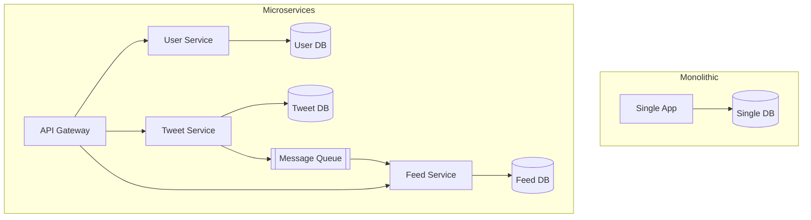

---

## What's a Message Queue? Where should we use it?

A message queue is a buffer that decouples producers (who generate work) from consumers (who process it). Producers push messages; consumers pull and process at their own pace.

**When to use:**
- **Async processing** — sending emails, generating thumbnails, notifications
- **Traffic spike absorption** — queue fills up; consumers process steadily
- **Microservice decoupling** — services don't call each other directly
- **Guaranteed delivery** — messages persist until acknowledged

**Examples:** SQS, Kafka, RabbitMQ

> **Connects to:** [Microservices](#what-is-monolithic-architecture-vs-microservices) — primary communication mechanism between services. [Scalability](#what-is-scalability) — buffers bursts without overloading downstream services.

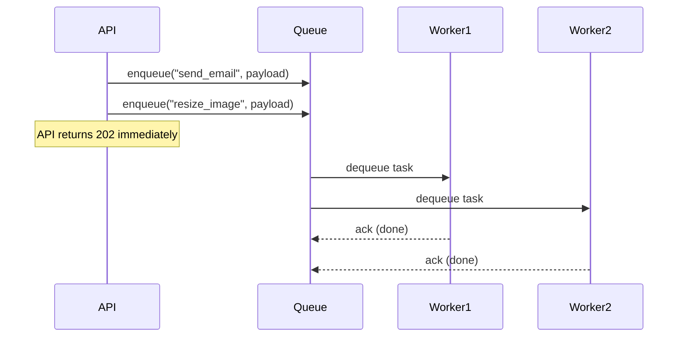

---

## What is API Gateway vs Load Balancer?

Both sit in front of your services, but they serve different purposes.

| | Load Balancer | API Gateway |
|--|--------------|-------------|
| Purpose | Distribute traffic evenly | Route, transform, and control API requests |
| Layer | L4 (TCP) or L7 (HTTP) | L7 (HTTP/REST/gRPC) |
| Features | Health checks, round robin | Auth, rate limiting, request routing, SSL termination |
| Awareness | Which server? | Which endpoint/service? |

**Rule of thumb:** Load balancer = traffic distribution. API Gateway = smart front door for a microservice ecosystem.

> **Connects to:** [Microservices](#what-is-monolithic-architecture-vs-microservices) — API gateway is the standard entry point. [Load Balancer](#explain-load-balancer) for traffic distribution detail.

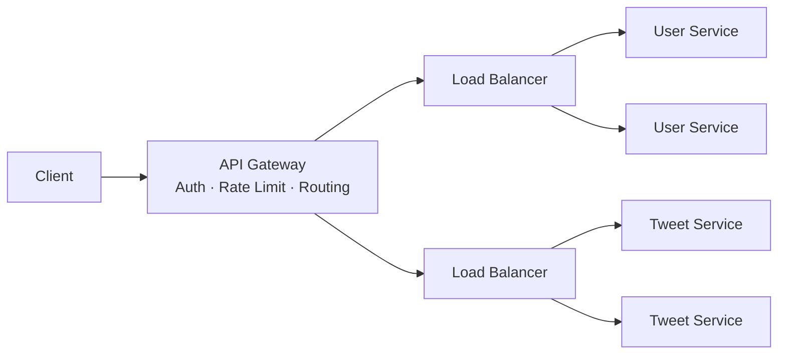

---

## Web Application Firewall (WAF)

A WAF inspects HTTP traffic between clients and your web application, blocking malicious requests before they reach your servers.

**What it protects against:**
- SQL Injection
- XSS (Cross-Site Scripting)
- DDoS at the application layer (L7)
- Bot scraping and credential stuffing

**Where it sits:** Between the CDN/internet and your API Gateway or Load Balancer.

> **Connects to:** [API Gateway](#what-is-api-gateway-vs-load-balancer) — WAF sits upstream of the gateway. [Non-Functional Requirements](#what-is-functional-and-non-functional-requirements) — security is a key non-functional requirement.

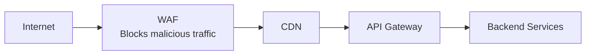

---

## Concept Map — How Everything Connects

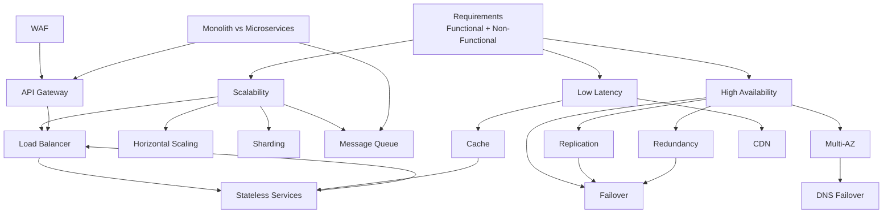
