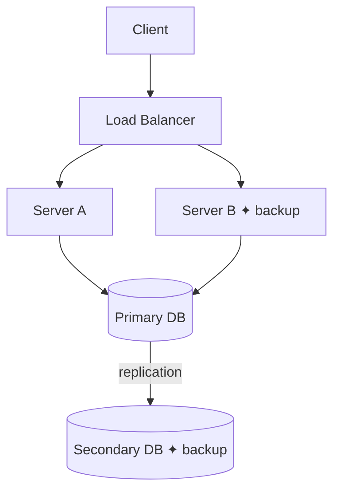
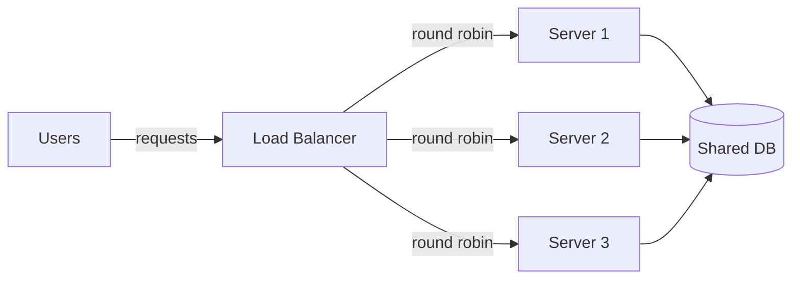
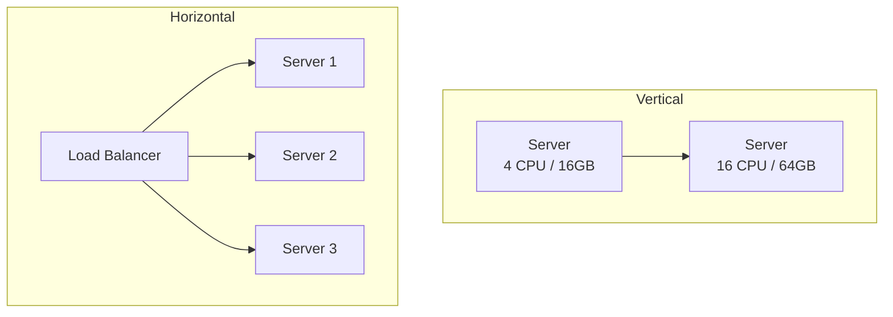
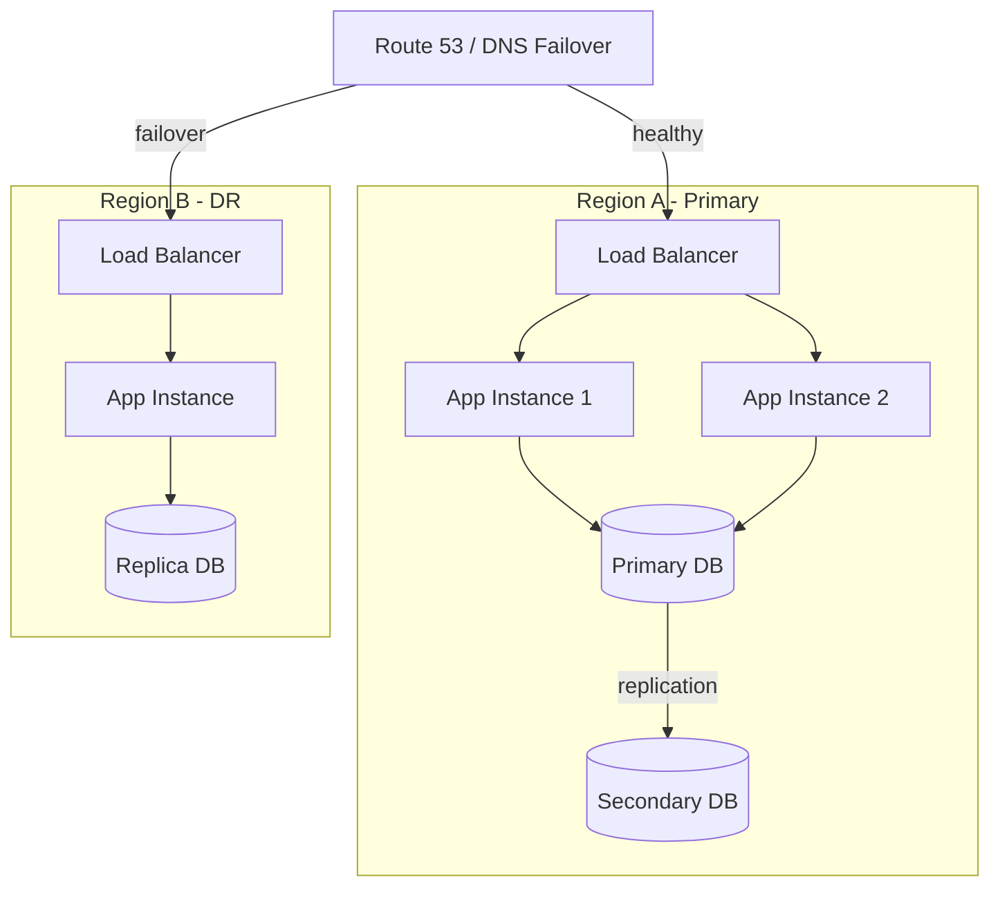

# System Design — Fundamentals

[← System Design Index](../README.md)

---

## What is redundancy?

Having backups of critical components so the system never depends on a single point. If one fails, another takes over without downtime.

**Example:** Two database instances running the same data. If the primary crashes, the secondary is already up-to-date and ready.

---

## What is failover?

The process where the system automatically switches from a failed component to its backup, with no manual intervention required.

**Example:** Primary database crashes → health check detects failure → traffic is rerouted to the secondary in seconds.

---

## Explain load balancer

Distributes incoming traffic across multiple servers to improve scalability and availability. Prevents any single server from being overwhelmed. If a server fails, the load balancer stops sending traffic to it.

**Common algorithms:**
- **Round Robin** — each server gets requests in turn
- **Least Connections** — sends to the server with fewest active connections
- **IP Hash** — same client always hits the same server (useful for session stickiness)

---

## Vertical Scaling vs Horizontal Scaling

| | Vertical (Scale Up) | Horizontal (Scale Out) |
|-|---------------------|------------------------|
| How | Bigger machine (more CPU, RAM) | More machines |
| Limit | Hardware ceiling | Virtually unlimited |
| Cost | Expensive at high end | More predictable |
| Downtime | Often requires restart | Zero downtime possible |
| Complexity | Simple | Requires load balancer, distributed state |

---

## How would you ensure high availability?

Eliminate single points of failure at every layer of the stack.

**Strategy:**
1. Multiple app instances behind a load balancer
2. Database primary/secondary replication with automatic failover
3. Multi-AZ (or multi-region) deployment for disaster recovery
4. Health checks + circuit breakers to isolate failures fast

