# Ch10: Design a Notification System

## What questions does this chapter answer?
- How does a notification system support iOS push, Android push, SMS, and email through a single architecture?
- Why must message queues sit between notification servers and third-party providers like APNs and FCM?
- How do you guarantee at-least-once delivery while preventing duplicate notifications?
- How do user preferences and rate limiting prevent notification spam?
- What happens when APNs or FCM is temporarily unavailable?
- How do notification templates, event tracking, and monitoring make the system operationally complete?

## Key Concepts

### Notification Channels and Third-Party Providers
A notification system must support four distinct delivery channels, each backed by a different third-party provider:

**iOS push notification** requires three components:
- **Provider**: your server builds the notification payload (device token + JSON payload) and sends it to APNs
- **APNs** (Apple Push Notification Service): Apple's remote service that propagates push notifications to iOS devices
- **iOS Device**: receives the push notification

Example iOS notification payload:
```json
{
  "aps": {
    "alert": {
      "title": "Game Request",
      "body": "Bob wants to play chess"
    },
    "badge": 9
  }
}
```

**Android push notification**: Same pattern, but uses **Firebase Cloud Messaging (FCM)** instead of APNs.

**SMS message**: Third-party services like Twilio, Nexmo, or Amazon SNS handle SMS delivery. High deliverability, but costs per message.

**Email**: SendGrid, Mailchimp, or Amazon SES handle spam filtering, delivery tracking, and templates. Better deliverability than self-hosted email servers.

Your service never communicates directly with end-user devices; it hands off to these providers, which handle last-mile delivery.

### Contact Info Gathering Flow
To send notifications, the system must first collect contact information:
- When a user installs the app or signs up, the API server collects device tokens (for push), phone numbers (for SMS), and email addresses
- This data is stored in two tables:
  - `user` table: email address, phone number
  - `device` table: device_id, user_id, device_token (push_id)
- A user can have multiple devices — a notification may be sent to all of them simultaneously

### Why Message Queues Are Essential (Three Problems Without Them)
A single notification server without queues has three critical problems:
1. **Single point of failure (SPOF)**: one server means the whole system fails if it crashes
2. **Hard to scale**: notification processing (rendering HTML, waiting for third-party responses) is resource-intensive; scaling databases, caches, and processing components independently is impossible with a monolith
3. **Performance bottleneck**: during peak hours, processing all notifications on one system causes overload

### Message Queue Architecture
The solution: insert a message queue between notification servers and delivery workers, with a **separate queue per channel**:

```
Service A/B/N → Notification Servers → [iOS Queue | Android Queue | SMS Queue | Email Queue]
                                                    ↓              ↓             ↓            ↓
                                              iOS Workers   Android Workers  SMS Workers  Email Workers
                                                    ↓              ↓             ↓            ↓
                                                 APNs            FCM         Twilio       SendGrid
```

Benefits:
- iOS workers can fail without affecting email delivery
- Each channel scales its worker pool independently
- Messages survive worker crashes — they remain in the queue until consumed
- Providers can be swapped without changing notification servers

The notification server flow:
1. Receives API call from triggering service (billing, booking, marketing)
2. Fetches metadata (user info, device tokens, notification settings) from cache/DB
3. Sends notification event to the appropriate channel queue
4. Returns immediately — no blocking on delivery

### At-Least-Once Delivery and Deduplication
Every notification is saved to a database with status `pending` before the worker attempts to send it. After a successful provider response, the status is updated to `sent`. If a worker crashes mid-delivery, the notification remains `pending` and another worker retries it — **at-least-once delivery**.

This introduces the risk of duplicate sends. To prevent duplicates reaching the user, each notification event is assigned a unique **event ID**. Before sending, the worker checks whether this event ID has already been processed (in a Redis SET or processed-events table). If yes, the send is skipped. This converts at-least-once to effectively exactly-once from the user's perspective.

### Notification Templates
A large notification system sends millions of notifications daily. Many follow similar formats. **Notification templates** avoid building every notification from scratch:

```
BODY: You dreamed of it. We dared it. [ITEM NAME] is back — only until [DATE].
CTA:  Order Now. Or, Save My [ITEM NAME]
```

Templates provide:
- **Consistent format** across all notifications of a type
- **Reduced margin for error** — parameterized templates are safer than ad-hoc strings
- **Time savings** — engineers configure parameters rather than writing full notification content

### Notification Settings (User Preferences)
Users receive too many notifications and can easily feel overwhelmed. Fine-grained opt-out control is stored in a notification settings table:

```
user_id    bigInt
channel    varchar  -- "push", "sms", "email"
opt_in     boolean
```

Before any notification is sent, the notification server checks these settings and **silently discards** the notification for any channel where the user has opted out. This check happens before the message enters the queue — no wasted queue space or worker CPU for notifications that will be discarded.

Respecting opt-outs is not optional:
- CAN-SPAM (email) and GDPR impose legal obligations
- APNs and FCM actively throttle or ban providers with too many spam reports

### Rate Limiting
Even when a user has opted in, enforce per-user send-rate limits to prevent overwhelming them. Example limits: 20 push notifications per user per day, 5 SMS per user per day, 3 marketing emails per user per week. Rate limits also protect against provider bans — APNs and FCM throttle providers that send at excessive rates. Rate limit state is tracked in Redis counters with TTL.

### Retry with Exponential Backoff
When a provider call fails, the worker retries with exponential backoff: wait 1s, then 2s, then 4s, up to a configured maximum. If all retries are exhausted, the notification is moved to a **Dead Letter Queue (DLQ)** and an alert fires to on-call engineers.

Why exponential backoff specifically: retrying immediately often hits the same transient error. Doubling the wait gives providers time to recover from temporary outages without hammering them.

### Security: AppKey and AppSecret
For iOS and Android apps, **appKey** and **appSecret** are used to secure push notification APIs. Only authenticated and verified clients are allowed to send push notifications using the API. This prevents unauthorized services from abusing the notification infrastructure.

### Monitoring Queued Notifications
A key operational metric: the **total number of queued notifications**. If this number grows, notification events are not being processed fast enough by workers. Alert threshold: if queue depth exceeds X, add more workers automatically (autoscaling) or page on-call. Without this monitoring, a silent provider outage or worker crash can cause notification delays of hours that engineers don't discover until users complain.

### Event Tracking
Notification metrics drive product decisions:
- **Open rate**: percentage of push notifications tapped by users
- **Click rate**: percentage of email notifications where the user clicked a link
- **Engagement metrics**: downstream actions taken after notification (purchases, page visits)

An analytics service captures these events. Integration between the notification system and the analytics service typically requires:
- Tracking pixels in emails (HTTP request on open)
- Click-through URLs that redirect through the analytics service
- SDK callbacks in mobile apps when a push notification is tapped

### Device Token Lifecycle
Device tokens are not permanent. When a user uninstalls the app:
- APNs returns `410 Gone` when a notification is sent to the invalid token
- FCM returns `registration-token-not-registered`

Workers must detect these responses and **immediately delete** the invalid token from the device table to prevent wasting resources on future sends. Failing to clean up stale tokens degrades deliverability metrics and wastes compute.

### Notification Lifecycle State Machine
Every notification travels through a defined set of states from creation to final user interaction. Tracking these states enables debugging, retry logic, and product analytics:

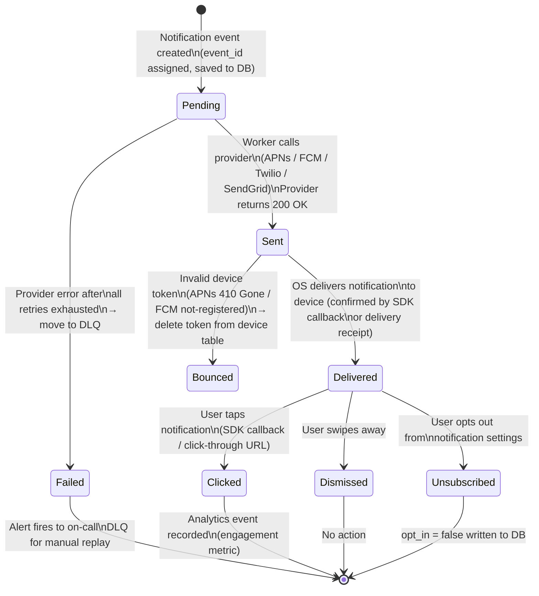

State transitions are the basis for product metrics: sent-to-delivered rate tells you provider health; delivered-to-clicked is the engagement metric; delivered-to-unsubscribed signals spam fatigue.

### Per-Channel Communication Protocols
Each delivery channel has a different protocol and payload format. Workers must implement each separately.

#### iOS (APNs) Communication
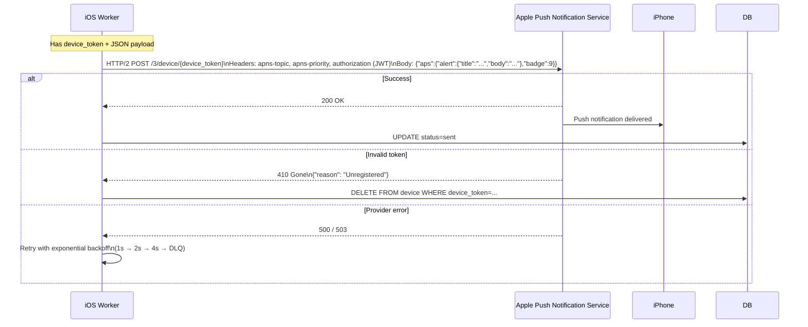

APNs uses HTTP/2 with a persistent connection — workers maintain a connection pool to avoid TLS handshake overhead on every notification.

#### Android (FCM) Communication
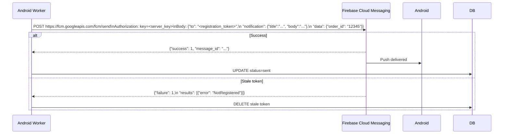

FCM supports two message types: **notification messages** (displayed automatically by the OS) and **data messages** (delivered silently to the app for custom handling). The payload structure differs for each.

#### SMS (Twilio) Communication
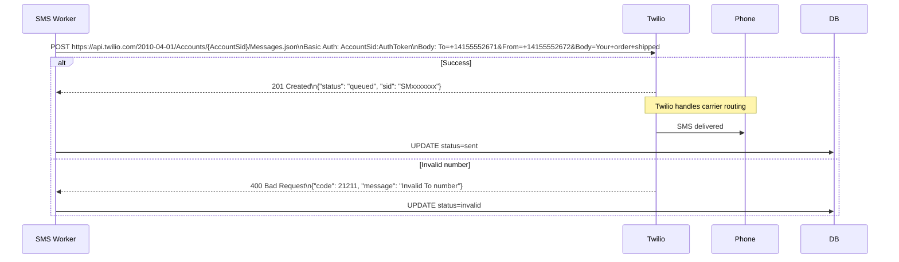

SMS has per-message cost and regulatory constraints (TCPA in the US, GDPR in EU). Workers must not retry SMS blindly — delivery failure codes must distinguish transient errors from permanent ones (invalid number = never retry).

#### Email (SendGrid) Communication
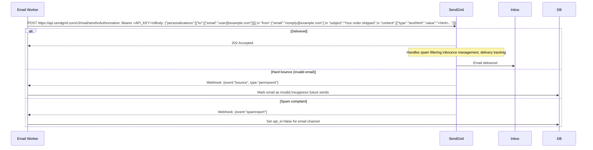

Email uses **webhooks** (not synchronous responses) for delivery confirmation. Workers must expose an endpoint to receive these async callbacks from SendGrid and update the notification log accordingly.

## Architecture Diagrams

### High-Level Notification System Architecture (Improved)
This diagram shows the full flow from triggering services through queues and workers to third-party providers, including the authentication, rate-limiting, and monitoring components added in the improved design.

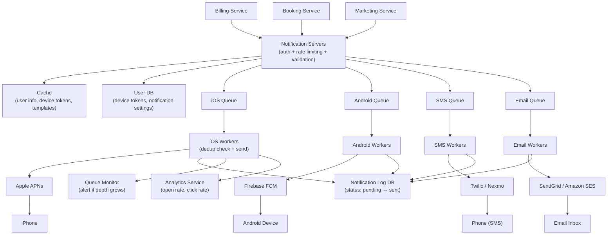

### Contact Info Gathering Flow

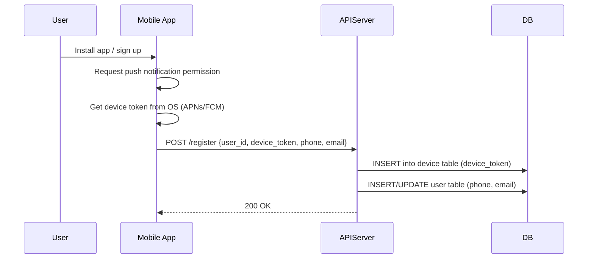

A user can register multiple devices. The notification server queries the device table and creates one notification job per device.

### Full Notification Delivery Sequence (iOS)

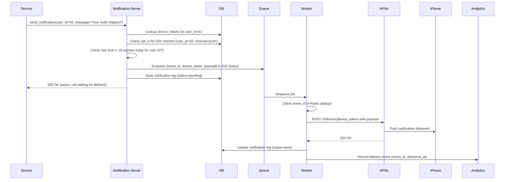

### Retry and Dead Letter Queue Flow

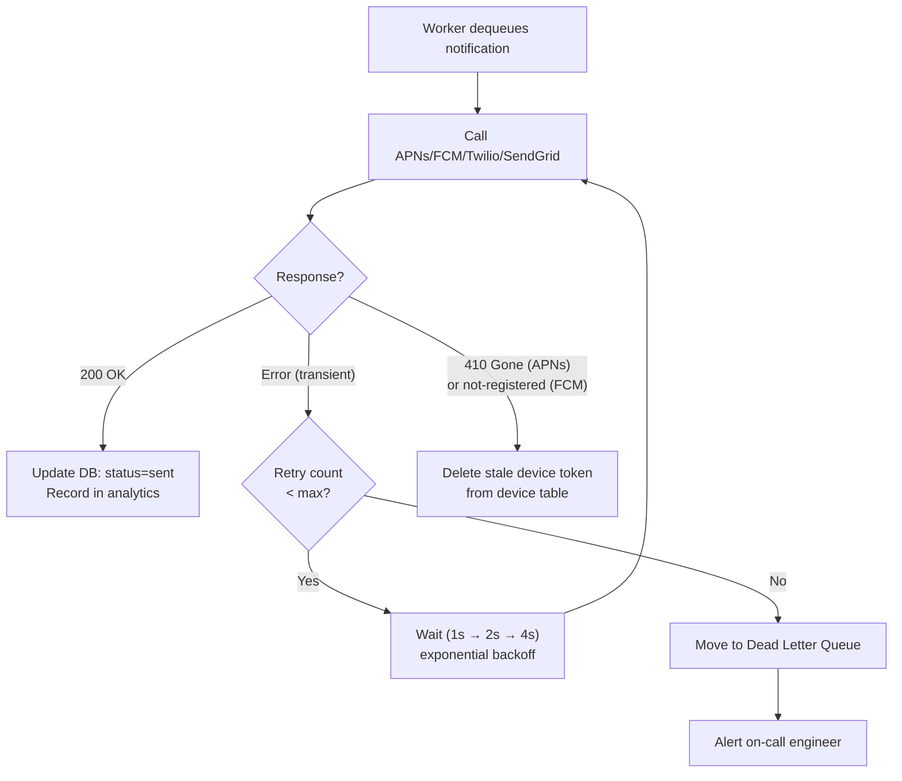

### User Preferences and Rate Limit Gate

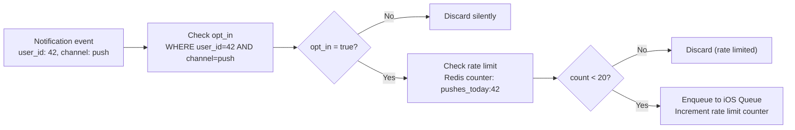

### Queue Depth Monitoring

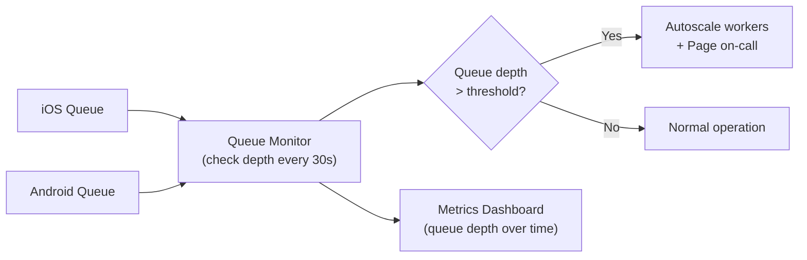

A queue that's growing means workers can't keep up. This could be due to: a provider outage, insufficient workers, or an unusual spike in notification volume. The queue depth metric is the earliest warning signal — long before users notice delays.

### Notification System Improved Design — Component Map

The improved design (from the initial single-server sketch) adds five critical elements: authentication, rate limiting, notification templates, analytics/tracking, and the retry/DLQ path. This diagram maps every component to its responsibility:

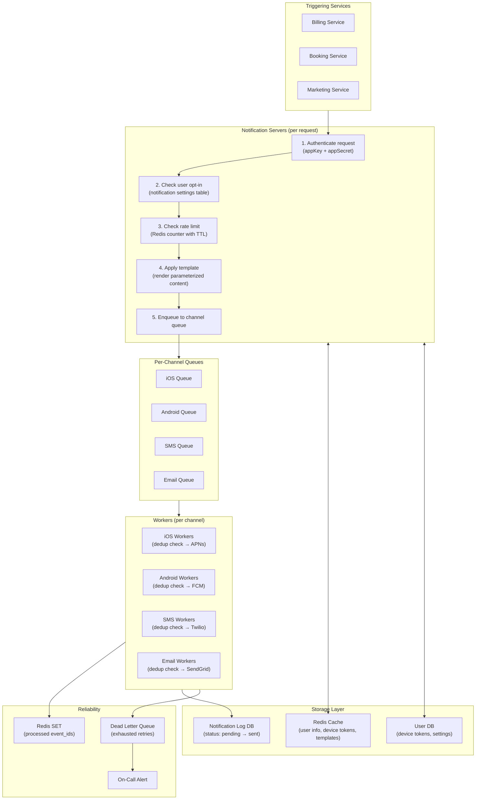

The key insight: notification servers are **stateless validators and routers**. They enforce business rules (auth, opt-in, rate limits) and then immediately hand off to a queue. Workers handle the stateful retry logic and provider calls.

## Interview Questions

- "Design a notification system that sends 10M push, 1M SMS, and 5M emails per day." → Clarify notification types and triggers. Walk through: triggering services → notification servers (validate, check opt-in, check rate limit, enqueue) → per-channel queues → channel-specific workers → providers (APNs, FCM, Twilio, SendGrid). Emphasize: separate queues per channel for isolation, at-least-once delivery with DB logging, dedup via event IDs, templates for consistency, exponential backoff retries, queue depth monitoring.

- "What happens if APNs is unavailable for 2 hours?" → Messages stay in the iOS queue (not lost). Workers retry with exponential backoff. If retry budget is exhausted, messages go to the DLQ. Alert fires to on-call. When APNs recovers, DLQ messages can be replayed. Monitor queue depth — if iOS queue grows while Android/SMS/Email queues are normal, the problem is APNs-specific.

- "How do you prevent sending the same notification twice?" → Assign a unique event ID to every notification event. Save to DB with status=pending. Before calling the provider, check if this event ID is in a Redis processed-events SET. If yes, skip. If no, send, then add to SET and update DB status=sent.

- "How do you handle a user with 10 devices?" → The device table stores all device tokens for a user. The notification server queries all tokens and enqueues one job per device. Workers process each independently. If APNs returns 410 Gone for any token, that token is deleted from the device table.

- "How would you implement scheduled notifications (send at 9am user's local time)?" → Store the target send time in the notification DB. Use a delayed queue (Amazon SQS delay queues support up to 15-minute delays) or a cron scheduler that queries for notifications due in the next minute and enqueues them. For longer delays, the cron approach is more flexible.

- "What operational metrics matter for a notification system?" → Queue depth per channel (growing = workers can't keep up), delivery success rate per provider, retry rate, DLQ message count, notification open rate (product metric), device token invalid rate (stale token cleanup effectiveness), and per-channel latency (time from enqueue to delivery).

## Related Chapters
- [Ch09 - Web Crawler](09-web-crawler.md) — both use message queues to decouple producers from consumers and rely on worker retry logic for reliability
- [Ch11 - News Feed](11-news-feed.md) — news feed uses push notifications for out-of-app updates; understanding this chapter informs how feeds reach offline users
- [Ch12 - Chat System](12-chat-system.md) — chat falls back to APNs/FCM push notifications for offline users, using the same provider infrastructure described here
- [Ch04 - Rate Limiter](04-rate-limiter.md) — the per-user rate limiting in this chapter uses the same Redis counter pattern described in Ch04
- [Ch01 - Scale from Zero to Millions](01-scale.md) — message queues for async decoupling and stateless web servers introduced here are the foundation for the notification server architecture
