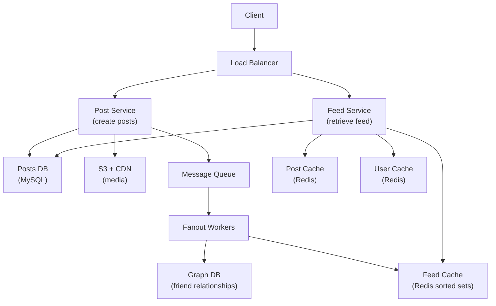
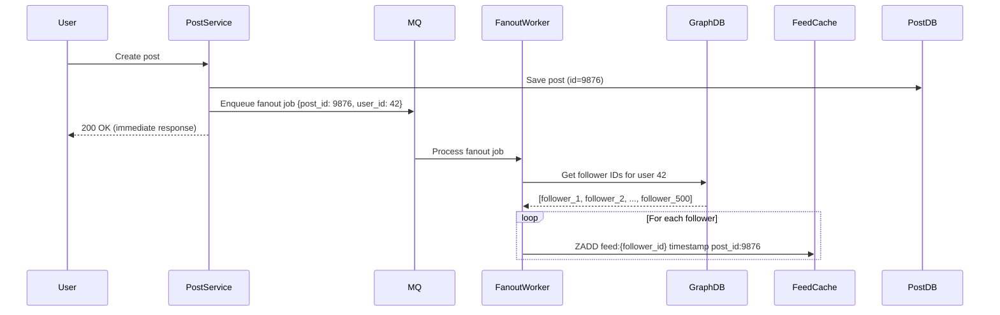
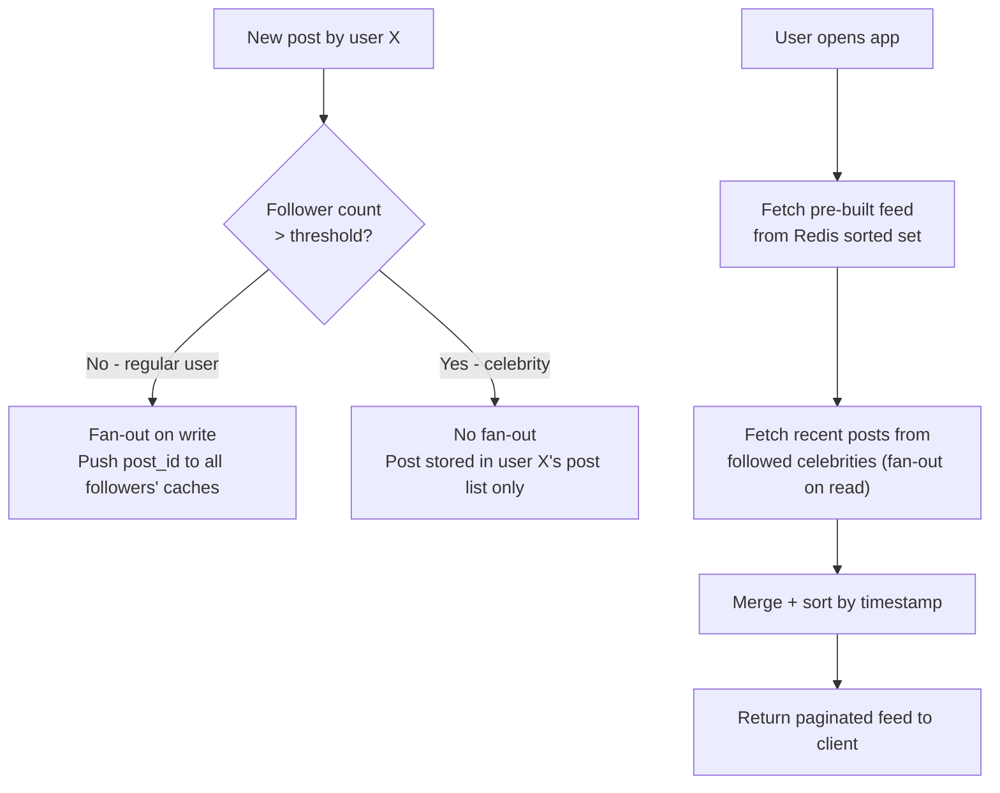
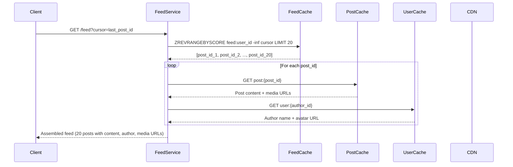

# Ch11: Design a News Feed System

## What questions does this chapter answer?
- What is fan-out, and what are the trade-offs between fan-out on write and fan-out on read?
- How does the hybrid fan-out approach solve the celebrity problem without sacrificing read performance?
- Why is a Redis sorted set the right data structure for a feed cache, and what exactly is stored in it?
- How are feed publishing and feed retrieval architecturally separated?
- How do you paginate an infinite-scroll feed and handle the cold-start case?

## Key Concepts

### Fan-Out on Write (Push Model)
When a user creates a post, the system immediately pushes the post ID to every follower's feed cache. The feed is pre-computed, so when any follower opens the app their feed is already built and the read is fast. The disadvantage is write amplification: for a user with 10 million followers, every post triggers 10 million cache writes. This is the "celebrity problem." Additionally, pre-building feeds for inactive users wastes cache space and write throughput. Fan-out on write is appropriate when follower counts are bounded (e.g., up to 5,000 friends on a closed social network).

### Fan-Out on Read (Pull Model)
When a user opens the app, the feed is built at read time by fetching recent posts from all followed accounts, merging them, and returning the sorted result. This eliminates write amplification — publishing a post is a single database write regardless of follower count — and avoids wasting computation on inactive users. The cost is read latency: fetching from potentially thousands of accounts, sorting the results, and serving them in real time is expensive and complex. Fan-out on read is the right model for celebrity accounts where write amplification would be unacceptable.

### Hybrid Fan-Out Approach
The production approach used by companies like Twitter and Facebook combines both models. For regular users (follower count below a threshold, e.g., 1 million), fan-out on write pre-populates followers' feed caches asynchronously after each post. For celebrity accounts (above the threshold), no fan-out occurs; the post is stored in the celebrity's own post list. At read time for any user, the system merges two sources: the pre-built cache (covering regular followed accounts) and fresh fetches from followed celebrity accounts. This limits write amplification to a small population of accounts while keeping reads fast for the vast majority of users.

### Feed Cache Structure (Redis Sorted Set)
Each user's feed is stored as a Redis sorted set with the key `feed:{user_id}`. Each entry has a score (Unix timestamp) and a value (post ID). `ZREVRANGE feed:42 0 19` returns the 20 most recent post IDs in O(K) time. Insertions are O(log N). The feed cache stores only post IDs, not full post content. Post content is fetched separately from a post cache or database, which keeps the feed cache compact and allows post content to be updated without invalidating any feed entries. The sorted set is capped (e.g., 500 entries) to bound memory usage; older posts are retrieved from the database on demand.

### Asynchronous Fanout via Message Queue
Post creation must return immediately to the user. Fan-out — writing a post ID to potentially thousands of feed caches — is performed asynchronously by fanout workers that consume from a message queue. The post service saves the post to the database, enqueues a fanout job, and returns `200 OK` to the user. Fanout workers pick up the job, query the graph database for follower IDs, filter by muted/blocked status, and append the post ID to each follower's Redis sorted set. This async approach keeps the posting latency at single-digit milliseconds regardless of follower count.

### Data Stores by Access Pattern
Different data types in a news feed system require different storage solutions. Posts (text, metadata) live in MySQL or PostgreSQL because they are structured, relational, and ACID-compliant. Friend and follow relationships live in a graph database (Neo4j, Amazon Neptune) or an adjacency list in MySQL, because graph traversal is the primary access pattern. Feed data (ordered lists of post IDs per user) lives in Redis sorted sets for fast O(K) range queries. Media (images, video) lives in object storage (S3) and is served globally through a CDN; only media URLs are stored in the feed, never the bytes themselves. Post content is also cached in Redis to avoid hitting the database on every feed read.

### Cursor-Based Pagination
News feeds are paginated to avoid loading thousands of posts at once. The client includes a cursor (the last seen post ID and timestamp) in each request. The server fetches the next N posts with a score lower than the cursor's timestamp using `ZRANGEBYSCORE`. This approach is more stable than offset-based pagination: if new posts arrive while a user is scrolling, the cursor anchors their position and they do not see duplicates or skip posts.

## Architecture Diagrams

### High-Level News Feed Architecture
This diagram shows the two main paths through the system — the write path (post creation and fanout) and the read path (feed retrieval) — and the data stores each path touches.

The Post Service handles only persistence and queue enqueue — it does not touch the feed cache directly. Fanout Workers are the only writers to the feed cache and can be scaled independently from the Post Service. The Feed Service is read-only and combines multiple cached data sources to assemble the response, falling back to the database only when cache misses occur.

### Fan-Out on Write Sequence
This sequence diagram shows the full write path for a post, from user submission through async fanout to followers' feed caches.

The user receives a `200 OK` before any fanout occurs. Followers see the post within seconds as the fanout worker processes the queue job. The post service is completely decoupled from the fanout logic — adding new fanout destinations (e.g., notification system) means adding new queue consumers, not modifying the post service.

### Hybrid Fan-Out Decision Logic
This diagram captures the branching logic that determines which fan-out strategy to apply based on the poster's follower count, and how the read path merges both sources.

The threshold (e.g., 1 million followers) is a tunable parameter. Regular users' posts are pre-distributed so reads require only a Redis range query. Celebrity posts are fetched at read time from a small number of accounts, so the read-time cost is bounded by how many celebrities a user follows (typically a handful), not by the celebrity's follower count.

### Feed Retrieval Sequence
This diagram shows how the Feed Service assembles a complete feed response by combining multiple cache lookups.

Media URLs point to the CDN; the Feed Service never fetches media bytes. All cache misses fall back to their respective databases. The cursor in the request anchors pagination so new posts arriving between scrolls do not disrupt the user's position.

## Interview Questions

- "Design a news feed system for a social network with 10 million DAU." → Open by identifying the two core flows: feed publishing and feed retrieval. Explain the fan-out trade-off: write (fast reads, expensive writes, celebrity problem), read (slow reads, no celebrity problem), hybrid (used in practice). Describe the feed cache as Redis sorted sets of post IDs, the async fanout via message queue, and the data store choices (MySQL for posts, graph DB for relationships, CDN for media). Close with pagination and cold-start handling.

- "What is the celebrity problem and how do you solve it?" → A user with 10 million followers causes 10 million cache writes on every post with pure fan-out on write. Solution: hybrid approach — fan-out on write for users below a follower threshold, no fan-out for celebrities. At read time, the client merges pre-built feed entries with fresh celebrity posts fetched directly.

- "Why store only post IDs in the feed cache rather than full post content?" → Keeps the feed cache compact (a post ID is ~8 bytes versus 500+ bytes for content). Allows post content to be updated independently without cache invalidation. The same post ID can appear in millions of users' feeds without data duplication. Full post content is fetched separately from the post cache.

- "How do you implement infinite scroll pagination?" → Use cursor-based pagination: the client passes the last seen post ID and its timestamp as a cursor. The Feed Service queries `ZRANGEBYSCORE` to fetch the next page of post IDs scored below the cursor. This is stable when new posts arrive — unlike offset-based pagination, the cursor anchors the user's scroll position.

- "What happens when a user first opens the app and has no feed cache?" → Cold-start fallback: use fan-out on read to build the feed dynamically by fetching recent posts from all followed accounts, merging and sorting them. Cache the result in Redis for subsequent requests. This is slower for the first load but ensures the user always sees a feed.

## Related Chapters
- [Ch10 - Notification System](10-notification-system.md) — Feed events (new posts, comments) trigger push notifications; the notification system delivers them to offline users.
- [Ch12 - Chat System](12-chat-system.md) — Both news feed and chat involve real-time delivery and fan-out to multiple recipients; chat uses WebSocket where feeds use cached pre-computation.
- [Ch06 - Key-Value Store](06-key-value-store.md) — Redis sorted sets are the feed cache backbone; understanding key-value store internals informs TTL and eviction strategy choices.
