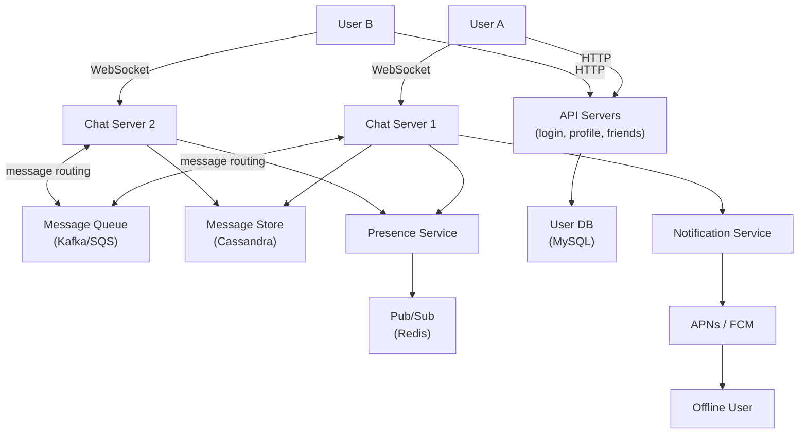
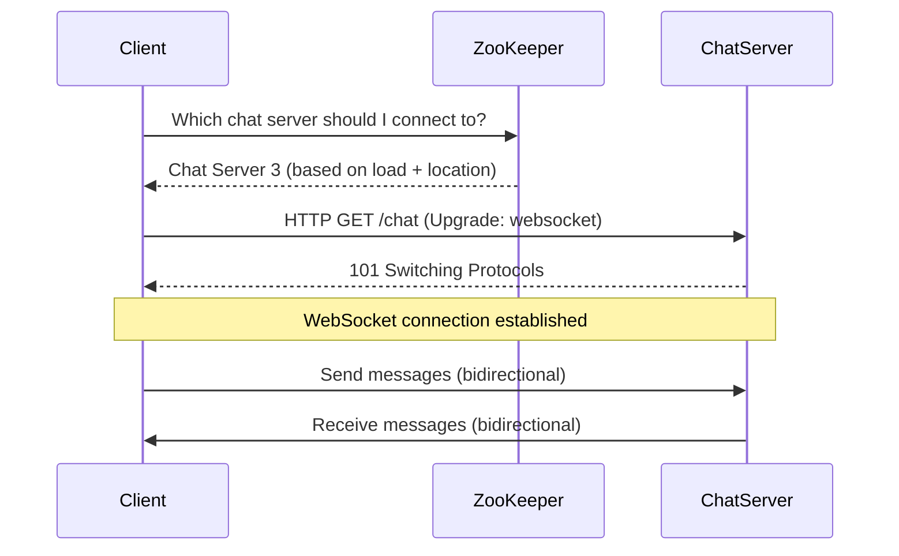
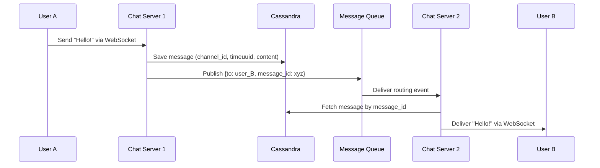
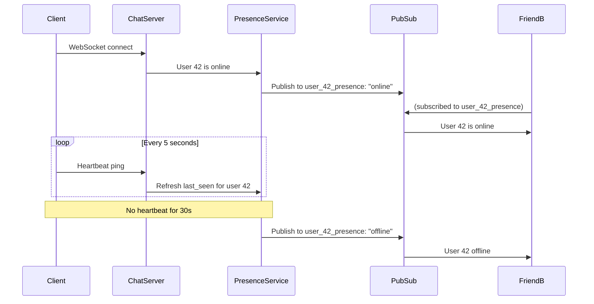
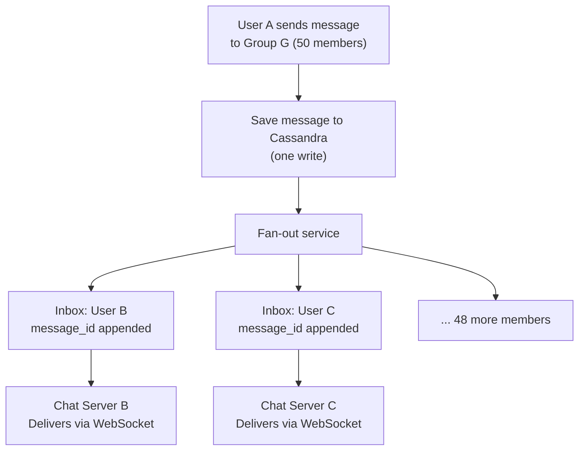

# Ch12: Design a Chat System

## What questions does this chapter answer?
- Why is WebSocket the right protocol for real-time chat, and how does it compare to HTTP polling and long polling?
- Why are chat servers stateful, and how does service discovery (ZooKeeper) route clients to the right server?
- Why is Cassandra preferred over MySQL for message storage?
- How does the presence service track online/offline status at scale using a heartbeat mechanism?
- How does group chat fan-out work, and when should you switch from per-user inboxes to a shared feed model?

## Key Concepts

### Communication Protocols: Polling vs. WebSocket
HTTP polling has the client repeatedly ask "any new messages?" every N seconds. It is simple but wastes bandwidth on empty responses and has latency equal to the poll interval. Long polling improves on this by holding the HTTP connection open until a message arrives, but the server must maintain many open connections, the client cannot detect silent drops, and communication is still one-directional per request. WebSocket upgrades the initial HTTP connection to a persistent full-duplex TCP channel; both client and server can send messages at any time with no per-message HTTP header overhead. WebSocket is the correct choice for real-time bidirectional chat. Server-Sent Events (SSE) allow the server to push to the client but not the reverse, making them unsuitable for chat.

### Stateful Chat Servers and Service Discovery
Chat servers are stateful because they maintain long-lived WebSocket connections tied to specific server instances. You cannot route a WebSocket request to any available server the way you can with a stateless HTTP request. This statefulness has two implications: scaling requires assigning new clients to available servers without disrupting existing connections, and routing messages to a recipient requires knowing which server hosts their connection. ZooKeeper (or a similar service registry) solves the routing problem: clients query ZooKeeper for the optimal chat server to connect to (based on load and geography), and chat servers register their connected user IDs so messages can be routed inter-server. Stateless API servers (login, profile, friend lists) operate separately and route normally behind a load balancer.

### Message Storage with Cassandra
Chat message history is append-heavy (new messages are always inserted, existing messages are rarely if ever updated) and queried by conversation ID over time ranges ("show me the last 50 messages in this chat"). Cassandra's data model maps perfectly to this pattern: `channel_id` as the partition key places all messages from one conversation on the same nodes, and `message_id` as a clustering key (using TIMEUUID — a UUID with an embedded timestamp) sorts messages by time within the partition. A single query retrieves an entire page of conversation history without joins. Cassandra also scales horizontally without the complex sharding MySQL requires, and its masterless replication topology provides high availability across multiple data centers. MySQL would require complex index structures for time-range queries and does not scale horizontally as easily.

### Message Ordering with TIMEUUID
Messages may arrive at the server out of order due to network delays. Without a reliable ordering mechanism, conversations become incoherent. TIMEUUID (Cassandra's time-ordered UUID variant) embeds a millisecond timestamp in the first bytes of the UUID, making IDs sortable by creation time. Within the same millisecond, a sequence component provides tie-breaking. Each device tracks its `cur_max_message_id` cursor — on reconnect, it fetches only messages with a message ID greater than this cursor, enabling efficient multi-device sync without downloading the entire history.

### Presence Service with Heartbeat
The presence service maintains the online/offline status of every user. When a user connects, the chat server notifies the presence service, which updates a key-value store and publishes a `user X is online` event to the user's presence channel via pub/sub (e.g., Redis Pub/Sub). Friends who have subscribed to that user's presence channel receive the update and refresh their UI. The client sends a heartbeat ping every 5 seconds. If the presence service receives no heartbeat for 30 seconds, it marks the user as offline and publishes the corresponding event. The heartbeat approach is more reliable than relying on WebSocket disconnect signals, which can be silently dropped by network intermediaries.

### Group Chat and Fan-Out
For small groups (up to ~100 members), the server uses a per-user inbox model: the message is saved once to Cassandra, and the message ID is appended to each member's personal inbox. Each member's chat server delivers the message via their WebSocket connection (or triggers a push notification if they are offline). This is O(N) writes per message but O(1) reads per member. For very large groups, a shared group feed is more practical: the message is saved once, and members poll the group's post list at read time. This is O(1) write but O(members × poll interval) reads. The book's design uses per-user inboxes for groups up to 100 members.

### Offline Delivery via Push Notifications
When a message is sent to an offline user, the chat server checks the presence service and finds no active connection. It then forwards a push notification request to the notification service, which sends the message preview via APNs (iOS) or FCM (Android). When the user comes back online, they fetch all messages with IDs greater than their last cursor from Cassandra, catching up on the full conversation — not just the push notification summary.

## Architecture Diagrams

### High-Level Chat System Architecture
This diagram shows the separation between stateful chat servers (WebSocket connections, message routing) and stateless API servers (login, profile), as well as the supporting services for presence and offline delivery.

Chat servers communicate with each other through a message queue (Kafka or SQS) to route messages between users connected to different server instances. Both chat servers write to the same Cassandra cluster, ensuring message durability and enabling multi-device sync. The presence service is a shared component that receives status updates from all chat servers and fans them out to interested subscribers through Redis Pub/Sub.

### WebSocket Connection Setup via ZooKeeper
This sequence diagram shows how a new client finds and connects to the appropriate chat server through service discovery before any messages are exchanged.

The client queries ZooKeeper only once at connection time. ZooKeeper selects the server with the lowest current connection count or the one geographically closest to the client. Once the WebSocket handshake completes with a `101 Switching Protocols` response, the connection is persistent and bidirectional until explicitly closed or the network drops.

### 1-on-1 Message Flow Across Different Servers
This sequence diagram shows the full path of a message between two users whose WebSocket connections are maintained by different chat server instances.

Cassandra write happens first, ensuring the message is durable before routing begins. The message queue decouples Chat Server 1 from Chat Server 2 — CS1 does not need to know CS2's address; it publishes to the queue and CS2 (which knows User B is its client) consumes the event. If User B is offline, CS2 would instead route to the Notification Service.

### Presence Service with Heartbeat
This sequence diagram illustrates the full lifecycle of a user's presence status: connection, periodic heartbeat, and timeout-triggered offline transition, along with how friends are notified at each stage.

The 5-second heartbeat and 30-second timeout are tunable. More frequent heartbeats reduce the lag before detecting disconnection but increase traffic proportionally to the number of online users. The pub/sub model ensures presence updates reach friends with minimal latency without the presence service needing to know each user's friend list at the time of the update.

### Group Chat Fan-Out
This diagram shows the fan-out pattern for a small group chat, where one message write triggers inbox updates for all members.

The message is written to Cassandra exactly once, regardless of group size. The fan-out service appends only the message ID (not the content) to each member's inbox. Members' chat servers then deliver the message — either immediately via WebSocket if the member is online, or via push notification if they are offline.

## Interview Questions

- "Design a real-time chat system supporting 50 million DAU with 1-on-1 and group chat." → Start with protocol choice: WebSocket for real-time bidirectional communication, HTTP for everything else. Walk through the architecture: chat servers (stateful, ZooKeeper for discovery), message storage (Cassandra, TIMEUUID clustering), presence service (heartbeat + pub/sub), and offline fallback (push notifications via APNs/FCM). Distinguish between 1-on-1 (direct routing) and group chat (fan-out to per-user inboxes).

- "Why is Cassandra better than MySQL for chat message history?" → Chat is append-heavy (always inserts, no updates) with time-range queries per conversation. Cassandra's `(channel_id, timeuuid)` partition + clustering schema stores all messages for a conversation on the same nodes, sorted by time, with no joins. It scales horizontally without sharding complexity and provides multi-datacenter high availability. MySQL would need complex indexing for time-range queries and does not scale out as easily.

- "How do you handle a user receiving messages while offline?" → The message is saved to Cassandra first (durable). The sending chat server checks the presence service and finds the recipient is offline. It triggers the notification service, which sends a push notification via APNs or FCM with a message preview. When the user reconnects, ZooKeeper assigns them to an available chat server, and the client fetches all messages after its last-seen cursor from Cassandra to catch up.

- "How do chat servers scale?" → Add more chat server instances. ZooKeeper distributes new client connections across available servers based on load. Existing connections remain on their current server until the client disconnects. If a chat server crashes, its clients detect the WebSocket disconnect, reconnect through ZooKeeper, and fetch missed messages from Cassandra using their cursor.

- "How would you implement read receipts?" → Add a `read_at` timestamp field to the message record. When the recipient views the message, the client sends a `READ` event over WebSocket to its chat server. The server updates `read_at` in Cassandra and propagates the read receipt to the sender's chat server via the message queue, which forwards it to the sender's client via WebSocket to update the "delivered/read" indicator in the UI.

## Related Chapters
- [Ch10 - Notification System](10-notification-system.md) — Chat falls back to APNs/FCM push notifications for offline users; the notification system provides this infrastructure.
- [Ch11 - News Feed](11-news-feed.md) — News feed fan-out to followers parallels group chat fan-out to members; both face write amplification challenges at scale.
- [Ch06 - Key-Value Store](06-key-value-store.md) — The presence service uses a key-value store for last-seen timestamps; understanding replication and consistency informs correctness guarantees for online status.
